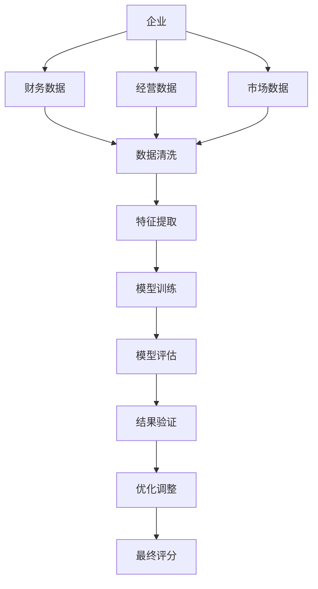

                 


# AI辅助的企业信用评分卡验证

## 关键词：AI，信用评分卡，企业信用评估，机器学习，数据验证

## 摘要：本文深入探讨了AI技术在企业信用评分卡验证中的应用，从背景、核心概念到具体算法和系统设计，详细分析了AI如何提升信用评估的效率和准确性。文章结合实际案例，提供了丰富的技术细节和实践指导，帮助读者全面理解AI辅助信用评分卡验证的原理和实现方法。

---

# 第一部分: AI辅助的企业信用评分卡验证概述

## 第1章: 企业信用评分卡概述

### 1.1 信用评分卡的基本概念

#### 1.1.1 信用评分卡的定义与作用

企业信用评分卡是一种用于评估企业信用状况的工具，通过对企业财务数据、经营状况和市场表现等多维度信息进行分析，生成一个综合评分，反映企业的信用风险水平。信用评分卡的作用在于帮助金融机构、投资者和合作伙伴快速、准确地评估企业的信用资质。

#### 1.1.2 信用评分卡的分类与特点

信用评分卡可以根据评估对象、评估方法和评估用途进行分类。按评估对象可分为企业信用评分卡和消费者信用评分卡；按评估方法可分为基于规则的评分卡和基于模型的评分卡；按评估用途可分为贷款审批评分卡、供应链管理评分卡等。其特点包括数据驱动、模型化、实时性等。

#### 1.1.3 信用评分卡的评价标准

信用评分卡的评价标准主要关注其准确性和可靠性。准确率是指模型预测结果与实际结果的匹配程度；可靠性是指评分卡在不同时间、不同环境下的稳定性和一致性。

### 1.2 AI在信用评分卡中的应用背景

#### 1.2.1 传统信用评分卡的局限性

传统信用评分卡主要依赖人工经验，存在评估效率低、主观性强、覆盖范围有限等问题。例如，人工审核耗时长，难以应对海量数据；规则设定过于僵化，难以适应复杂的市场变化。

#### 1.2.2 AI技术在信用评估中的优势

AI技术通过引入机器学习、自然语言处理和大数据分析，显著提升了信用评估的效率和准确性。AI能够处理非结构化数据，挖掘隐藏的模式，实现自动化评估和实时监控。

#### 1.2.3 企业信用评分卡验证的痛点与需求

企业信用评分卡验证的痛点包括数据孤岛、信息不完整、评估模型过时等。需求则集中在提高评估效率、降低误判率、增强实时性等方面。

### 1.3 本章小结

本章概述了企业信用评分卡的基本概念、分类及其评价标准，分析了传统评分卡的局限性以及AI技术带来的变革，为后续章节的深入探讨奠定了基础。

---

## 第2章: 信用评分卡验证的核心要素

### 2.1 信用评分卡验证的基本流程

#### 2.1.1 数据收集与处理

数据收集包括企业财务数据、经营数据、市场数据等。数据处理包括清洗、转换和特征提取，确保数据质量。

#### 2.1.2 模型训练与评估

选择合适的算法训练模型，评估模型性能，选择最优模型。

#### 2.1.3 结果验证与优化

通过验证测试优化模型，提升预测准确性。

### 2.2 AI在信用评分卡验证中的关键环节

#### 2.2.1 数据特征提取

利用AI技术提取关键特征，如企业偿债能力、盈利能力等指标。

#### 2.2.2 模型选择与优化

选择合适的机器学习算法，通过调参优化模型性能。

#### 2.2.3 结果解释与反馈

解读模型输出，提供可解释的信用评估结果，并根据反馈持续优化模型。

### 2.3 核心概念与联系

#### 2.3.1 核心概念原理

信用评分卡验证涉及数据、模型和结果解释三大部分，AI技术贯穿整个流程，提升效率和准确性。

#### 2.3.2 核心概念属性特征对比表格

| 特征属性 | 传统方法 | AI辅助方法 |
|----------|-----------|------------|
| 数据来源 | 单一数据源 | 多数据源融合 |
| 数据处理 | 手工处理 | 自动化处理 |
| 模型选择 | 人工选择 | 自动优化选择 |
| 结果解释 | 专家解释 | 可视化解释工具 |

#### 2.3.3 ER实体关系图架构的Mermaid流程图



### 2.4 本章小结

本章详细分析了信用评分卡验证的核心要素，探讨了AI在各环节中的应用，为后续算法和系统设计提供了理论基础。

---

## 第3章: 常用算法原理与流程

### 3.1 逻辑回归算法

#### 3.1.1 算法原理与流程图

逻辑回归是一种广泛应用于分类任务的算法，适用于二分类问题。其原理是通过优化对数似然函数，找到最佳参数以最大化预测概率。

#### 3.1.2 逻辑回归的数学模型

$$ P(y=1|x) = \frac{1}{1 + e^{-(\beta_0 + \beta_1 x_1 + \beta_2 x_2 + \dots + \beta_n x_n)}} $$

其中，$\beta$ 表示模型参数，$x_i$ 表示输入特征。

#### 3.1.3 逻辑回归的实现代码示例

```python
import pandas as pd
import numpy as np
from sklearn.linear_model import LogisticRegression

# 示例数据
data = {
    'feature1': [1, 2, 3],
    'feature2': [4, 5, 6],
    'label': [0, 1, 1]
}

df = pd.DataFrame(data)
X = df[['feature1', 'feature2']]
y = df['label']

# 模型训练
model = LogisticRegression()
model.fit(X, y)

# 预测
print("预测结果:", model.predict(X))
# 概率预测
print("概率预测:", model.predict_proba(X))
```

#### 3.1.4 逻辑回归的适用场景与优缺点

适用场景：适合二分类问题，如企业信用评分。

优点：实现简单，易于解释；计算效率高。

缺点：对非线性关系建模能力有限。

### 3.2 随机森林算法

#### 3.2.1 算法原理与流程图

随机森林是一种基于决策树的集成学习算法，通过构建多个决策树并进行投票或加权平均，提高模型的准确性和稳定性。

#### 3.2.2 随机森林的数学模型

$$ y = \sum_{i=1}^{n} w_i x_i $$

其中，$w_i$ 是决策树的权重，$x_i$ 是输入特征。

#### 3.2.3 随机森林的实现代码示例

```python
from sklearn.ensemble import RandomForestClassifier

# 示例数据
X = np.array([[1, 2], [3, 4], [5, 6]])
y = np.array([0, 1, 1])

# 模型训练
model = RandomForestClassifier(n_estimators=3)
model.fit(X, y)

# 预测
print("预测结果:", model.predict(X))
```

#### 3.2.4 随机森林的适用场景与优缺点

适用场景：适合多分类问题，特征较多时表现优秀。

优点：抗过拟合能力强，对特征缺失不敏感。

缺点：模型解释性较弱。

---

## 第4章: 支持向量机（SVM）算法

### 4.1 SVM算法原理与流程图

支持向量机是一种监督学习算法，适用于分类和回归任务。其原理是通过构建超平面，将数据点分为不同类别。

### 4.2 SVM的数学模型

$$ y = \text{sign}(w^T x + b) $$

其中，$w$ 是法向量，$b$ 是偏置项，$x$ 是输入特征。

### 4.3 SVM的实现代码示例

```python
from sklearn import svm

# 示例数据
X = np.array([[1, 2], [3, 4], [5, 6]])
y = np.array([0, 1, 1])

# 模型训练
model = svm.SVC()
model.fit(X, y)

# 预测
print("预测结果:", model.predict(X))
```

### 4.4 SVM的适用场景与优缺点

适用场景：适合小样本数据，特征维度较高的情况。

优点：对高维数据表现优秀，泛化能力强。

缺点：计算复杂度高，不适合大规模数据。

---

## 第5章: 神经网络与深度学习算法

### 5.1 神经网络算法原理与流程图

神经网络是一种模拟人脑神经元结构的算法，通过多层网络结构实现特征提取和非线性关系建模。

### 5.2 神经网络的数学模型

$$ y = f(Wx + b) $$

其中，$W$ 是权重矩阵，$x$ 是输入向量，$b$ 是偏置向量，$f$ 是激活函数。

### 5.3 神经网络的实现代码示例

```python
import keras
from keras import layers

# 示例数据
X = np.array([[1, 2], [3, 4], [5, 6]])
y = np.array([0, 1, 1])

# 模型定义
model = keras.Sequential()
model.add(layers.Dense(64, activation='relu', input_shape=(2,)))
model.add(layers.Dense(1, activation='sigmoid'))

# 模型编译
model.compile(optimizer='adam', loss='binary_crossentropy', metrics=['accuracy'])

# 模型训练
model.fit(X, y, epochs=10, batch_size=32)
```

### 5.4 神经网络的适用场景与优缺点

适用场景：适合复杂数据和高维特征，如文本、图像等。

优点：能够处理非线性关系，表达能力强。

缺点：训练时间长，模型复杂度高。

---

## 第6章: 算法选择与模型评估

### 6.1 算法选择策略

根据数据类型、样本数量、特征维度和业务需求选择合适的算法。

### 6.2 模型评估指标

包括准确率、召回率、F1分数、AUC值等。

### 6.3 模型调优与优化

通过交叉验证、网格搜索等方法优化模型参数，提升性能。

---

## 第7章: 企业信用评分卡验证的系统架构设计

### 7.1 系统功能设计

包括数据采集模块、模型训练模块、结果验证模块和用户交互模块。

### 7.2 系统架构设计

采用微服务架构，包括数据层、服务层和应用层，通过API接口实现模块间通信。

### 7.3 系统接口设计

定义数据接口、模型接口和结果接口，确保各模块协同工作。

### 7.4 系统交互流程

通过Mermaid序列图展示系统各角色的交互流程。

---

## 第8章: 项目实战——基于Python的企业信用评分卡验证系统

### 8.1 项目需求分析

明确项目目标、功能需求和约束条件。

### 8.2 系统环境搭建

安装必要的Python库，如pandas、numpy、scikit-learn等。

### 8.3 核心系统实现

实现数据处理、模型训练和结果验证模块，提供友好的用户界面。

### 8.4 实际案例分析

以具体企业为例，展示系统的应用效果和验证过程。

### 8.5 项目小结

总结项目实现的关键点和经验教训，为后续优化提供参考。

---

## 第9章: 最佳实践与注意事项

### 9.1 最佳实践

包括数据质量管理、模型选择优化、结果解释性等方面。

### 9.2 小结

总结全文，强调AI在企业信用评分卡验证中的重要性。

### 9.3 注意事项

提示读者在实际应用中需要注意的事项，如数据隐私保护、模型可解释性等。

### 9.4 拓展阅读

推荐相关领域的书籍和论文，供读者深入学习。

---

## 第10章: 总结与展望

### 10.1 本章总结

回顾全文内容，重申AI在企业信用评分卡验证中的价值。

### 10.2 未来展望

探讨AI技术的进一步应用，如结合区块链、联邦学习等新技术，提升信用评分卡的智能化水平。

---

## 关键词索引

列出全文中出现的关键术语，便于读者查阅。

---

通过以上目录，读者可以系统地学习AI在企业信用评分卡验证中的应用，从理论到实践，全面掌握相关技术与方法。

