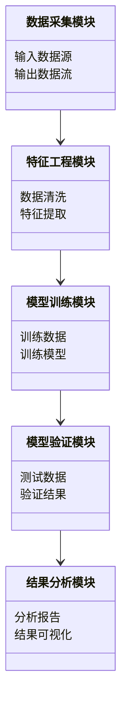
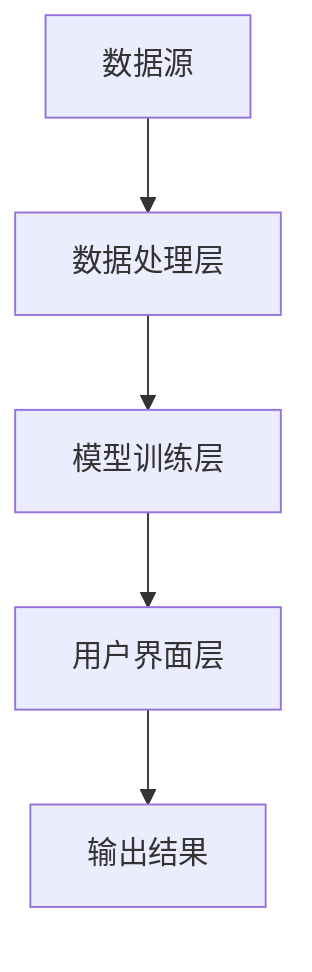
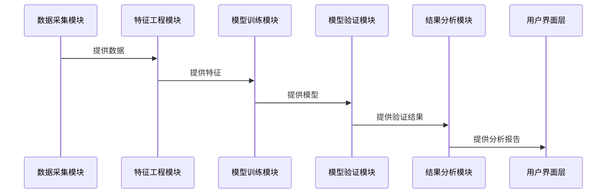

                 


# 第一部分: 引言

## 第1章: 企业信用评分卡的背景与挑战

### 1.1 企业信用评分卡的重要性
#### 1.1.1 信用评分卡的基本概念
企业信用评分卡是一种用于评估企业信用状况的工具，通过分析企业的财务数据、市场表现和运营状况，提供一个综合评分，帮助金融机构做出信贷决策。

#### 1.1.2 信用评分卡在企业中的作用
信用评分卡能够帮助企业评估潜在客户的信用风险，从而优化信贷审批流程，降低坏账率，提高资金利用率。同时，评分卡还能帮助企业识别高风险客户，提前采取风险控制措施。

#### 1.1.3 传统信用评分卡的局限性
传统的信用评分卡通常基于简单的统计模型或规则，难以处理复杂的数据关系，且容易受到人为因素的影响。此外，传统方法在面对大量非结构化数据时表现不佳，难以实时更新和调整，导致评分结果不够准确和动态。

### 1.2 AI技术在信用评分中的应用
#### 1.2.1 AI技术的基本概念
人工智能（AI）是指计算机系统能够执行人类智能任务的能力，如视觉识别、语音识别、决策推理和自然语言处理等。AI技术通过机器学习、深度学习等方法，可以从大量数据中提取复杂的模式和关系，提供更精准的预测和决策支持。

#### 1.2.2 AI在信用评分中的优势
AI技术能够处理结构化和非结构化数据，提取更多的特征和关系，从而提高评分的准确性。此外，AI模型具有自适应能力，可以实时更新和优化，适应市场变化和客户行为的变化。

#### 1.2.3 企业信用评分卡验证系统的需求
随着企业信用评估的复杂性增加，传统的评分方法难以满足需求。引入AI技术可以提高评分的准确性和效率，同时降低人为错误和成本。企业信用评分卡验证系统需要具备高准确性、实时性、可解释性和可扩展性。

### 1.3 本章小结
本章介绍了企业信用评分卡的重要性及其在企业中的作用，分析了传统评分卡的局限性，并探讨了AI技术在信用评分中的优势和系统需求。这些内容为后续章节奠定了基础。

# 第二部分: 核心概念

## 第2章: 信用评分卡验证系统的核心要素

### 2.1 信用评分卡的基本结构
#### 2.1.1 评分卡的组成要素
企业信用评分卡通常包括信用历史、还款能力、财务状况、市场表现等多个维度的特征。这些特征通过加权和计算，生成一个综合评分。

#### 2.1.2 评分卡的数学模型
评分卡的数学模型通常是基于统计或机器学习模型，如逻辑回归、随机森林等。这些模型将输入特征转化为评分，用于预测企业的信用风险。

#### 2.1.3 评分卡的验证流程
评分卡的验证流程包括数据收集、特征选择、模型训练、模型验证和结果分析。验证过程确保评分卡的准确性和可靠性。

### 2.2 AI技术在评分卡验证中的作用
#### 2.2.1 机器学习在评分卡验证中的应用
机器学习算法，如逻辑回归、支持向量机（SVM）和随机森林，能够从大量数据中提取复杂的特征关系，提高评分卡的准确性。

#### 2.2.2 深度学习在评分卡验证中的应用
深度学习技术，如神经网络和长短期记忆网络（LSTM），能够处理非结构化数据，如文本和图像，提取更深层次的特征，进一步提高评分的准确性。

#### 2.2.3 自然语言处理在评分卡验证中的应用
自然语言处理（NLP）技术可以分析企业的文本数据，如财务报告和新闻资讯，提取潜在的信用风险信号，丰富评分卡的特征维度。

### 2.3 评分卡验证系统的组成模块
#### 2.3.1 数据采集模块
数据采集模块负责收集企业的财务数据、市场数据、行业数据等，为评分卡的验证提供基础数据。

#### 2.3.2 数据处理模块
数据处理模块对采集的数据进行清洗、转换和特征提取，确保数据的质量和一致性，为后续的模型训练做好准备。

#### 2.3.3 模型训练模块
模型训练模块利用机器学习和深度学习算法，训练评分卡模型，优化模型参数，提高模型的预测能力。

#### 2.3.4 模型验证模块
模型验证模块通过测试数据评估模型的性能，验证模型的准确性和稳定性，确保评分卡的可靠性和有效性。

### 2.4 本章小结
本章详细介绍了信用评分卡的基本结构和AI技术在评分卡验证中的作用，分析了评分卡验证系统的组成模块及其功能。这些内容为后续章节的算法设计和系统实现提供了理论基础。

# 第三部分: 算法原理

## 第3章: 信用评分卡验证的核心算法

### 3.1 机器学习算法在评分卡验证中的应用
#### 3.1.1 逻辑回归算法
逻辑回归是一种常用的分类算法，适用于二分类问题。其数学模型如下：

$$ P(y=1|x) = \frac{e^{\beta_0 + \beta_1 x_1 + \dots + \beta_n x_n}}{1 + e^{\beta_0 + \beta_1 x_1 + \dots + \beta_n x_n}} $$

逻辑回归通过计算概率，将输入特征转化为信用评分，帮助判断企业的信用风险。

#### 3.1.2 支持向量机（SVM）算法
SVM是一种监督学习算法，适用于分类和回归问题。其核心思想是通过找到一个超平面，将数据点分成两类，最大化分类间隔。

#### 3.1.3 随机森林算法
随机森林是一种基于决策树的集成学习算法，通过构建多个决策树并进行投票或平均，提高模型的准确性和稳定性。

### 3.2 深度学习算法在评分卡验证中的应用
#### 3.2.1 神经网络算法
神经网络是一种模拟人脑神经网络结构的算法，能够处理复杂的非线性关系。其基本结构包括输入层、隐藏层和输出层。

#### 3.2.2 长短期记忆网络（LSTM）算法
LSTM是一种特殊的循环神经网络（RNN），适用于处理时间序列数据。其通过记忆单元和控制门，有效捕捉长期依赖关系。

#### 3.2.3 图神经网络（GNN）算法
GNN是一种处理图结构数据的深度学习算法，适用于分析企业间的关联关系，如供应链网络和合作伙伴网络。

### 3.3 算法的数学模型与公式
#### 3.3.1 逻辑回归的数学模型
逻辑回归的损失函数如下：

$$ L(\theta) = -\sum_{i=1}^{n} [y_i \cdot \ln h(x_i) + (1 - y_i) \cdot \ln(1 - h(x_i))] $$

其中，$h(x_i) = \frac{e^{\theta^T x_i}}{1 + e^{\theta^T x_i}}$。

#### 3.3.2 神经网络的数学模型
神经网络的前向传播过程如下：

$$ a^{(l+1)} = \sigma(w^{(l)} a^{(l)} + b^{(l)}) $$

其中，$\sigma$ 是激活函数，如ReLU或sigmoid。

### 3.4 本章小结
本章详细介绍了机器学习和深度学习算法在信用评分卡验证中的应用，分析了各种算法的数学模型和特点。这些内容为后续章节的系统设计和项目实现提供了理论依据。

# 第四部分: 系统架构设计

## 第4章: 信用评分卡验证系统的架构设计

### 4.1 系统功能设计
#### 4.1.1 领域模型设计
领域模型是系统功能的核心，通常包括数据采集、特征工程、模型训练、模型验证和结果分析五个模块。以下是一个领域模型的mermaid类图：



#### 4.1.2 系统架构设计
系统架构设计包括数据源、数据处理层、模型训练层和用户界面层。以下是一个系统架构的mermaid图：



### 4.2 系统接口设计
系统接口设计包括数据接口、模型接口和用户接口。数据接口负责数据的输入和输出，模型接口负责模型的训练和验证，用户接口负责与用户的交互。

### 4.3 系统交互设计
系统交互设计描述了系统各模块之间的交互流程。以下是一个系统交互的mermaid序列图：



### 4.4 本章小结
本章详细介绍了信用评分卡验证系统的架构设计，包括领域模型、系统架构、接口设计和交互设计。这些内容为后续章节的系统实现提供了指导。

# 第五部分: 项目实战

## 第5章: 信用评分卡验证系统的实现

### 5.1 环境搭建
#### 5.1.1 安装Python
安装Python编程语言，建议使用Anaconda或Miniconda。

#### 5.1.2 安装依赖库
安装必要的Python库，如NumPy、Pandas、Scikit-learn、Keras和TensorFlow。

### 5.2 数据预处理
#### 5.2.1 数据清洗
使用Pandas库对数据进行清洗，处理缺失值和异常值。

```python
import pandas as pd
df = pd.read_csv('企业数据.csv')
df.dropna(inplace=True)
```

#### 5.2.2 特征提取
从数据中提取有用的特征，如财务指标、市场指标等。

```python
from sklearn.feature_selection import SelectKBest
selector = SelectKBest(k=10)
selected_features = selector.fit_transform(df, target)
```

### 5.3 模型训练与验证
#### 5.3.1 选择算法
选择合适的机器学习或深度学习算法，如逻辑回归、随机森林或神经网络。

#### 5.3.2 训练模型
使用训练数据训练模型，优化模型参数。

```python
from sklearn.model_selection import train_test_split
from sklearn.linear_model import LogisticRegression
X_train, X_test, y_train, y_test = train_test_split(selected_features, target, test_size=0.2)
model = LogisticRegression()
model.fit(X_train, y_train)
```

#### 5.3.3 验证模型
使用测试数据验证模型的性能，评估准确率、召回率和F1分数。

```python
from sklearn.metrics import accuracy_score, recall_score, f1_score
y_pred = model.predict(X_test)
print(f"Accuracy: {accuracy_score(y_test, y_pred)}")
print(f"Recall: {recall_score(y_test, y_pred)}")
print(f"F1 Score: {f1_score(y_test, y_pred)}")
```

### 5.4 结果分析
#### 5.4.1 分析报告
生成分析报告，总结模型的性能和评分卡的结果。

#### 5.4.2 结果可视化
使用可视化工具（如Matplotlib或Seaborn）绘制评分分布图、混淆矩阵等。

```python
import matplotlib.pyplot as plt
from sklearn.metrics import confusion_matrix, ConfusionMatrixDisplay
cm = confusion_matrix(y_test, y_pred)
disp = ConfusionMatrixDisplay(confusion_matrix=cm, display_labels=model.classes_)
disp.plot(cmap='Blues')
plt.show()
```

### 5.5 本章小结
本章详细介绍了信用评分卡验证系统的实现过程，包括环境搭建、数据预处理、模型训练与验证以及结果分析。通过具体的代码示例和步骤说明，帮助读者理解和实现系统。

# 第六部分: 最佳实践

## 第6章: 信用评分卡验证系统的最佳实践

### 6.1 经验总结
在实际项目中，数据质量是影响模型性能的关键因素。确保数据的准确性和完整性，能够显著提高模型的预测能力。

### 6.2 注意事项
- 数据隐私和安全：确保数据的保密性，遵守相关法律法规。
- 模型可解释性：选择可解释的模型，便于用户理解和信任。
- 模型更新：定期更新模型，适应市场变化和企业行为的变化。

### 6.3 拓展阅读
- 《机器学习实战》：深入介绍机器学习算法的实现和应用。
- 《深度学习》：系统讲解深度学习的基本概念和算法。
- 《Python数据处理》：提供Python数据处理的实用技巧和方法。

### 6.4 本章小结
本章总结了项目中的经验和教训，提供了最佳实践的建议，帮助读者在实际项目中避免常见的问题，提高系统的性能和稳定性。

# 第七部分: 附录

## 附录A: 数据集
提供企业信用评分卡验证系统的数据集，包括企业财务数据、市场数据等。

## 附录B: 代码仓库
提供项目的代码仓库，如GitHub仓库，方便读者克隆和运行。

## 附录C: 工具包
列出项目中使用的主要工具包，如Pandas、Scikit-learn、Keras等，并提供安装和配置的说明。

## 附录D: 参考文献
列出项目中参考的文献和资料，包括书籍、论文、在线资源等。

## 附录E: 扩展资料
提供项目相关的扩展资料，如AI技术在金融领域的应用案例、信用评分卡的行业标准等。

# 结语
通过本篇技术博客文章，我们详细介绍了AI辅助的企业信用评分卡验证系统的各个方面，从理论到实践，从算法到系统设计，为读者提供了一个全面的指导。希望本文能够帮助读者理解AI在信用评分中的应用，并为实际项目提供参考和启发。

