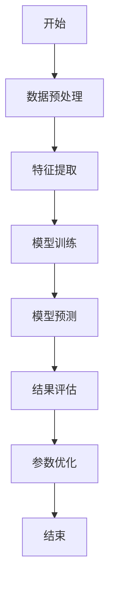
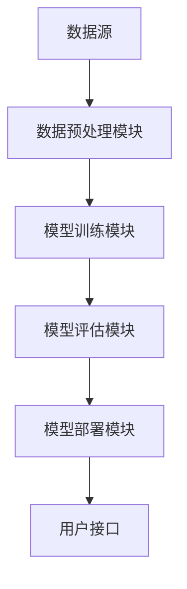

                 


# AI辅助的企业信用评级模型校准

## 关键词：AI，企业信用评级，模型校准，机器学习，金融风控

## 摘要：本文深入探讨了AI在企业信用评级模型校准中的应用，分析了传统模型的局限性，介绍了AI辅助校准的核心概念与算法原理，并通过系统架构设计和项目实战，展示了如何利用AI技术提升信用评级模型的准确性和可靠性。文章内容涵盖从理论到实践的全过程，为金融领域的技术从业者提供了宝贵的参考。

---

# 第1章: 企业信用评级与AI辅助模型校准概述

## 1.1 企业信用评级的重要性

### 1.1.1 企业信用评级的基本概念
企业信用评级是通过对企业的财务状况、经营能力、管理团队和市场环境等多方面因素的综合评估，确定企业在偿还债务时的可能性和能力。信用评级结果通常以等级形式表示，如AAA、AA、A、BBB等，用于指导投资者、银行和其他金融机构的决策。

### 1.1.2 信用评级在金融领域的应用价值
信用评级是金融风险管理的重要工具，直接影响企业的融资成本和市场信誉。高信用评级的企业更容易获得低利率贷款和投资，而低信用评级的企业则可能面临融资困难或高利率。

### 1.1.3 AI技术在信用评级中的潜力
传统信用评级方法依赖于经验和主观判断，存在效率低、主观性强、难以处理复杂数据等问题。AI技术通过机器学习、大数据分析等手段，能够更准确地识别风险，提高评估效率，并支持实时监控。

## 1.2 AI辅助模型校准的核心概念

### 1.2.1 模型校准的定义与目标
模型校准是指调整模型的参数或结构，使模型的预测结果与实际数据更接近。在信用评级中，校准的目标是提高模型的准确性和可靠性。

### 1.2.2 AI在模型校准中的作用
AI技术能够自动分析数据特征，优化模型参数，并通过反馈机制不断改进模型性能。通过AI辅助，模型校准过程更加高效、精准。

### 1.2.3 企业信用评级中的常见挑战
- 数据质量参差不齐，存在缺失或错误。
- 传统模型难以捕捉非线性关系和复杂特征。
- 市场环境变化快，模型需要频繁更新。

## 1.3 本章小结
本章介绍了企业信用评级的重要性及其在金融领域中的应用价值，分析了传统评级方法的局限性，并阐述了AI技术在模型校准中的潜力和作用。

---

# 第2章: 企业信用评级模型校准的背景与问题分析

## 2.1 传统信用评级模型的局限性

### 2.1.1 传统模型的基本特点
传统信用评级模型通常基于线性回归、逻辑回归等简单算法，依赖于少量的财务指标，难以处理非结构化数据。

### 2.1.2 传统模型在实际应用中的不足
- 无法有效处理大量非结构化数据，如文本、图像等。
- 对异常值和小样本数据敏感，泛化能力差。
- 模型更新和维护成本高，难以实时适应市场变化。

## 2.2 AI辅助模型校准的背景与优势

### 2.2.1 AI技术的发展对企业信用评级的影响
AI技术的进步，尤其是深度学习和自然语言处理的发展，为信用评级提供了新的工具和方法。

### 2.2.2 AI辅助模型校准的核心优势
- 提高模型的准确性和鲁棒性。
- 实现自动化校准，降低人工成本。
- 支持实时更新，适应市场变化。

## 2.3 当前企业信用评级中的主要问题

### 2.3.1 数据质量与完整性问题
数据缺失、错误或不一致会影响模型的准确性。

### 2.3.2 模型泛化能力不足
传统模型难以捕捉复杂的数据特征和非线性关系。

### 2.3.3 模型更新与维护成本高
传统模型需要手动调整参数，维护成本高，难以实时更新。

## 2.4 本章小结
本章分析了传统信用评级模型的局限性，探讨了AI技术在模型校准中的优势，并总结了当前企业信用评级中面临的主要问题。

---

# 第3章: AI辅助企业信用评级模型校准的核心概念

## 3.1 数据特征分析

### 3.1.1 数据预处理的重要性
数据预处理是确保模型准确性的基础，包括数据清洗、特征提取和标准化等步骤。

### 3.1.2 数据特征的选择与提取
通过选择关键特征，可以提高模型的训练效率和准确率。常用的方法包括主成分分析（PCA）和LASSO回归。

## 3.2 模型评估与校准方法

### 3.2.1 常见模型评估指标
- 准确率（Accuracy）
- 召回率（Recall）
- F1分数（F1 Score）

### 3.2.2 AI辅助模型校准的基本流程
1. 数据收集与预处理
2. 模型训练与初始预测
3. 校准模型参数
4. 模型评估与优化

## 3.3 校准算法的选择与优化

### 3.3.1 常见校准算法介绍
- 梯度提升树（GBDT）
- 支持向量机（SVM）
- 神经网络（NN）

### 3.3.2 算法选择的依据与优化策略
根据数据类型和特征选择合适的算法，并通过交叉验证和网格搜索优化参数。

## 3.4 本章小结
本章详细介绍了AI辅助模型校准的核心概念，包括数据特征分析、模型评估指标和校准算法的选择与优化。

---

# 第4章: AI辅助模型校准的算法原理

## 4.1 校准算法概述

### 4.1.1 常见校准算法的分类
- 线性校准方法
- 非线性校准方法

### 4.1.2 各算法的优缺点对比
| 算法类型 | 优点 | 缺点 |
|----------|------|------|
| 线性校准 | 简单高效 | 难处理复杂特征 |
| 非线性校准 | 准确性高 | 计算复杂 |

## 4.2 基于梯度提升树的校准算法

### 4.2.1 算法原理
梯度提升树是一种集成学习方法，通过多次训练弱模型（如决策树）来提高整体性能。

### 4.2.2 算法流程图（Mermaid）


### 4.3 算法实现与优化

#### 4.3.1 算法实现的Python代码
```python
import pandas as pd
from sklearn.ensemble import GradientBoostingClassifier
from sklearn.metrics import accuracy_score

# 数据加载与预处理
data = pd.read_csv('credit_data.csv')
X = data.drop('label', axis=1)
y = data['label']

# 模型训练
model = GradientBoostingClassifier()
model.fit(X, y)

# 模型预测
y_pred = model.predict(X)

# 结果评估
print("准确率:", accuracy_score(y, y_pred))
```

#### 4.3.2 算法优化策略
- 调整学习率和树的深度。
- 增加特征工程，提取更多有用的特征。

## 4.4 本章小结
本章详细介绍了AI辅助模型校准的算法原理，重点讲解了梯度提升树算法的实现与优化策略。

---

# 第5章: 企业信用评级模型校准的系统架构设计

## 5.1 系统功能模块划分

### 5.1.1 数据预处理模块
负责数据清洗、特征提取和数据标准化。

### 5.1.2 模型训练与校准模块
包括模型训练、参数优化和模型评估。

### 5.1.3 模型部署与监控模块
实现模型部署、实时监控和性能优化。

## 5.2 系统架构设计

### 5.2.1 系统架构图（Mermaid）


### 5.2.2 各模块之间的交互关系
用户输入数据，经过数据预处理后，传递给模型训练模块，训练完成后，模型评估模块对结果进行评估，最后部署到生产环境供用户使用。

## 5.3 系统接口设计

### 5.3.1 数据接口
定义数据的输入格式和接口协议。

### 5.3.2 模型接口
定义模型的输入输出接口和调用方式。

### 5.3.3 用户接口
提供用户友好的操作界面，方便用户输入数据和查看结果。

## 5.4 本章小结
本章详细描述了企业信用评级模型校准系统的架构设计，包括功能模块划分、系统架构图和各模块之间的交互关系。

---

# 第6章: 项目实战——AI辅助企业信用评级

## 6.1 项目背景与目标
通过实际案例，展示如何利用AI技术构建企业信用评级模型，并实现模型校准。

## 6.2 数据准备与预处理
### 6.2.1 数据收集
从公开数据集获取企业信用数据，包括财务指标、市场信息等。

### 6.2.2 数据清洗
处理缺失值、异常值和重复数据。

### 6.2.3 特征工程
提取关键特征，如收入增长率、利润率等。

## 6.3 模型实现与优化

### 6.3.1 模型选择
选择梯度提升树作为基础模型。

### 6.3.2 模型训练与调优
通过交叉验证和网格搜索优化模型参数。

## 6.4 模型评估与部署

### 6.4.1 模型评估
使用准确率、召回率等指标评估模型性能。

### 6.4.2 模型部署
将模型部署到生产环境，提供API接口供其他系统调用。

## 6.5 项目小结
本章通过实际案例展示了AI辅助企业信用评级模型的实现过程，包括数据准备、模型训练、优化和部署。

---

# 第7章: 最佳实践与未来展望

## 7.1 本章小结
总结全文的核心内容和主要观点。

## 7.2 最佳实践与注意事项
- 数据质量是模型性能的关键，必须重视数据预处理。
- 模型校准需要结合业务知识，避免过度依赖技术。
- 定期更新模型，适应市场变化。

## 7.3 未来展望
随着AI技术的不断发展，企业信用评级模型将更加智能化和个性化。未来的研究方向包括引入更多非结构化数据、提升模型解释性等。

---

# 附录

## 附录A: 常用机器学习算法简介
- 支持向量机（SVM）
- 随机森林（Random Forest）
- 神经网络（NN）

## 附录B: 数据预处理代码示例
```python
import pandas as pd
from sklearn.impute import SimpleImputer

# 数据加载
data = pd.read_csv('credit_data.csv')

# 处理缺失值
imputer = SimpleImputer(strategy='mean')
data_imputed = imputer.fit_transform(data)
```

## 附录C: 模型评估指标公式
- 准确率：$$\text{准确率} = \frac{\text{正确预测数}}{\text{总样本数}}$$
- 召回率：$$\text{召回率} = \frac{\text{正确预测的正例数}}{\text{实际正例数}}$$

---

# 结束语
感谢您的阅读！希望本文能够为您提供有价值的信息和启发。如需进一步探讨或合作，请随时联系我。

---

通过以上内容，您将深入了解AI在企业信用评级模型校准中的应用，从理论到实践，逐步掌握相关技术。

