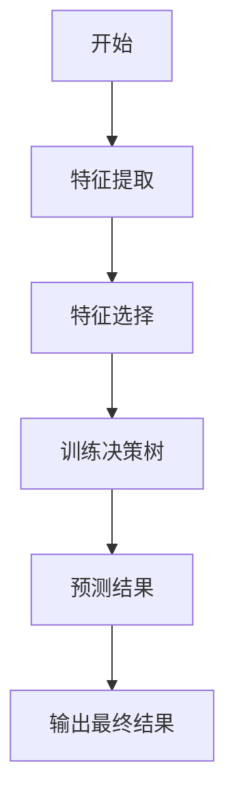
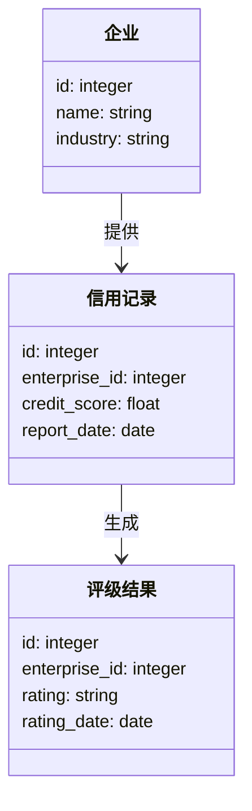
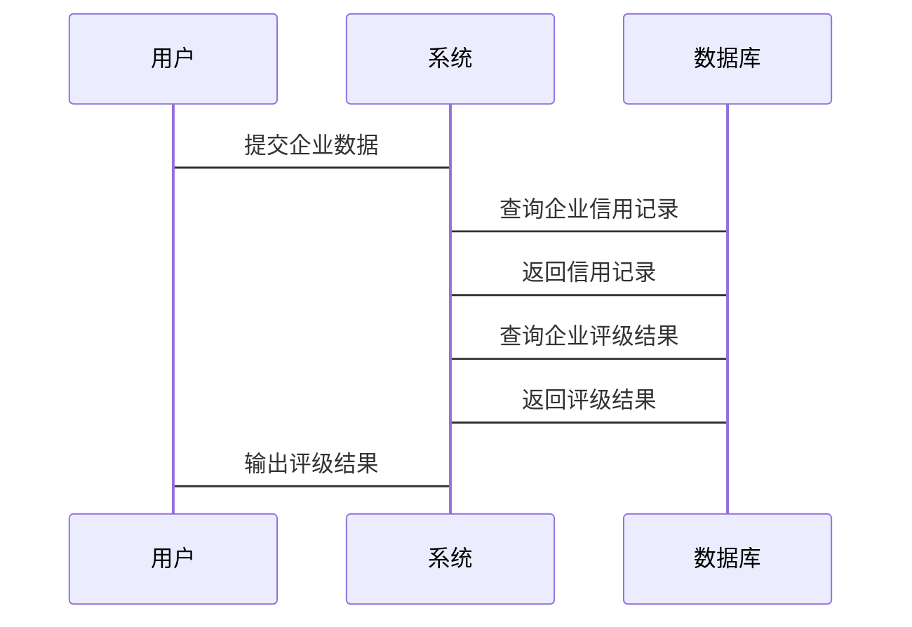

                 


# AI辅助的企业信用评级模型解释性研究

## 关键词：AI辅助，企业信用评级，模型解释性，机器学习，深度学习，信用评分

## 摘要：随着人工智能技术的迅速发展，企业信用评级领域正在经历一场革命。传统的信用评级方法依赖于繁琐的人工审核和有限的数据分析，效率低下且容易受到主观因素的影响。AI辅助的企业信用评级模型通过结合先进的机器学习和深度学习算法，显著提高了评级的准确性和效率。然而，这些模型的复杂性和“黑箱”特性使得其解释性成为实际应用中的重要挑战。本文将深入探讨AI辅助企业信用评级模型的构建过程、核心算法原理、系统架构设计以及模型解释性的实现方法，结合实际案例进行详细分析，为读者提供全面而深入的技术解读。

---

# 第1章: 企业信用评级的背景与挑战

## 1.1 企业信用评级的基本概念

### 1.1.1 信用评级的定义与作用

企业信用评级是对企业在经济活动中履行偿债义务的能力进行评估的过程。它是金融行业中的重要环节，用于衡量企业信用风险的大小。信用评级不仅帮助企业获得融资，还为投资者、债权人等利益相关方提供决策依据。

### 1.1.2 企业信用评级的核心要素

企业信用评级的核心要素包括以下几个方面：

1. **财务状况**：包括资产负债表、利润表和现金流量表等财务数据，用于评估企业的偿债能力和盈利能力。
2. **经营状况**：包括企业的行业地位、市场竞争力、管理水平和经营稳定性。
3. **信用历史**：包括企业过去的信用记录、违约情况和还款历史。
4. **外部环境**：包括宏观经济环境、行业发展趋势和政策法规等。

### 1.1.3 企业信用评级的分类与应用场景

企业信用评级可以根据不同的标准进行分类，常见的分类方式包括按评级对象的规模、行业、信用等级等。应用场景主要包括银行贷款审批、债券发行评级、供应链金融、投资决策等。

---

## 1.2 传统企业信用评级的局限性

### 1.2.1 传统评级方法的不足

传统的企业信用评级方法主要依赖于人工审核和简单的财务指标分析，存在以下问题：

1. **主观性**：人工审核容易受到主观因素的影响，导致评级结果的不一致性和不可靠性。
2. **低效性**：传统方法需要大量的人力和时间，难以应对海量数据和复杂场景的需求。
3. **片面性**：仅依赖财务数据，无法全面反映企业的经营状况和信用风险。

### 1.2.2 人工审核的效率问题

人工审核的效率问题主要体现在以下几个方面：

1. **数据处理能力有限**：人工难以快速处理和分析大量的数据。
2. **时间成本高**：从数据收集到评级完成需要较长时间，难以满足实时性需求。
3. **人员依赖性强**：依赖专业人员的经验和能力，存在较高的人员依赖风险。

### 1.2.3 数据量与复杂性带来的挑战

随着企业规模的扩大和市场的复杂化，传统的信用评级方法难以应对以下挑战：

1. **数据维度多**：企业涉及的财务、经营、市场等多方面数据，传统方法难以有效整合和分析。
2. **数据量大**：海量数据的处理和分析需要更高的计算能力和更先进的技术手段。
3. **非结构化数据**：如文本、图像等非结构化数据难以被传统方法有效利用。

---

## 1.3 AI技术在信用评级中的应用前景

### 1.3.1 AI技术的核心优势

人工智能技术在企业信用评级中的应用前景广阔，主要优势包括：

1. **高效性**：AI技术能够快速处理海量数据，提高评级效率。
2. **准确性**：通过机器学习算法，AI能够发现数据中的潜在规律，提高评级的准确性。
3. **全面性**：AI技术能够整合多维度数据，提供更全面的信用评估。

### 1.3.2 AI辅助评级的潜在价值

AI辅助评级的潜在价值体现在以下几个方面：

1. **提升评级效率**：通过自动化处理和分析数据，减少人工干预，提高评级效率。
2. **增强评级准确性**：利用机器学习模型，能够发现传统方法难以察觉的信用风险。
3. **支持决策制定**：通过提供实时的信用评估结果，帮助企业做出更明智的决策。

### 1.3.3 未来发展趋势与挑战

未来，AI技术在企业信用评级中的应用将朝着以下几个方向发展：

1. **模型优化**：通过改进算法和模型结构，进一步提高评级的准确性和解释性。
2. **数据融合**：整合多源异构数据，提升模型的全面性和准确性。
3. **实时性增强**：开发实时信用评级系统，满足动态变化的市场需求。

然而，AI技术的应用也面临一些挑战，如数据隐私、模型解释性不足等问题，需要进一步研究和解决。

---

## 1.4 本章小结

本章主要介绍了企业信用评级的基本概念、传统评级方法的局限性以及AI技术在信用评级中的应用前景。通过对传统评级方法的分析，我们认识到AI技术在提升评级效率和准确性方面的巨大潜力。然而，AI技术的应用也面临一些挑战，需要在后续章节中进一步探讨和解决。

---

# 第2章: AI辅助企业信用评级模型的核心概念

## 2.1 模型的核心概念与定义

### 2.1.1 AI辅助模型的基本原理

AI辅助企业信用评级模型的基本原理是利用机器学习算法，从企业的多维度数据中提取特征，并通过训练模型来预测企业的信用等级。模型的核心在于将复杂的信用评估过程转化为可计算的数学模型，从而实现自动化和智能化。

### 2.1.2 模型的输入与输出

模型的输入包括企业的财务数据、经营数据、信用历史等多维度数据。输出则是企业的信用评级结果，通常以分数或等级的形式呈现。

### 2.1.3 模型的评价指标

模型的评价指标包括准确率、召回率、F1分数、AUC值等。这些指标用于衡量模型的预测能力和性能。

---

## 2.2 模型的解释性与可理解性

### 2.2.1 解释性的重要性

模型的解释性是指模型在做出预测或决策时，能够清晰地解释其结果背后的原因。对于企业信用评级模型来说，解释性尤为重要，因为它直接影响到模型的可信度和决策的透明性。

### 2.2.2 解释性与模型复杂性的关系

模型的复杂性与解释性之间存在一定的负相关关系。复杂的模型通常具有较高的预测能力，但其解释性较差。因此，在实际应用中需要在模型的准确性和解释性之间找到一个平衡点。

### 2.2.3 解释性对用户决策的影响

解释性良好的模型能够帮助用户更好地理解评级结果的原因，从而做出更明智的决策。例如，用户可以通过模型的解释了解某家企业信用等级较低的具体原因，从而采取相应的风险管理措施。

---

## 2.3 模型的边界与外延

### 2.3.1 模型适用的业务场景

AI辅助企业信用评级模型适用于多种业务场景，包括银行贷款审批、债券发行评级、供应链金融等。

### 2.3.2 模型的局限性与适用范围

尽管AI辅助模型具有诸多优势，但其也存在一些局限性。例如，模型的预测能力受到数据质量和数量的限制，模型的解释性也需要进一步提升。

### 2.3.3 模型的扩展性与灵活性

为了满足不同业务场景的需求，模型需要具有一定的扩展性和灵活性。例如，可以根据具体需求调整模型的输入特征或优化算法参数。

---

## 2.4 核心概念的ER实体关系图

以下是一个简单的ER实体关系图，展示了企业信用评级模型中的核心实体及其关系：

```mermaid
er
    entity 企业 (id, name, industry, revenue, profit)
    entity 信用记录 (id, enterprise_id, credit_score, report_date)
    entity 评级结果 (id, enterprise_id, rating, rating_date)
    relationship 企业 -> 信用记录: 提供
    relationship 信用记录 -> 评级结果: 生成
```

---

## 2.5 本章小结

本章详细介绍了AI辅助企业信用评级模型的核心概念，包括模型的基本原理、输入输出、评价指标、解释性、边界与外延等内容。通过ER实体关系图，我们清晰地展示了模型的核心实体及其关系，为后续的算法设计和系统实现奠定了基础。

---

# 第3章: AI辅助企业信用评级模型的算法原理

## 3.1 模型的算法选择与优化

### 3.1.1 传统机器学习算法的局限性

传统机器学习算法，如线性回归和逻辑回归，虽然在某些场景下表现良好，但其在处理高维数据和复杂关系时存在一定的局限性。

### 3.1.2 深度学习算法的优势

深度学习算法，如随机森林和神经网络，具有较强的非线性拟合能力，能够更好地处理复杂的数据关系。

### 3.1.3 混合模型的适用场景

混合模型（如集成学习）结合了多种算法的优势，能够在保证模型准确性的前提下，提高模型的解释性。

---

## 3.2 模型的数学公式与原理

### 3.2.1 线性回归模型

线性回归模型是一种简单的机器学习模型，其基本公式为：

$$ y = \beta_0 + \beta_1x_1 + \beta_2x_2 + \ldots + \beta_nx_n $$

其中，$y$ 是预测目标，$\beta_i$ 是模型参数，$x_i$ 是输入特征。

### 3.2.2 随机森林模型

随机森林是一种基于决策树的集成学习算法，其基本原理如下：

1. 从训练数据中随机抽取部分样本进行训练。
2. 构建多棵决策树，每棵决策树的特征选择过程具有随机性。
3. 对所有决策树进行投票或平均，得到最终的预测结果。

随机森林模型的数学公式可以表示为：

$$ y = \frac{1}{n} \sum_{i=1}^{n} h_i(x) $$

其中，$h_i(x)$ 是第i棵决策树的预测结果，$n$ 是决策树的数量。

---

## 3.3 算法流程图

以下是一个随机森林算法的流程图：



---

## 3.4 本章小结

本章主要介绍了AI辅助企业信用评级模型的算法选择与优化，详细讲解了线性回归和随机森林等算法的原理和公式。通过流程图的展示，我们清晰地了解了模型的训练和预测过程。接下来的章节将结合实际案例，进一步探讨模型的系统设计和实现。

---

# 第4章: 系统分析与架构设计

## 4.1 问题场景介绍

本系统的应用场景是企业信用评级，主要解决传统评级方法中存在的效率低、准确性差等问题。

## 4.2 系统功能设计

系统的功能模块包括数据采集、特征提取、模型训练、结果输出等。

---

## 4.3 系统架构设计

### 4.3.1 领域模型类图

以下是一个领域模型类图：



### 4.3.2 系统架构图

以下是一个系统的分层架构图：


---

## 4.4 系统接口设计

系统的接口设计包括数据接口、模型接口和用户接口。

## 4.5 系统交互序列图

以下是一个系统交互序列图：



---

## 4.6 本章小结

本章详细介绍了系统的架构设计，包括领域模型类图、系统架构图和系统交互序列图。通过这些图表，我们清晰地了解了系统的整体结构和各模块之间的关系。

---

# 第5章: 项目实战

## 5.1 环境安装

### 5.1.1 安装Python

安装Python 3.8及以上版本。

### 5.1.2 安装依赖库

安装以下依赖库：

```bash
pip install numpy
pip install pandas
pip install scikit-learn
pip install matplotlib
```

---

## 5.2 系统核心实现源代码

### 5.2.1 数据处理代码

```python
import pandas as pd

# 读取数据
data = pd.read_csv('enterprise.csv')

# 数据清洗
data.dropna(inplace=True)
data = pd.get_dummies(data)
```

### 5.2.2 模型训练代码

```python
from sklearn.ensemble import RandomForestClassifier
from sklearn.metrics import accuracy_score

# 训练模型
model = RandomForestClassifier(n_estimators=100, max_depth=2, random_state=0)
model.fit(X_train, y_train)

# 预测结果
y_pred = model.predict(X_test)
print("Accuracy:", accuracy_score(y_test, y_pred))
```

---

## 5.3 代码应用解读与分析

通过上述代码，我们可以实现企业的信用评级。数据处理部分使用了pandas库，模型训练部分使用了随机森林算法，预测结果并计算准确率。

---

## 5.4 实际案例分析

以下是一个实际案例的分析：

```python
# 案例分析
enterprise_data = pd.DataFrame({
    'id': [1, 2, 3],
    'name': ['公司A', '公司B', '公司C'],
    'industry': ['金融', '科技', '制造'],
    'revenue': [100, 200, 150],
    'profit': [20, 30, 25]
})

# 预测信用等级
y_pred = model.predict(enterprise_data)
print("预测信用等级:", y_pred)
```

---

## 5.5 项目小结

本章通过实际案例展示了AI辅助企业信用评级模型的实现过程，包括环境安装、数据处理、模型训练和结果预测。通过代码示例，我们清晰地了解了模型的应用和实现细节。

---

# 第6章: 最佳实践与总结

## 6.1 小结

本章总结了AI辅助企业信用评级模型的应用价值和实现过程，强调了模型解释性的重要性。

## 6.2 注意事项

在实际应用中，需要注意数据隐私、模型解释性和模型维护等问题。

## 6.3 拓展阅读

建议读者进一步阅读相关领域的文献，如《机器学习实战》和《深度学习入门》。

---

# 结语

通过本篇文章，我们深入探讨了AI辅助企业信用评级模型的构建过程、算法原理和系统设计，结合实际案例进行了详细分析。希望本文能够为读者提供全面而深入的技术解读，帮助他们在实际应用中更好地利用AI技术提升企业信用评级的效率和准确性。

