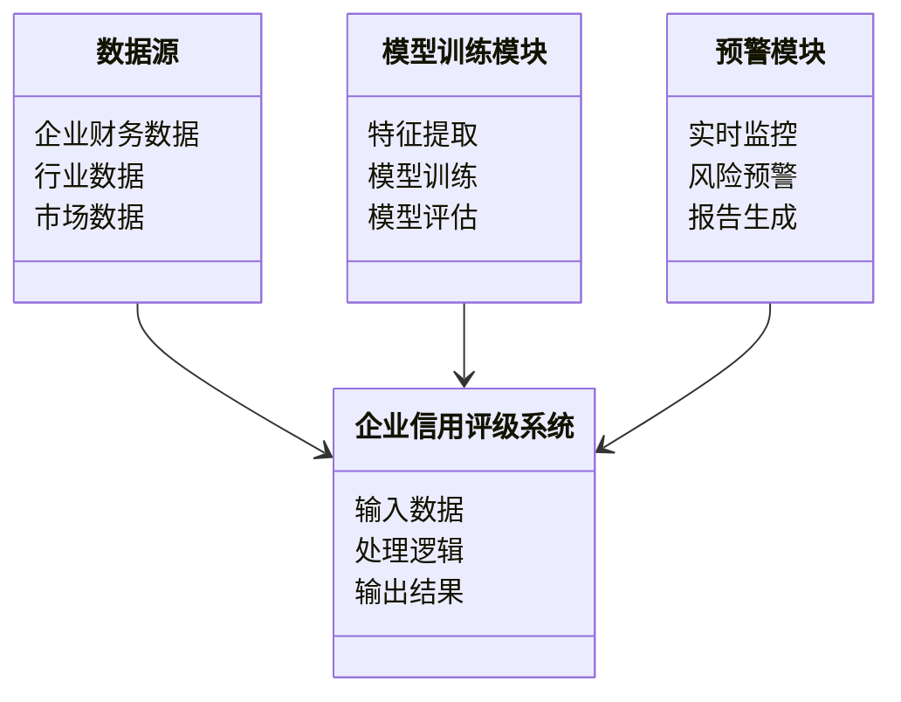
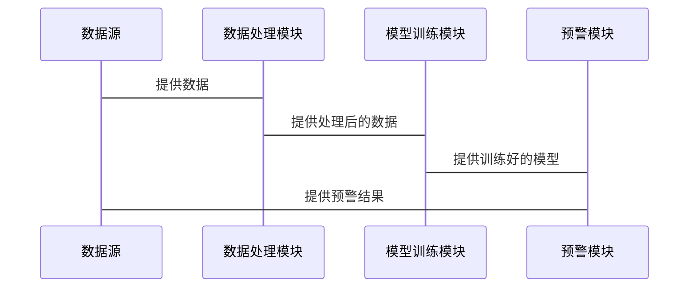

                 


# AI辅助的企业信用评级预警

> 关键词：AI, 企业信用评级, 信用预警, 风险评估, 机器学习, 深度学习, 自然语言处理

> 摘要：本文将深入探讨AI技术在企业信用评级预警中的应用，结合机器学习、深度学习和自然语言处理等技术，分析信用评级的核心概念、算法原理和系统架构，并通过实际案例展示AI在信用评级中的优势和实践应用。

---

# 第一部分: 企业信用评级预警的背景与挑战

## 第1章: 企业信用评级预警的背景与挑战

### 1.1 企业信用评级的基本概念

#### 1.1.1 信用评级的定义与作用

企业信用评级是指通过对企业的财务状况、经营能力和市场环境等多方面因素的综合评估，确定其信用等级的过程。信用评级的作用在于帮助企业获得融资、降低交易风险、优化资源配置等。

#### 1.1.2 企业信用评级的重要性

信用评级是企业信用管理的核心环节，直接影响企业的融资成本、市场信任度以及经营稳定性。良好的信用评级能够提升企业形象，降低融资门槛，而信用评级过低则可能导致融资困难甚至企业危机。

#### 1.1.3 信用评级的分类与标准

企业信用评级通常分为内部评级和外部评级。外部评级由专业的评级机构（如穆迪、标普等）进行，而内部评级则由企业自身或其财务部门进行。评级标准通常基于财务指标、行业地位、管理团队等因素。

### 1.2 传统企业信用评级的局限性

#### 1.2.1 传统评级方法的不足

传统信用评级方法主要依赖财务报表分析和经验判断，存在以下问题：
- 数据维度有限：仅依赖财务数据，难以全面反映企业信用状况。
- 人工分析成本高：需要大量专业人员进行数据收集、整理和分析。
- 主观性较强：评级结果受评级人员主观判断影响较大。

#### 1.2.2 数据获取与处理的难点

传统评级方法依赖于财务数据，但企业可能存在数据不完整、数据质量差等问题，导致评级结果不够准确。

#### 1.2.3 人工分析的效率与成本问题

随着企业数量的增加，传统的人工分析方式效率低下，难以满足大规模信用评级的需求。

### 1.3 AI辅助信用评级预警的必要性

#### 1.3.1 AI技术在信用评级中的优势

AI技术能够处理海量数据，发现隐藏的模式和关系，提高信用评级的准确性和效率。

#### 1.3.2 数据驱动的信用评估新范式

通过AI技术，可以利用企业内外部数据，构建多维度的信用评估模型，实现更精准的评级。

#### 1.3.3 企业信用风险预警的智能化需求

AI技术可以帮助企业及时发现潜在风险，提前采取预警措施，降低信用损失。

### 1.4 本书的目标与结构

#### 1.4.1 本书的核心目标

本书旨在探讨AI技术在企业信用评级中的应用，结合理论与实践，提供一套基于AI的信用评级预警解决方案。

#### 1.4.2 本书的章节安排

- 第一部分：背景与挑战
- 第二部分：核心概念与联系
- 第三部分：AI技术在信用评级中的应用
- 第四部分：信用评级预警的算法原理
- 第五部分：系统架构设计
- 第六部分：项目实战
- 第七部分：最佳实践与总结

#### 1.4.3 本书的阅读方法与建议

建议读者在阅读本书时，结合实际案例和代码实现，逐步理解AI技术在信用评级中的应用。

---

# 第二部分: 企业信用评级预警的核心概念与联系

## 第2章: 企业信用评级预警的核心概念

### 2.1 信用评级预警的关键要素

#### 2.1.1 企业财务指标分析

财务指标是信用评级的重要依据，包括资产负债率、流动比率、速动比率等。

#### 2.1.2 企业经营状况评估

经营状况包括企业的盈利能力、市场竞争力、管理团队稳定性等。

#### 2.1.3 企业信用历史记录

信用历史记录是评估企业信用状况的重要依据，包括按时还款、违约记录等。

### 2.2 信用评级预警的流程与方法

#### 2.2.1 数据收集与预处理

数据收集包括企业财务数据、行业数据、市场数据等，预处理包括数据清洗、特征提取等。

#### 2.2.2 风险评估模型构建

基于机器学习、深度学习等技术，构建信用评级模型。

#### 2.2.3 预警结果的应用与反馈

通过模型预测结果，制定预警策略，并根据反馈不断优化模型。

### 2.3 信用评级与AI技术的结合

#### 2.3.1 AI在信用数据分析中的应用

AI技术可以对海量数据进行分析，发现潜在的信用风险。

#### 2.3.2 AI在风险预测中的作用

通过AI技术，可以实现对信用风险的实时预测和预警。

#### 2.3.3 AI在信用评分模型中的优化

AI技术可以优化传统信用评分模型，提高模型的准确性和效率。

---

# 第三部分: AI技术在信用评级预警中的应用

## 第3章: AI技术基础与信用评级预警

### 3.1 机器学习在信用评级中的应用

#### 3.1.1 监督学习与信用评分

监督学习可以通过历史数据训练模型，预测企业的信用评分。

#### 3.1.2 非监督学习与信用数据挖掘

非监督学习可以对信用数据进行聚类分析，发现潜在的风险模式。

#### 3.1.3 强化学习与信用风险控制

强化学习可以通过模拟环境，优化信用风险控制策略。

### 3.2 深度学习在信用评级中的应用

#### 3.2.1 神经网络在信用评分中的应用

神经网络可以通过多层结构，提取复杂的信用特征。

#### 3.2.2 卷积神经网络与信用数据特征提取

卷积神经网络可以用于信用数据的特征提取，发现潜在的风险因素。

#### 3.2.3 循环神经网络与信用时间序列分析

循环神经网络可以用于信用时间序列分析，预测未来的信用风险。

### 3.3 自然语言处理在信用评级中的应用

#### 3.3.1 NLP在企业新闻与公告分析中的应用

通过NLP技术，可以分析企业新闻和公告，提取潜在的信用风险信息。

#### 3.3.2 基于文本挖掘的企业信用风险评估

文本挖掘技术可以分析企业公告、新闻报道等文本数据，评估企业的信用风险。

#### 3.3.3 多模态数据融合的信用评估

多模态数据融合可以将文本、图像、数值等多种数据类型结合起来，进行综合信用评估。

---

## 第4章: 信用评级预警的核心算法

### 4.1 逻辑回归模型

#### 4.1.1 逻辑回归的基本原理

逻辑回归是一种常用的分类算法，适用于二分类问题。

#### 4.1.2 逻辑回归在信用评分中的应用

通过逻辑回归模型，可以预测企业的信用评分。

#### 4.1.3 逻辑回归的优缺点分析

优点：简单易懂，计算效率高；缺点：假设线性关系，可能无法捕捉复杂特征。

---

### 4.2 支持向量机（SVM）

#### 4.2.1 SVM的基本原理

SVM是一种基于统计学习理论的分类算法，适用于高维数据。

#### 4.2.2 SVM在信用评级中的应用

SVM可以用于信用评级中的分类问题。

#### 4.2.3 SVM的优缺点分析

优点：适用于高维数据，泛化能力强；缺点：计算复杂度高。

---

### 4.3 随机森林（Random Forest）

#### 4.3.1 随机森林的基本原理

随机森林是一种基于树模型的集成算法，适用于分类和回归问题。

#### 4.3.2 随机森林在信用评级中的应用

随机森林可以用于信用评级中的特征选择和模型评估。

#### 4.3.3 随机森林的优缺点分析

优点：抗过拟合能力强，特征重要性分析方便；缺点：计算复杂度较高。

---

### 4.4 神经网络（Neural Networks）

#### 4.4.1 神经网络的基本原理

神经网络是一种模拟人脑神经网络的计算模型，适用于复杂模式识别。

#### 4.4.2 神经网络在信用评级中的应用

神经网络可以用于信用评级中的非线性关系建模。

#### 4.4.3 神经网络的优缺点分析

优点：能够捕捉复杂的非线性关系；缺点：训练时间长，容易过拟合。

---

## 第5章: 系统架构设计

### 5.1 系统功能设计

#### 5.1.1 领域模型



#### 5.1.2 系统架构


#### 5.1.3 系统接口设计



---

## 第6章: 项目实战

### 6.1 环境搭建

#### 6.1.1 安装Python和相关库

```bash
pip install numpy pandas scikit-learn tensorflow
```

#### 6.1.2 数据准备

```python
import pandas as pd
data = pd.read_csv('credit_data.csv')
```

### 6.2 核心代码实现

#### 6.2.1 数据预处理

```python
from sklearn.preprocessing import StandardScaler
scaler = StandardScaler()
data_scaled = scaler.fit_transform(data)
```

#### 6.2.2 模型训练

```python
from sklearn.linear_model import LogisticRegression
model = LogisticRegression()
model.fit(data_scaled, labels)
```

#### 6.2.3 模型评估

```python
from sklearn.metrics import accuracy_score
accuracy = accuracy_score(labels, model.predict(data_scaled))
print(f"Accuracy: {accuracy}")
```

### 6.3 案例分析

#### 6.3.1 数据分析与可视化

```python
import matplotlib.pyplot as plt
plt.scatter(data['feature1'], data['feature2'], c=labels)
plt.show()
```

#### 6.3.2 模型优化与调参

```python
from sklearn.model_selection import GridSearchCV
param_grid = {'C': [0.1, 1, 10]}
grid_search = GridSearchCV(LogisticRegression(), param_grid)
grid_search.fit(data_scaled, labels)
print(grid_search.best_params_)
```

---

## 第7章: 最佳实践与总结

### 7.1 注意事项

- 数据质量是信用评级的核心，需确保数据的完整性和准确性。
- 模型的可解释性是信用评级的重要因素，需关注模型的透明度。
- 风险控制是信用评级的关键，需建立有效的预警机制。

### 7.2 小结

AI技术在企业信用评级中的应用，能够显著提高评级的准确性和效率，降低企业的信用风险。

### 7.3 未来展望

随着AI技术的不断发展，信用评级将更加智能化和个性化，数据的多源化和模型的深度化将是未来的主要发展方向。

### 7.4 拓展阅读

建议读者进一步学习机器学习、深度学习和自然语言处理的相关知识，以更好地应用AI技术于信用评级领域。

---

# 结语

通过本文的介绍，读者可以全面了解AI技术在企业信用评级中的应用，从理论到实践，掌握基于AI的信用评级预警系统的构建方法。希望本文能够为读者提供有价值的参考和启发，助力企业信用评级的智能化发展。

