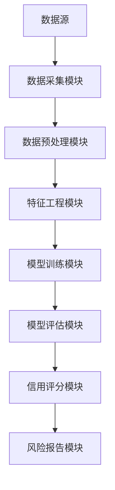

                 


# AI辅助的企业信用风险评估

> 关键词：企业信用风险评估，人工智能，机器学习，信用评分模型，风险管理

> 摘要：本文详细探讨了如何利用人工智能技术提升企业信用风险评估的效率和准确性。通过分析传统信用评估方法的局限性，介绍基于AI的信用风险评估的核心算法、系统架构和实际应用案例。文章内容涵盖从基础概念到高级算法，再到系统实现的全过程，旨在为企业信用风险管理提供新的思路和实践指导。

---

# 第一部分: 背景介绍

## 第1章: 信用风险评估的基本概念

### 1.1 信用风险的定义与特征

信用风险是指企业在履行合同义务时，由于债务人或交易对手方无法履行其财务责任而导致债权人或利益相关方遭受损失的可能性。企业信用风险评估是通过对企业的财务状况、经营状况、信用历史等多方面信息进行分析，量化企业在特定条件下的违约概率。

#### 1.1.1 信用风险的定义

企业信用风险通常包括以下几种表现形式：
1. **违约风险**：企业在约定的时间内无法支付债务本金或利息。
2. **评级风险**：企业信用评级的变化导致的风险。
3. **迁移风险**：企业信用状况发生不利变化的风险。

#### 1.1.2 信用风险的特征

| 特征 | 描述 |
|------|------|
| 客观性 | 信用风险是客观存在的，不受主观因素影响。 |
| 可测性 | 通过数据分析可以量化和评估信用风险。 |
| 可变性 | 信用风险会随着市场环境和企业经营状况的变化而变化。 |
| 累积性 | 信用风险可能在一段时间内累积，形成较大的损失。 |

### 1.2 企业信用风险评估的必要性

企业信用风险评估是企业风险管理的核心内容之一，其主要目的是通过科学的方法和模型，帮助企业识别和量化潜在的信用风险，从而制定合理的风险控制策略。

#### 1.2.1 信用风险对企业的影响

企业信用风险可能带来以下几种后果：
1. **直接损失**：由于客户或供应商的违约，企业可能面临直接的经济损失。
2. **声誉损失**：信用风险事件可能影响企业的市场声誉，进而影响未来的业务发展。
3. **融资成本增加**：信用风险高企可能导致企业融资成本上升。

### 1.3 传统信用风险评估方法的局限性

传统信用风险评估方法主要依赖于财务报表分析和经验判断，这种方法虽然在一定程度上能够反映企业的信用状况，但也存在明显的局限性。

#### 1.3.1 传统信用评估方法的特点

| 方法 | 描述 |
|------|------|
| 财务报表分析 | 通过分析企业的财务报表（如资产负债表、利润表、现金流量表）来评估企业的信用状况。 |
| 专家判断法 | 由信用评估专家基于经验和行业知识进行主观判断。 |
| 信用评分模型 | 使用简单的评分卡模型对客户进行信用评分。 |

#### 1.3.2 传统方法的局限性

| 问题 | 描述 |
|------|------|
| 数据不足 | 传统方法主要依赖财务数据，难以充分利用其他类型的数据（如市场数据、行为数据）。 |
| 主观性高 | 专家判断法主观性强，容易受到评估人员的经验和偏见影响。 |
| 模型简单 | 传统信用评分模型通常基于简单的线性关系，难以捕捉复杂的信用风险因素。 |

---

## 第2章: AI技术在信用风险评估中的应用前景

### 2.1 AI技术如何提升信用风险评估的效率

人工智能技术（AI）在信用风险评估中的应用，主要体现在以下几个方面：

#### 2.1.1 数据处理能力

AI技术能够处理海量的非结构化数据，如文本、图像、视频等，从而为企业提供更全面的信用评估信息。

#### 2.1.2 模型复杂性

AI模型（如深度学习模型）能够捕捉复杂的非线性关系，从而更准确地预测企业的信用风险。

#### 2.1.3 自动化评估

AI技术可以实现信用评估的自动化，显著提高评估效率，降低成本。

### 2.2 数据驱动的信用评估新范式

传统的信用风险评估主要依赖于财务数据，而AI技术的应用使得信用风险评估可以利用更多类型的数据，形成数据驱动的信用评估新范式。

#### 2.2.1 数据来源的扩展

| 数据类型 | 描述 |
|----------|------|
| 财务数据 | 资产负债表、利润表、现金流量表等。 |
| 市场数据 | 行业趋势、市场价格、竞争环境等。 |
| 行为数据 | 客户交易记录、支付行为、社交网络信息等。 |
| 文本数据 | 新闻报道、公司公告、行业报告等。 |

#### 2.2.2 数据融合与特征提取

通过数据融合技术，可以将多种类型的数据进行整合，并提取有用的特征，从而提高信用评估的准确性。

### 2.3 企业信用风险评估的未来趋势

随着AI技术的不断发展，企业信用风险评估将朝着更加智能化、数据化和个性化的方向发展。

#### 2.3.1 智能化

AI技术将更加深入地融入信用风险评估的各个环节，实现智能化的信用评估。

#### 2.3.2 数据化

信用风险评估将更加依赖于大数据技术，通过分析海量数据来提高评估的准确性和全面性。

#### 2.3.3 个性化

基于AI的信用风险评估将更加注重客户的个性化特征，提供更加精准的风险评估服务。

---

## 第3章: 本书的核心内容与目标

### 3.1 本书的研究范围

本书主要研究AI技术在企业信用风险评估中的应用，涵盖从理论到实践的全过程。

#### 3.1.1 理论基础

介绍信用风险评估的基本理论和AI技术的核心算法。

#### 3.1.2 应用实践

通过实际案例分析，展示AI技术在信用风险评估中的具体应用。

### 3.2 本书的主要目标

本书旨在为企业信用风险管理提供新的思路和实践指导，帮助读者了解和掌握基于AI的信用风险评估方法。

#### 3.2.1 提供理论支持

通过介绍AI算法的基本原理，为读者提供理论支持。

#### 3.2.2 提供实践指导

通过实际案例分析，为读者提供实践指导。

### 3.3 本书的结构安排

本书分为以下几个部分：
1. **背景介绍**：介绍信用风险评估的基本概念和AI技术的应用前景。
2. **核心概念**：详细讲解企业信用风险评估的核心概念和关键要素。
3. **算法原理**：介绍常用的信用风险评估算法及其原理。
4. **系统架构**：设计基于AI的信用风险评估系统架构。
5. **项目实战**：通过实际案例分析，展示AI技术在信用风险评估中的应用。
6. **最佳实践**：总结经验和注意事项，提供实践指导。

---

## 第4章: 企业信用风险评估的核心概念

### 4.1 信用风险评估的定义与特征

信用风险评估是通过对企业的财务状况、经营状况、信用历史等多方面信息进行分析，量化企业在特定条件下的违约概率。

#### 4.1.1 信用风险评估的定义

信用风险评估是通过对企业的综合分析，量化其违约概率的过程。

#### 4.1.2 信用风险评估的核心特征

| 特征 | 描述 |
|------|------|
| 综合性 | 信用风险评估需要综合考虑企业的财务状况、经营状况、信用历史等多个方面。 |
| 数据驱动 | 信用风险评估依赖于大量数据的分析和处理。 |
| 动态性 | 信用风险评估需要动态调整，以反映市场环境和企业经营状况的变化。 |

---

## 第5章: 信用风险评估的关键要素

### 5.1 企业财务状况分析

企业财务状况是信用风险评估的重要组成部分，主要包括以下几个方面：

#### 5.1.1 资产负债表分析

| 财务指标 | 描述 |
|----------|------|
| 资产负债率 | 衡量企业的财务杠杆程度。 |
| 速动比率 | 衡量企业的短期偿债能力。 |
| 存货周转率 | 衡量企业的存货管理效率。 |

#### 5.1.2 利润表分析

| 财务指标 | 描述 |
|----------|------|
| 净利润 | 反映企业的盈利能力。 |
| 营业利润率 | 衡量企业的销售毛利率。 |
| 净利率 | 衡量企业的净利润水平。 |

### 5.2 企业经营状况评估

企业经营状况是信用风险评估的另一个重要方面，主要包括以下几个方面：

#### 5.2.1 市场地位

| 指标 | 描述 |
|------|------|
| 市场占有率 | 衡量企业在市场中的地位。 |
| 行业排名 | 衡量企业在行业中的位置。 |

#### 5.2.2 竞争能力

| 指标 | 描述 |
|------|------|
| 核心竞争力 | 衡量企业的核心竞争优势。 |
| 创新能力 | 衡量企业的创新能力。 |

### 5.3 企业信用历史记录

企业信用历史记录是信用风险评估的重要依据，主要包括以下几个方面：

#### 5.3.1 违约记录

| 指标 | 描述 |
|------|------|
| 违约次数 | 衡量企业过去的违约情况。 |
| 违约金额 | 衡量企业过去的违约规模。 |

#### 5.3.2 信用评级

| 指标 | 描述 |
|------|------|
| 信用评分 | 衡量企业的信用状况。 |
| 评级机构 | 衡量评级的权威性。 |

---

## 第6章: 企业信用风险评估的流程与方法

### 6.1 传统信用风险评估流程

传统信用风险评估流程主要包括以下几个步骤：

#### 6.1.1 数据收集

| 步骤 | 描述 |
|------|------|
| 数据收集 | 收集企业的财务数据、经营数据、信用历史数据等。 |
| 数据清洗 | 对收集到的数据进行清洗和预处理。 |
| 数据分析 | 对数据进行分析，提取关键特征。 |
| 模型训练 | 使用简单的模型（如逻辑回归）进行信用评分。 |
| 结果评估 | 对模型的性能进行评估和调整。 |

### 6.2 数据驱动的信用风险评估流程

数据驱动的信用风险评估流程主要依赖于大数据技术和机器学习算法，流程如下：

#### 6.2.1 数据收集与预处理

| 步骤 | 描述 |
|------|------|
| 数据收集 | 收集企业的多维数据，包括财务数据、市场数据、行为数据等。 |
| 数据清洗 | 对数据进行清洗，处理缺失值、异常值等问题。 |
| 数据融合 | 将不同来源的数据进行融合，提取有用的特征。 |

#### 6.2.2 模型训练与优化

| 步骤 | 描述 |
|------|------|
| 特征选择 | 选择对信用风险影响较大的特征。 |
| 模型选择 | 选择适合的机器学习算法（如逻辑回归、随机森林、神经网络等）。 |
| 模型训练 | 使用训练数据对模型进行训练。 |
| 模型评估 | 使用测试数据对模型的性能进行评估和优化。 |

---

## 第7章: AI辅助信用风险评估的核心算法

### 7.1 逻辑回归算法

逻辑回归是一种常用的分类算法，广泛应用于信用风险评估。

#### 7.1.1 逻辑回归的基本原理

逻辑回归通过将线性回归的结果压缩到0到1之间，从而实现分类。其数学公式如下：

$$ P(y=1|x) = \frac{e^{\beta_0 + \beta_1 x}}{1 + e^{\beta_0 + \beta_1 x}} $$

其中，$y$ 是输出变量（0或1），$x$ 是输入变量，$\beta_0$ 和 $\beta_1$ 是模型参数。

#### 7.1.2 逻辑回归的数学模型

逻辑回归的损失函数为对数损失函数：

$$ L(\beta) = -\sum_{i=1}^{n} [y_i \ln p_i + (1 - y_i) \ln (1 - p_i)] $$

其中，$p_i = \frac{e^{\beta_0 + \beta_1 x_i}}{1 + e^{\beta_0 + \beta_1 x_i}}$。

---

### 7.2 支持向量机算法

支持向量机（SVM）是一种强大的分类算法，适用于高维数据的分类。

#### 7.2.1 SVM的基本原理

SVM通过找到一个超平面，使得正类和负类样本被最大化地分隔开。其数学模型如下：

$$ y = \text{sign}(w \cdot x + b) $$

其中，$w$ 是权重向量，$b$ 是偏置项，$x$ 是输入向量，$y$ 是输出变量。

#### 7.2.2 SVM的数学模型

SVM的目标是最小化以下损失函数：

$$ \min_{w,b,\xi} \frac{1}{2} w^T w + C \sum_{i=1}^{n} \xi_i $$

其中，$\xi_i$ 是松弛变量，$C$ 是惩罚系数。

---

### 7.3 随机森林算法

随机森林是一种基于树的集成算法，具有较高的准确性和鲁棒性。

#### 7.3.1 随机森林的基本原理

随机森林通过构建多棵决策树，并对结果进行投票或平均，从而提高模型的准确性和稳定性。

#### 7.3.2 随机森林的数学模型

随机森林的预测结果是多个决策树预测结果的加权平均：

$$ y = \frac{1}{N} \sum_{i=1}^{N} y_i $$

其中，$N$ 是决策树的数量，$y_i$ 是第$i$棵决策树的预测结果。

---

### 7.4 神经网络算法

神经网络是一种模拟人脑神经网络的算法，适用于复杂的非线性分类问题。

#### 7.4.1 神经网络的基本原理

神经网络通过多层神经元网络，实现对输入数据的非线性变换和分类。

#### 7.4.2 神经网络的数学模型

神经网络的前向传播过程如下：

$$ a^{(l+1)} = \sigma(w^{(l)} a^{(l)} + b^{(l)}) $$

其中，$a^{(l)}$ 是第$l$层的激活值，$w^{(l)}$ 是权重矩阵，$b^{(l)}$ 是偏置向量，$\sigma$ 是激活函数。

---

## 第8章: 系统架构与设计

### 8.1 系统功能设计

基于AI的信用风险评估系统主要包括以下几个功能模块：

#### 8.1.1 数据采集模块

| 功能 | 描述 |
|------|------|
| 数据采集 | 从多种数据源采集企业的多维数据。 |
| 数据清洗 | 对采集到的数据进行清洗和预处理。 |

#### 8.1.2 数据预处理模块

| 功能 | 描述 |
|------|------|
| 数据融合 | 将不同来源的数据进行融合，提取有用的特征。 |
| 特征选择 | 选择对信用风险影响较大的特征。 |

#### 8.1.3 模型训练模块

| 功能 | 描述 |
|------|------|
| 模型选择 | 选择适合的机器学习算法。 |
| 模型训练 | 使用训练数据对模型进行训练。 |

#### 8.1.4 模型评估模块

| 功能 | 描述 |
|------|------|
| 模型评估 | 使用测试数据对模型的性能进行评估。 |
| 模型优化 | 对模型进行优化，提高预测准确率。 |

#### 8.1.5 信用评分模块

| 功能 | 描述 |
|------|------|
| 信用评分 | 根据模型预测结果，生成企业的信用评分。 |
| 风险报告 | 生成信用风险评估报告，供企业决策参考。 |

### 8.2 系统架构设计

基于AI的信用风险评估系统的架构设计如下：



---

## 第9章: 项目实战

### 9.1 环境配置

#### 9.1.1 安装Python

```bash
python --version
pip install --upgrade pip
```

#### 9.1.2 安装机器学习库

```bash
pip install numpy
pip install pandas
pip install scikit-learn
pip install xgboost
```

### 9.2 数据预处理与特征工程

#### 9.2.1 数据加载与清洗

```python
import pandas as pd
import numpy as np

# 加载数据
data = pd.read_csv('credit_data.csv')

# 删除缺失值
data = data.dropna()

# 处理异常值
data = data[abs(data['amount'] - data['amount'].mean()) < 3 * data['amount'].std()]
```

#### 9.2.2 特征选择

```python
from sklearn.feature_selection import SelectKBest
from sklearn.feature_selection import chi2

# 选择最重要的特征
selector = SelectKBest(score_func=chi2, k=5)
selector.fit_transform(data.drop('label', axis=1), data['label'])
```

### 9.3 模型训练与评估

#### 9.3.1 训练逻辑回归模型

```python
from sklearn.linear_model import LogisticRegression
from sklearn.model_selection import train_test_split
from sklearn.metrics import accuracy_score

# 分割数据集
X_train, X_test, y_train, y_test = train_test_split(data.drop('label', axis=1), data['label'], test_size=0.2)

# 训练逻辑回归模型
model = LogisticRegression()
model.fit(X_train, y_train)

# 预测并评估准确率
y_pred = model.predict(X_test)
print('Accuracy:', accuracy_score(y_test, y_pred))
```

#### 9.3.2 使用XGBoost模型优化

```python
import xgboost as xgb

# 训练XGBoost模型
model = xgb.XGBClassifier(n_estimators=100, learning_rate=0.1, max_depth=3)
model.fit(X_train, y_train)

# 预测并评估准确率
y_pred = model.predict(X_test)
print('Accuracy:', accuracy_score(y_test, y_pred))
```

### 9.4 部署与应用

#### 9.4.1 部署模型

将训练好的模型部署到生产环境，可以通过Flask或Django等框架实现API接口。

#### 9.4.2 模型监控

定期监控模型的性能，及时调整和优化模型。

---

## 第10章: 最佳实践与注意事项

### 10.1 最佳实践

#### 10.1.1 数据隐私保护

在处理企业数据时，必须严格遵守数据隐私保护法规，确保数据的安全性和合法性。

#### 10.1.2 模型解释性

为了提高模型的透明度和可解释性，可以选择使用解释性更强的算法（如逻辑回归）或提供模型解释工具（如SHAP值）。

### 10.2 注意事项

#### 10.2.1 数据质量问题

数据的质量直接影响模型的性能，因此在数据预处理阶段必须严格把控数据质量。

#### 10.2.2 模型过拟合问题

在模型训练过程中，需要注意防止过拟合，可以通过交叉验证、正则化等方法进行控制。

#### 10.2.3 模型更新

为了保持模型的准确性，需要定期更新模型，以适应市场环境和企业经营状况的变化。

---

## 第11章: 未来发展趋势

### 11.1 数据驱动的信用评估新范式

随着大数据技术的发展，信用风险评估将更加依赖于数据驱动的方法，通过分析海量数据来提高评估的准确性和全面性。

### 11.2 AI技术的不断进步

AI技术的不断进步将推动信用风险评估向着更加智能化、自动化和个性化的方向发展。

### 11.3 区块链技术的应用

区块链技术可以通过提供不可篡改的记录，提高信用风险评估的可靠性和安全性。

---

## 第12章: 总结与展望

### 12.1 本书的总结

本书系统地介绍了AI技术在企业信用风险评估中的应用，涵盖了从理论到实践的全过程，为企业信用风险管理提供了新的思路和实践指导。

### 12.2 未来研究方向

未来的研究方向可以包括以下几个方面：
1. **更复杂的模型**：探索更复杂的深度学习模型在信用风险评估中的应用。
2. **多模态数据融合**：研究如何更有效地融合多模态数据，提高信用评估的准确性。
3. **实时信用评估**：研究如何实现信用评估的实时化，提高风险控制的效率。

---

## 结语

AI技术的快速发展为企业信用风险评估提供了新的机遇和挑战。通过本书的介绍，读者可以了解到如何利用AI技术提升信用风险评估的效率和准确性，为企业信用风险管理提供更有力的支持。希望本书能够为读者提供有价值的参考和启发，帮助他们在实践中取得更好的效果。

