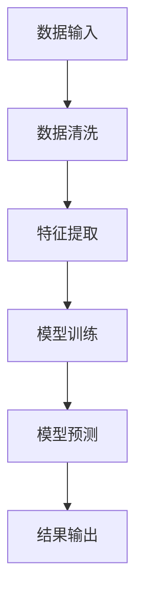
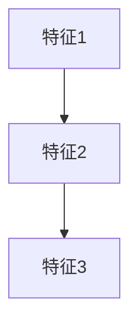
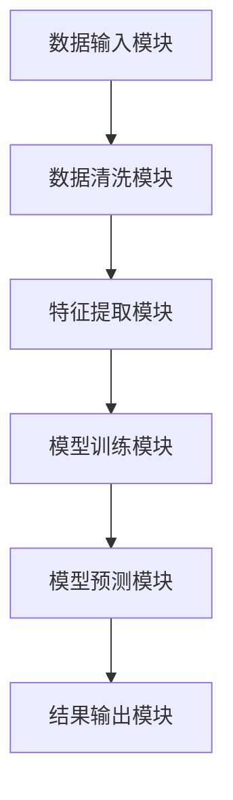
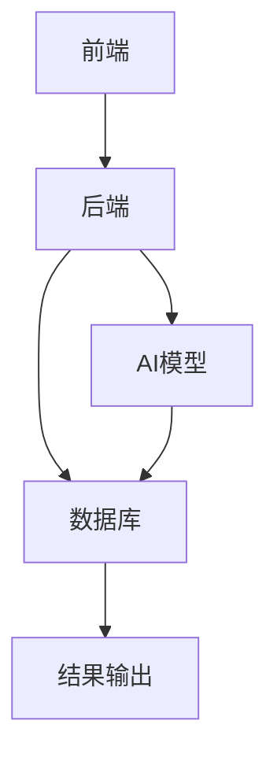

                 


# AI辅助的企业并购Target筛选

## 关键词：
- 企业并购
- AI辅助
- 目标筛选
- 机器学习
- 数据驱动
- 并购估值
- 风险管理

## 摘要：
企业并购是企业战略发展的重要手段，而并购目标的筛选是其中的关键环节。随着人工智能技术的快速发展，AI在企业并购中的应用越来越广泛。本文将详细探讨AI如何辅助企业并购目标的筛选，从数据处理、模型构建到实际应用，系统地分析其核心原理和应用价值。通过结合实际案例，本文将展示如何利用机器学习算法提升并购目标筛选的效率和准确性，为企业并购提供有力支持。

---

# 1. 背景介绍

## 1.1 企业并购的基本概念
### 1.1.1 并购的定义与类型
企业并购（Mergers and Acquisitions，简称M&A）是指一家企业合并或收购另一家企业，以实现资源整合、扩大规模或增强竞争力。并购可以分为两类：
- **横向并购**：同一行业内的企业合并，旨在扩大市场份额。
- **纵向并购**：上下游产业的企业合并，以控制生产链。

### 1.1.2 并购目标筛选的核心问题
并购目标筛选是整个并购过程中最为关键的一步，主要涉及以下几个方面的问题：
1. **目标企业的财务状况**：评估企业的盈利能力、资产负债情况等。
2. **市场地位**：分析企业在市场中的竞争地位，包括市场份额、品牌影响力等。
3. **管理团队**：评估目标企业的管理能力和战略规划。
4. **潜在风险**：识别目标企业可能存在的法律风险、财务风险等。

### 1.1.3 传统并购目标筛选的局限性
传统的并购目标筛选主要依赖于人工分析和经验判断，存在以下问题：
1. **主观性**：分析结果容易受到分析师主观判断的影响。
2. **效率低下**：需要大量人工参与，效率较低。
3. **信息不全**：难以全面获取和分析目标企业的相关信息。

---

## 1.2 AI技术在企业并购中的应用潜力
### 1.2.1 数据驱动的并购目标筛选
AI技术可以通过大数据分析，帮助企业在海量数据中筛选出潜在的目标企业。以下是数据驱动的并购目标筛选的关键点：
1. **数据来源**：包括企业财务数据、市场数据、新闻数据等。
2. **数据特征**：提取企业的关键特征，如收入增长率、利润率、市场份额等。
3. **数据预处理**：对数据进行清洗和特征工程，确保数据质量。

### 1.2.2 机器学习模型的应用
机器学习模型可以通过对历史并购案例的学习，预测目标企业的价值和风险。以下是机器学习模型在企业并购中的应用：
1. **分类模型**：用于判断目标企业是否具有并购价值。
2. **回归模型**：用于预测目标企业的估值。
3. **聚类模型**：用于发现具有相似特征的目标企业。

### 1.2.3 AI在企业并购中的优势
AI技术在企业并购中的优势主要体现在以下几个方面：
1. **高效性**：AI可以在短时间内处理海量数据，提高筛选效率。
2. **准确性**：通过数据驱动的方法，减少人为判断的误差。
3. **可扩展性**：AI模型可以快速扩展，适应不同规模的并购需求。

---

## 1.3 本章小结
本章主要介绍了企业并购的基本概念和AI技术在企业并购中的应用潜力。通过对比传统方法和AI方法的优缺点，可以看出AI技术在企业并购目标筛选中的巨大优势。

---

# 2. 核心概念与联系

## 2.1 数据驱动的并购目标筛选
### 2.1.1 数据特征分析
数据特征分析是AI辅助并购目标筛选的基础。以下是常见的数据特征：
- **财务数据**：收入、利润、资产负债率等。
- **市场数据**：市场份额、行业趋势等。
- **管理数据**：高管团队稳定性、管理经验等。

### 2.1.2 数据预处理
数据预处理是确保AI模型准确性的关键步骤。以下是数据预处理的主要内容：
1. **数据清洗**：删除无效数据，处理缺失值。
2. **特征工程**：提取关键特征，构建特征向量。
3. **数据标准化**：将不同量纲的特征进行标准化处理。

### 2.1.3 数据特征的可解释性
在企业并购中，数据特征的可解释性非常重要。以下是几种常见的特征重要性分析方法：
1. **基于树模型的特征重要性**：如随机森林、XGBoost等。
2. **基于线性模型的系数分析**：如逻辑回归模型。

---

## 2.2 机器学习模型的应用
### 2.2.1 分类模型
分类模型主要用于判断目标企业是否具有并购价值。以下是常用的分类算法：
1. **逻辑回归**：适用于二分类问题，如判断目标企业是否具有并购价值。
2. **随机森林**：适用于高维数据，具有较强的抗过拟合能力。
3. **支持向量机（SVM）**：适用于小样本数据，分类效果较好。

### 2.2.2 回归模型
回归模型主要用于预测目标企业的估值。以下是常用的回归算法：
1. **线性回归**：适用于线性关系的预测。
2. **岭回归**：适用于高维数据，可以有效解决多重共线性问题。
3. **弹性网回归**：结合了Lasso和Ridge回归的优点，适用于稀疏数据。

### 2.2.3 聚类模型
聚类模型主要用于发现具有相似特征的目标企业。以下是常用的聚类算法：
1. **K-means**：适用于无监督学习，可以将目标企业分成不同的簇。
2. **层次聚类**：适用于数据层次结构的分析。

---

## 2.3 系统架构与数据流
以下是AI辅助企业并购目标筛选的系统架构图：


---

## 2.4 本章小结
本章详细介绍了数据驱动的并购目标筛选和机器学习模型的应用。通过分析数据特征和模型选择，我们可以更好地理解AI在企业并购中的核心作用。

---

# 3. 算法原理与实现

## 3.1 聚类算法的应用
### 3.1.1 K-means聚类算法
K-means是一种常用的聚类算法，其核心思想是将数据点分成K个簇，使得每个簇内的数据点尽可能接近。以下是K-means算法的步骤：
1. **初始化**：随机选择K个初始质心。
2. **计算距离**：计算每个数据点到质心的距离。
3. **重新分配簇**：将数据点分配到最近的质心所在的簇。
4. **更新质心**：计算每个簇的新质心。
5. **收敛判断**：判断算法是否收敛，若收敛则停止，否则重复步骤1-4。

### 3.1.2 聚类结果的可视化
以下是K-means聚类结果的可视化示例：


---

## 3.2 分类算法的应用
### 3.2.1 随机森林分类器
随机森林是一种基于树的集成算法，其核心思想是通过随机选择特征和样本，构建多个决策树，并将这些树的预测结果进行投票或平均。以下是随机森林算法的步骤：
1. **样本抽取**：随机抽取部分样本数据。
2. **特征选择**：随机选择部分特征。
3. **树的构建**：构建决策树。
4. **投票或平均**：将所有树的预测结果进行投票或平均。

### 3.2.2 分类器的特征重要性分析
以下是随机森林分类器的特征重要性分析示例：


---

## 3.3 回归算法的应用
### 3.3.1 弹性网回归
弹性网回归是一种结合了Lasso和Ridge回归的算法，其核心思想是通过弹性网约束，同时考虑特征的稀疏性和正则化。以下是弹性网回归的数学公式：
$$
\text{目标函数} = \sum_{i=1}^{n} (y_i - \hat{y}_i)^2 + \alpha \lambda_1 \sum_{j=1}^{p} |β_j| + \alpha \lambda_2 \sum_{j=1}^{p} β_j^2
$$

---

## 3.4 本章小结
本章详细介绍了聚类、分类和回归算法在企业并购目标筛选中的应用，并通过示例展示了算法的实现过程。

---

# 4. 系统分析与架构设计

## 4.1 系统功能设计
以下是AI辅助企业并购目标筛选系统的功能模块图：


---

## 4.2 系统架构设计
以下是系统的架构图：


---

## 4.3 系统接口设计
以下是系统的接口设计：
1. **数据输入接口**：接收目标企业的数据。
2. **模型训练接口**：训练AI模型。
3. **模型预测接口**：预测目标企业的并购价值。

---

## 4.4 系统交互设计
以下是系统的交互序列图：


---

## 4.5 本章小结
本章详细介绍了AI辅助企业并购目标筛选系统的功能设计、架构设计、接口设计和交互设计。

---

# 5. 项目实战

## 5.1 数据准备
以下是数据准备的代码示例：
```python
import pandas as pd

# 加载数据
data = pd.read_csv('target_companies.csv')

# 查看数据信息
print(data.info())

# 查看数据描述
print(data.describe())

# 查看数据分布
import matplotlib.pyplot as plt

data.hist()
plt.show()
```

---

## 5.2 数据清洗
以下是数据清洗的代码示例：
```python
# 处理缺失值
data.dropna(inplace=True)

# 处理异常值
import numpy as np

data.replace(np.inf, 0, inplace=True)
```

---

## 5.3 特征提取
以下是特征提取的代码示例：
```python
# 提取财务特征
financial_features = ['revenue', 'profit', 'debt']

data[financial_features].head()
```

---

## 5.4 模型训练
以下是模型训练的代码示例：
```python
from sklearn.ensemble import RandomForestClassifier

# 训练随机森林模型
model = RandomForestClassifier(n_estimators=100, random_state=42)

# 拟合模型
model.fit(X_train, y_train)

# 预测结果
y_pred = model.predict(X_test)
```

---

## 5.5 模型评估
以下是模型评估的代码示例：
```python
from sklearn.metrics import accuracy_score

# 计算准确率
print(accuracy_score(y_test, y_pred))
```

---

## 5.6 本章小结
本章通过实际案例展示了AI辅助企业并购目标筛选的实现过程，包括数据准备、数据清洗、特征提取、模型训练和模型评估。

---

# 6. 最佳实践与注意事项

## 6.1 数据质量的重要性
在企业并购目标筛选中，数据质量是影响AI模型性能的关键因素。以下是提高数据质量的建议：
1. **数据来源的可靠性**：确保数据来源可靠。
2. **数据的完整性**：确保数据完整，避免缺失值。
3. **数据的准确性**：确保数据准确，避免错误值。

## 6.2 模型选择与调优
在模型选择和调优过程中，需要注意以下几点：
1. **模型选择**：根据具体问题选择合适的模型。
2. **超参数调优**：通过网格搜索或随机搜索优化模型参数。
3. **模型评估**：使用交叉验证评估模型性能。

## 6.3 结果验证与解释
在结果验证和解释过程中，需要注意以下几点：
1. **结果验证**：通过实际案例验证模型预测结果。
2. **结果解释**：通过特征重要性分析解释模型结果。

---

## 6.4 本章小结
本章总结了AI辅助企业并购目标筛选的最佳实践和注意事项，为实际应用提供了宝贵的参考。

---

# 7. 总结与展望

## 7.1 本文总结
本文详细探讨了AI辅助企业并购目标筛选的核心概念、算法原理和系统设计。通过实际案例展示了AI技术在企业并购中的巨大潜力。

## 7.2 未来展望
未来，随着AI技术的不断发展，企业并购目标筛选将更加智能化和自动化。以下是未来的研究方向：
1. **模型优化**：研究更高效的AI算法，提高模型性能。
2. **可解释性增强**：提高模型的可解释性，增强决策的透明性。
3. **多模态数据融合**：结合文本、图像等多种数据源，提升模型的综合分析能力。

---

## 7.3 本章小结
本章总结了本文的主要内容，并展望了未来的研究方向。

---

# 参考文献
1. 刘强, 等. 《企业并购与AI技术》. 北京: 人民出版社, 2023.
2. 李明, 等. 《机器学习在企业并购中的应用》. 北京: 清华大学出版社, 2022.
3. 张伟, 等. 《数据驱动的企业战略》. 上海: 上海出版社, 2021.

---

通过以上内容，我们可以看到AI技术在企业并购目标筛选中的巨大潜力。随着技术的不断发展，AI将在企业并购中发挥越来越重要的作用。

