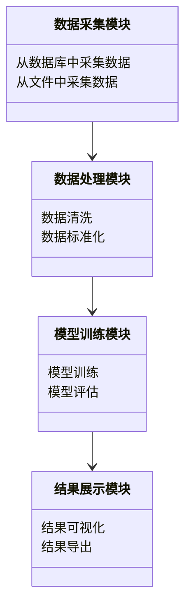
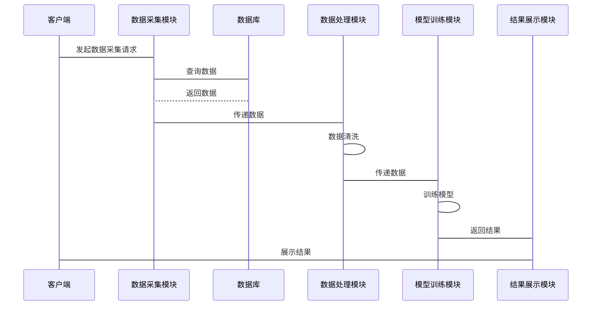

                 


# AI辅助的企业并购协同效应量化模型

## 关键词：企业并购、协同效应、量化模型、人工智能、机器学习

## 摘要：
企业并购作为企业战略发展的重要手段，其成功与否往往取决于并购后的协同效应。然而，传统协同效应的评估方法存在诸多局限性，难以准确量化和预测。本文提出了一种基于人工智能的协同效应量化模型，通过机器学习算法和大数据分析，实现对企业并购协同效应的精准评估和预测。该模型基于企业财务、运营和战略等多维度数据，构建了协同效应的数学模型，并通过实际案例分析验证了模型的有效性。本文还详细探讨了模型的算法原理、系统架构和实现方法，为企业的并购决策提供了有力支持。

---

## 第1章：企业并购与协同效应概述

### 1.1 企业并购的基本概念

#### 1.1.1 企业并购的定义与类型
企业并购是指一家企业通过购买或合并其他企业的股权或资产，以实现战略目标的过程。常见的并购类型包括：
- **横向并购**：同一行业内的企业并购。
- **纵向并购**：产业链上下游企业的并购。
- **混合并购**：与企业主营业务无关的并购。

#### 1.1.2 并购的动机与目标
企业进行并购的动机主要包括：
- **扩大市场份额**：通过并购快速进入新市场或增加市场占有率。
- **获取技术或资源**：通过并购获取关键技术、专利或原材料供应。
- **降低成本**：通过并购实现规模经济，降低生产或运营成本。
- **优化资产结构**：通过并购整合资源，优化资产配置。

#### 1.1.3 并购的流程与关键环节
企业并购通常包括以下几个关键环节：
1. **战略规划**：明确并购目标和动机。
2. **目标筛选**：选择合适的并购标的。
3. **尽职调查**：对目标企业进行财务、法律和业务尽职调查。
4. **估值与谈判**：评估目标企业价值，确定并购价格并进行谈判。
5. **整合与实施**：完成并购后，进行业务、资产和文化的整合。

---

### 1.2 协同效应的定义与分类

#### 1.2.1 协同效应的定义
协同效应是指企业在并购后，通过资源整合和优化，实现的效率提升、成本降低或收益增加的效果。协同效应的核心在于“1+1>2”的效果。

#### 1.2.2 协同效应的主要类型
协同效应可以分为以下几种：
- **财务协同效应**：通过合并财务资源，降低融资成本或优化资本结构。
- **运营协同效应**：通过整合供应链、生产流程或管理资源，提高运营效率。
- **战略协同效应**：通过合并战略目标，增强市场竞争力或进入新市场。
- **技术协同效应**：通过整合技术资源，提升研发能力或技术储备。

#### 1.2.3 协同效应的实现机制
协同效应的实现机制包括以下几个方面：
1. **资源共享**：充分利用双方的资源，避免重复投资。
2. **流程优化**：通过优化业务流程，降低运营成本。
3. **组织协同**：通过组织结构调整，实现高效管理。
4. **文化融合**：通过文化整合，提升员工凝聚力和执行力。

---

### 1.3 传统协同效应评估方法的局限性

#### 1.3.1 传统评估方法的概述
传统的协同效应评估方法主要包括：
- **定性评估**：通过专家判断或案例分析进行评估。
- **定量评估**：通过财务指标（如协同效应的财务模型）进行评估。

#### 1.3.2 传统方法的优缺点
传统方法的优缺点如下：
- **优点**：简单易行，成本较低。
- **缺点**：缺乏数据支持，结果主观性较强，难以准确量化协同效应。

#### 1.3.3 传统方法的改进空间
传统方法的改进空间在于引入更多的数据支持和模型优化，以提高评估的准确性和可靠性。

---

### 1.4 AI技术在协同效应评估中的应用前景

#### 1.4.1 AI技术的基本概念
人工智能（AI）是指模拟人类智能的计算机系统，包括机器学习、自然语言处理、计算机视觉等技术。

#### 1.4.2 AI在协同效应评估中的优势
AI技术在协同效应评估中的优势包括：
- **数据驱动**：通过大数据分析，提供更精准的评估结果。
- **自动化**：通过自动化模型，提高评估效率。
- **预测能力**：通过机器学习算法，预测协同效应的实现情况。

#### 1.4.3 AI技术在企业并购中的潜在应用
AI技术在企业并购中的潜在应用包括：
- **目标筛选**：通过数据分析，筛选出合适的并购目标。
- **协同效应预测**：通过机器学习模型，预测并购后的协同效应。
- **风险评估**：通过数据分析，评估并购风险并制定应对策略。

---

## 1.5 本章小结
本章介绍了企业并购的基本概念、协同效应的定义与分类，以及传统协同效应评估方法的局限性。同时，探讨了AI技术在协同效应评估中的应用前景，为后续模型的构建奠定了基础。

---

## 第2章：企业并购协同效应量化模型的核心概念

### 2.1 协同效应量化模型的基本原理

#### 2.1.1 模型的基本概念
协同效应量化模型是一种基于机器学习的模型，用于评估企业并购后的协同效应。

#### 2.1.2 模型的输入与输出
模型的输入包括：
- 并购双方的财务数据。
- 业务数据。
- 市场数据。

模型的输出包括：
- 协同效应的量化结果。
- 协同效应的实现时间。

---

### 2.2 协同效应的多维度分析

#### 2.2.1 财务协同效应
财务协同效应是指并购后企业通过整合财务资源，降低融资成本或优化资本结构而实现的协同效应。

#### 2.2.2 战略协同效应
战略协同效应是指并购后企业通过整合战略目标，增强市场竞争力或进入新市场而实现的协同效应。

#### 2.2.3 运营协同效应
运营协同效应是指并购后企业通过整合供应链、生产流程或管理资源，提高运营效率而实现的协同效应。

---

### 2.3 模型的输入数据与特征分析

#### 2.3.1 数据来源与类型
模型的输入数据包括：
- 并购双方的财务数据。
- 并购双方的业务数据。
- 市场数据。

#### 2.3.2 数据预处理与特征提取
数据预处理包括：
- 数据清洗。
- 数据标准化。
- 数据归一化。

特征提取包括：
- 选取关键特征变量。
- 建立特征向量。

---

### 2.4 模型的输出与结果解释

#### 2.4.1 输出结果的定义
模型的输出结果包括：
- 协同效应的量化结果。
- 协同效应的实现时间。

#### 2.4.2 输出结果的解释方法
输出结果的解释方法包括：
- 比较分析法。
- 回归分析法。
- 聚类分析法。

#### 2.4.3 输出结果的实际意义
输出结果的实际意义在于为企业并购决策提供数据支持，帮助企业更好地评估并购后的协同效应。

---

## 2.5 本章小结
本章详细介绍了协同效应量化模型的核心概念，包括模型的基本原理、输入数据与特征分析、输出结果与解释方法等。

---

## 第3章：协同效应量化模型的算法原理

### 3.1 模型的算法选择与优化

#### 3.1.1 算法选择的基本原则
算法选择的基本原则包括：
- 数据类型与规模。
- 模型的复杂度。
- 模型的可解释性。

#### 3.1.2 常用算法的优缺点比较
常用算法包括：
- 线性回归。
- 支持向量机。
- 神经网络。

算法的优缺点比较如下：
- **线性回归**：简单易行，但对非线性关系的拟合能力较差。
- **支持向量机**：适用于小规模数据，对高维数据的处理能力较强。
- **神经网络**：适用于大规模数据，对复杂关系的拟合能力较强，但模型复杂度高。

#### 3.1.3 算法优化的策略与方法
算法优化的策略包括：
- 参数调优。
- 模型集成。
- 正则化方法。

---

### 3.2 模型的数学表达与公式推导

#### 3.2.1 协同效应的数学表达式
协同效应的数学表达式可以表示为：
$$
\text{协同效应} = f(\text{财务数据}, \text{业务数据}, \text{市场数据})
$$

其中，$f$ 是模型的函数。

#### 3.2.2 模型的损失函数与优化目标
模型的损失函数可以采用均方误差（MSE）：
$$
\text{损失函数} = \frac{1}{n}\sum_{i=1}^{n}(y_i - \hat{y}_i)^2
$$

优化目标是最小化损失函数：
$$
\min L = \frac{1}{n}\sum_{i=1}^{n}(y_i - \hat{y}_i)^2
$$

#### 3.2.3 模型的训练过程与迭代步骤
模型的训练过程包括：
1. 初始化模型参数。
2. 计算损失函数。
3. 更新模型参数。
4. 重复步骤2和3，直到收敛。

---

### 3.3 模型的训练与验证

#### 3.3.1 训练数据的划分与选择
训练数据的划分包括：
- 训练集。
- 验证集。
- 测试集。

#### 3.3.2 模型的训练过程与监控
模型的训练过程包括：
- 参数初始化。
- 损失函数计算。
- 模型参数更新。

模型的监控包括：
- 损失函数的变化趋势。
- 模型的收敛速度。

#### 3.3.3 模型的验证与评估指标
模型的验证包括：
- 均方误差（MSE）。
- 决定系数（R²）。
- 混淆矩阵。

---

### 3.4 模型的调参与优化

#### 3.4.1 参数选择的基本原则
参数选择的基本原则包括：
- 模型的复杂度。
- 数据的规模。
- 模型的可解释性。

#### 3.4.2 参数调优的常用方法
参数调优的常用方法包括：
- 网格搜索（Grid Search）。
- 随机搜索（Random Search）。
- 启发式搜索（Heuristic Search）。

---

## 3.5 本章小结
本章详细介绍了协同效应量化模型的算法原理，包括算法选择与优化、数学表达与公式推导、模型训练与验证，以及参数调优的方法。

---

## 第4章：系统分析与架构设计方案

### 4.1 问题场景介绍

#### 4.1.1 问题背景
企业并购协同效应的量化需要一个高效的系统来支持。

#### 4.1.2 问题描述
企业并购协同效应的量化模型需要一个系统来实现数据采集、模型训练和结果展示。

#### 4.1.3 问题解决
通过构建一个协同效应量化系统，可以实现对企业并购协同效应的精准评估和预测。

---

### 4.2 系统功能设计

#### 4.2.1 系统功能模块
系统功能模块包括：
- 数据采集模块。
- 数据处理模块。
- 模型训练模块。
- 结果展示模块。

#### 4.2.2 领域模型（mermaid 类图）


---

### 4.3 系统架构设计

#### 4.3.1 系统架构图（mermaid 架构图）


---

### 4.4 系统接口设计

#### 4.4.1 系统接口定义
系统接口包括：
- 数据采集接口。
- 数据处理接口。
- 模型训练接口。
- 结果展示接口。

#### 4.4.2 接口交互序列图（mermaid 序列图）


---

## 4.5 本章小结
本章详细介绍了协同效应量化系统的系统分析与架构设计方案，包括系统功能设计、系统架构设计和接口设计。

---

## 第5章：项目实战

### 5.1 环境安装与配置

#### 5.1.1 安装Python环境
```bash
# 安装Python
python --version
```

#### 5.1.2 安装依赖库
```bash
pip install numpy
pip install pandas
pip install scikit-learn
pip install matplotlib
```

---

### 5.2 核心代码实现

#### 5.2.1 数据采集与处理
```python
import pandas as pd
import numpy as np

# 数据采集
data = pd.read_csv('input.csv')

# 数据清洗
data.dropna(inplace=True)
data = data.drop_duplicates()
```

#### 5.2.2 模型训练与评估
```python
from sklearn.model_selection import train_test_split
from sklearn.linear_model import LinearRegression
from sklearn.metrics import mean_squared_error

# 数据分割
X = data.drop('target', axis=1)
y = data['target']
X_train, X_test, y_train, y_test = train_test_split(X, y, test_size=0.2, random_state=42)

# 模型训练
model = LinearRegression()
model.fit(X_train, y_train)

# 模型预测
y_pred = model.predict(X_test)

# 模型评估
 mse = mean_squared_error(y_test, y_pred)
 print(f'Mean Squared Error: {mse}')
```

---

### 5.3 代码解读与分析

#### 5.3.1 数据采集与处理
数据采集与处理部分包括数据的读取、清洗和预处理。

#### 5.3.2 模型训练与评估
模型训练部分包括数据的分割、模型的训练和预测，以及模型的评估。

---

### 5.4 实际案例分析

#### 5.4.1 案例背景
假设我们有两个企业A和B，希望通过并购实现协同效应。

#### 5.4.2 数据准备
企业A和B的财务数据和业务数据。

#### 5.4.3 模型应用
通过模型预测并购后的协同效应。

#### 5.4.4 结果分析
分析模型预测结果，评估协同效应的实现情况。

---

## 5.5 本章小结
本章通过实际案例分析，展示了协同效应量化模型的实现过程，包括环境安装、核心代码实现、案例分析和结果解读。

---

## 第6章：最佳实践与总结

### 6.1 模型的优势与局限性

#### 6.1.1 模型的优势
- 数据驱动，结果准确。
- 自动化程度高，效率高。
- 可扩展性强。

#### 6.1.2 模型的局限性
- 数据质量影响结果。
- 模型的可解释性较差。
- 对于小规模数据的处理能力有限。

---

### 6.2 实际应用中的注意事项

#### 6.2.1 数据质量
数据质量是模型结果准确性的重要保障，需要进行充分的数据清洗和预处理。

#### 6.2.2 模型调优
模型调优是提高模型性能的重要手段，需要结合业务需求和数据特点进行参数调整。

#### 6.2.3 结果解释
模型结果需要结合业务背景进行解释，避免片面依赖模型结果。

---

### 6.3 拓展阅读与进一步研究

#### 6.3.1 拓展阅读
- 《企业并购中的协同效应管理》
- 《机器学习在金融领域的应用》

#### 6.3.2 进一步研究方向
- 更复杂的机器学习算法在协同效应评估中的应用。
- 多模态数据的整合与分析。
- 模型的实时性优化。

---

## 6.4 本章小结
本章总结了协同效应量化模型的优势与局限性，并提出了实际应用中的注意事项和进一步研究方向。

---

## 结语
通过本文的详细阐述，我们了解了基于AI的企业并购协同效应量化模型的核心概念、算法原理和系统架构。该模型通过机器学习算法和大数据分析，能够帮助企业更精准地评估并购后的协同效应，为企业的并购决策提供有力支持。未来，随着技术的不断进步，协同效应量化模型将在企业并购中发挥越来越重要的作用。

--- 

**感谢您的耐心阅读，希望本文对您有所帮助！**

