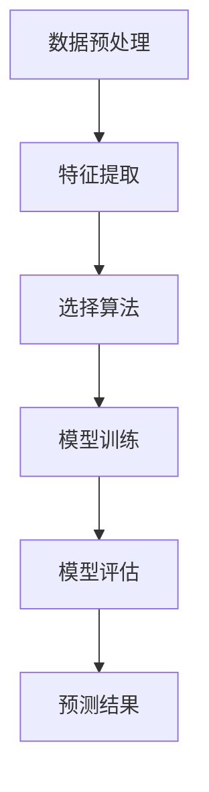
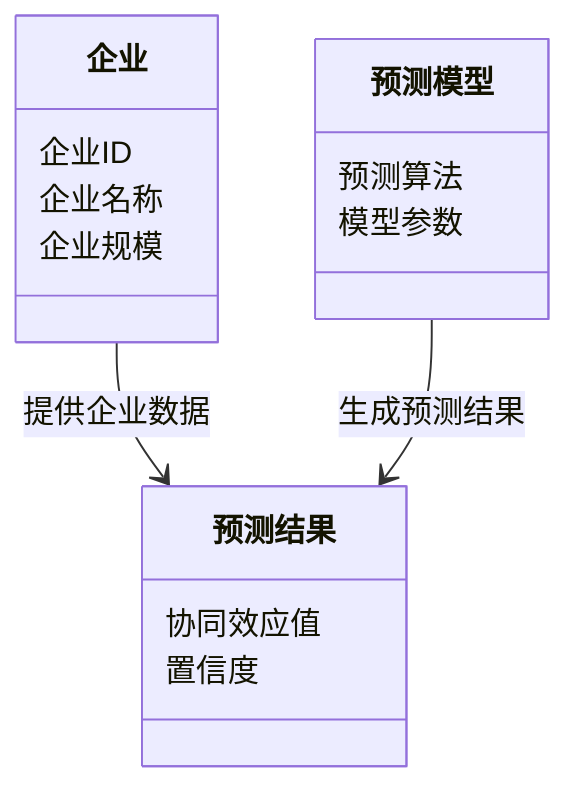

                 


# AI辅助的企业并购协同效应预测

> 关键词：AI、企业并购、协同效应、预测模型、机器学习、数据挖掘、风险管理

> 摘要：  
本文探讨了如何利用人工智能技术辅助企业并购中的协同效应预测。通过分析协同效应的核心概念、算法原理、系统架构设计以及实际案例，本文为读者提供了从理论到实践的全面指南。文章详细介绍了协同效应的影响因素、AI预测模型的构建方法，以及如何通过系统化的方法提升企业并购决策的科学性和准确性。

---

## 第1章: 企业并购协同效应的背景与问题

### 1.1 企业并购的定义与特点

#### 1.1.1 企业并购的基本概念  
企业并购（Mergers and Acquisitions, M&A）是指两个或多个企业之间的合并或收购行为。并购的目的是通过资源整合、协同效应、市场扩展等方式，实现企业价值的最大化。  

#### 1.1.2 并购的类型与分类  
并购可以分为以下几种类型：  
1. **横向并购**：同一行业内的企业并购，旨在扩大市场份额。  
2. **纵向并购**：上下游产业的企业并购，以优化供应链。  
3. **混合并购**：跨行业或跨领域的并购，通常用于 diversification。  

#### 1.1.3 并购的动机与目标  
企业进行并购的主要动机包括：  
- 扩大市场份额。  
- 获取新技术或专利。  
- 降低生产成本。  
- 进入新市场。  
- 提高企业竞争力。  

---

### 1.2 协同效应的定义与分类

#### 1.2.1 协同效应的定义  
协同效应是指企业并购后，双方资源整合所产生的额外价值。这种价值可以通过成本节约、收入增长或其他效率提升来体现。  

#### 1.2.2 协同效应的类型  
协同效应主要分为以下几种：  
1. **成本协同效应**：通过合并运营成本（如共享资源、减少重复投入）实现成本节约。  
2. **收入协同效应**：通过市场扩展、产品互补实现收入增长。  
3. **创新协同效应**：通过技术共享或知识整合推动创新。  

#### 1.2.3 协同效应的度量方法  
协同效应的度量方法包括：  
- **净现值法（Net Present Value, NPV）**：计算并购后的未来现金流折现值与并购前的差异。  
- **协同效应比率法**：通过收入或利润的提升比例来衡量协同效应。  

---

### 1.3 传统协同效应预测的挑战

#### 1.3.1 传统预测方法的局限性  
传统协同效应预测方法通常依赖于财务模型和市场分析，存在以下问题：  
- 数据维度有限，难以捕捉复杂因素。  
- 模型假设过于简化，导致预测偏差。  
- 人工分析耗时长，且容易受到主观因素影响。  

#### 1.3.2 数据不足与模型复杂性问题  
企业并购涉及大量非结构化数据（如企业战略、文化因素等），传统模型难以处理这些复杂信息。  

#### 1.3.3 人工分析的低效性  
人工分析不仅效率低下，还容易受到人为情绪和经验的限制，导致预测结果不够准确。  

---

### 1.4 AI技术在协同效应预测中的应用前景

#### 1.4.1 AI技术的核心优势  
AI技术在协同效应预测中的优势包括：  
- 能够处理海量数据，包括结构化和非结构化数据。  
- 可以通过机器学习算法自动发现数据中的潜在规律。  
- 能够实时更新模型，适应市场变化。  

#### 1.4.2 AI在企业并购中的潜在应用  
AI可以用于以下场景：  
- 并购目标筛选与匹配。  
- 协同效应潜力评估。  
- 并购风险预警与管理。  

#### 1.4.3 AI辅助预测的未来发展趋势  
随着AI技术的不断进步，协同效应预测将更加精准和高效，为企业并购决策提供更有力的支持。

---

## 第2章: 企业并购协同效应预测的核心概念

### 2.1 协同效应的关键影响因素

#### 2.1.1 企业战略一致性  
企业战略一致性是协同效应的重要影响因素。如果两家企业的战略目标一致，协同效应更容易实现。  

#### 2.1.2 企业资源互补性  
资源互补性是协同效应的核心驱动力。例如，一家企业拥有技术优势，而另一家企业拥有市场渠道优势，双方可以实现资源互补。  

#### 2.1.3 企业文化与组织整合难度  
企业文化差异和组织结构差异会直接影响协同效应的实现难度。  

---

### 2.2 协同效应预测的数学模型

#### 2.2.1 线性回归模型  
线性回归模型是最常用的协同效应预测模型之一。其基本形式为：  
$$ y = \beta_0 + \beta_1x_1 + \beta_2x_2 + \ldots + \beta_nx_n $$  
其中，$y$ 表示协同效应，$x_i$ 表示影响协同效应的因素，$\beta_i$ 为回归系数。  

#### 2.2.2 神经网络模型  
神经网络模型能够处理复杂的非线性关系，适用于协同效应的多因素预测。典型的神经网络结构包括输入层、隐藏层和输出层。  

#### 2.2.3 集成学习模型  
集成学习模型（如随机森林、梯度提升树）能够通过组合多个模型的结果，提高预测准确率。  

---

### 2.3 协同效应预测的ER实体关系图

```mermaid
erDiagram
    企业A [attributes: 企业ID, 企业名称, 企业规模] {
        <属性> 企业ID
        <属性> 企业名称
        <属性> 企业规模
    }
    企业B [attributes: 企业ID, 企业名称, 企业规模] {
        <属性> 企业ID
        <属性> 企业名称
        <属性> 企业规模
    }
    预测结果 [attributes: 预测协同效应值, 预测置信度] {
        <属性> 预测协同效应值
        <属性> 预测置信度
    }
    企业A --> 预测结果 : 提供企业数据
    企业B --> 预测结果 : 提供企业数据
```

---

## 第3章: 协同效应预测的算法原理

### 3.1 协同效应预测的算法选择

#### 3.1.1 传统机器学习算法
常用的算法包括线性回归、支持向量机（SVM）和K-近邻算法（KNN）。  

#### 3.1.2 深度学习算法
深度学习算法（如卷积神经网络CNN和循环神经网络RNN）适用于处理复杂非线性关系。  

---

### 3.2 协同效应预测的算法流程

#### 3.2.1 协同效应预测流程图



#### 3.2.2 协同效应预测算法实现

```python
import pandas as pd
from sklearn.linear_model import LinearRegression

# 数据预处理
data = pd.read_csv('并购数据.csv')
X = data[['企业规模', '市场地位', '技术创新']]
y = data['协同效应']

# 模型训练
model = LinearRegression()
model.fit(X, y)

# 预测结果
predicted = model.predict(X)
print(predicted)
```

---

## 第4章: 系统分析与架构设计

### 4.1 系统功能设计

#### 4.1.1 领域模型类图



---

## 第5章: 项目实战

### 5.1 环境安装与配置

#### 5.1.1 Python环境配置
安装Python和必要的库（如scikit-learn、pandas、numpy）。  

#### 5.1.2 数据集获取与预处理
从公开数据源获取企业并购数据，并进行清洗和特征工程。  

---

### 5.2 代码实现

#### 5.2.1 协同效应预测代码

```python
import pandas as pd
from sklearn.model_selection import train_test_split
from sklearn.metrics import mean_squared_error

# 数据加载
data = pd.read_csv('并购数据.csv')

# 特征选择
X = data[['企业规模', '市场地位', '技术创新']]
y = data['协同效应']

# 数据分割
X_train, X_test, y_train, y_test = train_test_split(X, y, test_size=0.2, random_state=42)

# 模型训练
model = LinearRegression()
model.fit(X_train, y_train)

# 预测与评估
predicted = model.predict(X_test)
mse = mean_squared_error(y_test, predicted)
print(f"均方误差: {mse}")
```

---

## 第6章: 总结与展望

### 6.1 总结
本文详细探讨了AI辅助企业并购协同效应预测的核心概念、算法原理和系统设计。通过理论分析和实际案例，展示了AI技术在提升协同效应预测准确性中的重要作用。

### 6.2 展望
未来，随着AI技术的不断发展，协同效应预测将更加智能化和精准化。企业可以利用AI技术实现更高效的并购决策，从而在竞争中占据优势。

---

**注意事项**：  
- 数据隐私和安全问题需要高度重视。  
- 模型的可解释性是实际应用中的关键问题。  
- 在实际应用中，需要结合企业的具体情况调整模型参数。  

**拓展阅读**：  
- 《企业并购与财务分析》  
- 《人工智能在金融领域的应用》  

--- 

以上为文章的完整目录大纲，具体内容可以根据实际需求进一步扩展和补充。

