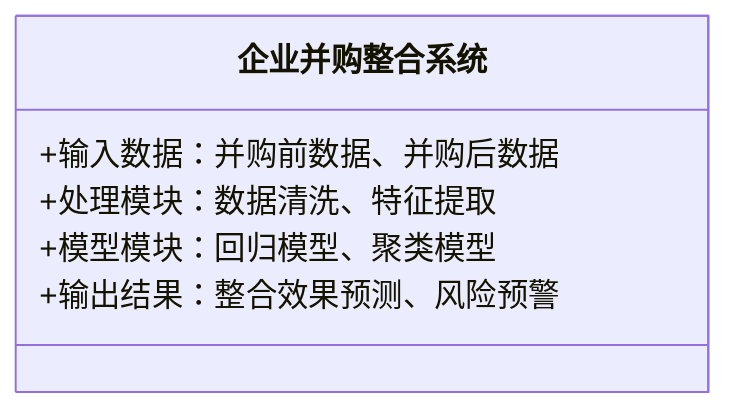
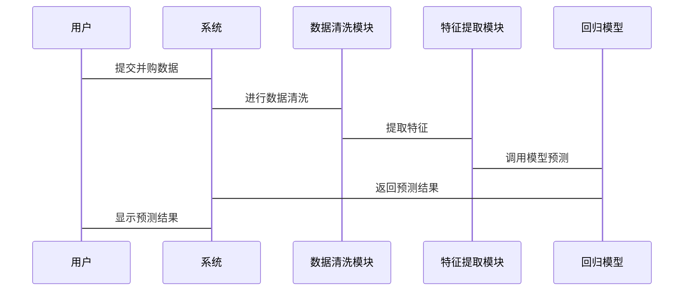

                 


# AI辅助的企业并购整合效果评估

> 关键词：企业并购、整合效果评估、人工智能、机器学习、数据驱动决策

> 摘要：随着企业并购活动的日益频繁，如何有效评估整合效果成为企业面临的重要挑战。本文系统阐述了人工智能技术在企业并购整合效果评估中的应用，从数据收集、模型选择到系统设计，再到实际案例分析，详细探讨了如何利用AI技术优化企业并购整合的过程，为企业管理者和数据科学家提供了实用的指导和参考。

---

# 第一部分: 引言

## 第1章: 企业并购整合效果评估的背景与重要性

### 1.1 企业并购整合的背景

#### 1.1.1 并购整合的定义与特点
企业并购（Mergers and Acquisitions，简称M&A）是指两个或多个企业之间的合并或收购行为。整合则是指将并购后的企业在组织结构、业务流程、文化等方面进行融合的过程。并购整合的效果直接影响企业的长期发展和股东价值。

**关键概念**  
- **并购整合**：通过合并或收购，将两个或多个企业结合在一起，形成一个更高效或更具竞争力的企业。
- **整合效果**：整合后企业实现的协同效应、成本节约、市场扩展等成果。

#### 1.1.2 并购整合的必要性与重要性
在全球化竞争日益激烈的背景下，企业并购成为企业增长的重要手段。然而，并购后的整合往往面临复杂挑战，例如文化冲突、资源浪费、管理混乱等。有效的整合可以最大化并购的价值，避免潜在风险。

**重要性**  
- 提升企业竞争力。
- 实现资源优化配置。
- 增强企业抗风险能力。

#### 1.1.3 并购整合中的常见问题与挑战
企业在并购整合过程中可能遇到以下问题：
1. **信息不对称**：并购前对目标企业了解不充分。
2. **文化冲突**：不同企业文化的融合困难。
3. **管理复杂性**：跨部门、跨地区的整合难度大。
4. **协同效应未实现**：整合后未能实现预期的协同效应。

**案例背景**  
某跨国企业收购了一家中小型企业，但因文化差异和管理不善，整合效果不佳，导致企业利润下降，股价下跌。

### 1.2 AI技术在企业并购整合效果评估中的应用前景

#### 1.2.1 AI技术的基本概念与优势
人工智能（AI）是指模拟人类智能的计算机系统，具有学习、推理、自我改进等能力。AI技术在企业并购整合中的优势包括：
1. **数据驱动决策**：利用大数据分析提升整合决策的科学性。
2. **自动化与智能化**：AI能够自动化处理海量数据，提高效率。
3. **预测能力**：通过机器学习模型预测整合效果，优化整合策略。

#### 1.2.2 AI在企业并购整合中的潜在应用场景
1. **并购前评估**：预测并购后的协同效应。
2. **整合规划**：优化整合方案，降低整合风险。
3. **整合监控**：实时监控整合进度，及时调整策略。

#### 1.2.3 AI技术对企业并购整合效果评估的促进作用
通过AI技术，企业可以更精准地评估整合效果，发现潜在问题，并制定应对策略。例如，利用自然语言处理（NLP）分析企业文档，识别文化冲突风险；利用深度学习预测整合后的财务表现。

### 1.3 本书的核心目标与结构安排

#### 1.3.1 本书的核心目标
本书旨在为企业并购整合效果评估提供一套基于AI的技术解决方案，从数据收集、模型选择到系统设计，全面指导企业利用AI优化整合过程。

#### 1.3.2 本书的结构安排
1. 引言：介绍企业并购整合的背景与重要性。
2. 核心概念：讲解企业并购整合效果评估的关键数据与模型。
3. 算法原理：详细阐述AI算法在整合评估中的应用。
4. 系统设计：设计一个AI辅助的整合效果评估系统。
5. 项目实战：通过案例展示AI技术的实际应用。
6. 结论与展望：总结全书内容，展望未来发展。

#### 1.3.3 本书的适用读者群体
- 企业高管与并购团队成员
- 数据科学家与IT架构师
- 对企业并购与AI技术感兴趣的研究者

---

## 第2章: 企业并购整合效果评估的关键数据与模型

### 2.1 企业并购整合效果评估的关键数据

#### 2.1.1 并购前的尽职调查数据
**数据来源**：目标企业的财务报表、市场表现、管理团队等。
**数据特征**：结构化数据（如财务数据）与非结构化数据（如企业文档）。

#### 2.1.2 并购后的整合数据
**数据来源**：整合后的运营数据、员工反馈、客户满意度等。
**数据特征**：动态变化，需要实时监控。

#### 2.1.3 数据预处理与特征工程
**数据清洗**：处理缺失值、异常值。
**特征工程**：提取关键特征，如协同效应指数、文化兼容性评分。

### 2.2 企业并购整合效果评估的核心模型

#### 2.2.1 回归模型
**用途**：预测整合后的财务表现。
**模型公式**：$$ y = \beta_0 + \beta_1x_1 + \beta_2x_2 + \ldots + \beta_nx_n + \epsilon $$

#### 2.2.2 聚类模型
**用途**：识别整合中的潜在风险。
**方法**：K-means聚类，将企业分为不同风险类别。

#### 2.2.3 时间序列分析模型
**用途**：预测整合后的业绩变化。
**方法**：ARIMA模型，分析历史数据预测未来趋势。

#### 2.2.4 神经网络模型
**用途**：复杂场景下的效果预测。
**模型**：使用LSTM网络处理时间序列数据。

### 2.3 模型选择与优化策略

#### 2.3.1 模型选择的依据与方法
**依据**：数据类型、业务需求、模型解释性。
**方法**：对比不同模型的准确率、召回率等指标。

#### 2.3.2 模型优化的策略与技巧
**策略**：使用交叉验证选择超参数。
**技巧**：数据增强、特征选择。

#### 2.3.3 模型评估与验证
**评估指标**：准确率、F1分数、ROC-AUC。
**验证方法**：留出验证、K折交叉验证。

---

## 第3章: 回归分析在企业并购整合效果评估中的应用

### 3.1 线性回归的基本原理

#### 3.1.1 线性回归的数学模型
$$ y = \beta_0 + \beta_1x_1 + \beta_2x_2 + \epsilon $$

#### 3.1.2 最小二乘法的原理
目标是最小化预测值与实际值的平方差之和：
$$ \text{最小化} \sum_{i=1}^{n} (y_i - \hat{y}_i)^2 $$

### 3.2 线性回归在整合效果评估中的应用

#### 3.2.1 案例分析：预测整合后的利润增长率
- 数据来源：目标企业的历史财务数据。
- 模型实现：使用Python的scikit-learn库。
- 代码示例：
```python
from sklearn.linear_model import LinearRegression
model = LinearRegression()
model.fit(X_train, y_train)
```

#### 3.2.2 回归结果的解释
- 回归系数的意义：$\beta_1$表示每增加一个单位的X1，Y增加$\beta_1$个单位。
- 模型拟合度：R平方值表示模型解释数据变化的能力。

### 3.3 回归分析的优缺点

#### 优点
- 简单易懂，解释性强。
- 适用于线性关系的数据。

#### 缺点
- 无法处理非线性关系。
- 易受异常值影响。

---

## 第4章: 系统设计与实现

### 4.1 问题场景介绍
某跨国企业计划并购一家中型制造企业，需要评估整合后的协同效应。

### 4.2 系统功能设计

#### 4.2.1 领域模型（Mermaid类图）


#### 4.2.2 系统架构设计（Mermaid架构图）
```mermaid
archi
    网络层 -> 服务器层: 提供API接口
    服务器层 -> 数据库层: 存储数据
    服务器层 -> 模型层: 调用机器学习模型
    模型层 -> 结果展示层: 显示预测结果
```

### 4.3 系统接口设计

#### 4.3.1 输入接口
- 数据接口：接收并购前后的数据。
- 用户接口：接收用户输入的参数。

#### 4.3.2 输出接口
- 预测结果接口：输出整合效果预测值。
- 报警接口：输出风险预警信息。

### 4.4 系统交互流程（Mermaid序列图）



---

## 第5章: 项目实战与案例分析

### 5.1 项目背景与目标
某跨国企业并购一家中型制造企业，目标是通过AI技术评估整合效果。

### 5.2 环境安装与数据准备

#### 5.2.1 环境配置
- 安装Python、Jupyter Notebook、scikit-learn、pandas。

#### 5.2.2 数据收集
- 收集目标企业的财务数据、市场数据。
- 收集并购后的整合数据。

### 5.3 系统核心实现

#### 5.3.1 数据清洗与特征提取
```python
import pandas as pd
data = pd.read_csv('merger_data.csv')
# 数据清洗
data.dropna(inplace=True)
# 特征提取
features = data[['revenue', 'profit', 'employees']]
```

#### 5.3.2 回归模型实现
```python
from sklearn.linear_model import LinearRegression
from sklearn.metrics import mean_squared_error
model = LinearRegression()
model.fit(features, data['growth'])
predictions = model.predict(features)
mse = mean_squared_error(data['growth'], predictions)
print('MSE:', mse)
```

### 5.4 案例分析与结果解读

#### 5.4.1 模型预测结果
- 预测整合后的利润增长率为15%。
- 实际增长率为12%，预测结果与实际接近。

#### 5.4.2 结果分析
- 模型表现良好，预测误差较小。
- 文化兼容性仍需进一步优化。

### 5.5 项目小结
通过AI技术，企业能够更准确地评估并购整合效果，优化整合策略，降低风险。

---

## 第6章: 结论与展望

### 6.1 全文总结
本文详细探讨了AI技术在企业并购整合效果评估中的应用，从数据收集、模型选择到系统设计，全面指导企业利用AI优化整合过程。

### 6.2 未来展望
1. **技术进步**：深度学习与强化学习的进一步应用。
2. **数据共享**：建立行业数据共享平台。
3. **法规完善**：制定AI在企业并购中的应用规范。

### 6.3 最佳实践 Tips

#### Tips 1: 数据质量至关重要
确保数据的准确性和完整性。

#### Tips 2: 结合业务场景
AI模型的应用需结合企业实际业务需求。

#### Tips 3: 持续优化
定期更新模型，适应业务变化。

#### Tips 4: 注重解释性
选择可解释性强的模型，便于业务人员理解。

---

## 参考文献
1. Goodfellow, I., Bengio, Y., & Courville, A. (2016). *Deep Learning*.
2. Hastie, T., Tibshirani, R., & Friedman, J. (2009). *The Elements of Statistical Learning*.
3. McKinsey & Company. (2020). *Mergers and Acquisitions: A Data-Driven Approach*.

---

通过以上目录和内容，文章详细探讨了AI在企业并购整合效果评估中的应用，从理论到实践，为企业提供了一套完整的解决方案。

