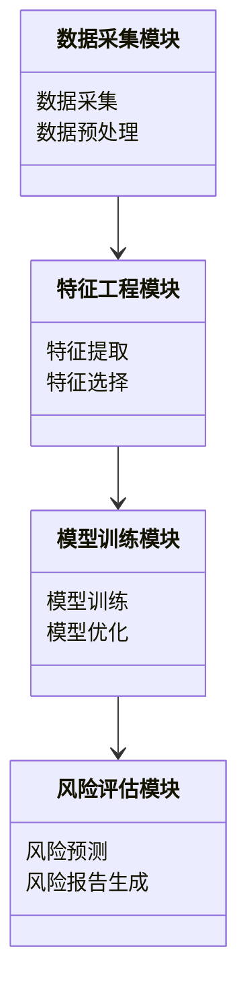
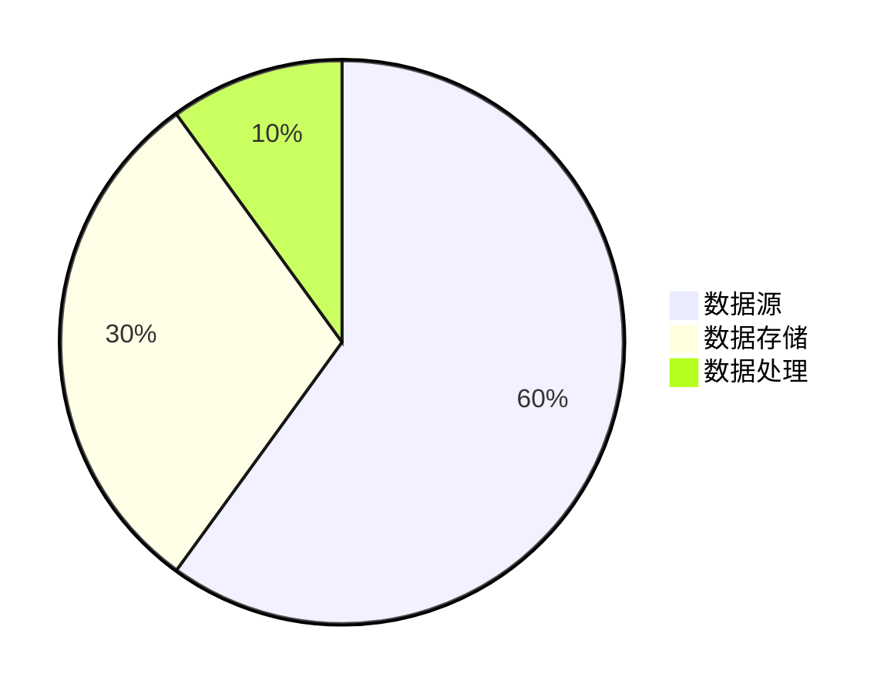
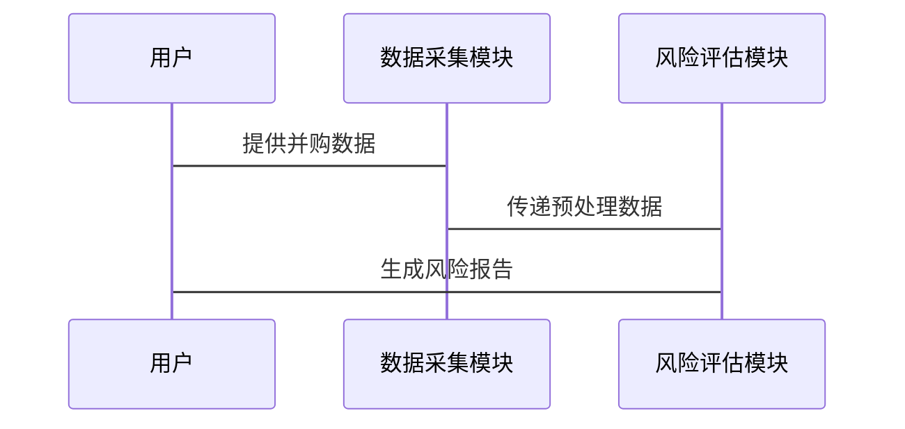

                 


# AI辅助的企业并购整合风险评估

> 关键词：企业并购，AI辅助，风险评估，机器学习，数据驱动

> 摘要：随着企业并购活动的日益频繁，如何有效评估和管理并购整合过程中的风险成为企业面临的重要挑战。本文将探讨如何利用人工智能技术辅助企业并购整合风险评估，分析其核心原理、系统架构及实际应用，为企业提供一种高效、精准的解决方案。

---

# 第一部分：企业并购整合风险评估的背景与概述

## 第1章：企业并购整合风险评估概述

### 1.1 企业并购的基本概念

#### 1.1.1 企业并购的定义与类型
企业并购（Mergers and Acquisitions, M&A）是指一家企业与其他企业合并或收购其资产、股权等行为。根据具体操作方式，可以分为以下几种类型：
- **横向并购**：同一行业内的企业并购，旨在扩大市场份额。
- **纵向并购**：产业链上下游企业之间的并购，以增强垂直整合能力。
- **混合并购**：与企业现有业务不相关的新业务并购，通常用于业务扩展或多元化。

#### 1.1.2 并购整合的核心目标
企业并购的目的是为了实现资源优化配置、扩大市场影响力、提升竞争力等。并购整合的核心目标包括：
- **协同效应**：通过整合资源，降低成本，提高效率。
- **市场扩展**：通过并购进入新市场或新领域。
- **技术获取**：通过并购获取关键技术或专利。

#### 1.1.3 并购整合中的风险特征
并购整合过程中可能面临的风险包括：
- **市场风险**：目标企业所在市场的不确定性。
- **运营风险**：整合过程中可能出现的运营问题。
- **财务风险**：并购可能带来的财务负担。
- **文化风险**：企业文化和管理风格的差异可能导致整合失败。

### 1.2 AI技术在企业并购中的应用背景

#### 1.2.1 AI技术的发展与企业并购的关系
人工智能技术的快速发展为企业并购提供了新的工具和方法。AI可以通过分析海量数据，帮助企业更精准地识别潜在风险，优化并购决策。

#### 1.2.2 数据驱动的并购决策趋势
传统的并购决策主要依赖于经验和主观判断，而数据驱动的决策方法通过分析历史数据和市场趋势，可以更客观地评估并购的可行性。

#### 1.2.3 传统并购风险评估的局限性
传统并购风险评估方法存在以下局限性：
- 数据量有限，难以覆盖多维度风险因素。
- 分析过程耗时长，效率低。
- 人为因素影响较大，存在主观性。

---

## 第2章：企业并购整合风险评估的核心概念

### 2.1 并购整合风险的定义与分类

#### 2.1.1 并购整合风险的定义
并购整合风险是指在企业并购过程中，由于内外部因素的影响，导致并购目标未能实现或出现负面影响的可能性。

#### 2.1.2 并购整合风险的主要类型
并购整合风险可以分为以下几类：
- **战略风险**：并购战略与企业整体战略不一致。
- **运营风险**：整合过程中出现的运营管理问题。
- **财务风险**：并购带来的财务负担。
- **法律风险**：并购涉及的法律问题。

#### 2.1.3 各类风险的特征与影响
- **战略风险**：可能导致企业资源浪费和战略偏离。
- **运营风险**：可能导致企业效率低下，成本增加。
- **财务风险**：可能导致企业财务状况恶化。
- **法律风险**：可能导致企业面临法律诉讼和罚款。

### 2.2 AI辅助风险评估的理论框架

#### 2.2.1 数据驱动的分析方法
数据驱动的分析方法通过收集和分析海量数据，利用机器学习等技术，识别潜在风险因素。

#### 2.2.2 机器学习在风险预测中的应用
机器学习可以通过训练模型，预测并购整合过程中可能面临的风险，并提供相应的预警。

#### 2.2.3 理论框架的构建与优化
构建一个完整的AI辅助风险评估理论框架需要考虑以下几个方面：
- 数据采集与预处理。
- 特征选择与模型训练。
- 风险预测与结果解释。

---

# 第二部分：AI辅助企业并购整合风险评估的核心原理

## 第3章：AI技术在并购整合风险评估中的核心原理

### 3.1 机器学习算法在风险评估中的应用

#### 3.1.1 机器学习算法的分类与选择
机器学习算法可以分为监督学习、无监督学习和半监督学习。在并购整合风险评估中，监督学习（如决策树、随机森林）和无监督学习（如聚类分析）应用较为广泛。

#### 3.1.2 常见算法（如决策树、随机森林）的原理
- **决策树**：通过构建树状结构，将数据分成不同的子集，最终预测结果。
- **随机森林**：通过构建多个决策树，取其平均值，提高模型的准确性和稳定性。

#### 3.1.3 算法在并购风险评估中的适用场景
- **决策树**：适合用于分类问题，如判断并购是否成功。
- **随机森林**：适合用于特征重要性分析，识别关键风险因素。

### 3.2 数据挖掘与特征工程

#### 3.2.1 数据预处理与清洗
数据预处理包括数据清洗、数据转换和数据标准化。数据清洗主要是处理缺失值、重复值和异常值。

#### 3.2.2 特征选择与提取
特征选择包括特征筛选和特征提取。特征筛选是通过统计方法选择重要特征，特征提取是通过降维技术（如主成分分析）提取特征。

#### 3.2.3 数据特征对风险评估的影响
- **财务特征**：如收入、利润、负债等。
- **市场特征**：如市场份额、竞争对手情况等。
- **管理特征**：如管理团队稳定性、文化差异等。

## 第4章：并购整合风险评估的数学模型与公式

### 4.1 风险评估的数学模型

#### 4.1.1 风险概率计算模型
风险概率计算模型可以通过贝叶斯定理进行计算：
$$ P(A|B) = \frac{P(B|A) \cdot P(A)}{P(B)} $$
其中，\( P(A|B) \) 表示在B条件下A发生的概率。

#### 4.1.2 风险影响程度评估模型
风险影响程度评估模型可以通过线性回归模型进行预测：
$$ y = \beta_0 + \beta_1x_1 + \beta_2x_2 + \dots + \beta_nx_n + \epsilon $$
其中，\( y \) 表示风险影响程度，\( x_i \) 表示影响风险的特征变量。

#### 4.1.3 综合风险评分模型
综合风险评分模型可以通过加权平均的方式进行计算：
$$ \text{综合风险评分} = \sum (\text{权重}_i \cdot \text{风险评分}_i) $$

### 4.2 机器学习算法的数学公式

#### 4.2.1 线性回归模型
线性回归模型的损失函数为：
$$ L = \sum_{i=1}^n (y_i - \hat{y}_i)^2 $$
其中，\( y_i \) 表示实际值，\( \hat{y}_i \) 表示预测值。

#### 4.2.2 支持向量机（SVM）原理
SVM的优化目标为：
$$ \min_{w, b, \xi} \frac{1}{2}||w||^2 + C \sum_{i=1}^n \xi_i $$
约束条件为：
$$ y_i(w \cdot x_i + b) \geq 1 - \xi_i $$
$$ \xi_i \geq 0 $$

#### 4.2.3 神经网络模型
神经网络模型的损失函数为：
$$ L = -\sum_{i=1}^n (y_i \log a_i + (1-y_i) \log (1-a_i)) $$
其中，\( a_i \) 表示神经网络的输出概率。

---

# 第三部分：系统分析与架构设计

## 第5章：系统分析与架构设计方案

### 5.1 问题场景介绍
本节将介绍企业并购整合风险评估系统的目标和应用场景。系统旨在通过AI技术帮助企业识别和评估并购整合过程中的潜在风险，优化并购决策。

### 5.2 系统功能设计

#### 5.2.1 领域模型
领域模型描述了系统的核心功能模块及其关系。以下是领域模型的类图：



### 5.3 系统架构设计

#### 5.3.1 系统架构图
以下是系统的架构图：



### 5.4 系统接口设计
系统接口设计包括数据输入接口和风险报告输出接口。数据输入接口用于接收企业并购的相关数据，风险报告输出接口用于生成风险评估报告。

### 5.5 系统交互设计

#### 5.5.1 交互序列图
以下是系统交互的序列图：



---

## 第6章：项目实战

### 6.1 环境安装
项目实战部分将介绍如何安装和配置开发环境。需要安装以下工具：
- Python
- scikit-learn
- pandas
- numpy
- matplotlib

### 6.2 系统核心实现源代码

#### 6.2.1 数据预处理代码
```python
import pandas as pd
import numpy as np

# 数据加载
data = pd.read_csv('并购数据.csv')

# 数据清洗
data.dropna(inplace=True)
data = data.replace({'收入': {'high': 3, 'medium': 2, 'low': 1}})
```

#### 6.2.2 特征选择代码
```python
from sklearn.feature_selection import SelectKBest
from sklearn.feature_selection import chi2

# 特征选择
selector = SelectKBest(score_func=chi2, k=5)
selected_features = selector.fit_transform(data)
```

#### 6.2.3 模型训练代码
```python
from sklearn.ensemble import RandomForestClassifier

# 模型训练
model = RandomForestClassifier(n_estimators=100, max_depth=2, random_state=0)
model.fit(selected_features, target)
```

### 6.3 代码应用解读与分析
通过上述代码，我们可以实现企业并购数据的预处理、特征选择和模型训练。模型训练完成后，可以进行风险预测，并生成风险评估报告。

### 6.4 实际案例分析和详细讲解剖析
本节将通过一个实际案例，详细介绍如何利用AI技术进行企业并购整合风险评估。案例包括数据采集、数据处理、模型训练和风险报告生成等步骤。

### 6.5 项目小结
通过本项目，我们可以看到AI技术在企业并购整合风险评估中的巨大潜力。利用AI技术可以显著提高风险评估的效率和准确性，为企业决策提供有力支持。

---

## 第7章：总结与展望

### 7.1 总结
本文详细探讨了AI技术在企业并购整合风险评估中的应用，分析了其核心原理和系统架构，并通过实际案例展示了其应用价值。

### 7.2 展望
未来，随着AI技术的不断发展，企业并购整合风险评估将更加智能化和精准化。我们期待更多创新技术的应用，为企业创造更大的价值。

---

## 第8章：最佳实践与注意事项

### 8.1 最佳实践 tips
- 在数据采集阶段，确保数据的完整性和准确性。
- 在模型训练阶段，选择合适的算法和参数。
- 在风险报告生成阶段，确保报告的清晰和可读性。

### 8.2 小结
通过本文的介绍，我们希望读者能够更好地理解AI技术在企业并购整合风险评估中的应用，并能够在实际工作中加以应用。

### 8.3 注意事项
- 数据隐私和安全问题需要高度重视。
- 模型的解释性和可扩展性需要充分考虑。
- 风险评估结果需要结合实际情况进行调整和优化。

### 8.4 拓展阅读
- 推荐阅读《企业并购与战略管理》。
- 推荐阅读《人工智能与金融》。

---

通过以上章节的详细讲解，我们希望能够为企业并购整合风险评估提供一种高效、精准的AI辅助解决方案，帮助企业更好地应对并购过程中的各种风险挑战。

