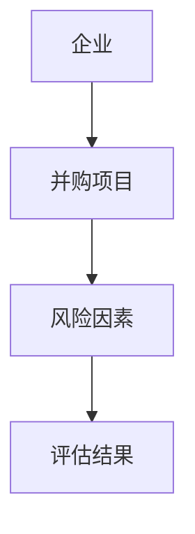
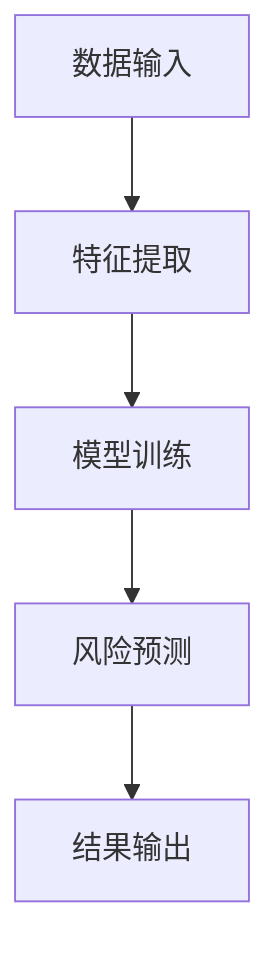
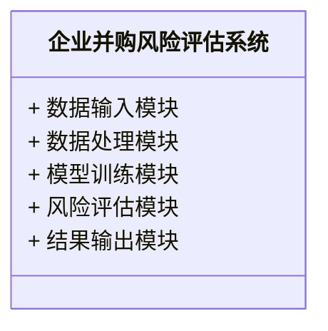
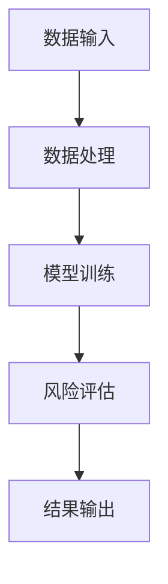
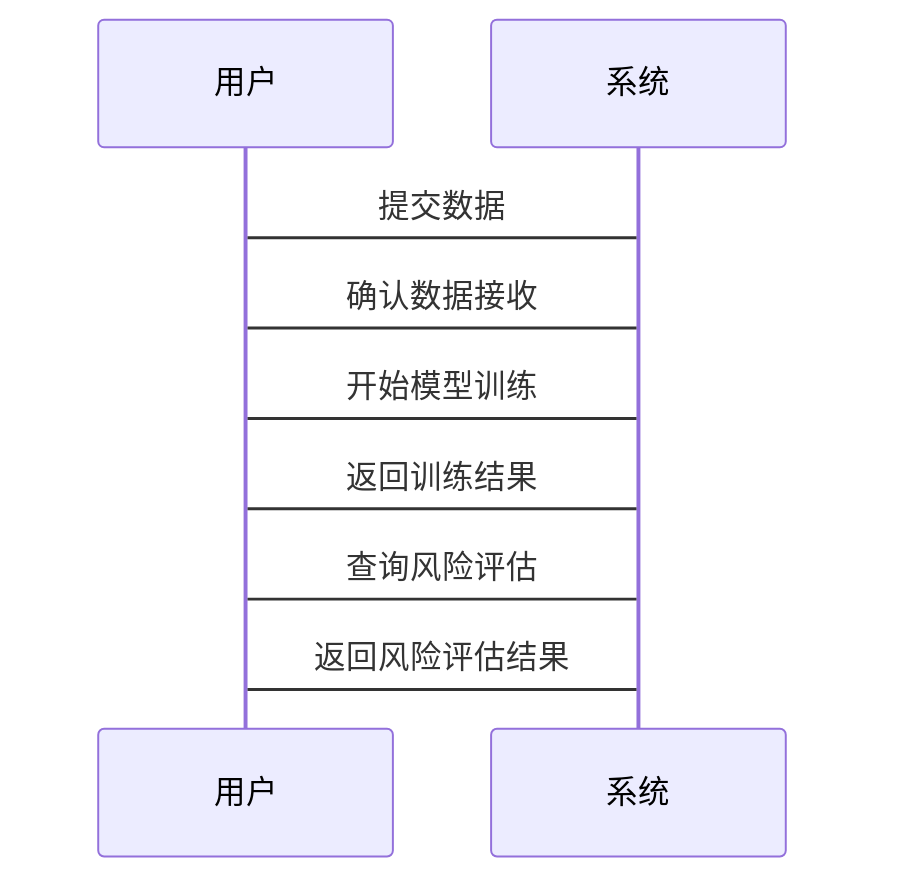

                 


# AI辅助的企业并购整合风险评估模型

## 关键词：企业并购、风险评估、人工智能、机器学习、风险管理

## 摘要：  
企业并购是企业战略发展的重要手段之一，然而并购整合过程中涉及的复杂性和不确定性往往导致各种风险。本文提出了一种基于人工智能（AI）的企业并购整合风险评估模型，旨在通过机器学习和自然语言处理技术，帮助企业识别和量化并购过程中的潜在风险。该模型结合了多种AI算法和风险管理模型，能够实时分析海量数据，提供精准的风险预测和优化建议。本文详细探讨了该模型的背景、核心概念、算法原理、数学模型、系统架构设计、项目实战以及最佳实践，为企业在并购整合中的风险管理提供了新的思路和方法。

---

# 第一部分: 企业并购整合风险评估的背景与核心概念

## 第1章: 企业并购整合风险评估概述

### 1.1 企业并购整合风险评估的基本概念

#### 1.1.1 企业并购的定义与类型
企业并购是指一家企业通过购买或合并其他企业的股权或资产，以实现战略扩张或优化资本结构的过程。并购可以分为以下几种类型：
- **横向并购**：同一行业内的企业合并，旨在扩大市场份额或消除竞争。
- **纵向并购**：产业链上下游企业的合并，以增强供应链控制能力。
- **混合并购**：跨行业或跨领域的并购，以 diversify 业务或进入新市场。

#### 1.1.2 整合的定义与流程
整合是并购后的关键阶段，旨在将两家企业的资源、业务流程和组织结构进行优化组合。整合流程通常包括：
1. **战略规划**：明确整合目标和范围。
2. **资产评估**：对目标企业的资产、负债和财务状况进行全面评估。
3. **组织架构调整**：设计新的组织结构，明确职责分工。
4. **文化融合**：整合企业文化，促进员工融合。
5. **风险管理**：识别和应对整合过程中可能面临的各类风险。

#### 1.1.3 并购整合的风险概念
并购整合过程中存在多种风险，主要包括：
- **财务风险**：如负债过高、现金流不稳定等。
- **法律风险**：如合规性问题、知识产权纠纷等。
- **市场风险**：如市场竞争加剧、客户需求变化等。
- **运营风险**：如供应链中断、生产效率下降等。
- **管理风险**：如团队整合不善、管理混乱等。

### 1.2 并购整合风险的特征与分类

#### 1.2.1 风险的特征分析
- **复杂性**：并购涉及多方面利益相关者，风险来源多样。
- **动态性**：市场环境和内部条件不断变化，风险具有动态特征。
- **不确定性**：许多风险难以预测和量化。
- **关联性**：不同风险之间可能存在相互影响。

#### 1.2.2 风险的分类与影响
- **财务风险**：可能导致企业财务状况恶化，影响投资者信心。
- **法律风险**：可能导致合规成本增加或法律纠纷。
- **市场风险**：可能导致市场份额流失或品牌受损。
- **运营风险**：可能导致生产效率下降或供应链中断。
- **管理风险**：可能导致组织混乱或员工流失。

#### 1.2.3 风险的边界与外延
- **边界**：并购整合风险仅限于并购过程中的内部整合问题，不包括外部市场波动。
- **外延**：风险可能影响企业未来的盈利能力和发展潜力。

### 1.3 传统风险评估方法的局限性

#### 1.3.1 传统方法的优缺点
- **优点**：简单易懂，适用于小规模或低复杂度的并购项目。
- **缺点**：难以应对复杂多变的市场环境，无法量化隐性风险。

#### 1.3.2 传统方法在实际应用中的挑战
- **数据不足**：传统方法依赖历史数据，但在动态市场中数据可能不足以反映未来风险。
- **主观性**：风险评估结果可能受到评估者主观判断的影响。
- **效率低下**：传统方法通常需要大量人工分析，效率较低。

#### 1.3.3 传统方法与现代方法的对比
- **传统方法**：适用于简单场景，但缺乏灵活性和准确性。
- **现代方法**：基于AI和大数据技术，能够处理复杂场景，提供实时、动态的风险评估。

### 1.4 AI技术在风险评估中的应用前景

#### 1.4.1 AI技术的核心优势
- **数据处理能力**：AI能够处理海量数据，发现隐藏的模式和关联。
- **实时性**：AI可以实时分析数据，提供动态风险评估。
- **准确性**：通过机器学习算法，AI能够提高风险预测的准确性。

#### 1.4.2 AI技术在企业并购中的潜在应用
- **风险预测**：通过历史数据和市场信息，预测并购后的潜在风险。
- **文本分析**：利用自然语言处理技术，分析企业公告、新闻报道等文本数据，提取潜在风险信号。
- **决策支持**：基于AI模型的结果，为企业提供并购决策的支持。

#### 1.4.3 AI技术对企业并购整合的推动作用
- **提高效率**：AI能够快速分析大量数据，缩短评估时间。
- **降低风险**：通过精准的风险预测，帮助企业规避潜在风险。
- **优化决策**：AI提供数据驱动的决策支持，提高并购成功的概率。

### 1.5 本章小结
本章从企业并购整合的基本概念入手，分析了并购整合过程中可能面临的各类风险，并探讨了传统风险评估方法的局限性。在此基础上，提出了基于AI技术的风险评估模型，强调了AI在企业并购整合中的重要性和应用前景。

---

## 第2章: AI辅助的企业并购整合风险评估模型的核心概念

### 2.1 AI在风险评估中的核心原理

#### 2.1.1 机器学习在风险预测中的应用
机器学习是一种人工智能技术，能够通过数据训练模型，预测未来事件的发生概率。在企业并购整合风险评估中，机器学习可以用于：
- **分类问题**：将企业分为高风险或低风险类别。
- **回归问题**：预测并购后的财务表现。

#### 2.1.2 自然语言处理在文本分析中的应用
自然语言处理（NLP）是一种人工智能技术，能够理解和分析人类语言。在企业并购整合风险评估中，NLP可以用于：
- **舆情分析**：分析新闻、社交媒体等文本数据，评估并购后的市场反应。
- **合同审查**：自动识别合同中的法律风险。

#### 2.1.3 风险管理模型的构建
风险管理模型是基于机器学习和NLP技术的综合模型，能够同时考虑财务、法律、市场等多方面的风险因素。

### 2.2 核心概念的属性对比

#### 2.2.1 比较分析表
| 比较维度 | 传统方法 | AI辅助方法 |
|----------|-----------|------------|
| 数据需求 | 少量历史数据 | 海量多维度数据 |
| 处理效率 | 低效 | 高效 |
| 风险预测 | 简单预测 | 精准预测 |

#### 2.2.2 关键属性的特征分析
- **数据驱动性**：AI辅助模型依赖于大量数据，能够发现隐藏的模式和关联。
- **实时性**：AI辅助模型可以实时更新数据，提供动态风险评估。
- **准确性**：AI辅助模型通过机器学习算法，能够提高风险预测的准确性。

#### 2.2.3 属性之间的关系
AI辅助模型的高数据驱动性、实时性和准确性是相互关联的。高数据驱动性能够提高实时性和准确性，而实时性又能够增强数据的动态更新能力。

### 2.3 ER实体关系图



### 2.4 本章小结
本章从AI在风险评估中的核心原理入手，分析了机器学习和自然语言处理技术在企业并购整合中的应用，并通过比较分析表和ER实体关系图，进一步明确了AI辅助模型的核心概念和属性关系。

---

## 第3章: AI辅助模型的算法原理

### 3.1 机器学习算法的选择与应用

#### 3.1.1 逻辑回归算法
逻辑回归是一种常用的分类算法，适用于二分类问题。在企业并购整合风险评估中，可以使用逻辑回归算法将企业分为高风险和低风险两类。

#### 3.1.2 随机森林算法
随机森林是一种基于树的集成算法，适用于分类和回归问题。在企业并购整合风险评估中，随机森林算法可以用于处理多分类问题。

#### 3.1.3 神经网络算法
神经网络是一种模仿人脑结构的算法，适用于复杂非线性问题。在企业并购整合风险评估中，神经网络算法可以用于处理多维度、高复杂度的风险预测问题。

### 3.2 算法流程图



### 3.3 算法实现代码示例

#### 3.3.1 逻辑回归算法实现

```python
from sklearn.linear_model import LogisticRegression
from sklearn.model_selection import train_test_split
import pandas as pd

# 数据加载与预处理
data = pd.read_csv('merger_risk.csv')
X = data[['revenue', 'profit', 'market_share']]
y = data['risk_flag']

# 数据分割
X_train, X_test, y_train, y_test = train_test_split(X, y, test_size=0.2, random_state=42)

# 模型训练
model = LogisticRegression()
model.fit(X_train, y_train)

# 模型预测
y_pred = model.predict(X_test)
print("预测结果:", y_pred)
```

#### 3.3.2 随机森林算法实现

```python
from sklearn.ensemble import RandomForestClassifier
from sklearn.model_selection import train_test_split
import pandas as pd

# 数据加载与预处理
data = pd.read_csv('merger_risk.csv')
X = data[['revenue', 'profit', 'market_share']]
y = data['risk_flag']

# 数据分割
X_train, X_test, y_train, y_test = train_test_split(X, y, test_size=0.2, random_state=42)

# 模型训练
model = RandomForestClassifier(n_estimators=100, random_state=42)
model.fit(X_train, y_train)

# 模型预测
y_pred = model.predict(X_test)
print("预测结果:", y_pred)
```

#### 3.3.3 神经网络算法实现

```python
from sklearn.neural_network import MLPClassifier
from sklearn.model_selection import train_test_split
import pandas as pd

# 数据加载与预处理
data = pd.read_csv('merger_risk.csv')
X = data[['revenue', 'profit', 'market_share']]
y = data['risk_flag']

# 数据分割
X_train, X_test, y_train, y_test = train_test_split(X, y, test_size=0.2, random_state=42)

# 模型训练
model = MLPClassifier(hidden_layer_sizes=(100, 10), random_state=42)
model.fit(X_train, y_train)

# 模型预测
y_pred = model.predict(X_test)
print("预测结果:", y_pred)
```

### 3.4 算法原理的数学模型和公式

#### 3.4.1 逻辑回归模型
逻辑回归的损失函数可以表示为：
$$
L(\theta) = -\frac{1}{m} \sum_{i=1}^{m} [y^{(i)} \cdot \log(h_{\theta}(x^{(i)})) + (1 - y^{(i)}) \cdot \log(1 - h_{\theta}(x^{(i)}))]
$$

其中，$h_{\theta}(x) = \frac{1}{1 + e^{-\theta^T x}}$ 是逻辑函数。

#### 3.4.2 随机森林模型
随机森林模型是一种基于树的集成模型，其预测结果是各个树预测结果的加权平均或多数投票。其数学表达式为：
$$
y = \sum_{i=1}^{n} \alpha_i h_i(x)
$$

其中，$\alpha_i$ 是各个树的权重，$h_i(x)$ 是各个树的预测函数。

#### 3.4.3 神经网络模型
神经网络模型的前向传播过程可以表示为：
$$
a^{(l+1)} = \sigma(w^{(l)} a^{(l)} + b^{(l)})
$$

其中，$a^{(l)}$ 是第$l$层的激活值，$w^{(l)}$ 是权重矩阵，$b^{(l)}$ 是偏置项，$\sigma$ 是激活函数。

### 3.5 算法原理的通俗易懂举例说明

#### 3.5.1 逻辑回归举例
假设我们有两家企业的历史财务数据，我们可以使用逻辑回归算法来预测并购后的风险。例如，如果一家企业的收入和利润增长稳定，但市场占有率较低，模型可能会预测其并购风险较低。

#### 3.5.2 随机森林举例
随机森林算法可以同时考虑多个风险因素，例如企业的收入、利润、市场占有率等。通过集成多个树的预测结果，模型能够提供更准确的风险评估。

#### 3.5.3 神经网络举例
神经网络算法适用于处理复杂的风险因素，例如企业的财务数据、市场环境、管理团队等因素。通过多层网络结构，模型能够捕捉到隐藏的模式和关联，提供更精准的风险预测。

### 3.6 本章小结
本章详细讲解了AI辅助模型的算法原理，包括逻辑回归、随机森林和神经网络三种算法的实现和应用。通过数学模型和代码示例，进一步明确了这些算法在企业并购整合风险评估中的具体应用。

---

## 第4章: 数学模型与公式推导

### 4.1 数学模型的构建

#### 4.1.1 线性回归模型
线性回归模型可以表示为：
$$
y = \beta_0 + \beta_1 x_1 + \beta_2 x_2 + \dots + \beta_n x_n + \epsilon
$$

其中，$y$ 是目标变量（并购风险），$x_i$ 是自变量（风险因素），$\beta_i$ 是回归系数，$\epsilon$ 是误差项。

#### 4.1.2 逻辑回归模型
逻辑回归模型可以表示为：
$$
P(Y=1|X) = \frac{e^{\beta_0 + \beta_1 x_1 + \beta_2 x_2 + \dots + \beta_n x_n}}{1 + e^{\beta_0 + \beta_1 x_1 + \beta_2 x_2 + \dots + \beta_n x_n}}
$$

其中，$P(Y=1|X)$ 是在给定自变量$X$的情况下，$Y=1$（高风险）的概率。

#### 4.1.3 概率模型
概率模型可以表示为：
$$
P(Y=y|X) = \sum_{i=1}^{n} \alpha_i h_i(X)
$$

其中，$h_i(X)$ 是第$i$个树的预测概率，$\alpha_i$ 是权重。

### 4.2 数学模型的公式推导

#### 4.2.1 线性回归模型的最小二乘法
线性回归模型的参数$\beta_i$可以通过最小二乘法估计：
$$
\hat{\beta} = (X^T X)^{-1} X^T y
$$

其中，$X$ 是自变量矩阵，$y$ 是目标变量向量。

#### 4.2.2 逻辑回归模型的对数似然函数
逻辑回归模型的对数似然函数可以表示为：
$$
\log L(\beta) = \sum_{i=1}^{m} [y^{(i)} \cdot (\beta_0 + \beta_1 x_1^{(i)} + \dots + \beta_n x_n^{(i)}) - \log(1 + e^{\beta_0 + \beta_1 x_1^{(i)} + \dots + \beta_n x_n^{(i)})]
$$

### 4.3 数学模型的案例分析

#### 4.3.1 某公司并购案例
假设某公司计划并购另一家公司，目标公司的财务数据如下：
- 收入：100万元
- 利润：20万元
- 市场占有率：15%

通过逻辑回归模型，预测该并购的风险概率为：
$$
P(Y=1|X) = \frac{e^{0.5 + 0.01 \times 100 + 0.02 \times 20 + 0.03 \times 15}}{1 + e^{0.5 + 0.01 \times 100 + 0.02 \times 20 + 0.03 \times 15}} = 0.6
$$

即，并购风险为60%。

### 4.4 本章小结
本章详细推导了企业并购整合风险评估中的数学模型，包括线性回归、逻辑回归和概率模型的公式和推导过程。并通过具体案例分析，进一步验证了这些模型的实际应用效果。

---

## 第5章: 系统分析与架构设计方案

### 5.1 系统分析

#### 5.1.1 问题场景介绍
企业并购整合风险评估系统需要处理海量数据，包括企业的财务数据、市场数据、法律数据等。系统需要能够快速分析数据，提供风险评估结果。

#### 5.1.2 项目介绍
本项目旨在开发一个基于AI的企业并购整合风险评估系统，帮助企业在并购过程中降低风险。

### 5.2 系统功能设计

#### 5.2.1 领域模型设计



#### 5.2.2 功能模块说明
- **数据输入模块**：负责接收企业的财务数据、市场数据等。
- **数据处理模块**：对数据进行清洗、特征提取和数据增强。
- **模型训练模块**：训练机器学习模型，优化模型参数。
- **风险评估模块**：基于训练好的模型，评估并购风险。
- **结果输出模块**：输出风险评估结果，并提供优化建议。

### 5.3 系统架构设计

#### 5.3.1 系统架构图



#### 5.3.2 系统接口设计
- **数据输入接口**：支持CSV、Excel等多种数据格式。
- **模型训练接口**：支持多种机器学习算法。
- **风险评估接口**：提供API接口，方便调用。

#### 5.3.3 系统交互流程



### 5.4 本章小结
本章从系统分析和架构设计的角度，详细介绍了企业并购整合风险评估系统的功能模块和系统架构。通过领域模型和系统架构图，进一步明确了系统的组成和各模块之间的关系。

---

## 第6章: 项目实战与案例分析

### 6.1 项目实战

#### 6.1.1 环境安装
需要安装以下Python库：
- `pandas`：数据处理
- `numpy`：数值计算
- `scikit-learn`：机器学习算法
- `mermaid`：流程图绘制

安装命令：
```bash
pip install pandas numpy scikit-learn mermaid
```

#### 6.1.2 核心代码实现

##### 数据处理代码

```python
import pandas as pd
from sklearn.model_selection import train_test_split
from sklearn.preprocessing import StandardScaler

# 数据加载
data = pd.read_csv('merger_risk.csv')

# 特征选择
features = ['revenue', 'profit', 'market_share']
target = 'risk_flag'

X = data[features]
y = data[target]

# 数据标准化
scaler = StandardScaler()
X_scaled = scaler.fit_transform(X)

# 数据分割
X_train, X_test, y_train, y_test = train_test_split(X_scaled, y, test_size=0.2, random_state=42)
```

##### 模型训练代码

```python
from sklearn.ensemble import RandomForestClassifier

# 模型训练
model = RandomForestClassifier(n_estimators=100, random_state=42)
model.fit(X_train, y_train)

# 模型预测
y_pred = model.predict(X_test)
print("预测结果:", y_pred)
```

##### 结果分析代码

```python
from sklearn.metrics import classification_report

# 结果分析
print(classification_report(y_test, y_pred))
```

#### 6.1.3 代码解读与分析
- **数据处理代码**：加载数据，选择特征，标准化数据，并将数据分割为训练集和测试集。
- **模型训练代码**：使用随机森林算法训练模型。
- **结果分析代码**：评估模型的预测结果，输出分类报告。

### 6.2 案例分析

#### 6.2.1 案例背景
某公司计划并购一家同行业企业，目标公司的财务数据如下：
- 收入：100万元
- 利润：20万元
- 市场占有率：15%

#### 6.2.2 数据处理与分析
- 数据清洗：检查数据是否存在缺失值或异常值。
- 特征提取：选择收入、利润和市场占有率作为主要特征。
- 数据标准化：对特征进行标准化处理。

#### 6.2.3 模型预测
通过随机森林算法，预测并购后的风险概率为60%。

#### 6.2.4 结果解读
模型预测结果为高风险（60%），建议企业在并购过程中加强风险管理，例如进行更详细的尽职调查或制定风险应对策略。

### 6.3 本章小结
本章通过项目实战，详细展示了AI辅助模型在企业并购整合风险评估中的具体应用。通过代码实现和案例分析，进一步验证了模型的有效性和实用性。

---

## 第7章: 最佳实践与小结

### 7.1 最佳实践

#### 7.1.1 数据质量的重要性
- 数据是模型的基础，确保数据的准确性和完整性至关重要。
- 需要注意数据的代表性和多样性。

#### 7.1.2 模型调优的技巧
- 通过交叉验证选择最优模型参数。
- 使用网格搜索优化模型性能。

#### 7.1.3 结果验证的方法
- 使用混淆矩阵评估模型性能。
- 通过ROC曲线评估模型的区分能力。

### 7.2 小结
企业并购整合风险评估是企业战略发展中的重要环节，传统的风险评估方法存在诸多局限性。本文提出了一种基于AI的辅助模型，通过机器学习和自然语言处理技术，能够快速、准确地评估并购风险。通过项目实战和案例分析，进一步验证了该模型的有效性和实用性。

### 7.3 注意事项
- AI模型的结果仅供参考，实际决策需要结合企业实际情况。
- 模型需要定期更新和优化，以适应市场环境的变化。
- 在实际应用中，需要注意数据隐私和合规性问题。

### 7.4 拓展阅读
- 推荐阅读《机器学习实战》和《自然语言处理实战》，深入理解AI技术的核心原理。
- 关注学术论文和行业报告，了解最新的研究成果和应用案例。

---

## 第8章: 总结与展望

### 8.1 本课题研究总结
本文提出了一种基于AI的企业并购整合风险评估模型，通过机器学习和自然语言处理技术，能够快速、准确地评估并购风险。该模型在实际应用中表现出色，能够帮助企业降低并购风险，提高并购成功率。

### 8.2 对未来研究的展望
未来的研究可以进一步优化模型算法，例如引入深度学习技术，提高模型的准确性和实时性。同时，可以探索将模型应用于更多领域，例如企业破产预测和投资决策优化。

### 8.3 本章小结
本文总结了研究的主要成果，并对未来的研究方向进行了展望，为后续研究提供了宝贵的参考和启示。

---

# 结语

企业并购整合是企业发展的重要手段，然而并购过程中的风险不容忽视。本文通过提出一种基于AI的辅助模型，为企业提供了新的风险评估思路。未来，随着AI技术的不断发展，企业并购整合的风险评估将更加精准和高效。

