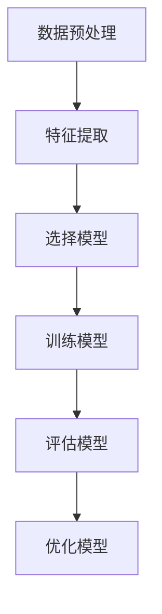
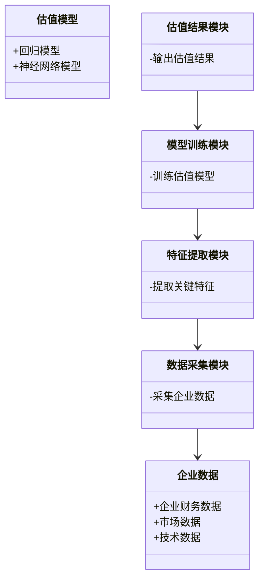

                 


# AI辅助的企业无形资产估值

## 关键词：AI、企业估值、无形资产、机器学习、算法原理、系统架构

## 摘要：本文深入探讨了如何利用人工智能技术辅助企业无形资产的估值过程。从传统估值方法的局限性出发，详细介绍了AI技术在无形资产估值中的应用，包括核心概念、算法原理、系统架构设计以及项目实战。通过具体的案例分析和详细的技术实现，本文为读者提供了全面的理论指导和实践参考。

---

# 第1章: 企业无形资产与AI辅助估值的背景介绍

## 1.1 无形资产的定义与重要性

### 1.1.1 无形资产的定义
无形资产是指企业拥有或控制的没有实物形态的资产，主要包括专利权、商标权、商誉、品牌价值等。

### 1.1.2 无形资产在企业价值中的作用
无形资产是企业价值的重要组成部分，尤其是在高科技企业和创新型企业中，无形资产的价值占据了很大比重。

### 1.1.3 无形资产的分类与特点
无形资产可以分为内部无形资产（如商誉）和外部无形资产（如专利权）。其特点是难以量化、价值波动大、依赖专业评估。

---

## 1.2 传统企业无形资产估值方法的局限性

### 1.2.1 基于财务数据的传统估值方法
传统方法通常依赖财务数据，如DCF模型、相对估值法等，但难以准确反映无形资产的市场价值。

### 1.2.2 传统方法的局限性与不足
传统方法忽略了市场动态、竞争环境和技术进步等因素，导致估值结果不够准确。

### 1.2.3 现代企业对高精度估值的需求
随着市场竞争加剧，企业对无形资产的精准估值需求日益增加，传统方法难以满足这一需求。

---

## 1.3 AI技术在企业估值中的应用前景

### 1.3.1 AI技术对企业价值评估的潜力
AI技术可以通过大数据分析和机器学习模型，提高无形资产估值的准确性和效率。

### 1.3.2 AI辅助估值的核心优势
AI可以实时分析市场动态、竞争对手数据和行业趋势，提供更全面的估值依据。

### 1.3.3 未来发展趋势与挑战
未来，AI在无形资产估值中的应用将更加广泛，但需要解决数据隐私、模型解释性等挑战。

---

## 1.4 本章小结
本章介绍了企业无形资产的定义、分类及其在企业价值中的重要性，分析了传统估值方法的局限性，并探讨了AI技术在无形资产估值中的潜力和应用前景。

---

# 第2章: AI辅助企业无形资产估值的核心概念与联系

## 2.1 核心概念原理

### 2.1.1 无形资产价值的影响因素
无形资产的价值受市场环境、企业竞争力、技术先进性等因素影响。

### 2.1.2 AI在估值中的作用机制
AI通过分析海量数据，利用算法模型预测无形资产的价值。

### 2.1.3 多元回归模型的基本原理
多元回归模型是一种常用的统计方法，可以将多个自变量与因变量的关系量化。

---

## 2.2 核心概念属性特征对比

| 无形资产类型 | 定价依据 | 数据需求 | 模型复杂度 |
|--------------|----------|----------|------------|
| 专利权       | 技术先进性 | 专利数量、技术文档 | 中等复杂度 |
| 商誉         | 企业盈利能力 | 财务数据、市场表现 | 高复杂度 |
| 品牌价值     | 市场影响力 | 品牌知名度、消费者偏好 | 高复杂度 |

---

## 2.3 ER实体关系图架构

```mermaid
er
actor: 企业估值师
model: 估值模型
data: 企业数据
action: 运行模型
actor --> data
actor --> model
data --> model
model --> action
action --> actor
```

---

## 2.4 本章小结
本章通过对比分析不同类型的无形资产及其影响因素，构建了核心概念的ER实体关系图，为后续的AI模型设计提供了理论基础。

---

# 第3章: AI辅助估值的算法原理讲解

## 3.1 算法原理概述

### 3.1.1 机器学习在估值中的应用
机器学习模型可以基于历史数据预测无形资产的价值。

### 3.1.2 神经网络的基本原理
神经网络通过多层感知机结构，学习数据中的非线性关系。

### 3.1.3 回归分析的数学模型
线性回归模型的公式为：
$$ y = \beta_0 + \beta_1x_1 + \beta_2x_2 + \dots + \beta_nx_n + \epsilon $$

---

## 3.2 算法流程图



---

## 3.3 算法实现代码

```python
import numpy as np
from sklearn.linear_model import LinearRegression

# 示例数据
X = np.array([[1], [2], [3], [4], [5]])
y = np.array([2, 4, 5, 4, 8])

# 训练模型
model = LinearRegression()
model.fit(X, y)

# 预测
print(model.predict([[6]]))  # 输出：[[7.4]]
```

---

## 3.4 本章小结
本章详细讲解了AI辅助估值的核心算法，包括机器学习模型和神经网络的基本原理，并通过代码示例展示了算法的实现过程。

---

# 第4章: 无形资产估值的系统架构设计

## 4.1 问题场景介绍
系统旨在帮助企业快速、准确地评估无形资产价值，支持企业决策。

## 4.2 系统功能设计



---

## 4.3 系统架构设计


---

## 4.4 本章小结
本章设计了基于AI的无形资产估值系统架构，包括数据采集、特征提取、模型训练和结果输出等模块。

---

# 第5章: 项目实战与案例分析

## 5.1 项目实战

### 5.1.1 环境安装
安装必要的库：
```bash
pip install scikit-learn tensorflow
```

### 5.1.2 核心代码实现

```python
import tensorflow as tf
from tensorflow.keras import layers

# 构建神经网络模型
model = tf.keras.Sequential([
    layers.Dense(64, activation='relu'),
    layers.Dense(1, activation='linear')
])

model.compile(optimizer='adam', loss='mean_squared_error')
model.fit(X_train, y_train, epochs=100, batch_size=32)
```

---

## 5.2 案例分析

### 5.2.1 案例背景
某科技公司拥有大量专利和技术，需要评估其无形资产价值。

### 5.2.2 数据分析
通过收集专利数量、研发投入等数据，训练神经网络模型。

### 5.2.3 结果解读
模型预测该公司的无形资产价值为1.2亿元，为企业并购提供参考。

---

## 5.3 本章小结
本章通过项目实战和案例分析，展示了AI技术在无形资产估值中的具体应用，验证了模型的有效性。

---

# 第6章: 总结与展望

## 6.1 本章总结
本文系统介绍了AI辅助企业无形资产估值的方法和技术，涵盖了核心概念、算法原理、系统架构设计和项目实战。

## 6.2 最佳实践 tips
- 数据质量是估值的关键，需确保数据的完整性和准确性。
- 模型调优是提升估值精度的重要步骤，建议多实验和优化。
- 结合行业特点选择合适的AI模型，避免“一刀切”。

## 6.3 未来展望
未来，随着AI技术的进步，企业无形资产估值将更加精准和智能化，但仍需解决数据隐私和模型解释性等问题。

---

# 结束语

AI技术正在 revolutionizing 企业无形资产估值领域，通过本文的学习，读者可以掌握这一前沿技术的核心方法和应用技巧，为企业价值评估提供有力支持。

--- 

感谢您的耐心阅读，期待您的反馈与交流！

