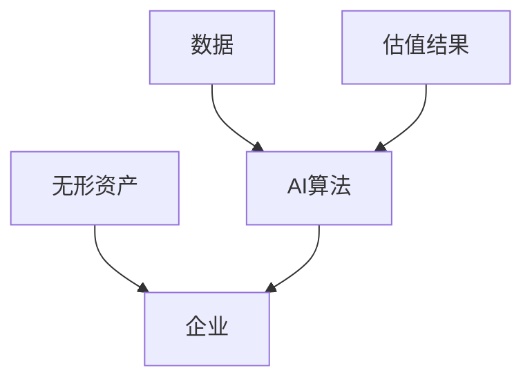
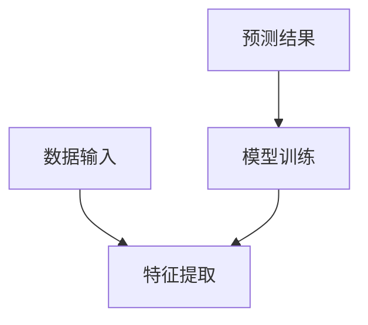
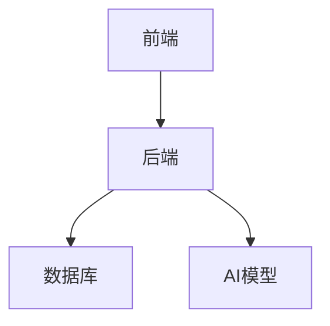

                 


# AI辅助的企业无形资产估值与管理

> 关键词：企业无形资产，AI技术，估值模型，资产管理系统，数据驱动，数字化转型

> 摘要：随着企业对无形资产的重视程度不断提高，传统的无形资产估值方法逐渐暴露出其局限性。本文将详细探讨AI技术在企业无形资产估值与管理中的应用，从核心概念、算法原理、系统架构到实际案例，全面解析AI如何助力企业实现无形资产的高效管理和精准估值。通过本文，读者将了解如何利用AI技术优化无形资产管理流程，提升企业竞争力。

---

## 第1章: 企业无形资产与AI辅助管理的背景

### 1.1 无形资产的定义与特点

无形资产是指企业拥有或控制的，没有实物形态，但能够为企业带来长期经济利益的资源。它们通常包括专利权、商标权、商誉、版权、特许经营权等。以下是无形资产的主要特点：

- **不可见性**：无形资产没有实体形态，其价值往往体现在企业的声誉、技术或品牌中。
- **长期性**：无形资产的使用寿命通常较长，能够在较长时间内为企业创造价值。
- **专有性**：许多无形资产具有专有性，竞争对手难以轻易复制。
- **价值波动性**：无形资产的价值可能受到市场环境、技术发展等多种因素的影响，具有较高的波动性。

### 1.2 AI技术在企业管理中的应用背景

随着人工智能技术的快速发展，AI在企业管理中的应用越来越广泛。AI技术能够通过大数据分析、机器学习等手段，帮助企业更高效地进行决策和管理。特别是在无形资产管理方面，AI技术的应用可以显著提升估值的准确性和管理效率。

- **数据驱动决策**：AI技术能够从海量数据中提取有价值的信息，帮助企业做出更科学的决策。
- **自动化处理**：通过自动化流程，AI可以减少人为错误，提高管理效率。
- **实时监控**：AI能够实时监控无形资产的价值变化，帮助企业及时调整管理策略。

### 1.3 AI辅助企业无形资产估值与管理的必要性

传统的无形资产估值方法通常依赖于人工经验，存在主观性强、效率低、精度不足等问题。而AI技术的引入可以弥补这些不足，为企业提供更精准、更高效的估值和管理方案。

- **提高估值精度**：通过机器学习算法，AI能够从大量历史数据中学习，建立更准确的估值模型。
- **降低管理成本**：自动化管理流程可以显著降低人力成本，提高管理效率。
- **应对复杂环境**：AI能够实时分析市场变化和企业内部数据，帮助企业更好地应对复杂多变的商业环境。

---

## 第2章: 企业无形资产估值的核心概念与AI联系

### 2.1 无形资产估值的基本原理

无形资产估值的基本原理是通过分析其经济价值、市场环境、企业经营状况等因素，确定其在市场上的公允价值。以下是常见的无形资产估值方法：

- **市场法**：通过比较类似资产的市场交易价格，确定估值。
- **收益法**：通过预测资产未来产生的收益，折现后确定当前价值。
- **成本法**：通过估算资产的重置成本，确定其价值。

### 2.2 AI在无形资产估值中的核心作用

AI技术在无形资产估值中的作用主要体现在以下几个方面：

- **数据处理与分析**：AI能够快速处理大量数据，提取关键特征，为估值提供依据。
- **模型建立与优化**：通过机器学习算法，AI可以建立更复杂的估值模型，并不断优化其性能。
- **实时更新与调整**：AI能够实时跟踪市场变化和企业内部数据，动态调整估值结果。

### 2.3 无形资产与AI技术的实体关系图

以下是无形资产与AI技术的实体关系图：



---

## 第3章: AI算法在无形资产估值中的实现原理

### 3.1 常见AI算法及其特点

在无形资产估值中，常用的AI算法包括：

- **线性回归**：适用于简单的线性关系，但对复杂关系的拟合能力较弱。
- **支持向量机（SVM）**：适用于分类和回归问题，具有较强的泛化能力。
- **神经网络**：适用于复杂非线性关系，能够处理高维数据。

### 3.2 无形资产估值的AI算法选择

算法选择的依据主要包括数据类型、问题复杂度、计算资源等因素。以下是不同算法的适用场景对比：

| 算法类型   | 适用场景               | 优点                           | 缺点                           |
|------------|------------------------|--------------------------------|--------------------------------|
| 线性回归    | 简单线性关系            | 实现简单，计算速度快           | 拟合能力有限                   |
| 支持向量机  | 中等复杂度，高维数据    | 泛化能力强，适合小样本数据     | 参数选择敏感                   |
| 神经网络    | 复杂非线性关系，大数据  | 拟合能力强，能够处理复杂模式   | 训练时间长，需要大量数据       |

### 3.3 基于AI的无形资产估值模型

以下是一个简单的基于AI的无形资产估值模型：



---

## 第4章: 企业无形资产管理系统的架构设计

### 4.1 系统功能设计

以下是无形资产管理系统的功能模块：

- **数据采集模块**：从企业内部和外部数据源采集相关数据。
- **特征提取模块**：对采集的数据进行特征提取和预处理。
- **模型训练模块**：基于特征数据训练AI模型。
- **估值模块**：利用训练好的模型进行无形资产估值。
- **管理模块**：提供资产管理、风险评估等功能。

### 4.2 系统架构设计

以下是系统架构图：



---

## 第5章: 项目实战

### 5.1 环境安装

以下是项目所需的环境和工具：

- **Python**：3.8+
- **TensorFlow**：2.0+
- **Pandas**、**NumPy**、**Scikit-learn**

### 5.2 核心代码实现

以下是一个简单的基于线性回归的估值模型代码示例：

```python
import numpy as np
from sklearn.linear_model import LinearRegression

# 示例数据
X = np.array([[1], [2], [3], [4], [5]])
y = np.array([2, 4, 5, 4, 6])

# 模型训练
model = LinearRegression()
model.fit(X, y)

# 预测
print(model.predict([[6]]))  # 输出：[[7.8]]
```

### 5.3 案例分析

以下是一个实际案例分析：

某科技公司拥有一项专利技术，希望通过AI技术对其价值进行评估。首先，我们需要收集相关数据，包括类似专利的交易价格、公司的财务数据、市场环境等。然后，利用机器学习算法建立估值模型，预测该专利的公允价值。

---

## 第6章: 最佳实践与小结

### 6.1 小结

通过本文的介绍，我们了解了AI技术在企业无形资产估值与管理中的重要性。AI技术能够通过大数据分析和机器学习算法，显著提高估值的准确性和管理效率。

### 6.2 注意事项

- 数据质量对估值结果影响较大，需确保数据的准确性和完整性。
- 模型的选择应根据具体问题和数据特点进行，避免盲目使用复杂算法。
- 定期更新模型参数，确保估值结果的时效性。

### 6.3 拓展阅读

- 《机器学习实战》
- 《企业价值评估》
- 《人工智能与商业分析》

---

通过本文的详细讲解，读者可以全面了解AI技术在企业无形资产估值与管理中的应用，为企业的数字化转型提供有力支持。

