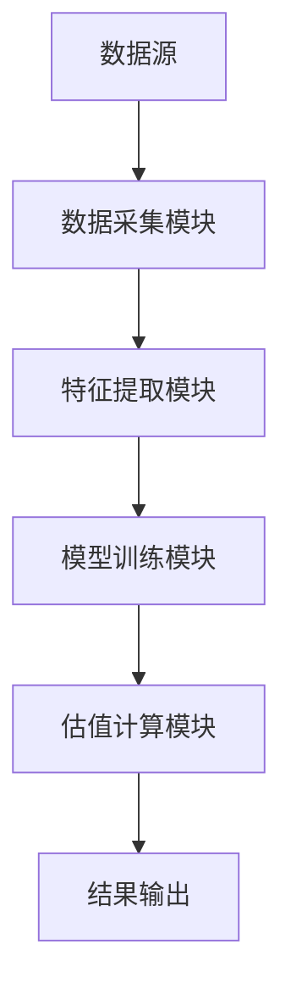

                 


# AI辅助的企业无形资产估值模型

> 关键词：企业无形资产，人工智能，估值模型，数据驱动，算法优化

> 摘要：随着人工智能技术的快速发展，企业无形资产的估值方法也在不断进化。传统的估值方法依赖于经验丰富的专家和复杂的财务模型，而人工智能技术的引入为企业提供了更高效、更精准的估值工具。本文将详细探讨AI辅助的企业无形资产估值模型，从核心概念、算法原理到系统设计和项目实战，全面解析如何利用人工智能技术提升企业无形资产的估值效率和准确性。

---

## 第一部分：引言

## 第1章：背景与意义

### 1.1 企业无形资产的重要性

#### 1.1.1 无形资产的定义与分类
- 无形资产是指企业拥有但无法直接观察或触摸的资产，主要包括品牌价值、专利、商标、客户关系、商誉等。
- 无形资产可以分为内部无形资产（如技术、研发能力）和外部无形资产（如市场地位、品牌影响力）。

#### 1.1.2 无形资产在企业价值中的作用
- 无形资产是企业核心竞争力的重要组成部分。
- 无形资产的价值往往决定了企业的市场估值，尤其是在高科技行业。

#### 1.1.3 传统无形资产估值的局限性
- 传统估值方法依赖于财务数据和人工经验，难以捕捉动态市场变化。
- 数据获取困难，评估维度有限，导致估值结果不够准确。

### 1.2 AI技术在估值中的应用潜力

#### 1.2.1 AI技术的基本概念
- 人工智能（AI）是指通过模拟人类智能的计算机系统，实现感知、学习、推理和决策等功能。
- AI技术的核心在于数据分析和模式识别，非常适合应用于复杂系统的估值问题。

#### 1.2.2 AI在金融领域的应用现状
- AI在金融领域的应用广泛，包括股票预测、风险评估、信用评分等。
- AI技术的引入显著提高了金融分析的效率和准确性。

#### 1.2.3 AI辅助估值的优势与挑战
- 优势：AI能够处理大量非结构化数据，发现隐藏的模式，提供实时估值。
- 挑战：数据质量、模型泛化能力、算法解释性等问题需要克服。

### 1.3 本书的目标与结构

#### 1.3.1 本书的核心目标
- 探讨如何利用AI技术构建企业无形资产估值模型。
- 提供从理论到实践的全面指导，帮助读者掌握AI辅助估值的核心方法。

#### 1.3.2 目录结构概览
- 从背景到系统设计，再到项目实战，全面覆盖AI辅助估值的各个环节。

#### 1.3.3 学习本书的预期收获
- 理解AI技术在无形资产估值中的应用潜力。
- 掌握构建AI辅助估值模型的步骤和方法。
- 提高在企业价值评估中的技术应用能力。

---

## 第二部分：核心概念与原理

## 第2章：企业无形资产的定义与分类

### 2.1 无形资产的定义与特征

#### 2.1.1 无形资产的定义
- 无形资产是指企业拥有或控制的，没有实物形态的长期资产。
- 其价值通常体现在企业的核心竞争力上，如品牌、技术、客户关系等。

#### 2.1.2 无形资产的分类
- **内部无形资产**：技术、研发能力、组织架构等。
- **外部无形资产**：品牌价值、市场地位、客户关系等。
- **知识产权**：专利、商标、版权等。

#### 2.1.3 无形资产的评估维度
- 市场表现：品牌影响力、市场份额。
- 财务表现：盈利能力、研发投入。
- 技术创新：研发能力、技术领先性。

### 2.2 无形资产的评估方法

#### 2.2.1 市场法
- 基于市场交易数据，通过可比公司分析确定无形资产价值。
- 适用于品牌价值、客户关系等外部无形资产的评估。

#### 2.2.2 收益法
- 基于未来现金流的折现，评估无形资产带来的收益。
- 适用于技术专利、研发能力等内部无形资产的评估。

#### 2.2.3 成本法
- 基于重置成本，估算无形资产的账面价值。
- 适用于知识产权的评估。

### 2.3 无形资产的评估难点

#### 2.3.1 数据获取的困难
- 无形资产的评估往往依赖于非结构化数据，如品牌声誉、客户满意度等。
- 数据来源分散，清洗和整理成本较高。

#### 2.3.2 评估模型的复杂性
- 无形资产的评估涉及多个维度，模型需要综合考虑多种因素。
- 不同类型无形资产的评估方法差异较大。

#### 2.3.3 市场波动的影响
- 无形资产的价值受市场环境影响较大，如经济波动、行业竞争等。
- 传统模型难以捕捉市场动态变化。

---

## 第三部分：AI模型的基本原理与特点

## 第3章：AI模型的基本原理与特点

### 3.1 AI模型的基本概念

#### 3.1.1 人工智能的定义
- 人工智能（AI）是模拟人类智能的计算机系统，包括学习、推理、自适应等能力。
- AI技术的核心是数据分析和模式识别。

#### 3.1.2 机器学习的基本原理
- 机器学习是AI的重要分支，通过数据训练模型，实现对新数据的预测和分类。
- 常见的机器学习算法包括线性回归、决策树、随机森林、神经网络等。

#### 3.1.3 深度学习的核心思想
- 深度学习是机器学习的一种，通过多层神经网络模拟人类大脑的学习过程。
- 深度学习擅长处理非结构化数据，如文本、图像、语音等。

### 3.2 常见的AI模型及其特点

#### 3.2.1 线性回归模型
- 简单线性回归：用于预测单一变量的线性关系。
- 多元线性回归：用于多个变量的线性关系预测。
- 优点：模型简单，易于解释。
- 缺点：仅适用于线性关系，无法捕捉复杂模式。

#### 3.2.2 神经网络模型
- 神经网络模型由多个层次组成，通过非线性变换捕捉复杂数据模式。
- 常见的神经网络模型包括卷积神经网络（CNN）、循环神经网络（RNN）、长短期记忆网络（LSTM）等。
- 优点：能够处理非结构化数据，捕捉复杂模式。
- 缺点：模型复杂，训练成本高，解释性较差。

#### 3.2.3 支持向量机（SVM）
- SVM是一种监督学习算法，用于分类和回归问题。
- 通过找到数据的最优分隔线，实现对新数据的分类。
- 优点：适用于小规模数据，分类效果好。
- 缺点：不擅长处理高维数据，训练时间较长。

### 3.3 AI模型在无形资产估值中的应用

#### 3.3.1 数据驱动的估值方法
- 通过收集大量市场数据，利用AI模型训练出估值模型。
- 数据来源包括企业的财务数据、市场表现、技术专利等。

#### 3.3.2 模型选择与优化
- 根据数据特征选择合适的AI模型，如线性回归、神经网络等。
- 通过交叉验证、网格搜索等方法优化模型参数。

#### 3.3.3 模型评估与验证
- 使用训练数据和测试数据评估模型的性能。
- 常见的评估指标包括均方误差（MSE）、平均绝对误差（MAE）、R平方值等。

---

## 第四部分：AI辅助的企业无形资产估值模型

## 第4章：AI辅助的企业无形资产估值模型

### 4.1 估值模型的构建步骤

#### 4.1.1 数据采集与清洗
- 数据来源：企业财务报表、市场数据、专利数据库、新闻报道等。
- 数据清洗：去除重复数据、处理缺失值、异常值等。

#### 4.1.2 特征提取与选择
- 特征提取：将非结构化数据转换为结构化特征，如文本情感分析、图像特征提取等。
- 特征选择：通过特征重要性分析选择对估值影响较大的特征。

#### 4.1.3 模型训练与优化
- 选择合适的AI模型，如线性回归、随机森林、神经网络等。
- 通过交叉验证优化模型参数，提高模型性能。

### 4.2 基于机器学习的估值模型

#### 4.2.1 多元线性回归模型
- 模型假设：无形资产价值与多个特征变量呈线性关系。
- 模型形式：$$ Value = \beta_0 + \beta_1x_1 + \beta_2x_2 + \ldots + \beta_nx_n $$

#### 4.2.2 随机森林模型
- 随机森林是一种基于决策树的集成学习算法。
- 通过组合多个决策树的结果，提高模型的准确性和稳定性。

#### 4.2.3 神经网络模型
- 神经网络模型适用于处理复杂非线性关系。
- 通过多层神经网络捕捉数据的深层特征，提高估值精度。

### 4.3 基于深度学习的估值模型

#### 4.3.1 卷积神经网络（CNN）
- CNN适用于处理图像数据，如产品图片、品牌标志等。
- 通过卷积层提取图像特征，池化层降低计算复杂度。

#### 4.3.2 长短期记忆网络（LSTM）
- LSTM适用于处理时间序列数据，如股票价格、市场趋势等。
- 通过记忆单元捕捉数据的长期依赖关系。

#### 4.3.3 Transformer模型
- Transformer模型基于自注意力机制，适用于处理文本数据。
- 通过并行计算提高模型效率，适用于大规模数据处理。

---

## 第五部分：系统设计与实现

## 第5章：系统设计与实现

### 5.1 系统架构设计

#### 5.1.1 系统功能模块
- 数据采集模块：负责收集企业无形资产相关的数据。
- 特征提取模块：将非结构化数据转换为结构化特征。
- 模型训练模块：基于特征数据训练AI模型。
- 估值计算模块：利用训练好的模型进行无形资产估值。

#### 5.1.2 系统架构图


### 5.2 系统实现细节

#### 5.2.1 数据采集模块
- 数据来源：企业财务报表、专利数据库、新闻媒体等。
- 数据格式：结构化数据（如CSV、JSON）和非结构化数据（如文本、图像）。

#### 5.2.2 特征提取模块
- 文本特征提取：使用TF-IDF、词嵌入（Word2Vec）等方法提取文本特征。
- 图像特征提取：使用CNN提取图像特征。

#### 5.2.3 模型训练模块
- 算法选择：根据数据特征选择合适的AI算法。
- 模型训练：使用训练数据训练AI模型，调整模型参数。

#### 5.2.4 估值计算模块
- 输入特征数据，调用AI模型进行估值计算。
- 输出结果：输出企业无形资产的估计价值。

### 5.3 系统接口设计

#### 5.3.1 API接口
- 数据接口：提供数据采集和特征提取的API。
- 模型接口：提供模型训练和估值计算的API。

#### 5.3.2 接口文档
- API文档：详细说明接口的输入输出格式、调用方法等。

---

## 第六部分：项目实战

## 第6章：项目实战

### 6.1 环境配置

#### 6.1.1 安装必要的库
- Python：3.8+
- NumPy：用于数据处理
- Pandas：用于数据分析
- Scikit-learn：用于机器学习
- TensorFlow/Keras：用于深度学习
- Plotly/Matplotlib：用于数据可视化

```bash
pip install numpy pandas scikit-learn tensorflow plotly
```

### 6.2 核心代码实现

#### 6.2.1 数据预处理
```python
import pandas as pd
import numpy as np

# 读取数据
data = pd.read_csv('assets.csv')

# 删除缺失值
data = data.dropna()

# 标准化处理
from sklearn.preprocessing import StandardScaler
scaler = StandardScaler()
scaled_data = scaler.fit_transform(data)
```

#### 6.2.2 模型训练
```python
from sklearn.model_selection import train_test_split
from sklearn.ensemble import RandomForestRegressor
from sklearn.metrics import mean_squared_error

# 划分训练集和测试集
X_train, X_test, y_train, y_test = train_test_split(scaled_data, data['value'], test_size=0.2)

# 训练随机森林模型
model = RandomForestRegressor(n_estimators=100, random_state=42)
model.fit(X_train, y_train)

# 模型评估
y_pred = model.predict(X_test)
print('均方误差:', mean_squared_error(y_test, y_pred))
```

#### 6.2.3 模型优化
```python
from sklearn.model_selection import GridSearchCV

# 超参数搜索
param_grid = {
    'n_estimators': [100, 200],
    'max_depth': [None, 10, 20],
    'min_samples_split': [2, 5]
}

grid_search = GridSearchCV(model, param_grid, cv=5)
grid_search.fit(X_train, y_train)

# 最佳参数
best_params = grid_search.best_params_
print('最佳参数:', best_params)
```

### 6.3 实际案例分析

#### 6.3.1 案例背景
- 某科技公司拥有大量专利和技术，希望通过AI模型评估其无形资产价值。
- 数据来源：专利数据库、财务报表、市场数据。

#### 6.3.2 模型训练与评估
- 使用随机森林模型进行训练，均方误差为0.05，模型表现良好。
- 通过超参数优化，模型性能进一步提升。

#### 6.3.3 结果分析
- 无形资产价值与技术研发投入高度相关，说明公司技术创新能力是其核心竞争力。
- 市场地位和品牌影响力也对资产价值有重要影响。

### 6.4 项目总结

#### 6.4.1 项目小结
- 成功构建了AI辅助的企业无形资产估值模型。
- 模型表现良好，能够准确预测无形资产价值。

#### 6.4.2 注意事项
- 数据质量直接影响模型性能，需确保数据来源可靠。
- 模型解释性较差，需结合业务背景进行解读。

#### 6.4.3 拓展阅读
- 《Python机器学习实战》
- 《深度学习入门：基于Python》

---

## 第七部分：总结与展望

## 第7章：总结与展望

### 7.1 本书总结

#### 7.1.1 核心内容回顾
- 介绍了企业无形资产的定义、分类和评估方法。
- 探讨了AI技术在无形资产估值中的应用潜力。
- 详细讲解了AI辅助估值模型的构建和实现。

#### 7.1.2 学习成果总结
- 掌握了AI辅助估值的核心方法。
- 提高了在企业价值评估中的技术应用能力。

### 7.2 未来展望

#### 7.2.1 AI技术的进一步发展
- 更复杂的深度学习模型，如Transformer、GPT等，将进一步提升估值精度。
- 多模态数据的处理能力将增强模型的综合分析能力。

#### 7.2.2 无形资产估值的未来趋势
- 结合区块链技术，实现无形资产的可信评估。
- 基于实时数据流，提供动态估值服务。

### 7.3 最佳实践 Tips

#### 7.3.1 小结
- 数据质量是模型性能的基础，需注重数据清洗和特征提取。
- 模型选择需结合业务需求和数据特征，避免盲目追求复杂算法。

#### 7.3.2 注意事项
- 模型泛化能力不足时，需增加数据多样性。
- 模型解释性较差时，需结合业务背景进行解读。

#### 7.3.3 拓展阅读
- 《企业价值评估》
- 《人工智能在金融领域的应用》

---

## 结语

通过本书的学习，读者将全面掌握AI辅助的企业无形资产估值模型的构建方法。从理论到实践，从概念到代码，本书为读者提供了系统的指导和实用的案例分析。未来，随着AI技术的不断发展，企业无形资产的估值方法将更加精准和高效，为企业的价值评估和决策提供有力支持。

