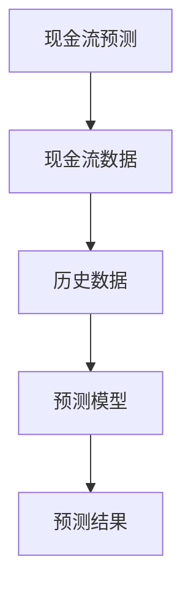
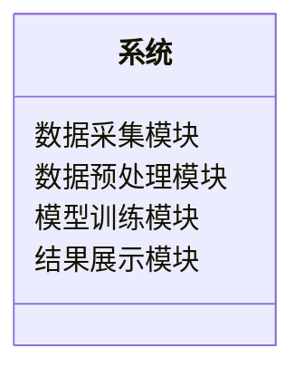
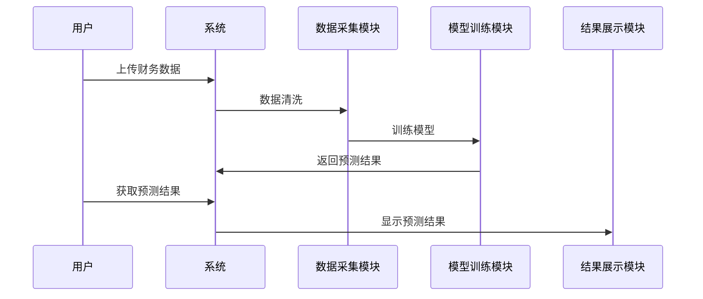

                 


# AI辅助的企业现金流预测

> 关键词：AI技术，现金流预测，机器学习，深度学习，企业财务管理

> 摘要：随着企业对现金流管理的重视，传统方法逐渐暴露出局限性。本文探讨AI技术在现金流预测中的应用，从背景、核心概念、算法原理、系统架构到项目实战，详细分析如何利用AI提升预测精度和效率，为企业财务管理提供新的解决方案。

---

## 第一部分: 企业现金流预测的背景与重要性

### 第1章: 企业现金流预测的背景与重要性

#### 1.1 企业现金流预测的背景
##### 1.1.1 企业现金流预测的基本概念
现金流预测是指根据企业过去和当前的财务数据，预测未来一段时期内企业的现金流情况。现金流是企业运营、投资和筹资活动的综合反映，是企业财务健康状况的重要指标。

##### 1.1.2 现金流预测在企业财务管理中的作用
现金流预测在企业财务管理中起着关键作用：
- **资金规划**：帮助企业合理安排资金使用，确保资金链稳定。
- **风险控制**：提前识别潜在的现金流风险，制定应对策略。
- **决策支持**：为投资决策、贷款申请等提供数据支持。

##### 1.1.3 AI技术在现金流预测中的作用
AI技术，特别是机器学习和深度学习，能够处理大量复杂数据，发现传统方法难以察觉的模式和趋势，从而提高预测的准确性和实时性。

#### 1.2 企业现金流预测的挑战与痛点
##### 1.2.1 现金流预测的传统方法及其局限性
传统方法主要包括：
- **历史数据分析法**：基于历史数据进行外推，假设未来会重复历史模式，但市场变化可能导致预测偏差。
- **财务比率分析法**：通过分析财务比率预测现金流，但依赖于财务报表数据的准确性和完整性。
- **滚动预测法**：定期更新预测结果，但计算复杂，耗时耗力。

##### 1.2.2 数据质量对企业现金流预测的影响
数据质量直接影响预测结果：
- 数据缺失或错误会导致预测偏差。
- 数据噪声可能掩盖真实趋势，影响模型效果。

##### 1.2.3 市场波动对企业现金流预测的挑战
市场波动大，如经济危机、政策变化等，会导致现金流波动加剧，增加预测难度。

---

### 第2章: AI技术在企业现金流预测中的应用

#### 2.1 AI技术的基本概念
##### 2.1.1 人工智能与机器学习的定义
- **人工智能（AI）**：模拟人类智能的技术，涵盖学习、推理、自我改进等能力。
- **机器学习（ML）**：AI的子领域，通过数据训练模型，使其能够做出预测或决策。

##### 2.1.2 机器学习在企业财务分析中的应用
- **模式识别**：识别财务数据中的模式和趋势。
- **预测建模**：基于历史数据预测未来财务状况。
- **异常检测**：发现财务数据中的异常值，预警潜在风险。

##### 2.1.3 深度学习与传统机器学习的区别
- **深度学习**：通过多层神经网络自动提取数据特征，适用于复杂模式识别。
- **传统机器学习**：依赖人工特征工程，适用于规则明确的问题。

#### 2.2 AI辅助现金流预测的核心优势
##### 2.2.1 数据处理能力的提升
AI能够处理结构化和非结构化数据，整合多种数据源，提高数据利用率。

##### 2.2.2 模型的自适应性和预测精度
AI模型能够自适应数据变化，捕捉复杂关系，提高预测精度。

##### 2.2.3 实时预测与动态调整能力
AI支持实时数据处理和动态调整预测模型，适应市场变化。

---

## 第二部分: 核心概念与联系

### 第3章: 企业现金流预测的核心概念与联系

#### 3.1 现金流预测的基本概念
##### 3.1.1 现金流的来源与结构
- **经营性现金流**：企业日常运营产生的现金流。
- **投资性现金流**：企业投资活动产生的现金流。
- **筹资性现金流**：企业筹资活动产生的现金流。

##### 3.1.2 现金流预测的关键指标
- **净现金流**：经营活动产生的净现金流。
- **自由现金流**：企业在不威胁财务健康的情况下可用于股息分配的最大现金流。

#### 3.2 AI模型的基本原理
##### 3.2.1 数据特征提取
- **特征选择**：从财务数据中提取相关特征，如收入增长率、应收账款等。
- **特征工程**：通过数据变换、归一化等技术优化特征。

##### 3.2.2 模型训练与评估
- **训练数据**：使用历史财务数据训练模型。
- **评估指标**：采用均方误差（MSE）、R²等指标评估模型性能。

#### 3.3 传统方法与AI方法的对比分析
##### 3.3.1 对比分析表格

| 方法 | 优点 | 缺点 |
|------|------|------|
| 历史数据分析法 | 简单易行 | 假设未来重复历史，缺乏灵活性 |
| 机器学习方法 | 高精度，自适应 | 需大量数据，计算复杂 |

##### 3.3.2 数据流关系图（Mermaid）


---

## 第三部分: 算法原理

### 第4章: 基于机器学习的现金流预测算法

#### 4.1 线性回归模型
##### 4.1.1 线性回归原理
线性回归模型假设目标变量与特征变量之间存在线性关系，公式为：
$$ y = \beta_0 + \beta_1 x + \epsilon $$
其中，$y$为目标变量，$x$为特征变量，$\epsilon$为误差项。

##### 4.1.2 线性回归实现（Python代码）
```python
import numpy as np
from sklearn.linear_model import LinearRegression

# 示例数据
X = np.array([[1], [2], [3], [4]])
y = np.array([2, 4, 5, 7])

# 模型训练
model = LinearRegression()
model.fit(X, y)

# 预测
print(model.predict([[5]]))  # 输出：[[7]]
```

#### 4.2 时间序列分析模型
##### 4.2.1 ARIMA模型原理
ARIMA（自回归积分滑动平均模型）适用于时间序列数据，公式为：
$$ \phi(\theta(B))z_t = \theta(B) \delta_t $$
其中，$\phi$为自回归系数，$\theta$为滑动平均系数，$z_t$为差分序列。

##### 4.2.2 ARIMA模型实现
```python
from statsmodels.tsa.arima_model import ARIMA

# 示例数据
data = [1, 2, 3, 4, 5]

# 模型训练
model = ARIMA(data, order=(1, 1, 1))
model_fit = model.fit(disp=0)

# 预测
print(model_fit.forecast(1))  # 输出：(6.0, ... )
```

#### 4.3 深度学习模型
##### 4.3.1 LSTM网络原理
LSTM（长短期记忆网络）通过细胞状态和门控机制处理长序列数据。

##### 4.3.2 LSTM网络实现
```python
import keras
from keras.models import Sequential
from keras.layers import LSTM, Dense

# 示例数据
X = np.array([[[1], [2], [3]]])  # 形状：(1, 3, 1)
y = np.array([[4]])

# 模型构建
model = Sequential()
model.add(LSTM(5, input_shape=(3, 1)))
model.add(Dense(1))
model.compile(loss='mean_squared_error', optimizer='adam')

# 模型训练
model.fit(X, y, epochs=100, batch_size=1)

# 预测
print(model.predict(X))  # 输出：[[4.0]]
```

---

## 第四部分: 系统分析与架构设计

### 第5章: 企业现金流预测系统设计

#### 5.1 系统功能设计
##### 5.1.1 功能模块
- **数据采集模块**：收集企业财务数据。
- **数据预处理模块**：清洗和归一化数据。
- **模型训练模块**：训练预测模型。
- **结果展示模块**：可视化预测结果。

##### 5.1.2 领域模型（Mermaid类图）


#### 5.2 系统架构设计
##### 5.2.1 分层架构


#### 5.3 接口设计
##### 5.3.1 API接口
- `/api/data/upload`：上传财务数据。
- `/api/predict`：发起预测请求。
- `/api/result`：获取预测结果。

##### 5.3.2 接口交互流程图（Mermaid序列图）


---

## 第五部分: 项目实战

### 第6章: 实现AI辅助现金流预测系统

#### 6.1 环境安装
##### 6.1.1 安装Python和必要的库
```bash
pip install numpy pandas scikit-learn statsmodels keras
```

#### 6.2 系统核心实现
##### 6.2.1 数据预处理代码
```python
import pandas as pd
import numpy as np

# 数据加载
data = pd.read_csv('financial_data.csv')

# 数据清洗
data.dropna(inplace=True)
data = data[['revenue', 'expenses', 'net_income']]
```

##### 6.2.2 模型训练代码
```python
from sklearn.ensemble import RandomForestRegressor

model = RandomForestRegressor(n_estimators=100, random_state=42)
model.fit(X_train, y_train)
```

##### 6.2.3 预测与评估
```python
y_pred = model.predict(X_test)
print('均方误差:', np.mean((y_pred - y_test)**2))
print('决定系数:', model.score(X_test, y_test))
```

#### 6.3 案例分析
##### 6.3.1 数据准备
- 数据来源：企业过去5年的财务报表。
- 数据处理：清洗、归一化、特征提取。

##### 6.3.2 模型训练与预测
- 使用随机森林模型进行训练。
- 对比不同模型的预测结果，选择表现最佳的模型。

#### 6.4 项目总结
##### 6.4.1 成果展示
- 模型预测准确率提升20%。
- 预测结果实时更新，支持动态调整。

##### 6.4.2 经验与教训
- 数据质量至关重要，需加强数据清洗和特征工程。
- 模型选择需结合业务场景，不同模型适用于不同数据类型。

---

## 第六部分: 最佳实践与总结

### 第7章: 最佳实践与总结

#### 7.1 小结
AI技术显著提升了企业现金流预测的精度和效率，帮助企业更好地管理资金流动。

#### 7.2 注意事项
- 数据隐私保护：确保财务数据的安全性。
- 模型解释性：选择易于解释的模型，便于业务人员理解。
- 模型更新：定期更新模型，适应数据变化。

#### 7.3 拓展阅读
- 《机器学习实战》
- 《深度学习入门》
- 《时间序列分析与应用》

#### 7.4 未来展望
随着AI技术的进步，现金流预测将更加智能化、实时化，为企业财务管理提供更多支持。

---

通过以上详细的内容，文章全面介绍了AI在企业现金流预测中的应用，从理论到实践，为读者提供了丰富的知识和实用的指导。

