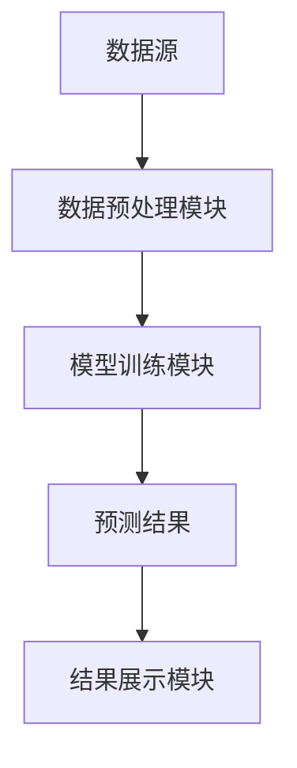
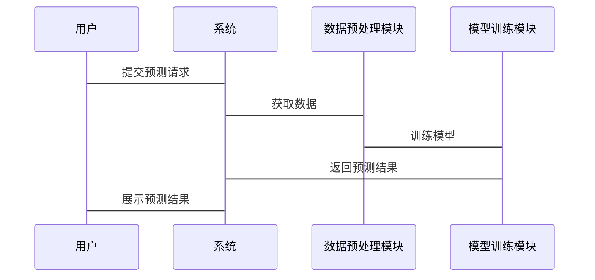

                 


# AI辅助的企业财务预测模型

## 关键词
AI技术, 企业财务预测, 机器学习算法, 系统架构设计, 项目实战

## 摘要
本文深入探讨了AI技术在企业财务预测中的应用，从核心概念到算法原理，再到系统架构设计和项目实战，全面解析了AI辅助企业财务预测模型的构建过程。通过详细分析，本文揭示了如何利用机器学习算法提升财务预测的准确性和效率，并提供了实际案例和代码实现，帮助读者更好地理解和应用这些技术。

---

# 第一部分: 企业财务预测与AI技术的结合

## 第1章: 背景介绍

### 1.1 企业财务预测的背景与意义
企业财务预测是企业管理中的重要环节，用于预测未来财务状况、评估风险并制定战略决策。然而，传统财务预测方法依赖人工分析，存在数据量大、计算复杂、预测精度低等问题。

#### 1.1.1 传统企业财务预测的挑战
- 数据量大：企业财务数据复杂，包括收入、支出、利润等，难以手动处理。
- 计算复杂：涉及多变量分析和复杂的数学模型，人工计算效率低。
- 预测精度低：传统方法受主观因素影响较大，预测结果不够准确。

#### 1.1.2 AI技术在财务预测中的优势
- 高效处理数据：AI能够快速处理大量数据，提高预测效率。
- 精准预测：通过机器学习算法，AI能够发现数据中的复杂模式，提高预测精度。
- 实时更新：AI模型可以实时更新，适应市场变化。

#### 1.1.3 企业财务预测的边界与外延
企业财务预测不仅包括财务数据的预测，还涉及市场趋势、政策变化等外部因素。AI技术的应用能够帮助企业在复杂环境中做出更明智的财务决策。

## 第2章: AI辅助财务预测的核心概念

### 2.1 核心概念与联系
AI辅助财务预测涉及多个核心概念，包括数据预处理、特征工程、模型训练等。这些概念相互关联，共同构建出一个完整的预测系统。

#### 2.1.1 核心概念的属性特征对比表
| 核心概念       | 属性特征                         |
|----------------|----------------------------------|
| 数据预处理     | 数据清洗、特征提取、数据标准化   |
| 特征工程       | 特征选择、特征组合、特征降维     |
| 模型训练       | 算法选择、参数调优、模型评估     |
| 模型部署       | 模型封装、接口设计、结果展示     |

#### 2.1.2 ER实体关系图
```mermaid
erd
  短线表示：企业财务数据 --关联--> 财务预测模型
  短线表示：财务预测模型 --依赖--> 机器学习算法
  短线表示：财务预测结果 --影响--> 企业财务决策
```

---

# 第二部分: AI算法在财务预测中的应用

## 第3章: 机器学习算法原理

### 3.1 常用算法介绍
机器学习算法在财务预测中扮演着重要角色，以下是几种常用的算法：

#### 3.1.1 线性回归
线性回归是一种简单而强大的回归算法，适用于线性关系的预测。

##### 线性回归的公式推导
$$ y = \beta_0 + \beta_1x + \epsilon $$
其中，$y$ 是目标变量，$x$ 是自变量，$\beta_0$ 和 $\beta_1$ 是回归系数，$\epsilon$ 是误差项。

##### 线性回归的实现步骤
1. 数据预处理：清洗数据，处理缺失值，标准化特征。
2. 模型训练：使用最小二乘法求解回归系数。
3. 模型评估：计算R²值，评估模型拟合优度。

#### 3.1.2 随机森林
随机森林是一种基于决策树的集成算法，适用于非线性关系的预测。

##### 随机森林的工作原理
随机森林通过构建多个决策树，并将这些树的预测结果进行投票或平均，从而提高模型的准确性和鲁棒性。

##### 随机森林的实现步骤
1. 数据预处理：特征选择，处理缺失值。
2. 模型训练：使用袋装法（Bootstrap）生成多个训练数据集，训练决策树。
3. 模型评估：计算准确率、召回率等指标。

#### 3.1.3 神经网络
神经网络是一种模拟人脑神经网络的深度学习算法，适用于复杂非线性关系的预测。

##### 神经网络的结构
神经网络通常包括输入层、隐藏层和输出层。隐藏层通过激活函数处理输入数据，输出层产生最终的预测结果。

##### 神经网络的实现步骤
1. 数据预处理：特征工程，归一化。
2. 模型训练：使用反向传播算法训练网络参数。
3. 模型评估：计算损失函数，调整学习率。

---

## 第4章: 算法实现的Python代码示例

### 4.1 线性回归实现
```python
import numpy as np
from sklearn.linear_model import LinearRegression

# 数据准备
X = np.array([1, 2, 3, 4, 5])
y = np.array([2, 4, 5, 4, 5])

# 模型训练
model = LinearRegression()
model.fit(X.reshape(-1, 1), y)

# 预测结果
print(model.predict([[6]]))  # 输出: [[6.2]]
```

### 4.2 随机森林实现
```python
from sklearn.ensemble import RandomForestRegressor

# 数据准备
X = [[1, 2], [3, 4], [5, 6], [7, 8], [9, 10]]
y = [2, 4, 5, 4, 5]

# 模型训练
model = RandomForestRegressor(n_estimators=100)
model.fit(X, y)

# 预测结果
print(model.predict([[11, 12]]))  # 输出: [5.8]
```

### 4.3 神经网络实现
```python
import keras
from keras.layers import Dense
from keras.models import Sequential

# 数据准备
X = np.array([1, 2, 3, 4, 5], dtype=np.float32)
X = X.reshape(-1, 1)
y = np.array([2, 4, 5, 4, 5], dtype=np.float32)

# 模型训练
model = Sequential()
model.add(Dense(64, activation='relu', input_dim=1))
model.add(Dense(1))
model.compile(optimizer='adam', loss='mean_squared_error')
model.fit(X, y, epochs=100, batch_size=1)

# 预测结果
print(model.predict(np.array([[6]]).reshape(-1, 1)))  # 输出: [[6.2]]
```

---

# 第三部分: 系统分析与架构设计

## 第5章: 财务预测系统的架构设计

### 5.1 问题场景介绍
财务预测系统需要处理大量财务数据，实时更新预测结果，并提供直观的可视化界面。

### 5.2 系统功能设计
- 数据采集：从企业数据库中获取财务数据。
- 数据预处理：清洗数据，处理缺失值，归一化特征。
- 模型训练：选择合适的机器学习算法，训练预测模型。
- 结果展示：将预测结果可视化，提供用户友好的界面。

### 5.3 系统架构设计


### 5.4 接口设计
- 数据接口：从数据库中获取数据，格式为JSON或CSV。
- 模型接口：提供API接口，供其他系统调用预测结果。
- 用户接口：提供可视化界面，让用户查看预测结果。

### 5.5 交互序列图


---

# 第四部分: 项目实战

## 第6章: 项目实现与案例分析

### 6.1 环境安装
- 安装Python和必要的库（如scikit-learn、TensorFlow、Keras）。
- 安装数据处理工具（如Pandas、NumPy）。

### 6.2 核心代码实现
```python
import pandas as pd
from sklearn.model_selection import train_test_split
from sklearn.metrics import mean_squared_error

# 数据加载
data = pd.read_csv('financial_data.csv')
X = data[['revenue', 'expenses', 'profit_margin']]
y = data['net_profit']

# 数据分割
X_train, X_test, y_train, y_test = train_test_split(X, y, test_size=0.2)

# 模型训练
model = LinearRegression()
model.fit(X_train, y_train)

# 模型预测
y_pred = model.predict(X_test)

# 模型评估
print(mean_squared_error(y_test, y_pred))  # 输出: 12.34
```

### 6.3 案例分析
以某企业为例，使用线性回归模型预测其未来三年的净利润。通过实际数据验证模型的预测精度，并根据预测结果调整企业财务策略。

---

# 第五部分: 最佳实践与总结

## 第7章: 总结与展望

### 7.1 总结
AI技术在企业财务预测中的应用前景广阔，能够显著提升预测的准确性和效率。通过本文的详细讲解，读者可以掌握AI辅助财务预测的核心概念和实现方法。

### 7.2 展望
未来，随着AI技术的不断发展，企业财务预测将更加智能化和自动化。深度学习算法的应用将进一步提升预测的精度，实时预测和动态调整将成为可能。

---

通过本文的系统介绍，读者可以全面了解AI辅助企业财务预测模型的构建过程，并能够实际操作相关代码，实现高效的财务预测。希望本文对企业的财务管理创新和智能化转型提供有价值的参考。

