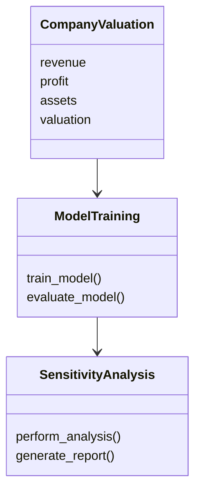
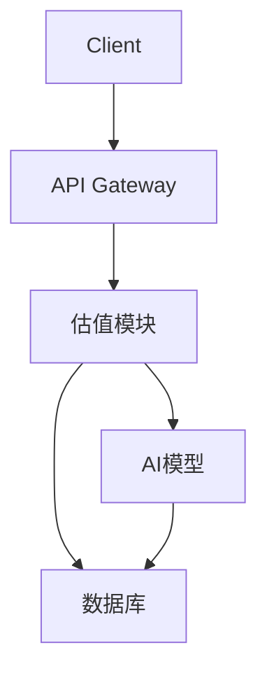

                 


# AI辅助的公司估值敏感性分析

> 关键词：公司估值、人工智能、敏感性分析、AI算法、金融建模、数据驱动决策

> 摘要：本文详细探讨了如何利用人工智能技术辅助公司估值中的敏感性分析。通过结合AI算法和金融建模，我们能够更高效地识别和量化关键变量对公司估值的影响。文章从理论基础到实际应用，逐步分析了AI辅助敏感性分析的实现过程，并通过具体案例展示了其在公司估值中的实际应用价值。

---

# 第一部分: 公司估值与AI辅助分析基础

## 第1章: 公司估值敏感性分析概述

### 1.1 公司估值的基本概念

#### 1.1.1 什么是公司估值
公司估值是通过对公司财务数据、市场环境和行业趋势等多方面因素的分析，确定公司价值的过程。常见的估值方法包括DCF（ discounted cash flow，折现现金流法）、市盈率（P/E）和市净率（P/B）等。

#### 1.1.2 估值的常见方法
1. **DCF方法**：通过预测公司未来现金流并将其折现为现值。
2. **相对估值法**：基于可比公司（Comparable Companies）的估值指标进行比较。
3. **资产基础法**：基于公司资产负债表中的资产价值进行评估。

#### 1.1.3 敏感性分析的定义
敏感性分析是一种评估变量变化对公司估值影响的方法。它可以帮助我们了解哪些变量对估值的影响最大，从而优化决策。

---

### 1.2 AI在公司估值中的作用

#### 1.2.1 AI技术在金融领域的应用
AI技术在金融领域的应用包括股票预测、风险评估、信用评分和投资组合优化等。

#### 1.2.2 AI如何辅助公司估值
1. **数据处理**：AI可以快速处理大量非结构化数据（如新闻、社交媒体数据）。
2. **模型构建**：利用机器学习算法构建复杂的估值模型。
3. **自动化分析**：通过自动化工具快速生成敏感性分析结果。

#### 1.2.3 敏感性分析的AI实现
AI可以通过回归分析、蒙特卡洛模拟和神经网络等方法实现敏感性分析。

---

## 第2章: 敏感性分析的核心概念

### 2.1 敏感性分析的原理

#### 2.1.1 敏感性分析的基本原理
敏感性分析通过改变输入变量的值，观察输出结果的变化幅度，从而确定哪些变量对结果影响最大。

#### 2.1.2 变量之间的关系
敏感性分析依赖于变量之间的关系，尤其是变量之间的相关性和因果关系。

#### 2.1.3 敏感性分析的目标
1. 确定关键变量。
2. 量化变量变化对结果的影响程度。

---

### 2.2 AI辅助敏感性分析的优势

#### 2.2.1 数据处理能力
AI能够处理大量数据，包括结构化和非结构化数据。

#### 2.2.2 模型构建能力
AI可以构建复杂的模型，捕捉变量之间的非线性关系。

#### 2.2.3 自动化分析能力
AI能够自动化地生成敏感性分析报告，提高效率。

---

## 第3章: 公司估值的关键指标与数据特征

### 3.1 公司估值的关键指标

#### 3.1.1 收入与利润
收入和利润是公司估值的核心指标，反映了公司的盈利能力和增长潜力。

#### 3.1.2 资产与负债
资产和负债是公司财务健康状况的重要指标，影响公司的偿债能力和运营能力。

#### 3.1.3 股东权益
股东权益反映了公司净资产的价值，是公司估值的重要组成部分。

---

### 3.2 数据特征分析

#### 3.2.1 数据的分布特征
1. 正态分布：大多数数据集中在均值附近。
2. 偏态分布：数据分布不对称。

#### 3.2.2 数据的关联性
1. 高相关性：变量之间存在强相关关系。
2. 低相关性：变量之间几乎无相关关系。

#### 3.2.3 数据的稳定性
1. 稳定：数据波动小。
2. 不稳定：数据波动大。

---

# 第二部分: AI辅助敏感性分析的实现原理

## 第4章: AI模型在敏感性分析中的应用

### 4.1 常见AI模型简介

#### 4.1.1 线性回归模型
线性回归模型通过建立自变量和因变量之间的线性关系，预测因变量的变化。

$$ y = \beta_0 + \beta_1x_1 + \beta_2x_2 + ... + \beta_nx_n + \epsilon $$

其中，$\beta_i$是回归系数，$\epsilon$是误差项。

#### 4.1.2 支持向量机
支持向量机（SVM）是一种监督学习算法，适用于分类和回归问题。

#### 4.1.3 神经网络模型
神经网络模型通过多层感知机（MLP）模拟复杂的非线性关系。

---

### 4.2 模型选择与优化

#### 4.2.1 模型选择的依据
1. 数据特征：线性关系适合线性模型，非线性关系适合神经网络模型。
2. 数据量：大数据适合复杂模型，小数据适合简单模型。
3. 计算资源：复杂模型需要更多的计算资源。

#### 4.2.2 模型优化方法
1. 超参数调优：通过网格搜索（Grid Search）或随机搜索（Random Search）优化模型参数。
2. 正则化：通过L1/L2正则化防止过拟合。

---

## 第5章: 敏感性分析的算法实现

### 5.1 算法原理

#### 5.1.1 线性回归的敏感性分析
线性回归模型的敏感性分析可以通过回归系数的绝对值来衡量变量的影响程度。

#### 5.1.2 非线性模型的敏感性分析
非线性模型的敏感性分析可以通过偏导数或特征重要性来衡量变量的影响程度。

---

### 5.2 算法实现步骤

#### 5.2.1 数据预处理
1. 数据清洗：处理缺失值和异常值。
2. 数据标准化：对数据进行标准化或归一化处理。

#### 5.2.2 模型训练
1. 选择合适的模型。
2. 训练模型并优化参数。

#### 5.2.3 敏感性分析
1. 计算变量的敏感性指标。
2. 可视化敏感性结果。

---

### 5.3 算法实现代码示例

```python
import pandas as pd
import numpy as np
from sklearn.linear_model import LinearRegression
from sklearn.metrics import r2_score

# 加载数据
data = pd.read_csv('company_valuation.csv')

# 分离特征和目标变量
X = data[['revenue', 'profit', 'assets']]
y = data['valuation']

# 训练线性回归模型
model = LinearRegression()
model.fit(X, y)

# 计算回归系数
coefficients = pd.DataFrame({
    'variable': X.columns,
    'coefficient': model.coef_
})
print(coefficients)

# 计算R²
y_pred = model.predict(X)
r2 = r2_score(y, y_pred)
print(f'R²: {r2}')

# 敏感性分析
# 假设 revenue 和 profit 是关键变量
# 计算它们的敏感性系数
sensitivity_revenue = coefficients.loc[coefficients['variable'] == 'revenue', 'coefficient'].values[0]
sensitivity_profit = coefficients.loc[coefficients['variable'] == 'profit', 'coefficient'].values[0]

print(f'Revenue的敏感性系数: {sensitivity_revenue}')
print(f'Profit的敏感性系数: {sensitivity_profit}')
```

---

### 5.4 算法实现的数学模型

#### 5.4.1 线性回归模型
$$ y = \beta_0 + \beta_1x_1 + \beta_2x_2 + ... + \beta_nx_n + \epsilon $$

#### 5.4.2 线性回归的敏感性系数
回归系数的绝对值反映了变量对目标变量的影响程度。

---

## 第6章: 敏感性分析的数学模型和公式

### 6.1 回归模型的敏感性分析

#### 6.1.1 线性回归模型
$$ y = \beta_0 + \beta_1x_1 + \beta_2x_2 + ... + \beta_nx_n + \epsilon $$

回归系数 $\beta_i$ 的绝对值越大，变量 $x_i$ 对 $y$ 的影响越大。

#### 6.1.2 逻辑回归模型
$$ \ln\left(\frac{p}{1-p}\right) = \beta_0 + \beta_1x_1 + \beta_2x_2 + ... + \beta_nx_n $$

逻辑回归模型适用于二分类问题，可以通过变量的系数来衡量其重要性。

---

### 6.2 蒙特卡洛模拟

#### 6.2.1 蒙特卡洛模拟的基本原理
蒙特卡洛模拟通过随机采样，模拟变量的变化，计算其对目标变量的影响。

#### 6.2.2 蒙特卡洛模拟的步骤
1. 确定输入变量的分布。
2. 生成随机样本。
3. 计算目标变量。
4. 统计变量对目标变量的影响。

---

### 6.3 主成分分析

#### 6.3.1 主成分分析的基本原理
主成分分析（PCA）是一种降维技术，通过线性组合提取数据的主要特征。

#### 6.3.2 主成分分析的步骤
1. 标准化数据。
2. 计算协方差矩阵。
3. 计算特征值和特征向量。
4. 提取主成分。

---

## 第7章: 系统分析与架构设计方案

### 7.1 问题场景介绍

#### 7.1.1 项目背景
假设我们正在分析一家科技公司的估值，需要利用AI技术进行敏感性分析。

#### 7.1.2 项目目标
1. 构建AI辅助的公司估值模型。
2. 实现敏感性分析功能。

---

### 7.2 系统功能设计

#### 7.2.1 领域模型设计
使用Mermaid类图描述系统功能模块。



---

### 7.3 系统架构设计

#### 7.3.1 系统架构图
使用Mermaid架构图描述系统架构。



---

### 7.4 系统接口设计

#### 7.4.1 API接口
1. GET /api/company_valuation：获取公司估值数据。
2. POST /api/train_model：训练AI模型。
3. POST /api/sensitivity_analysis：执行敏感性分析。

---

## 第8章: 项目实战

### 8.1 环境配置

#### 8.1.1 安装依赖
```bash
pip install pandas numpy scikit-learn
```

---

### 8.2 核心实现代码

```python
import pandas as pd
from sklearn.linear_model import LinearRegression
from sklearn.metrics import r2_score

# 加载数据
data = pd.read_csv('company_valuation.csv')

# 分离特征和目标变量
X = data[['revenue', 'profit', 'assets']]
y = data['valuation']

# 训练线性回归模型
model = LinearRegression()
model.fit(X, y)

# 计算回归系数
coefficients = pd.DataFrame({
    'variable': X.columns,
    'coefficient': model.coef_
})
print(coefficients)

# 计算R²
y_pred = model.predict(X)
r2 = r2_score(y, y_pred)
print(f'R²: {r2}')

# 敏感性分析
# 假设 revenue 和 profit 是关键变量
# 计算它们的敏感性系数
sensitivity_revenue = coefficients.loc[coefficients['variable'] == 'revenue', 'coefficient'].values[0]
sensitivity_profit = coefficients.loc[coefficients['variable'] == 'profit', 'coefficient'].values[0]

print(f'Revenue的敏感性系数: {sensitivity_revenue}')
print(f'Profit的敏感性系数: {sensitivity_profit}')
```

---

### 8.3 代码应用解读与分析

#### 8.3.1 数据加载与预处理
```python
data = pd.read_csv('company_valuation.csv')
X = data[['revenue', 'profit', 'assets']]
y = data['valuation']
```

#### 8.3.2 模型训练
```python
model = LinearRegression()
model.fit(X, y)
```

#### 8.3.3 敏感性分析
```python
sensitivity_revenue = coefficients.loc[coefficients['variable'] == 'revenue', 'coefficient'].values[0]
sensitivity_profit = coefficients.loc[coefficients['variable'] == 'profit', 'coefficient'].values[0]
```

---

## 第9章: 最佳实践与小结

### 9.1 最佳实践

#### 9.1.1 数据质量
确保数据的准确性和完整性。

#### 9.1.2 模型选择
根据数据特征选择合适的模型。

#### 9.1.3 结果解释
敏感性分析结果需要结合业务背景进行解释。

---

### 9.2 小结

通过AI技术辅助公司估值敏感性分析，我们能够更高效地识别和量化关键变量的影响。这不仅可以提高估值的准确性，还可以为决策者提供有力的支持。

---

### 9.3 注意事项

1. **数据隐私**：处理敏感数据时需要注意隐私保护。
2. **模型解释性**：复杂的模型可能难以解释。
3. **结果验证**：需要通过实际数据验证模型的准确性。

---

### 9.4 拓展阅读

1. 《机器学习实战》
2. 《金融数据分析与建模》
3. 《深度学习》

--- 

通过以上内容，我们可以看到，AI技术在公司估值敏感性分析中的应用具有巨大的潜力。未来，随着技术的不断发展，AI将更好地帮助我们理解和优化公司估值的过程。

