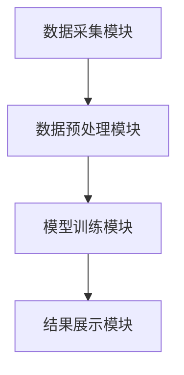

                 


# AI辅助的公司估值模型比较

> 关键词：AI技术，公司估值，机器学习，深度学习，算法原理，系统架构

> 摘要：本文深入探讨了AI技术在公司估值模型中的应用，从传统估值方法的局限性出发，分析了AI辅助模型的优势和核心概念，详细介绍了多种AI算法的原理及其在公司估值中的具体应用。文章还通过系统架构设计、项目实战和案例分析，展示了如何构建一个高效的AI辅助公司估值系统，并提出了最佳实践和注意事项。

---

## 第1章: 公司估值模型概述

### 1.1 公司估值的基本概念
公司估值是企业管理和投资决策中的重要环节，主要用于评估企业的市场价值或内在价值。传统公司估值方法包括DCF模型、EV/EBITDA倍数法、市盈率法等，这些方法通常依赖于财务数据和市场假设，存在数据获取难度大、假设过于简化、计算复杂等问题。

#### 1.1.1 公司估值的定义与意义
公司估值是指对企业的整体价值或部分价值进行评估的过程，其结果常用于企业并购、融资、上市定价等场景。准确的公司估值能够为投资者和企业管理者提供重要的决策依据。

#### 1.1.2 传统公司估值方法的局限性
传统估值方法依赖于财务数据和假设，可能无法充分考虑市场波动、行业趋势、企业战略等动态因素。此外，传统方法通常需要大量人工计算，效率较低。

#### 1.1.3 AI技术在公司估值中的潜力
AI技术能够处理海量数据，提取非结构化信息，并通过机器学习模型自动优化估值参数，显著提升了估值效率和准确性。

---

### 1.2 AI辅助的公司估值模型的优势
AI技术的引入使得公司估值模型更加灵活和高效，能够处理更多维度的数据，提高估值的准确性和鲁棒性。

#### 1.2.1 数据处理能力的提升
AI技术能够从文本、图像等非结构化数据中提取有价值的信息，丰富估值模型的输入维度。

#### 1.2.2 模型的自适应与优化
通过机器学习算法，AI辅助的估值模型能够自动适应市场变化，优化估值参数和假设。

#### 1.2.3 多维度分析的实现
AI技术可以同时考虑财务数据、市场趋势、行业动态等多个维度，提供更全面的估值结果。

---

### 1.3 本书的核心目标与范围
本书旨在通过AI技术的视角，深入分析和比较多种公司估值模型，探讨如何利用机器学习和深度学习技术提升公司估值的效率和准确性。

#### 1.3.1 本书的研究目标
通过比较和分析多种AI辅助的公司估值模型，总结其优缺点，为实际应用提供参考。

#### 1.3.2 本书的研究范围与边界
本书主要关注AI技术在公司估值中的应用，不涉及具体的财务分析方法和企业战略。

#### 1.3.3 本书的结构安排
本书分为背景介绍、核心概念、算法原理、系统架构、项目实战和最佳实践等部分，全面覆盖AI辅助公司估值模型的各个方面。

---

## 第2章: AI辅助的公司估值模型核心概念

### 2.1 公司估值模型的构成要素
AI辅助的公司估值模型通常包括以下要素：输入数据、模型假设、算法选择、参数优化和输出结果。

#### 2.1.1 估值目标与输入参数
输入参数包括企业的财务数据（如收入、利润）、市场数据（如行业指数）和宏观经济数据（如利率）。

#### 2.1.2 模型假设与约束条件
模型假设包括企业的未来增长率、现金流预测等，约束条件则包括数据的完整性和可靠性。

#### 2.1.3 输出结果与应用场景
输出结果包括企业的估值和敏感性分析，应用场景包括企业并购、融资决策等。

---

### 2.2 AI技术在模型中的应用
AI技术通过数据处理、特征提取和模型优化等步骤，显著提升了公司估值模型的性能。

#### 2.2.1 数据预处理与特征提取
AI技术能够从海量数据中提取关键特征，如市场情绪、行业趋势等。

#### 2.2.2 模型训练与优化
通过机器学习算法，AI模型能够自动优化估值参数和假设。

#### 2.2.3 结果解释与反馈机制
AI模型能够生成直观的可视化结果，并提供反馈机制以优化模型性能。

---

### 2.3 核心概念对比分析
通过对比分析，我们可以更好地理解不同AI辅助估值模型的特点和适用场景。

#### 2.3.1 传统模型与AI模型的对比
传统模型依赖于财务数据和假设，AI模型则能够处理更多维度的数据。

#### 2.3.2 不同AI模型的性能特征
不同AI模型在处理数据类型、计算效率和准确性方面存在差异。

#### 2.3.3 模型适用场景的对比分析
AI模型适用于数据量大、动态变化快的场景，传统模型则适用于数据简单、变化稳定的场景。

---

## 第3章: 常见AI算法在公司估值中的应用

### 3.1 机器学习算法
机器学习算法通过数据训练来优化模型参数，提升估值的准确性。

#### 3.1.1 线性回归模型
线性回归模型适用于简单的线性关系，但可能无法处理复杂的非线性数据。

#### 3.1.2 支持向量机（SVM）
SVM适用于分类问题，但在处理回归问题时表现一般。

#### 3.1.3 随机森林与梯度提升树
随机森林和梯度提升树能够处理高维数据，适合复杂的非线性关系。

#### 3.1.4 算法实现代码
以下是线性回归模型的Python代码示例：

```python
import numpy as np
from sklearn.linear_model import LinearRegression

# 生成数据
X = np.array([[1], [2], [3], [4], [5]])
y = np.array([2, 4, 5, 4, 6])

# 训练模型
model = LinearRegression()
model.fit(X, y)

# 预测
print(model.predict([[6]]))  # 输出：[7.8]
```

---

### 3.2 深度学习算法
深度学习算法通过多层神经网络提取数据特征，适用于复杂的非线性关系。

#### 3.2.1 神经网络基础
神经网络由输入层、隐藏层和输出层组成，能够处理复杂的模式识别任务。

#### 3.2.2 循环神经网络（RNN）
RNN适用于时间序列数据，如股票价格预测。

#### 3.2.3 Transformer模型与注意力机制
Transformer模型通过注意力机制捕捉数据中的长距离依赖关系，适合处理文本数据。

#### 3.2.4 算法实现代码
以下是RNN模型的Python代码示例：

```python
import tensorflow as tf
from tensorflow.keras import layers

# 定义模型
model = tf.keras.Sequential([
    layers.SimpleRNN(32, input_shape=(None, 1)),
    layers.Dense(1)
])

# 编译模型
model.compile(optimizer='adam', loss='mean_squared_error')

# 训练模型
model.fit(X_train, y_train, epochs=10, batch_size=32)
```

---

### 3.3 混合模型与集成学习
混合模型通过结合不同算法的优势，提升估值模型的准确性和鲁棒性。

#### 3.3.1 混合模型的定义与优势
混合模型通过集成学习算法，结合多个模型的结果，通常能够获得更好的性能。

#### 3.3.2 集成学习的原理与实现
集成学习通过投票法或加权法将多个模型的结果进行融合，适用于分类和回归问题。

#### 3.3.3 混合模型在公司估值中的应用
混合模型能够结合传统估值方法和AI模型的优势，提供更加准确的估值结果。

---

## 第4章: 公司估值模型的系统分析与架构设计

### 4.1 问题场景介绍
本章将通过一个具体的案例，介绍AI辅助公司估值系统的功能设计和架构实现。

#### 4.1.1 问题场景描述
假设我们希望构建一个能够实时估值的企业价值评估系统，系统需要处理大量的财务数据和市场数据。

#### 4.1.2 系统目标与需求分析
系统目标是实现高效的公司估值，需求包括数据采集、模型训练和结果展示。

---

### 4.2 系统功能设计
系统功能设计包括数据采集与预处理、模型训练与优化、结果展示与分析。

#### 4.2.1 数据采集与预处理
数据采集模块负责从数据库中获取财务数据和市场数据，预处理模块负责清洗数据和特征提取。

#### 4.2.2 模型训练与优化
模型训练模块负责训练AI模型，优化模块负责调整模型参数以提升性能。

#### 4.2.3 结果展示与分析
结果展示模块负责将估值结果以可视化的方式呈现，分析模块负责对结果进行解释和反馈。

---

### 4.3 系统架构设计
系统架构设计包括功能模块划分、系统架构图和接口设计。

#### 4.3.1 功能模块划分
系统功能模块包括数据采集模块、数据预处理模块、模型训练模块和结果展示模块。

#### 4.3.2 系统架构图
以下是系统架构的mermaid图：



#### 4.3.3 系统接口设计
系统接口包括数据输入接口、模型训练接口和结果展示接口。

---

### 4.4 系统交互设计
系统交互设计包括用户与系统的交互流程和反馈机制。

#### 4.4.1 用户与系统的交互流程
用户输入数据，系统进行处理并返回估值结果。

#### 4.4.2 系统反馈机制
系统通过可视化界面反馈估值结果和模型优化建议。

---

## 第5章: 项目实战

### 5.1 环境安装与配置
需要安装Python、TensorFlow和Scikit-learn等依赖库。

#### 5.1.1 安装Python环境
使用Anaconda安装Python 3.8及以上版本。

#### 5.1.2 安装依赖库
使用pip安装TensorFlow、Scikit-learn等库。

---

### 5.2 系统核心实现
以下是系统核心代码示例：

```python
import pandas as pd
from sklearn.linear_model import LinearRegression
from sklearn.metrics import mean_squared_error

# 数据加载
data = pd.read_csv('company_data.csv')

# 数据分割
X = data[['revenue', 'profit', 'industry_index']]
y = data['valuation']

# 模型训练
model = LinearRegression()
model.fit(X, y)

# 模型预测
y_pred = model.predict(X)
print(mean_squared_error(y, y_pred))
```

---

### 5.3 案例分析与结果解读
通过具体案例分析，展示AI辅助模型的估值效果和准确性。

#### 5.3.1 数据分析
通过对历史数据的分析，提取关键特征并进行建模。

#### 5.3.2 模型评估
通过均方误差（MSE）和决定系数（R²）等指标评估模型性能。

---

## 第6章: 最佳实践与注意事项

### 6.1 最佳实践
#### 6.1.1 数据质量的重要性
确保数据的完整性和准确性，避免噪声数据的影响。

#### 6.1.2 模型的可解释性
选择可解释的模型，便于结果分析和决策制定。

#### 6.1.3 模型的持续优化
定期更新模型参数和数据，保持模型的准确性。

---

### 6.2 小结
AI技术为公司估值模型带来了新的可能性，但也需要注意数据质量和模型优化等问题。

---

### 6.3 注意事项
#### 6.3.1 数据隐私与安全
确保数据的安全性和隐私性，遵守相关法律法规。

#### 6.3.2 模型的适用性
选择适合具体应用场景的模型，避免盲目使用复杂算法。

#### 6.3.3 模型的维护与更新
定期检查和更新模型，确保其适应市场变化。

---

## 第7章: 拓展阅读与进一步思考

### 7.1 拓展阅读
#### 7.1.1 推荐书籍
1. 《机器学习实战》
2. 《深度学习入门：基于Python的理论与实现》

#### 7.1.2 推荐博客与技术文档
1. TensorFlow官方文档
2. Keras官方文档

---

### 7.2 进一步思考
AI技术在公司估值中的应用前景广阔，未来可以进一步探索多模态数据的融合、模型的实时更新和分布式计算等方向。

---

## 第8章: 总结与展望

### 8.1 总结
本文系统地介绍了AI辅助的公司估值模型，分析了传统估值方法的局限性和AI技术的优势，详细讲解了多种AI算法及其在公司估值中的应用。

### 8.2 展望
未来，随着AI技术的不断发展，公司估值模型将更加智能化和个性化，为企业的管理和投资决策提供更有力的支持。

---

以上是文章的详细大纲，您可以根据需要进行调整和补充。

