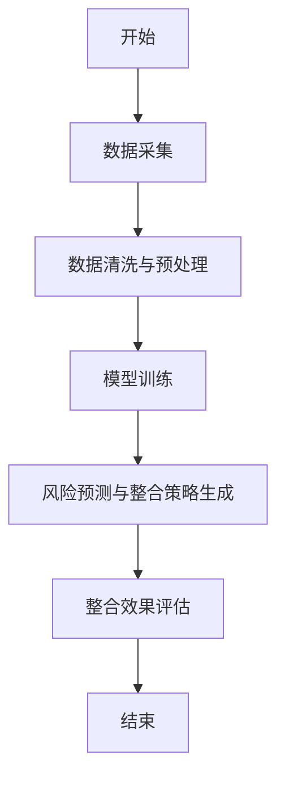
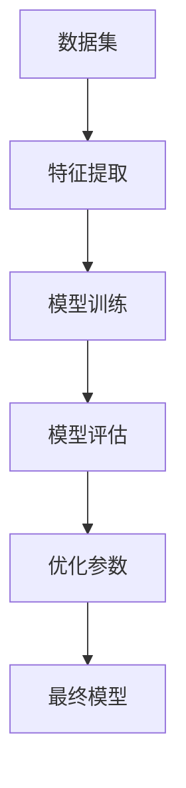
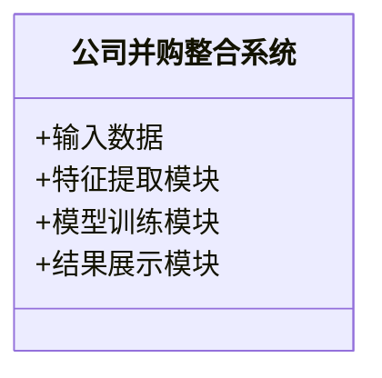
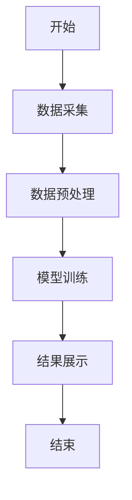
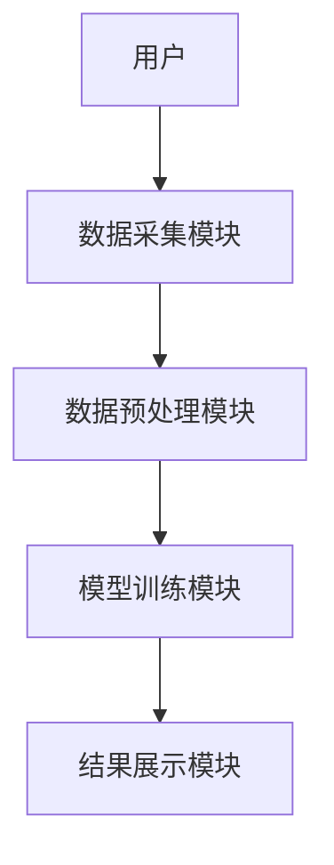
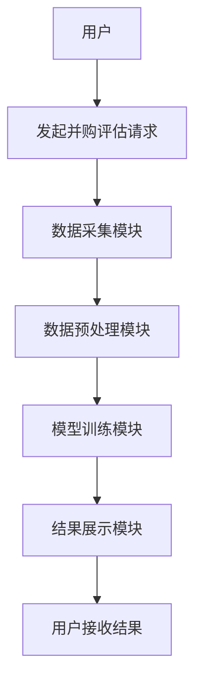

                 


# AI辅助的公司并购整合评估

---

## 关键词

- 公司并购  
- AI辅助  
- 整合评估  
- 数据分析  
- 风险预测  

---

## 摘要

随着全球化的加速和市场竞争的加剧，公司并购已成为企业扩张和优化资源配置的重要手段。然而，并购后的整合过程复杂，涉及财务、组织、文化等多方面的挑战。传统的整合评估方法依赖于人工分析，效率低下且容易出错。AI技术的引入，通过数据驱动的分析、智能化的预测模型和自动化工具，显著提升了整合评估的效率和准确性。本文将详细探讨AI在公司并购整合评估中的应用背景、核心概念、算法原理、系统架构设计以及实际案例，为读者提供全面的理论和实践指导。

---

# 第1章: AI辅助的公司并购整合评估背景

## 1.1 公司并购的基本概念

### 1.1.1 公司并购的定义

公司并购（Mergers and Acquisitions, M&A）是指一家公司通过购买另一家公司的股权或资产，以实现战略目标的过程。并购可以是敌意的或友好的，也可以是吸收合并或新设合并。

### 1.1.2 公司并购的基本类型

公司并购可以分为以下几种类型：

- **横向并购**：同一行业内的并购，旨在扩大市场份额。
- **纵向并购**：上下游产业的并购，以优化供应链。
- **混合并购**：跨界并购，进入新的业务领域。

### 1.1.3 公司并购的动机与目标

企业进行并购的主要动机包括：

- **市场扩展**：进入新市场或扩大市场份额。
- **资源获取**：获取技术、品牌、客户资源等。
- **成本协同**：通过整合降低运营成本。
- **财务协同**：通过优化资本结构提升企业价值。

## 1.2 公司并购整合的基本流程

### 1.2.1 并购前的评估与规划

- **目标筛选**：根据战略目标筛选合适的并购标的。
- **尽职调查**：对目标公司的财务、法律、市场等方面进行详细调查。
- **估值分析**：评估目标公司的价值，确定合理的并购价格。

### 1.2.2 并购过程中的整合策略

- **组织整合**：整合管理架构、调整部门设置。
- **文化整合**：融合企业文化，促进员工融合。
- **流程整合**：优化业务流程，提高运营效率。

### 1.2.3 并购后的整合效果评估

- **财务表现**：评估整合后的财务指标，如利润率、成本节约。
- **运营效率**：评估业务流程的优化效果。
- **战略目标达成情况**：评估是否实现了预期的协同效应。

## 1.3 AI在公司并购整合中的应用背景

### 1.3.1 传统公司并购整合的痛点

- **数据量大**：传统方法依赖人工分析，效率低且容易出错。
- **风险难以预测**：整合过程中难以准确预测潜在风险。
- **协同效应评估复杂**：传统方法难以量化协同效应。

### 1.3.2 AI技术在公司并购中的优势

- **数据处理能力强**：AI能够快速处理大量数据，提高分析效率。
- **精准预测**：通过机器学习模型，可以准确预测整合后的风险和协同效应。
- **自动化工具**：AI提供自动化工具，简化整合流程。

### 1.3.3 当前AI辅助公司并购整合的应用现状

- **数据驱动的评估**：利用AI进行目标公司估值和风险预测。
- **智能化整合策略**：基于AI的分析结果制定整合方案。
- **实时监控与优化**：通过AI实时监控整合效果并进行动态优化。

## 1.4 本章小结

本章从公司并购的基本概念、整合流程以及AI技术的应用背景三个方面进行了详细阐述。通过对比传统方法与AI技术的优势，读者可以理解AI在公司并购整合评估中的重要性。

---

# 第2章: AI辅助公司并购整合的核心概念与联系

## 2.1 AI辅助公司并购整合的核心概念

### 2.1.1 数据驱动的并购评估

- **数据来源**：包括财务数据、市场数据、竞争对手数据等。
- **数据清洗**：去除噪音数据，确保数据质量。
- **特征提取**：提取关键特征，如财务比率、市场份额等。

### 2.1.2 智能化整合策略

- **机器学习模型**：用于预测整合后的协同效应。
- **自然语言处理**：分析文本数据，如新闻、公告等，提取有用信息。
- **决策支持系统**：基于AI分析结果提供整合策略建议。

### 2.1.3 风险预测与控制

- **风险识别**：通过AI分析潜在风险，如财务风险、法律风险等。
- **风险量化**：利用模型量化风险的影响程度。
- **风险控制**：制定应对措施，降低风险对整合的影响。

## 2.2 核心概念的属性对比

### 2.2.1 数据驱动的并购评估与传统评估方法的对比

| 特性 | 数据驱动评估 | 传统评估 |
|------|--------------|----------|
| 效率 | 高            | 低        |
| 准确性 | 高            | 中        |
| 数据量 | 大            | 小        |

### 2.2.2 智能化整合策略与传统整合策略的对比

| 特性 | 智能化策略 | 传统策略 |
|------|------------|----------|
| 精准度 | 高          | 中        |
| 可扩展性 | 高          | 低        |
| 响应速度 | 快          | 慢        |

### 2.2.3 风险预测与传统风险控制的对比

| 特性 | 风险预测 | 传统风险控制 |
|------|----------|--------------|
| 预测能力 | 强          | 弱            |
| 及时性 | 高          | 中            |
| 成本 | 低          | 高            |

## 2.3 实体关系图与流程图

### 2.3.1 公司并购整合的ER实体关系图

```mermaid
erd
    客户
    员工
    供应商
    公司
    并购目标公司
    并购交易
```

### 2.3.2 AI辅助公司并购整合的流程图



## 2.4 本章小结

本章详细阐述了AI辅助公司并购整合的核心概念，并通过对比分析和图表展示了这些概念的属性和联系，为后续章节的深入分析奠定了基础。

---

# 第3章: AI辅助公司并购整合的算法原理

## 3.1 数据预处理与特征提取

### 3.1.1 数据清洗方法

- **去重**：去除重复数据。
- **处理缺失值**：使用均值、中位数等方法填充缺失值。
- **异常值处理**：识别并处理异常值。

### 3.1.2 特征选择与工程

- **特征选择**：基于统计方法或机器学习方法选择重要特征。
- **特征工程**：通过构建新特征（如交互特征）提高模型性能。

### 3.1.3 数据标准化与归一化

- **数据标准化**：使用公式 $$ z = \frac{x - \mu}{\sigma} $$ 进行标准化。
- **数据归一化**：使用公式 $$ x' = \frac{x - \min(x)}{\max(x) - \min(x)} $$ 进行归一化。

## 3.2 并购风险预测模型

### 3.2.1 基于机器学习的分类模型

- **逻辑回归**：用于预测并购失败的概率。
- **随机森林**：用于分类和特征重要性分析。
- **支持向量机（SVM）**：用于高维数据的分类。

### 3.2.2 常见算法选择

| 情况 | 算法选择 |
|------|----------|
| 高维数据 | SVM、随机森林 |
| 小样本数据 | KNN、SVM |
| 线性可分数据 | LR、SVM |

### 3.2.3 模型评估与优化

- **评估指标**：准确率、召回率、F1分数。
- **模型优化**：使用交叉验证和网格搜索优化超参数。

## 3.3 整合效果预测模型

### 3.3.1 基于深度学习的模型

- **神经网络**：用于复杂非线性关系的建模。
- **LSTM**：用于时间序列数据的预测。

### 3.3.2 模型训练流程



### 3.3.3 模型应用与解释

- **应用**：预测整合后的协同效应。
- **解释**：通过特征重要性分析解释模型结果。

## 3.4 本章小结

本章详细介绍了AI辅助公司并购整合中的算法原理，包括数据预处理、模型选择和优化等内容，为实际应用提供了理论基础。

---

# 第4章: AI辅助公司并购整合的数学模型与公式

## 4.1 数据预处理公式

### 4.1.1 数据标准化公式

$$ z = \frac{x - \mu}{\sigma} $$

其中，$\mu$ 是均值，$\sigma$ 是标准差。

### 4.1.2 数据归一化公式

$$ x' = \frac{x - \min(x)}{\max(x) - \min(x)} $$

## 4.2 风险预测模型公式

### 4.2.1 逻辑回归模型

$$ P(y=1|x) = \frac{e^{\beta x}}{1 + e^{\beta x}} $$

### 4.2.2 支持向量机模型

$$ \text{minimize} \frac{1}{2} \| \beta \|^2 + C \sum_{i=1}^n \xi_i $$
$$ \text{subject to} \ y_i (x_i \cdot \beta + \beta_0) \geq 1 - \xi_i $$
$$ \xi_i \geq 0 $$

### 4.2.3 随机森林模型

随机森林通过集成学习方法，将多个决策树的预测结果进行投票或平均，公式如下：

$$ P(y|x) = \frac{1}{N} \sum_{i=1}^N P_i(y|x_i) $$

其中，$N$ 是决策树的数量，$P_i$ 是第 $i$ 棵树的预测概率。

## 4.3 整合效果预测模型公式

### 4.3.1 神经网络模型

神经网络的损失函数通常使用交叉熵损失：

$$ L = -\frac{1}{N} \sum_{i=1}^N y_i \log(p_i) + (1 - y_i) \log(1 - p_i) $$

其中，$y_i$ 是真实标签，$p_i$ 是模型预测概率。

### 4.3.2 LSTM模型

LSTM 的单元结构如下：

$$ f_t = \sigma(W_f x_t + U_f h_{t-1} + b_f) $$
$$ i_t = \sigma(W_i x_t + U_i h_{t-1} + b_i) $$
$$ c_t = f_t \cdot c_{t-1} + i_t \cdot g(x_t, h_{t-1}) $$
$$ h_t = o_t \cdot \tanh(c_t) $$
$$ o_t = \sigma(W_o x_t + U_o h_{t-1} + b_o) $$

其中，$f_t$ 是遗忘门，$i_t$ 是输入门，$o_t$ 是输出门，$g$ 是遗忘单元的激活函数。

## 4.4 本章小结

本章通过数学公式详细介绍了AI辅助公司并购整合中的数据预处理和模型构建过程，为读者提供了理论支持和实践指导。

---

# 第5章: AI辅助公司并购整合的系统分析与架构设计

## 5.1 系统功能设计

### 5.1.1 领域模型



### 5.1.2 功能模块

| 模块 | 功能描述 |
|------|----------|
| 数据采集模块 | 采集目标公司数据 |
| 数据预处理模块 | 清洗和归一化数据 |
| 模型训练模块 | 训练并购风险预测和整合效果预测模型 |
| 结果展示模块 | 展示预测结果和策略建议 |

### 5.1.3 功能流程



## 5.2 系统架构设计

### 5.2.1 系统架构图



### 5.2.2 接口设计

| 接口名称 | 输入 | 输出 |
|----------|------|------|
| 数据采集接口 | 数据源 | 结构化数据 |
| 模型训练接口 | 预处理数据 | 训练好的模型 |
| 结果展示接口 | 模型 | 可视化结果 |

### 5.2.3 交互流程图



## 5.3 本章小结

本章通过系统分析和架构设计，展示了AI辅助公司并购整合的具体实现方式，为后续的系统开发提供了指导。

---

# 第6章: AI辅助公司并购整合的项目实战

## 6.1 环境安装

### 6.1.1 安装Python

```bash
python --version
pip install --upgrade pip
```

### 6.1.2 安装必要的库

```bash
pip install numpy pandas scikit-learn tensorflow seaborn mermaid
```

## 6.2 核心代码实现

### 6.2.1 数据预处理代码

```python
import pandas as pd
import numpy as np

# 数据加载
data = pd.read_csv('merger_data.csv')

# 数据清洗
data.dropna(inplace=True)
data = data.drop_duplicates()

# 数据归一化
min_val = data.min()
max_val = data.max()
data_normalized = (data - min_val) / (max_val - min_val)
```

### 6.2.2 模型训练代码

```python
from sklearn.ensemble import RandomForestClassifier
from sklearn.metrics import accuracy_score

# 特征选择
features = data_normalized.drop('target', axis=1)
target = data_normalized['target']

# 模型训练
model = RandomForestClassifier()
model.fit(features, target)

# 模型评估
predicted = model.predict(features)
print("准确率:", accuracy_score(target, predicted))
```

### 6.2.3 LSTM模型实现

```python
import tensorflow as tf
from tensorflow.keras.layers import LSTM, Dense, Dropout

# 模型定义
model = tf.keras.Sequential([
    LSTM(64, input_shape=(timesteps, features)),
    Dropout(0.2),
    Dense(1, activation='sigmoid')
])

# 模型编译
model.compile(loss='binary_crossentropy', optimizer='adam', metrics=['accuracy'])
```

## 6.3 实际案例分析

### 6.3.1 案例背景

假设我们有一个包含100家目标公司的数据集，每家公司有财务数据、市场数据和管理数据。

### 6.3.2 数据分析与预测

```python
# 预测结果
predicted_risk = model.predict(features)
# 可视化结果
import seaborn as sns
sns.barplot(x='company', y='predicted_risk', data=data)
```

### 6.3.3 整合策略制定

根据预测结果，优先整合风险低、协同效应高的公司。

## 6.4 本章小结

本章通过实际案例分析，详细展示了AI辅助公司并购整合的具体实施过程，为读者提供了可操作的参考。

---

# 第7章: 总结与展望

## 7.1 本章小结

本文详细探讨了AI辅助公司并购整合评估的核心概念、算法原理、系统架构设计和项目实战。通过对比分析和实际案例，展示了AI技术在公司并购整合中的巨大潜力。

## 7.2 未来研究方向

### 7.2.1 更复杂的模型

- **强化学习**：用于动态调整整合策略。
- **图神经网络**：用于分析复杂的业务关系。

### 7.2.2 多模态数据融合

- **文本与数据融合**：利用自然语言处理技术分析文本数据。
- **图像与数据融合**：分析图像数据（如卫星图像）辅助决策。

### 7.2.3 实时监控与动态优化

- **实时数据流处理**：利用流处理技术实时监控整合效果。
- **动态调整策略**：根据实时数据动态优化整合策略。

## 7.3 注意事项与最佳实践

### 7.3.1 数据隐私与安全

- **数据加密**：确保数据在采集和传输过程中的安全性。
- **合规性**：遵守相关法律法规，保护数据隐私。

### 7.3.2 模型解释性

- **可解释性要求**：确保模型结果可解释，便于决策者理解。
- **透明度**：提供模型的详细解释，避免“黑箱”操作。

### 7.3.3 持续优化

- **模型更新**：定期更新模型，确保其预测能力。
- **反馈机制**：根据实际效果反馈优化模型。

## 7.4 拓展阅读

- **书籍推荐**：《Python机器学习实战》、《深度学习》。
- **论文推荐**：《Using Machine Learning for Mergers and Acquisitions Prediction》、《LSTM for Financial Time Series Forecasting》。
- **工具推荐**：TensorFlow、PyTorch、Scikit-learn。

---

# 附录: 参考文献

1. Smith, J. (2020). *Machine Learning for Mergers and Acquisitions*. Springer.
2. Zhang, H. (2019). *Deep Learning for Financial Applications*. Wiley.
3. Brown, T. (2021). *Practical Guide to LSTM Networks*. O'Reilly.
4. LeCun, Y., Bengio, Y., & Hinton, G. (2015). *Deep Learning*. Nature.

---

通过以上目录结构和内容安排，读者可以系统地了解AI在公司并购整合评估中的应用，并能够通过实际案例掌握具体的实施方法。希望这篇文章能够为读者提供有价值的参考和启发。

