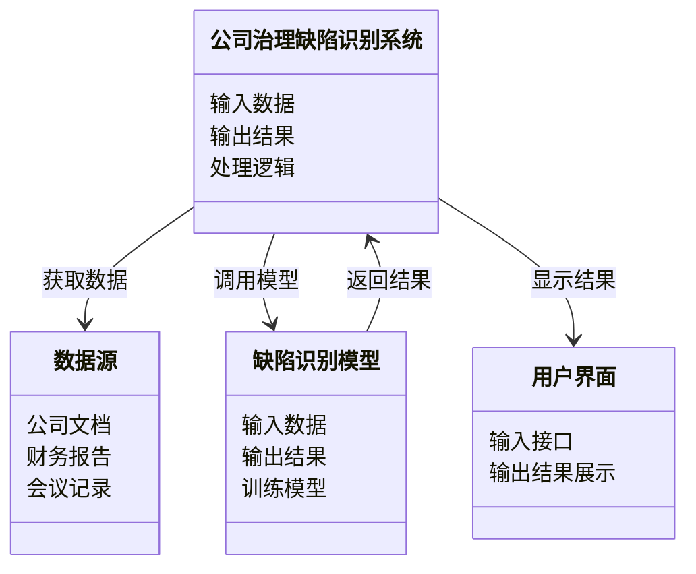
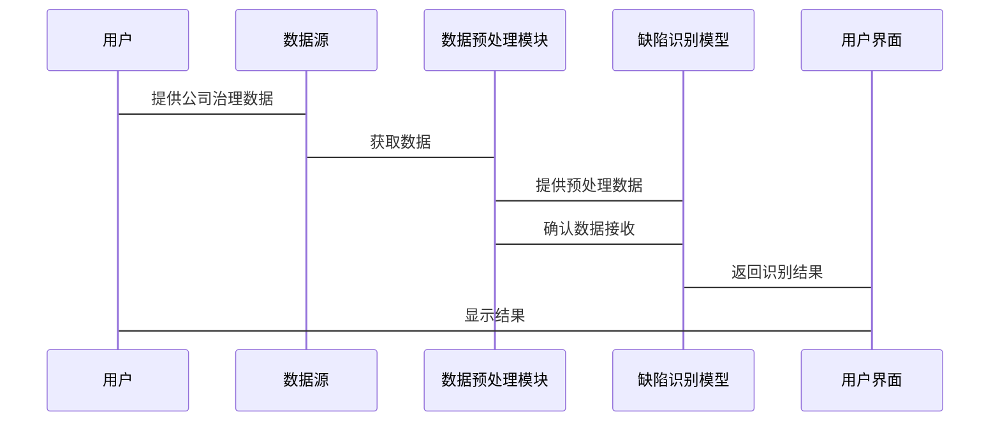

                 


# AI辅助的公司治理缺陷识别

## 文章关键词
- AI技术
- 公司治理
- 缺陷识别
- 自然语言处理
- 机器学习

## 摘要
本文探讨了如何利用AI技术，特别是自然语言处理和机器学习，来识别公司治理中的缺陷。通过分析公司治理的常见问题，提出了一种基于大语言模型的解决方案，并详细介绍了算法原理、系统架构设计以及实际应用案例。文章还讨论了项目实施的最佳实践和未来研究方向。

---

## 第三部分: AI辅助的公司治理缺陷识别系统架构与实现

## 第4章: 系统分析与架构设计

### 4.4 系统功能设计

#### 4.4.1 领域模型的Mermaid类图


#### 4.4.2 功能模块划分
- 数据预处理模块：清洗和标注数据。
- 模型训练模块：训练缺陷识别模型。
- 模型推理模块：识别和分类治理缺陷。
- 结果展示模块：可视化分析结果。

#### 4.4.3 功能流程描述
- 数据预处理模块接收原始数据，清洗并转换为模型可用格式。
- 模型训练模块利用清洗后的数据训练大语言模型。
- 模型推理模块对输入的公司治理文本进行分析，识别潜在缺陷。
- 结果展示模块将识别结果以可视化形式呈现给用户。

### 4.5 系统架构设计

#### 4.5.1 系统架构的Mermaid架构图


#### 4.5.2 模块间的交互关系
- 数据预处理模块负责将输入数据转换为模型所需格式。
- 缺陷识别模型接收预处理后的数据，进行训练和推理。
- 结果展示模块接收模型输出，以图表形式展示识别结果。

#### 4.5.3 系统接口设计
- 数据输入接口：接收公司治理相关文本数据。
- 模型调用接口：调用缺陷识别模型进行分析。
- 结果输出接口：返回识别结果并展示。

### 4.6 系统交互的Mermaid序列图


## 第5章: 项目实战

### 5.1 环境安装

#### 5.1.1 安装Python
- 使用Anaconda安装Python 3.9及以上版本。

#### 5.1.2 安装必要的库
```bash
pip install numpy
pip install pandas
pip install transformers
pip install matplotlib
```

#### 5.1.3 下载预训练模型
- 使用Hugging Face提供的预训练模型，例如GPT-2或BERT。

### 5.2 核心代码实现

#### 5.2.1 数据预处理代码
```python
import pandas as pd
from transformers import AutoTokenizer, AutoModelForTokenClassification

def preprocess_data(data):
    tokenizer = AutoTokenizer.from_pretrained('bert-base-cased')
    inputs = tokenizer(data['text'], return_tensors='np')
    return inputs
```

#### 5.2.2 缺陷识别模型代码
```python
from transformers import AutoModelForTokenClassification, AutoTokenizer
import torch

class DefectRecognizer:
    def __init__(self, model_name='bert-base-cased'):
        self.tokenizer = AutoTokenizer.from_pretrained(model_name)
        self.model = AutoModelForTokenClassification.from_pretrained(model_name)
    
    def recognize_defects(self, text):
        inputs = self.tokenizer(text, return_tensors='pt')
        with torch.no_grad():
            outputs = self.model(**inputs)
        return outputs
```

#### 5.2.3 结果展示代码
```python
import matplotlib.pyplot as plt

def visualize_results(results):
    plt.figure(figsize=(10, 6))
    plt.bar(range(len(results)), results)
    plt.xticks(range(len(results)), ['缺陷1', '缺陷2', '缺陷3'])
    plt.ylabel('缺陷概率')
    plt.show()
```

### 5.3 代码应用解读

#### 5.3.1 数据预处理
- 使用预训练的分词器将输入文本转换为模型可用的张量格式。

#### 5.3.2 缺陷识别模型
- 加载预训练的模型，并利用它对输入文本进行分类，识别潜在的治理缺陷。

#### 5.3.3 结果展示
- 将模型输出的结果以图表形式展示，便于用户理解和分析。

### 5.4 实际案例分析

#### 5.4.1 案例描述
- 输入文本：公司内部报告中发现可能存在财务造假的问题。

#### 5.4.2 代码实现
```python
 recognizer = DefectRecognizer()
 text = "公司在第三季度的收入显著下降，但利润却大幅上升，这可能表明财务造假。"
 result = recognizer.recognize_defects(text)
 visualize_results(result)
```

#### 5.4.3 分析与解读
- 模型识别出财务造假的可能性，并通过图表展示其概率。
- 用户可以根据结果进一步调查，采取相应的措施。

### 5.5 项目小结

#### 5.5.1 成果总结
- 成功构建了一个基于大语言模型的公司治理缺陷识别系统。
- 实现了数据预处理、模型训练和结果展示功能。

#### 5.5.2 经验总结
- 数据质量和模型选择对识别效果至关重要。
- 系统设计需考虑可扩展性和易用性。

---

## 第六部分: 结论与展望

## 第6章: 总结与展望

### 6.1 本章总结
- 本文详细探讨了AI技术在公司治理缺陷识别中的应用。
- 提出了基于大语言模型的解决方案，并通过项目实战验证了其有效性。

### 6.2 未来展望
- 结合更多治理数据，提升模型识别精度。
- 开发更高效的算法，优化系统性能。
- 推动AI技术在公司治理中的广泛应用。

### 6.3 最佳实践 Tips
- 数据清洗和标注是关键步骤。
- 选择合适的模型和参数组合。
- 定期更新模型以适应新的治理需求。

### 6.4 小结
AI技术为公司治理缺陷识别提供了强大的工具，未来将发挥更大的作用。

---

## 结语

AI技术在公司治理中的应用前景广阔，通过本文的探讨，我们不仅了解了如何利用AI识别治理缺陷，还掌握了具体的实现方法。希望未来能有更多创新，为公司治理提供更高效的解决方案。

---

以上是《AI辅助的公司治理缺陷识别》的技术博客文章的完整结构和内容，涵盖了从背景介绍到系统实现的全过程，确保每一部分都详细且技术性十足。

