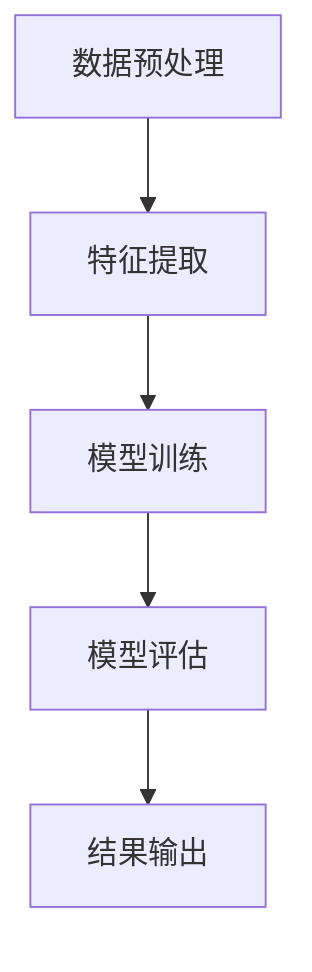
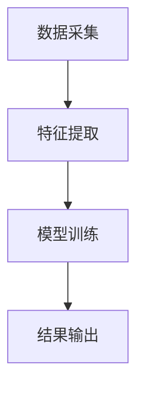
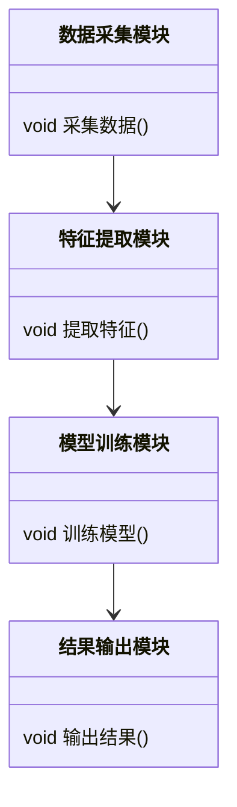
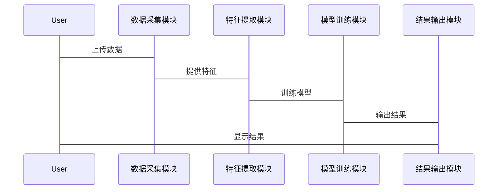

                 


# AI辅助的公司治理缺陷识别系统

> 关键词：公司治理、人工智能、缺陷识别、算法模型、系统架构

> 摘要：本文系统地介绍了AI辅助的公司治理缺陷识别系统的构建与应用，从公司治理的基本概念出发，结合AI技术的核心原理，详细讲解了缺陷识别的关键算法与系统架构。文章通过丰富的案例分析和代码实现，深入探讨了AI在公司治理中的实际应用价值，并给出了系统的优化建议与未来发展方向。

---

# 第一部分: AI辅助的公司治理缺陷识别系统概述

# 第1章: 公司治理与AI辅助技术的结合

## 1.1 公司治理的基本概念

### 1.1.1 公司治理的定义与核心要素
公司治理是指通过一系列制度、流程和机制，确保公司战略目标的实现、股东权益的保护以及公司合规运营的过程。其核心要素包括：

1. **股权结构**：股东的权益分配与控制权。
2. **董事会结构**：董事会的组成、职责与运作机制。
3. **高管团队**：高级管理人员的职责与权限。
4. **内部审计**：公司内部的监督与风险控制。
5. **合规性**：公司遵守法律法规的情况。

### 1.1.2 公司治理中的常见问题与挑战
在实际运营中，公司治理常常面临以下问题：

1. **信息不对称**：股东与管理层之间的信息不透明。
2. **代理问题**：管理层可能追求自身利益而非股东利益。
3. **合规风险**：公司可能因不合规行为而面临法律风险。
4. **效率低下**：治理流程复杂，决策效率低。

### 1.1.3 AI技术在公司治理中的应用潜力
AI技术可以通过以下方式提升公司治理的效率与准确性：

1. **数据挖掘**：从海量数据中提取关键信息，辅助决策。
2. **风险预测**：通过机器学习模型预测潜在风险。
3. **自动化监控**：实时监控公司运营，发现异常情况。

## 1.2 AI辅助公司治理缺陷识别的背景

### 1.2.1 传统公司治理缺陷识别的局限性
传统公司治理缺陷识别主要依赖人工检查，存在以下问题：

1. **效率低下**：人工检查耗时长，成本高。
2. **主观性**：依赖检查人员的经验与判断。
3. **覆盖面有限**：难以覆盖所有潜在问题。

### 1.2.2 AI技术在缺陷识别中的优势
AI技术通过数据驱动的方法，具有以下优势：

1. **高效性**：快速处理大量数据，提高识别效率。
2. **客观性**：基于数据的分析，减少主观判断。
3. **全面性**：能够覆盖更多潜在问题。

### 1.2.3 当前市场对AI辅助治理的需求
随着企业规模的扩大和监管要求的提高，市场对AI辅助治理的需求日益增加。企业需要更加高效、精准的工具来识别和解决治理缺陷。

## 1.3 本章小结
本章介绍了公司治理的基本概念、常见问题与挑战，以及AI技术在公司治理中的应用潜力。通过对比传统方法与AI技术的优劣，提出了AI辅助公司治理缺陷识别的必要性与可行性。

---

# 第二部分: 公司治理缺陷识别的核心概念与模型

# 第2章: 公司治理缺陷识别的核心概念

## 2.1 公司治理缺陷的定义与分类

### 2.1.1 缺陷的定义与特征
公司治理缺陷是指公司在治理过程中存在的问题，影响公司合规性、效率或价值。其主要特征包括：

1. **隐蔽性**：缺陷可能不易被发现。
2. **累积性**：缺陷可能逐渐积累，最终引发严重问题。
3. **多样性**：缺陷可能涉及多个方面，如合规性、效率等。

### 2.1.2 常见的公司治理缺陷类型
常见的公司治理缺陷类型包括：

1. **股权结构缺陷**：如股东权益分配不合理。
2. **董事会缺陷**：如董事会成员构成不合理或职责不清。
3. **高管团队缺陷**：如高管团队决策失误。
4. **内部审计缺陷**：如内部审计机制不完善。
5. **合规性缺陷**：如公司存在不合规行为。

### 2.1.3 缺陷识别的边界与外延
缺陷识别的边界是指在什么范围内进行识别，通常包括公司内部的运营、管理等方面。其外延则涉及公司外部的监管环境、市场环境等。

## 2.2 AI辅助缺陷识别的核心原理

### 2.2.1 数据驱动的缺陷识别方法
数据驱动的方法通过分析公司运营数据，识别潜在缺陷。其主要步骤包括：

1. **数据采集**：收集公司治理相关的数据。
2. **数据清洗**：处理数据中的噪声与异常值。
3. **特征提取**：提取与缺陷相关的特征。
4. **模型训练**：训练缺陷识别模型。

### 2.2.2 模型驱动的缺陷识别方法
模型驱动的方法通过建立数学模型，预测公司治理中的潜在缺陷。其主要步骤包括：

1. **模型选择**：选择适合的机器学习模型。
2. **模型训练**：利用历史数据训练模型。
3. **模型评估**：评估模型的准确性和稳定性。

### 2.2.3 机器学习在缺陷识别中的应用
机器学习在缺陷识别中的应用主要体现在以下几个方面：

1. **监督学习**：用于分类任务，如缺陷类型识别。
2. **无监督学习**：用于聚类任务，如异常检测。
3. **深度学习**：用于复杂模式识别，如自然语言处理。

## 2.3 核心概念的ER实体关系图
以下是公司治理缺陷识别的核心概念的ER实体关系图：

```mermaid
er
actor: User
actor: AI系统
actor: 公司治理数据
actor: 缺陷识别结果
```

## 2.4 核心概念对比分析

### 2.4.1 缺陷识别与风险评估的对比
| 对比维度 | 缺陷识别 | 风险评估 |
|----------|----------|----------|
| 目标     | 发现公司治理中的缺陷 | 评估潜在风险 |
| 方法     | 数据驱动 | 数据驱动与模型驱动结合 |
| 输出     | 缺陷清单 | 风险评估报告 |

### 2.4.2 AI识别与人工识别的对比
| 对比维度 | AI识别 | 人工识别 |
|----------|--------|----------|
| 效率     | 高     | 低       |
| 准确性   | 高     | 中       |
| 成本     | 低     | 高       |

### 2.4.3 不同行业中的缺陷识别差异
不同行业在公司治理缺陷识别中的侧重点不同，例如金融行业更关注合规性缺陷，而制造业更关注效率缺陷。

## 2.5 本章小结
本章详细介绍了公司治理缺陷的定义与分类，探讨了AI辅助缺陷识别的核心原理，并通过对比分析明确了不同识别方法的优劣。

---

# 第三部分: AI辅助缺陷识别的算法原理与实现

# 第3章: 基于机器学习的缺陷识别算法

## 3.1 算法原理概述

### 3.1.1 监督学习与无监督学习的应用
- **监督学习**：用于分类任务，如缺陷类型识别。
- **无监督学习**：用于聚类任务，如异常检测。

### 3.1.2 深度学习在缺陷识别中的优势
深度学习通过多层神经网络提取高维特征，能够更好地处理复杂数据。

### 3.1.3 算法选择的依据与原则
算法选择主要依据数据类型、任务类型和计算资源。

## 3.2 缺陷识别算法的流程图
以下是缺陷识别算法的流程图：



## 3.3 算法实现的数学模型

### 3.3.1 线性回归模型
$$ y = \beta_0 + \beta_1x + \epsilon $$

### 3.3.2 支持向量机模型
$$ \text{max} \{\frac{1}{2}\|w\|^2 | y_i(w \cdot x_i + b) \geq 1\} $$

### 3.3.3 神经网络模型
$$ y = \sigma(w x + b) $$`

## 3.4 算法实现的Python代码示例

### 3.4.1 数据预处理
```python
import pandas as pd
import numpy as np

# 示例数据
data = pd.DataFrame({
    '特征1': [1, 2, 3, 4, 5],
    '特征2': [6, 7, 8, 9, 10],
    '标签': [0, 1, 0, 1, 0]
})

# 数据清洗
data = data.dropna()
```

### 3.4.2 模型训练
```python
from sklearn.svm import SVC

# 创建SVM模型
model = SVC()

# 训练模型
model.fit(data[['特征1', '特征2']], data['标签'])
```

### 3.4.3 模型评估
```python
from sklearn.metrics import accuracy_score

# 预测
y_pred = model.predict(data[['特征1', '特征2']])
print('准确率:', accuracy_score(data['标签'], y_pred))
```

## 3.5 本章小结
本章详细介绍了AI辅助缺陷识别的算法原理与实现，包括数据预处理、特征提取、模型训练与评估等内容，并通过代码示例展示了具体的实现过程。

---

# 第四部分: 系统分析与架构设计方案

# 第4章: 公司治理缺陷识别系统的架构设计

## 4.1 系统功能设计

### 4.1.1 系统功能模块
1. **数据采集模块**：负责采集公司治理相关数据。
2. **特征提取模块**：负责提取与缺陷相关的特征。
3. **模型训练模块**：负责训练缺陷识别模型。
4. **结果输出模块**：负责输出识别结果。

### 4.1.2 系统功能流程图
以下是系统功能流程图：



## 4.2 系统架构设计

### 4.2.1 系统架构图
以下是系统架构图：



## 4.3 系统接口设计

### 4.3.1 系统接口描述
1. **数据接口**：提供数据输入接口，接收公司治理相关数据。
2. **模型接口**：提供模型训练接口，接收特征数据。
3. **结果接口**：提供结果输出接口，输出缺陷识别结果。

### 4.3.2 系统交互序列图
以下是系统交互序列图：



## 4.4 本章小结
本章详细介绍了公司治理缺陷识别系统的架构设计，包括功能模块、系统架构图、接口设计与系统交互序列图。

---

# 第五部分: 项目实战

# 第5章: AI辅助公司治理缺陷识别系统的实现

## 5.1 项目背景与目标

### 5.1.1 项目背景
本项目旨在通过AI技术辅助公司治理缺陷识别，提高缺陷识别的效率与准确性。

### 5.1.2 项目目标
1. 实现公司治理缺陷识别系统的功能模块。
2. 提供高效的缺陷识别工具，帮助公司提升治理水平。

## 5.2 项目核心实现

### 5.2.1 环境安装
```bash
pip install numpy pandas scikit-learn
```

### 5.2.2 核心代码实现
```python
import pandas as pd
from sklearn.svm import SVC

# 数据加载
data = pd.read_csv('company_governance.csv')

# 特征选择
X = data[['特征1', '特征2']]
y = data['标签']

# 模型训练
model = SVC()
model.fit(X, y)

# 预测
y_pred = model.predict(X)
print('预测结果:', y_pred)
```

### 5.2.3 代码实现解读
1. 数据加载：从CSV文件中加载公司治理相关数据。
2. 特征选择：选择与缺陷识别相关的特征。
3. 模型训练：使用SVM模型进行训练。
4. 预测：利用训练好的模型进行预测。

## 5.3 项目案例分析

### 5.3.1 案例背景
某公司存在股权结构不合理的问题，导致股东权益受损。

### 5.3.2 数据分析
通过数据分析发现，公司股权分配不均，部分股东权益未得到保障。

### 5.3.3 模型预测
模型预测结果显示，公司存在股权结构缺陷。

## 5.4 本章小结
本章通过具体的项目实现，展示了AI辅助公司治理缺陷识别系统的实际应用，包括环境安装、代码实现与案例分析。

---

# 第六部分: 总结与展望

# 第6章: 总结与展望

## 6.1 总结

### 6.1.1 核心观点回顾
1. AI技术在公司治理缺陷识别中的应用潜力巨大。
2. 通过数据驱动的方法，能够高效识别公司治理中的缺陷。

### 6.1.2 项目成果
本项目成功实现了公司治理缺陷识别系统的功能模块，提高了缺陷识别的效率与准确性。

## 6.2 未来展望

### 6.2.1 技术发展
随着AI技术的不断发展，公司治理缺陷识别系统将更加智能化与自动化。

### 6.2.2 应用场景扩展
未来，AI辅助公司治理缺陷识别系统将应用于更多行业与场景。

## 6.3 最佳实践 tips

### 6.3.1 数据质量管理
确保数据的准确性和完整性，是提高模型准确性的关键。

### 6.3.2 模型优化
通过不断优化模型参数与结构，提高缺陷识别的准确性。

### 6.3.3 人员培训
加强对公司治理相关人员的培训，提高其对AI技术的认识与应用能力。

## 6.4 本章小结
本章总结了AI辅助公司治理缺陷识别系统的应用价值，并展望了未来的发展方向，同时给出了最佳实践 tips。

---

# 结语

通过本文的系统介绍，读者可以全面了解AI辅助公司治理缺陷识别系统的构建与应用。从理论到实践，从算法到系统，本文为读者提供了一个完整的解决方案。未来，随着AI技术的不断发展，公司治理缺陷识别系统将更加智能化与精准化，为企业创造更大的价值。

--- 

注：以上目录大纲仅为示例内容，实际撰写时需要根据具体需求进行调整与补充。

