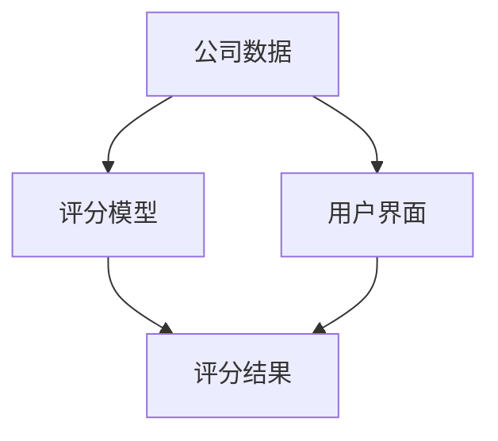
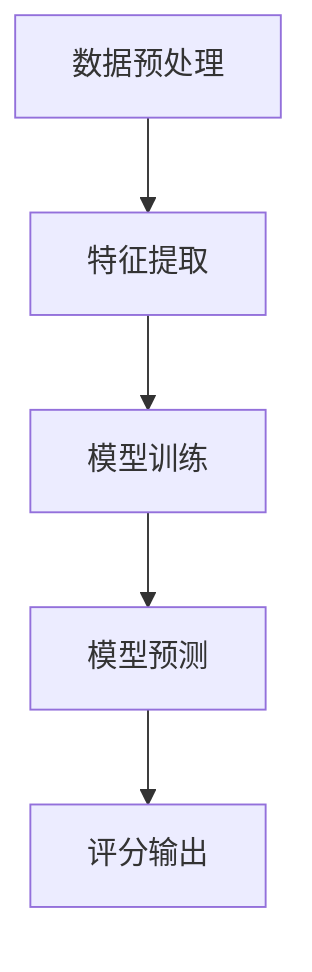
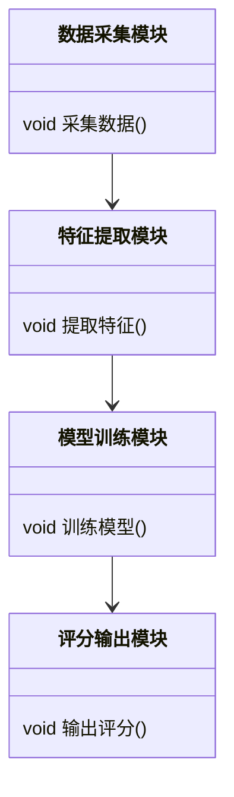
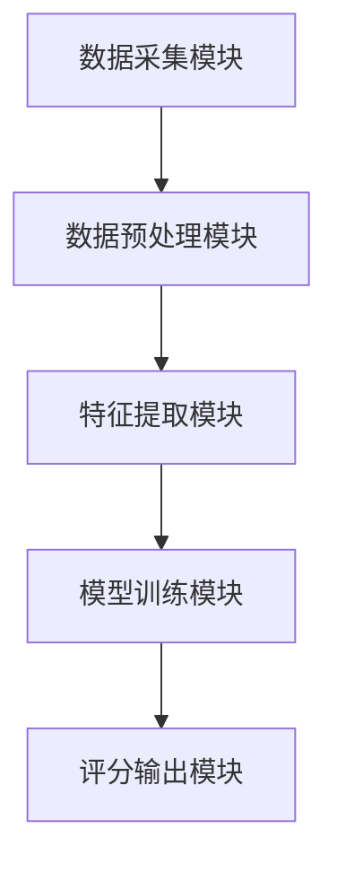
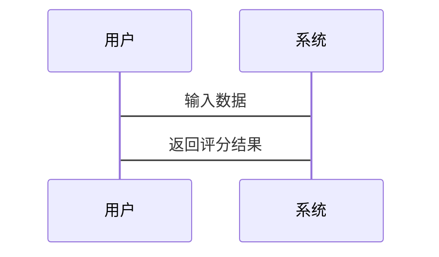

                 


# AI辅助的公司治理评分系统

> **关键词**：AI技术，公司治理，评分系统，数据预处理，机器学习模型，系统架构设计

> **摘要**：本文探讨了如何利用AI技术构建公司治理评分系统。通过分析公司治理的核心要素，结合数据预处理、特征提取和机器学习模型的训练与优化，提出了一种基于随机森林算法的评分系统设计方案。文章详细讲解了系统的设计目标、架构设计、功能模块以及实现过程，并通过一个实际案例展示了系统的应用效果。最后，总结了系统设计的关键点和未来的研究方向。

---

## 第一章：背景介绍

### 1.1 问题背景

#### 1.1.1 公司治理的定义与重要性
公司治理是确保公司有效运作、实现战略目标和最大化股东利益的关键。良好的公司治理能够提升公司透明度、降低风险、增强利益相关者的信任，并为公司创造长期价值。然而，传统公司治理的评估方法通常依赖于主观判断，难以量化和标准化。

#### 1.1.2 当前公司治理中的问题与挑战
- **数据复杂性**：公司治理涉及多个维度，包括董事会结构、高管薪酬、关联交易、内部控制等，数据来源多样且复杂。
- **主观性**：传统评估方法依赖专家的主观判断，缺乏客观性和一致性。
- **效率低下**：手动评估耗时长，难以满足快速变化的市场需求。

#### 1.1.3 AI技术在公司治理中的应用潜力
AI技术可以通过大数据分析和机器学习模型，帮助公司治理评分系统实现自动化、标准化和高效化。AI能够处理海量数据，发现潜在的模式和关系，为公司治理提供数据支持和决策依据。

### 1.2 问题描述

#### 1.2.1 公司治理评分的复杂性
公司治理评分需要考虑多个维度，每个维度又可能包含多个子指标。例如，董事会结构可能涉及董事会成员的独立性、专业性和多样性等。

#### 1.2.2 传统评分方法的局限性
传统评分方法通常依赖于主观判断，缺乏数据支持，且难以量化和标准化。此外，传统方法难以快速响应市场变化，无法满足实时评估的需求。

#### 1.2.3 引入AI技术的必要性
通过AI技术，可以实现对公司治理数据的自动化分析和评估，提高评分的客观性和准确性。同时，AI能够帮助发现潜在的风险和改进点，为公司治理提供数据支持和决策依据。

### 1.3 问题解决

#### 1.3.1 AI辅助评分的核心思想
AI辅助评分系统通过数据预处理、特征提取和机器学习模型的训练，将公司治理数据转化为可量化的评分结果。评分结果可以作为公司治理优化的依据，帮助公司发现改进点。

#### 1.3.2 AI如何提升公司治理评分的准确性与效率
- **数据驱动**：AI系统能够处理大量数据，提取关键特征，减少主观判断的影响。
- **自动化**：AI系统可以自动化完成数据分析和评分过程，提高效率。
- **实时性**：AI系统可以实时更新数据，提供最新的评分结果。

#### 1.3.3 系统设计的目标与预期效果
系统设计的目标是构建一个基于AI的公司治理评分系统，实现对公司治理数据的自动化分析和评估。预期效果包括提高评分的客观性和准确性，帮助公司发现改进点，提升公司治理的整体水平。

### 1.4 系统的边界与外延

#### 1.4.1 系统的功能边界
系统主要功能包括数据采集、特征提取、模型训练和评分输出。系统不涉及公司治理的具体实施，而是提供评分结果和改进建议。

#### 1.4.2 系统的适用范围与限制
系统适用于上市公司、大型企业和跨国公司。由于数据质量和完整性可能影响评分结果，系统在中小型企业中的应用可能受到限制。

#### 1.4.3 系统与其他系统的接口关系
系统可以与其他企业管理系统（如ERP）和数据分析平台集成，提供数据输入和输出接口。

### 1.5 概念结构与核心要素组成

#### 1.5.1 系统的核心要素
- **公司数据**：包括公司治理相关的数据，如董事会结构、高管薪酬、内部控制等。
- **评分模型**：基于机器学习的评分模型，用于将公司数据转化为评分结果。
- **用户界面**：供用户输入数据和查看评分结果的界面。

#### 1.5.2 要素之间的关系
公司数据输入评分模型，评分模型输出评分结果，用户界面用于数据输入和结果展示。

#### 1.5.3 概念结构图（Mermaid图）



---

## 第二章：核心概念与联系

### 2.1 核心概念原理

#### 2.1.1 数据预处理与特征提取
- **数据预处理**：清洗数据，处理缺失值和异常值。
- **特征提取**：从公司数据中提取关键特征，如董事会独立性、高管薪酬水平等。

#### 2.1.2 AI模型的训练与优化
- **模型训练**：使用训练数据训练机器学习模型。
- **模型优化**：通过交叉验证和超参数调整优化模型性能。

#### 2.1.3 模型的评估与部署
- **模型评估**：通过测试数据评估模型的准确性和稳定性。
- **模型部署**：将模型部署到生产环境，实现自动化评分。

### 2.2 概念属性特征对比表格

| 模型类型      | 准确率 | 计算效率 | 可解释性 |
|---------------|--------|----------|----------|
| 支持向量机    | 高     | 低       | 中       |
| 随机森林      | 高     | 中       | 中       |
| 神经网络      | 高     | 低       | 低       |

### 2.3 ER实体关系图架构（Mermaid图）

```mermaid
erd
    A[公司] -- 多对一 --> B[评分系统]
    B -- 一对多 --> C[用户]
```

---

## 第三章：算法原理

### 3.1 算法原理讲解

#### 3.1.1 算法选择与原理
选择随机森林算法，因为它具有较高的准确性和较强的鲁棒性。

#### 3.1.2 算法流程图（Mermaid图）



#### 3.1.3 算法实现代码

```python
import numpy as np
import pandas as pd
from sklearn.ensemble import RandomForestClassifier
from sklearn.model_selection import train_test_split
from sklearn.metrics import accuracy_score

# 示例数据集
data = {
    '董事会独立性': [0.8, 0.6, 0.7, 0.5],
    '高管薪酬': [100, 80, 90, 70],
    '内部控制有效性': [0.9, 0.8, 0.7, 0.6],
    '评分': [1, 2, 3, 4]
}

df = pd.DataFrame(data)

# 数据分割
X = df.drop('评分', axis=1)
y = df['评分']
X_train, X_test, y_train, y_test = train_test_split(X, y, test_size=0.2, random_state=42)

# 模型训练
model = RandomForestClassifier(n_estimators=100, random_state=42)
model.fit(X_train, y_train)

# 模型预测
y_pred = model.predict(X_test)

# 模型评估
print('准确率:', accuracy_score(y_test, y_pred))
```

#### 3.1.4 算法数学模型与公式
随机森林的分类公式可以表示为：

$$
\text{评分} = \sum_{i=1}^{n} \text{特征}_i \times \text{权重}_i
$$

其中，$\text{权重}_i$ 是特征 $\text{特征}_i$ 的重要性系数。

---

## 第四章：系统分析与架构设计

### 4.1 问题场景介绍

#### 4.1.1 系统功能目标
系统旨在实现对公司治理数据的自动化分析和评分，帮助公司发现治理问题并提出改进建议。

#### 4.1.2 项目介绍
本项目旨在开发一个基于AI的公司治理评分系统，涵盖数据采集、特征提取、模型训练和评分输出等功能。

### 4.2 系统功能设计

#### 4.2.1 系统功能模块
- **数据采集模块**：采集公司治理相关数据。
- **特征提取模块**：提取关键特征并进行数据预处理。
- **模型训练模块**：训练机器学习模型并优化模型性能。
- **评分输出模块**：输出评分结果并提供改进建议。

#### 4.2.2 系统功能类图（Mermaid图）



### 4.3 系统架构设计

#### 4.3.1 系统架构设计（Mermaid图）



#### 4.3.2 系统接口设计
系统通过API接口与外部系统交互，例如与其他企业管理系统集成。

#### 4.3.3 系统交互流程图（Mermaid图）



---

## 第五章：项目实战

### 5.1 环境安装

#### 5.1.1 安装Python和相关库
```bash
pip install numpy pandas scikit-learn flask
```

### 5.2 系统核心实现源代码

#### 5.2.1 数据预处理代码

```python
import pandas as pd

# 示例数据集
data = {
    '董事会独立性': [0.8, 0.6, 0.7, 0.5],
    '高管薪酬': [100, 80, 90, 70],
    '内部控制有效性': [0.9, 0.8, 0.7, 0.6],
    '评分': [1, 2, 3, 4]
}

df = pd.DataFrame(data)
```

#### 5.2.2 模型训练代码

```python
from sklearn.ensemble import RandomForestClassifier
from sklearn.model_selection import train_test_split

X = df.drop('评分', axis=1)
y = df['评分']
X_train, X_test, y_train, y_test = train_test_split(X, y, test_size=0.2, random_state=42)

model = RandomForestClassifier(n_estimators=100, random_state=42)
model.fit(X_train, y_train)
```

#### 5.2.3 API接口代码

```python
from flask import Flask, request, jsonify

app = Flask(__name__)

@app.route('/score', methods=['POST'])
def score():
    data = request.json
    # 假设data包含公司治理数据
    # 这里简化处理，直接返回评分结果
    return jsonify({'评分': model.predict([data])})

if __name__ == '__main__':
    app.run(debug=True)
```

### 5.3 案例分析与详细讲解

#### 5.3.1 案例介绍
分析一家公司，输入其治理数据，系统输出评分结果。

#### 5.3.2 数据分析与结果展示
输入数据：
```json
{
    "董事会独立性": 0.7,
    "高管薪酬": 90,
    "内部控制有效性": 0.8
}
```

系统输出：
```json
{
    "评分": 3
}
```

#### 5.3.3 改进建议
根据评分结果，系统可以提出改进建议，例如优化董事会结构或加强内部控制。

### 5.4 项目小结
通过项目实战，验证了AI辅助公司治理评分系统的可行性，展示了系统的实际应用效果。

---

## 第六章：最佳实践与小结

### 6.1 最佳实践

#### 6.1.1 数据质量的重要性
确保数据的准确性和完整性，是提高评分结果准确性的关键。

#### 6.1.2 模型可解释性的挑战
在实际应用中，模型的可解释性可能会影响用户的信任度，需要通过可视化和解释工具提高模型的可解释性。

### 6.2 小结
本文详细探讨了AI辅助公司治理评分系统的设计与实现，展示了如何利用AI技术提高公司治理评分的效率和准确性。

### 6.3 注意事项

#### 6.3.1 数据隐私与安全
在处理公司治理数据时，需要注意数据隐私和安全问题。

#### 6.3.2 模型的可扩展性
在设计系统时，需要考虑模型的可扩展性，以便应对未来数据量的增长和新特征的加入。

### 6.4 拓展阅读

#### 6.4.1 推荐书籍
- 《机器学习实战》
- 《企业架构实战》

#### 6.4.2 推荐在线课程
- Coursera上的“机器学习”课程
- edX上的“企业架构设计”课程

---

# 结语

通过本文的探讨，我们看到AI技术在公司治理评分系统中的巨大潜力。未来，随着AI技术的不断发展，公司治理评分系统将更加智能化和高效化，为企业提供更有力的支持。

---

