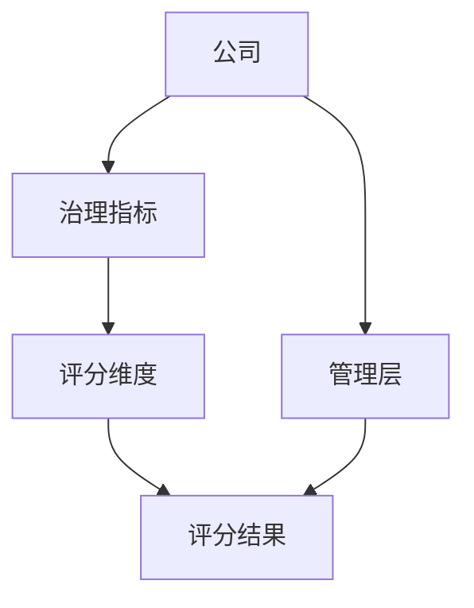
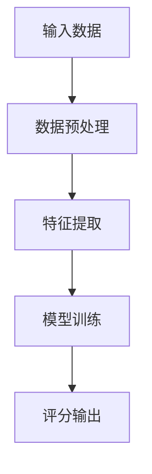
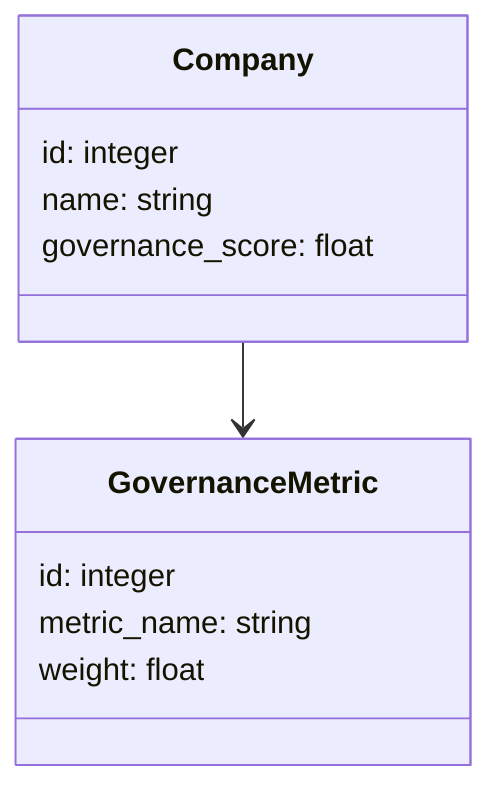
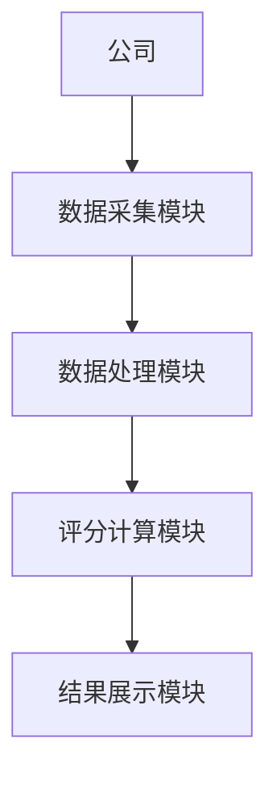

                 


# AI辅助的公司治理评分系统与改善建议

## 关键词：AI，公司治理，评分系统，改善建议，算法，数据驱动

## 摘要：  
随着人工智能技术的快速发展，公司治理的评估与优化正在经历一场深刻的变革。传统的公司治理评估方法往往依赖于主观判断和经验分析，存在效率低、覆盖面窄、缺乏数据支撑等问题。本文将探讨如何利用人工智能技术构建高效的公司治理评分系统，通过多维度的数据分析和智能化的算法模型，实现对公司治理的全面评估与优化建议。文章将从问题背景、核心概念、算法原理、系统设计、项目实战等多个维度展开，结合实际案例和代码实现，为读者提供一份详尽的技术指南。

---

# 第1章: 公司治理评分系统背景介绍

## 1.1 问题背景与描述
### 1.1.1 公司治理的传统挑战
公司治理是企业管理和发展的核心，传统评估方法依赖人工分析，存在主观性强、效率低、难以量化的问题。  
- 传统评估方法的局限性：  
  - 数据分散，难以整合。  
  - 评估维度单一，缺乏全面性。  
  - 人工判断为主，主观性高。  

### 1.1.2 当前问题的解决思路
- 引入AI技术，通过数据驱动的方式优化公司治理评估。  
- 利用机器学习模型分析多维度数据，实现精准评分与建议。  

### 1.1.3 评分系统的边界与适用范围
- 边界：评分系统不直接干预公司管理，而是提供数据支持和决策参考。  
- 适用范围：适用于中大型企业，尤其是数据化管理需求较高的行业。  

## 1.2 核心概念与结构
### 1.2.1 公司治理评分的核心要素
- 治理结构：董事会、监事会、管理层的职责划分。  
- 运营效率：决策效率、资源分配合理性。  
- 风险控制：风险管理能力、合规性。  

### 1.2.2 评分系统的基本结构
- 数据采集模块：整合公司治理相关的多维度数据。  
- 模型计算模块：基于机器学习算法进行评分计算。  
- 可视化与建议模块：提供直观的评分结果和改进建议。  

## 1.3 本章小结
本章从背景出发，分析了传统公司治理评估的局限性，并提出了利用AI技术构建评分系统的思路，明确了系统的边界与核心要素。

---

# 第2章: AI辅助的公司治理评分系统核心概念

## 2.1 核心概念与原理
### 2.1.1 AI评分模型的基本原理
- 数据驱动：基于大量公司治理数据，构建评分模型。  
- 多维度分析：从治理结构、运营效率、风险控制等多个维度进行评估。  
- 自动化计算：利用机器学习算法自动计算评分并生成建议。  

### 2.1.2 数据驱动的评分机制
- 数据来源：公司财务数据、管理层决策记录、员工满意度调查等。  
- 数据预处理：数据清洗、特征提取、标准化处理。  

### 2.1.3 多维度评估指标的设计
- 指标权重分配：根据经验或算法自适应调整各维度的权重。  
- 指标动态更新：根据公司最新数据实时更新评分结果。  

## 2.2 核心概念对比分析
### 2.2.1 不同评分模型的特征对比
| 模型名称  | 数据来源          | 计算方式         | 优点                   |
|-----------|-------------------|-----------------|-----------------------|
| 线性回归   | 财务数据           | 线性组合         | 简单易懂               |
| 支持向量机 | 财务+管理数据      | 非线性分类       | 适合小样本数据         |
| 神经网络   | 多源异构数据       | 多层非线性计算   | 适合复杂场景           |

### 2.2.2 数据来源的属性分析
- 数据的可获得性：内部数据（财务报表、会议记录）与外部数据（行业基准、市场反馈）的结合。  
- 数据的时效性：实时数据更新对评分结果的影响。  

### 2.2.3 评分结果的可解释性对比
- 解释性高低：线性回归模型 > 支持向量机 > 神经网络。  

## 2.3 ER实体关系图


## 2.4 本章小结
本章详细阐述了AI辅助公司治理评分系统的核心概念，对比分析了不同模型的特点，并通过ER图展示了系统的实体关系。

---

# 第3章: 公司治理评分系统的算法原理

## 3.1 算法流程图


## 3.2 算法原理详细讲解
### 3.2.1 数据预处理方法
- 数据清洗：去除缺失值、异常值。  
- 特征提取：从原始数据中提取关键特征，例如财务指标、管理行为指标等。  

### 3.2.2 特征提取的数学模型
$$ f(x) = w_1x_1 + w_2x_2 + ... + w_nx_n $$  
其中，$w_i$为特征$x_i$的权重，$f(x)$为特征提取后的综合评分。  

### 3.2.3 模型训练的优化算法
$$ \theta = \theta - \eta \frac{\partial L}{\partial \theta} $$  
其中，$\theta$为模型参数，$\eta$为学习率，$L$为损失函数。  

## 3.3 算法实现与代码
### 3.3.1 环境安装
```bash
pip install numpy pandas scikit-learn
```

### 3.3.2 核心代码实现
```python
def score_calculation(features):
    weights = [0.3, 0.5, 0.2]
    return sum(w * f for w, f in zip(weights, features))
```

## 3.4 本章小结
本章通过算法流程图和代码示例，详细讲解了公司治理评分系统的算法原理，包括数据预处理、特征提取和模型训练的全过程。

---

# 第4章: 系统分析与架构设计

## 4.1 问题场景分析
### 4.1.1 系统目标
- 实现对公司治理的多维度评分。  
- 提供个性化的改进建议。  

### 4.1.2 使用场景
- 企业内部审计：定期评估公司治理状况。  
- 投资者决策：评估潜在投资目标的治理能力。  

### 4.1.3 用户角色
- 公司管理层：希望通过评分了解公司治理现状。  
- 投资机构：需要评估被投企业的治理能力。  

## 4.2 系统架构设计
### 4.2.1 领域模型


### 4.2.2 系统架构图


## 4.3 本章小结
本章通过系统分析与架构设计，明确了公司治理评分系统的功能模块和交互流程。

---

# 第5章: 项目实战

## 5.1 环境安装与数据准备
### 5.1.1 环境安装
```bash
pip install numpy pandas scikit-learn
```

### 5.1.2 数据准备
- 数据来源：企业财务报表、管理记录、员工满意度调查等。  
- 数据格式：CSV或Excel格式，包含公司ID、财务指标、管理指标等字段。  

## 5.2 核心代码实现
### 5.2.1 数据预处理
```python
import pandas as pd

# 读取数据
df = pd.read_csv('governance_data.csv')

# 删除缺失值
df.dropna(inplace=True)

# 标准化处理
from sklearn.preprocessing import StandardScaler
scaler = StandardScaler()
df_scaled = pd.DataFrame(scaler.fit_transform(df), columns=df.columns)
```

### 5.2.2 模型训练
```python
from sklearn.svm import SVC

# 训练模型
model = SVC()
model.fit(df_scaled[['revenue', 'profit', 'employees']], df['score'])
```

## 5.3 实际案例分析
### 5.3.1 案例背景
某中型制造企业，希望通过评分系统优化公司治理结构。  

### 5.3.2 数据分析与评分
- 输入数据：公司财务报表、管理层决策记录。  
- 评分结果：治理评分为85分，其中管理效率得分较低。  

### 5.3.3 改进建议
- 提高管理层决策效率。  
- 优化公司治理结构，引入外部独立董事。  

## 5.4 本章小结
本章通过实际案例分析，展示了AI辅助公司治理评分系统的具体应用，包括数据准备、模型训练和结果解读。

---

# 第6章: 系统优化与改进建议

## 6.1 系统优化方向
### 6.1.1 数据来源的扩展
- 引入更多维度的数据，例如客户满意度、供应链稳定性等。  

### 6.1.2 模型的改进
- 使用深度学习模型（如LSTM）处理时间序列数据。  
- 引入强化学习算法，模拟不同治理策略的效果。  

## 6.2 改进建议
### 6.2.1 数据质量管理
- 建立数据采集标准，确保数据的准确性和完整性。  

### 6.2.2 系统的可解释性
- 优化模型的可解释性，帮助用户理解评分结果。  

## 6.3 最佳实践
- 定期更新模型，适应公司治理的新需求。  
- 结合企业实际业务场景，调整评分模型的参数。  

## 6.4 本章小结
本章提出了系统优化的方向和改进建议，强调了数据质量和模型可解释性的重要性。

---

# 第7章: 总结与展望

## 7.1 本章总结
本文详细探讨了AI辅助的公司治理评分系统的构建与应用，从理论到实践，全面介绍了系统的背景、核心概念、算法原理和实际案例。

## 7.2 未来展望
随着AI技术的不断进步，公司治理评分系统将更加智能化和个性化。未来的研究方向包括多模态数据的融合、动态评分模型的构建等。

## 7.3 注意事项
- 数据隐私保护：确保公司在使用评分系统时遵守相关法律法规。  
- 系统维护：定期更新模型和数据，保持系统的准确性和有效性。  

## 7.4 拓展阅读
- 推荐阅读《机器学习实战》、《企业治理与风险管理》等书籍。  

## 7.5 本章小结
本章总结了全文内容，并对未来的研究方向和实际应用提出了展望。

---

# 结语

通过本文的系统介绍，读者可以全面了解AI辅助的公司治理评分系统的构建与应用。无论是理论学习还是实际操作，都可以从中获得宝贵的 insights。未来，随着技术的不断进步，公司治理评分系统将为企业管理带来更大的价值。

--- 

**感谢您的耐心阅读！**

