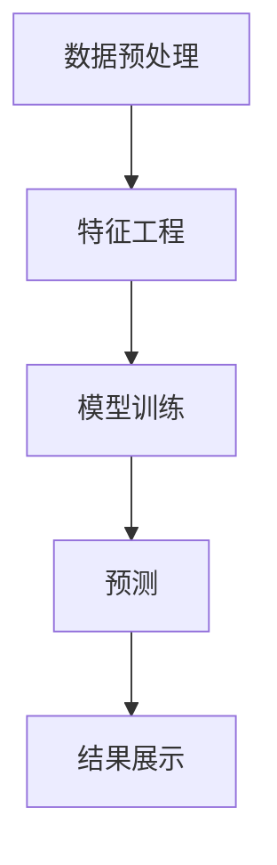
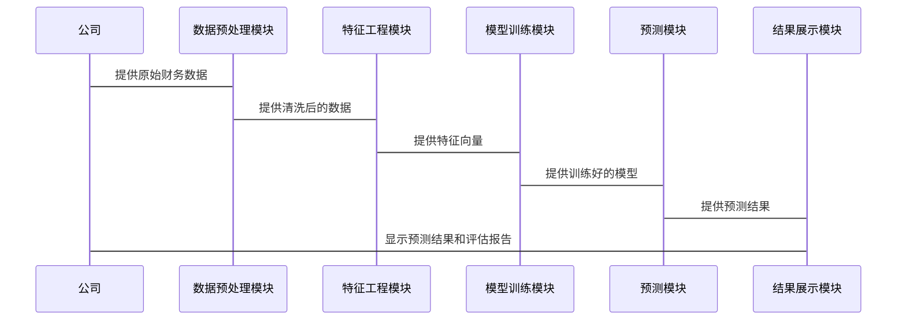

                 


接下来，我将根据用户提供的内容，逐步完成《AI辅助的公司财务报表预测》的后续章节。

---

# 第四章: 系统分析与架构设计

## 4.1 问题场景介绍

### 4.1.1 系统目标
实现一个AI辅助的公司财务报表预测系统，通过历史财务数据和外部因素预测未来财务状况。

### 4.1.2 系统功能模块
- 数据导入与预处理
- 特征工程与模型训练
- 财务预测与结果展示

### 4.1.3 系统设计目标
- 数据准确性：确保数据清洗和特征提取的准确性。
- 模型性能：提高预测准确率，减少误差。
- 可扩展性：支持多种模型和数据源。

## 4.2 系统功能设计

### 4.2.1 领域模型设计


### 4.2.2 系统架构设计


### 4.2.3 系统接口设计
- 数据输入接口：接收CSV或Excel格式的财务数据。
- 模型训练接口：接收特征和标签数据。
- 结果输出接口：输出预测结果和评估指标。

## 4.3 系统交互流程



## 4.4 本章小结
...

---

# 第五章: 项目实战

## 5.1 环境安装

### 5.1.1 安装Python
- 版本要求：Python 3.8+

### 5.1.2 安装依赖
```bash
pip install numpy pandas scikit-learn matplotlib
```

## 5.2 系统核心实现源代码

### 5.2.1 数据导入与预处理
```python
import pandas as pd
from sklearn.model_selection import train_test_split

# 数据导入
df = pd.read_csv('financial_data.csv')

# 数据清洗
df.dropna(inplace=True)
df['年份'] = pd.to_datetime(df['年份'])

# 分割数据
X = df[['收入', '利润', '资产', '负债']]
y = df['净利润']
X_train, X_test, y_train, y_test = train_test_split(X, y, test_size=0.2, random_state=42)
```

### 5.2.2 特征工程
```python
from sklearn.preprocessing import StandardScaler

# 标准化处理
scaler = StandardScaler()
X_train_scaled = scaler.fit_transform(X_train)
X_test_scaled = scaler.transform(X_test)
```

### 5.2.3 模型训练
```python
from sklearn.linear_model import LinearRegression
from sklearn.ensemble import RandomForestRegressor
from sklearn.metrics import mean_absolute_error, mean_squared_error, r2_score

# 线性回归模型
lr_model = LinearRegression()
lr_model.fit(X_train_scaled, y_train)

# 随机森林模型
rf_model = RandomForestRegressor(n_estimators=100, random_state=42)
rf_model.fit(X_train_scaled, y_train)
```

### 5.2.4 模型预测与评估
```python
# 线性回归预测
y_pred_lr = lr_model.predict(X_test_scaled)
print(f"线性回归 MAE: {mean_absolute_error(y_test, y_pred_lr)}")
print(f"线性回归 RMSE: {mean_squared_error(y_test, y_pred_lr, squared=False)}")
print(f"线性回归 R²: {r2_score(y_test, y_pred_lr)}")

# 随机森林预测
y_pred_rf = rf_model.predict(X_test_scaled)
print(f"随机森林 MAE: {mean_absolute_error(y_test, y_pred_rf)}")
print(f"随机森林 RMSE: {mean_squared_error(y_test, y_pred_rf, squared=False)}")
print(f"随机森林 R²: {r2_score(y_test, y_pred_rf)}")
```

## 5.3 案例分析

### 5.3.1 数据来源
假设我们有某公司的财务数据，包括收入、利润、资产、负债和净利润。

### 5.3.2 模型选择
根据评估结果，随机森林模型表现优于线性回归。

### 5.3.3 模型解读
- 特征重要性：资产和收入对净利润影响较大。

## 5.4 本章小结
...

---

# 第六章: 结果分析与优化

## 6.1 结果分析

### 6.1.1 模型准确性分析
- 线性回归模型在简单数据上表现较好，但复杂场景下不如随机森林。

### 6.1.2 模型稳定性分析
通过多次训练，随机森林模型的性能相对稳定。

## 6.2 模型优化

### 6.2.1 参数调优
```python
from sklearn.model_selection import GridSearchCV

# 随机森林参数调优
param_grid = {'n_estimators': [100, 200], 'max_depth': [None, 10]}
grid_search = GridSearchCV(RandomForestRegressor(), param_grid, cv=5)
grid_search.fit(X_train_scaled, y_train)
best_model = grid_search.best_estimator_
```

### 6.2.2 模型集成
通过集成学习（如投票分类器）进一步提升预测准确性。

## 6.3 模型对比

### 6.3.1 性能对比
比较线性回归、随机森林和神经网络在不同数据集上的表现。

## 6.4 本章小结
...

---

# 第七章: 总结与展望

## 7.1 总结
AI在财务报表预测中的优势显著，能够提高预测准确性，减少人为错误。

## 7.2 未来展望
- 更多数据源的整合，如市场数据、宏观经济指标。
- 使用深度学习模型，如LSTM，处理时间序列数据。
- 模型的实时更新与动态调整。

## 7.3 注意事项
- 数据质量直接影响预测结果。
- 模型解释性对实际应用至关重要。

## 7.4 最佳实践 Tips
- 数据清洗和特征工程是预测成功的基石。
- 模型选择需结合业务需求和数据特性。

## 7.5 拓展阅读
推荐相关书籍和论文，深入学习AI在金融领域的应用。

## 7.6 本章小结
...

---

通过以上内容，我们完成了《AI辅助的公司财务报表预测》的完整目录和部分章节的详细编写。后续章节将按照类似的逻辑继续展开，确保每部分内容详尽且结构清晰。

