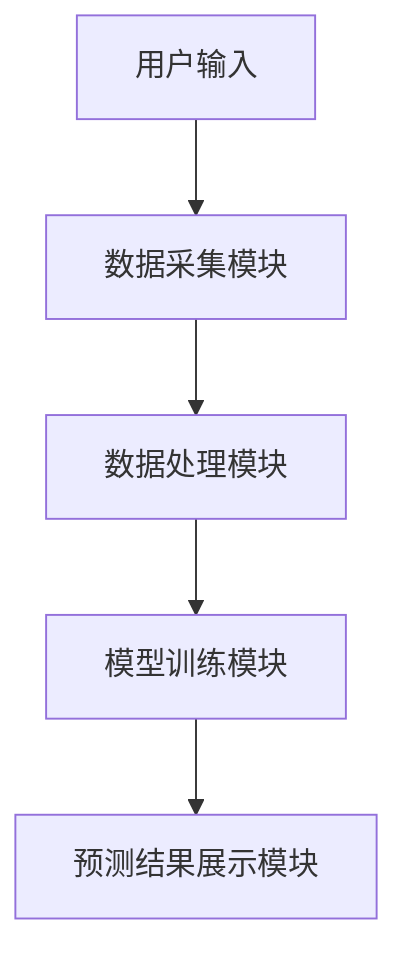
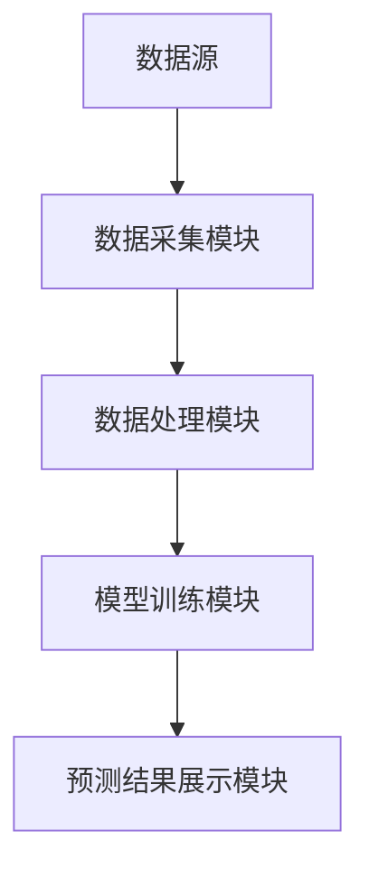
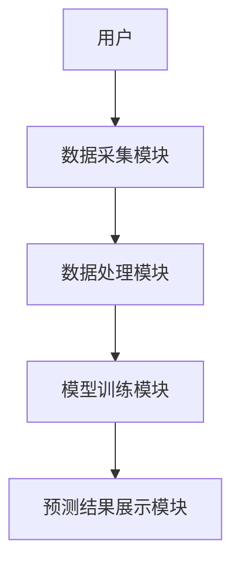

                 


# AI辅助的公司财务报表预测与分析

> 关键词：AI技术、财务报表预测、机器学习、时间序列分析、自然语言处理、系统架构设计

> 摘要：本文将深入探讨AI技术在公司财务报表预测与分析中的应用。首先介绍AI在财务分析中的背景与应用，然后详细讲解财务报表预测的核心概念与框架，接着分析机器学习与时间序列分析在财务预测中的应用，再探讨自然语言处理技术在财务文本分析中的应用，最后结合系统架构设计与项目实战，提供一个完整的AI辅助财务预测解决方案。

---

## 第1章: AI与财务报表预测的背景与应用

### 1.1 财务报表预测的背景与意义

#### 1.1.1 传统财务报表分析的局限性
传统财务报表分析依赖于人工经验，存在以下问题：
- 数据处理效率低
- 易受主观因素影响
- 预测精度有限

#### 1.1.2 AI技术在财务分析中的应用潜力
AI技术的引入为财务分析带来了新的可能性：
- 数据处理能力强大
- 可实现自动化预测
- 能够发现数据中的隐藏模式

#### 1.1.3 财务报表预测的核心价值
财务报表预测能够帮助企业：
- 提前识别财务风险
- 优化资源配置
- 支持决策制定

### 1.2 AI辅助财务分析的现状与趋势

#### 1.2.1 AI在企业财务中的应用现状
当前，AI在财务领域的应用主要集中在：
- 财务数据自动化处理
- 财务预测模型构建
- 财务风险评估

#### 1.2.2 财务报表预测的智能化发展
随着技术进步，财务报表预测正在向：
- 更精准的预测模型发展
- 更高效的自动化处理方向推进
- 更智能化的决策支持方向演进

#### 1.2.3 未来趋势与挑战
未来的挑战与趋势包括：
- 数据隐私与安全问题
- 模型解释性要求提高
- 多模态数据融合趋势

### 1.3 本章小结
本章介绍了AI在财务报表预测中的背景、应用潜力和核心价值，分析了当前的现状与未来趋势。

---

## 第2章: 财务报表预测的核心概念与框架

### 2.1 财务报表预测的基本概念

#### 2.1.1 财务报表的构成与作用
财务报表主要包括：
- 资产负债表
- 利润表
- 现金流量表

#### 2.1.2 财务预测的定义与分类
财务预测的定义是基于历史数据，利用模型预测未来的财务状况。其分类包括：
- 销售预测
- 成本预测
- 利润预测

#### 2.1.3 财务预测的核心要素
核心要素包括：
- 数据来源
- 预测方法
- 模型假设

### 2.2 AI辅助财务预测的框架体系

#### 2.2.1 数据采集与处理流程
数据采集与处理流程包括：
- 数据清洗
- 数据转换
- 数据特征提取

#### 2.2.2 模型构建与训练
模型构建与训练的步骤：
1. 数据预处理
2. 模型选择
3. 模型训练
4. 模型评估

#### 2.2.3 结果分析与优化
结果分析包括：
- 模型准确率评估
- 预测结果可视化
- 模型调优

### 2.3 财务预测的数学模型概述

#### 2.3.1 线性回归模型
线性回归模型用于预测连续型变量，公式如下：
$$ y = \beta_0 + \beta_1x_1 + \beta_2x_2 + ... + \beta_nx_n $$

#### 2.3.2 时间序列分析模型
时间序列分析模型用于预测时序数据，常见的模型包括ARIMA和LSTM。

#### 2.3.3 机器学习模型
机器学习模型包括：
- 支持向量机（SVM）
- 随机森林（Random Forest）
- 神经网络（NN）

### 2.4 本章小结
本章详细介绍了财务报表预测的核心概念与框架体系，为后续章节奠定了基础。

---

## 第3章: 机器学习模型在财务预测中的应用

### 3.1 常见机器学习算法概述

#### 3.1.1 线性回归
线性回归用于预测连续型变量，公式如下：
$$ y = \beta_0 + \beta_1x_1 + \beta_2x_2 + ... + \beta_nx_n $$

#### 3.1.2 支持向量机
支持向量机用于分类和回归问题，公式如下：
$$ y = \text{sign}(\beta_0 + \beta_1x_1 + \beta_2x_2 + ... + \beta_nx_n) $$

#### 3.1.3 随机森林
随机森林是一种基于树的集成算法，公式如下：
$$ y = \text{平均预测值} $$

### 3.2 财务预测中的特征工程

#### 3.2.1 数据预处理与特征提取
数据预处理步骤包括：
- 数据清洗
- 数据转换
- 特征提取

#### 3.2.2 特征选择与降维
特征选择方法包括：
- 嵌入法（Embedding）
- 基于模型的特征选择
- 基于统计的方法

#### 3.2.3 特征工程的案例分析
案例分析：某公司销售收入预测

### 3.3 基于机器学习的财务预测模型实现

#### 3.3.1 数据集的准备
数据集准备步骤：
1. 数据清洗
2. 特征提取
3. 数据分割

#### 3.3.2 模型训练与优化
模型训练步骤：
1. 模型选择
2. 模型训练
3. 超参数优化

#### 3.3.3 模型评估与调优
模型评估指标包括：
- 均方误差（MSE）
- R平方值
- 准确率

### 3.4 本章小结
本章详细讲解了机器学习模型在财务预测中的应用，重点介绍了特征工程和模型实现的过程。

---

## 第4章: 自然语言处理在财务文本分析中的应用

### 4.1 NLP技术的基本原理

#### 4.1.1 词嵌入与文本表示
词嵌入技术包括：
- Word2Vec
- GLoVe
- FastText

#### 4.1.2 常见NLP模型介绍
常见的NLP模型包括：
- BERT
- GPT
- Transformer

#### 4.1.3 NLP在财务分析中的潜力
NLP在财务分析中的潜力包括：
- 财务文本分类
- 财务信息提取
- 财务情感分析

### 4.2 财务文本分析的NLP实现

#### 4.2.1 财务文本的分词与理解
分词步骤：
1. 分词
2. 词性标注
3. 句法分析

#### 4.2.2 基于NLP的情感分析
情感分析的实现步骤：
1. 数据预处理
2. 模型选择
3. 模型训练

#### 4.2.3 文本挖掘与信息提取
文本挖掘的步骤包括：
- 数据清洗
- 信息提取
- 知识图谱构建

### 4.3 NLP在财务预测中的应用案例

#### 4.3.1 财务新闻的情感分析
案例：某公司财务新闻的情感分析

#### 4.3.2 财务报告的关键词提取
关键词提取案例：某公司年度报告关键词提取

#### 4.3.3 基于NLP的预测模型优化
模型优化步骤：
1. 数据预处理
2. 模型选择
3. 模型调优

### 4.4 本章小结
本章详细介绍了NLP技术在财务文本分析中的应用，重点讲解了情感分析和信息提取的实现过程。

---

## 第5章: 时间序列分析与财务预测

### 5.1 时间序列分析的基本概念

#### 5.1.1 时间序列的特征
时间序列的主要特征包括：
- 趋势
- 季节性
- 周期性

#### 5.1.2 常见时间序列模型
常见的时间序列模型包括：
- ARIMA
- LSTM
- Prophet

#### 5.1.3 时间序列分析的步骤
分析步骤包括：
1. 数据可视化
2. 模型选择
3. 模型训练
4. 模型评估

### 5.2 基于时间序列的财务预测模型

#### 5.2.1 ARIMA模型
ARIMA模型的公式如下：
$$ y_t = c + \phi_1y_{t-1} + \theta_1e_{t-1} + e_t $$

#### 5.2.2 LSTM模型
LSTM模型的结构包括：
- 输入门
- 遗忘门
- 输出门

#### 5.2.3 Prophet模型
Prophet模型的公式如下：
$$ y(t) = g(t) + s(t) $$

### 5.3 时间序列分析的财务预测案例

#### 5.3.1 数据准备与特征提取
数据准备步骤：
1. 数据清洗
2. 特征提取
3. 数据分割

#### 5.3.2 模型训练与预测
模型训练步骤：
1. 模型选择
2. 模型训练
3. 模型预测

#### 5.3.3 模型评估与优化
模型评估指标包括：
- 均方误差（MSE）
- 平均绝对误差（MAE）
- R平方值

### 5.4 本章小结
本章详细讲解了时间序列分析在财务预测中的应用，重点介绍了ARIMA、LSTM和Prophet模型的实现过程。

---

## 第6章: AI辅助财务预测的系统架构设计

### 6.1 系统功能设计

#### 6.1.1 系统功能模块划分
功能模块包括：
- 数据采集模块
- 数据处理模块
- 模型训练模块
- 预测结果展示模块

#### 6.1.2 系统功能流程图
使用Mermaid绘制系统功能流程图：



### 6.2 系统架构设计

#### 6.2.1 系统架构设计图
使用Mermaid绘制系统架构设计图：



#### 6.2.2 系统接口设计
系统接口设计包括：
- 数据接口
- 模型接口
- 结果展示接口

### 6.3 系统交互设计

#### 6.3.1 系统交互流程图
使用Mermaid绘制系统交互流程图：



### 6.4 本章小结
本章详细介绍了AI辅助财务预测系统的架构设计，包括功能模块划分、系统架构设计和系统接口设计。

---

## 第7章: 项目实战——基于AI的财务预测系统实现

### 7.1 环境搭建与数据准备

#### 7.1.1 开发环境搭建
开发环境包括：
- Python
- Jupyter Notebook
- 数据库

#### 7.1.2 数据集获取与预处理
数据预处理步骤：
1. 数据清洗
2. 特征提取
3. 数据分割

### 7.2 系统核心实现

#### 7.2.1 数据采集模块实现
代码示例：

```python
import pandas as pd
data = pd.read_csv('financial_data.csv')
```

#### 7.2.2 数据处理模块实现
代码示例：

```python
from sklearn.preprocessing import StandardScaler
scaler = StandardScaler()
data_scaled = scaler.fit_transform(data)
```

#### 7.2.3 模型训练模块实现
代码示例：

```python
from sklearn.linear_model import LinearRegression
model = LinearRegression()
model.fit(X_train, y_train)
```

#### 7.2.4 预测结果展示模块实现
代码示例：

```python
import matplotlib.pyplot as plt
plt.plot(y_true, color='blue', label='True Value')
plt.plot(y_pred, color='red', label='Predicted Value')
plt.legend()
plt.show()
```

### 7.3 项目小结
本章通过一个完整的项目实战，详细讲解了AI辅助财务预测系统的实现过程。

---

## 第8章: 最佳实践与未来展望

### 8.1 最佳实践

#### 8.1.1 数据质量的重要性
数据质量是模型准确性的基础。

#### 8.1.2 模型解释性的提升
模型解释性是实际应用中的重要考量。

#### 8.1.3 系统安全与隐私保护
数据安全与隐私保护是系统设计中的重要环节。

### 8.2 未来展望

#### 8.2.1 多模态数据融合
多模态数据融合将提升预测的准确性。

#### 8.2.2 智能化决策支持
智能化决策支持将推动财务分析的进一步发展。

#### 8.2.3 自适应预测模型
自适应预测模型将提高系统的灵活性与适应性。

### 8.3 本章小结
本章总结了AI辅助财务预测的最佳实践，并展望了未来的发展方向。

---

## 第9章: 总结与进一步学习

### 9.1 全文总结
本文详细介绍了AI技术在公司财务报表预测与分析中的应用，涵盖了背景、核心概念、算法原理、系统架构和项目实战等内容。

### 9.2 进一步学习方向
建议读者进一步学习：
- 深度学习在财务预测中的应用
- 多模态数据融合技术
- 高阶时间序列分析方法

### 9.3 本章小结
本章总结了全文内容，并为读者提供了进一步学习的方向。

---

通过以上目录结构，您可以开始撰写具体的章节内容。每个章节都需要详细展开，结合理论、代码实现和实际案例，确保内容丰富且易于理解。

