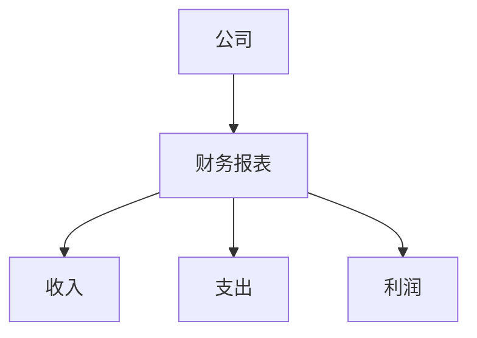
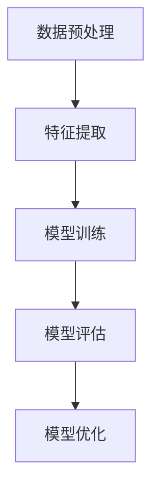

                 


```markdown
# AI辅助的公司财务报表预测与情景分析

> 关键词：人工智能，财务预测，情景分析，机器学习，财务报表，风险管理

> 摘要：本文将深入探讨人工智能在公司财务报表预测与情景分析中的应用，结合实际案例，详细讲解如何利用AI技术提升财务分析的效率与准确性。文章内容涵盖AI基础、算法原理、系统架构设计、项目实战等多个方面，为读者提供从理论到实践的全面指导。

---

## 第一部分: AI辅助的公司财务报表预测与情景分析基础

### 第1章: AI与财务报表分析概述

#### 1.1 AI技术的基本概念
- 1.1.1 人工智能的定义与特点
- 1.1.2 机器学习与深度学习的区别
- 1.1.3 AI在企业财务领域的应用前景

#### 1.2 财务报表分析的核心概念
- 1.2.1 财务报表的基本组成
- 1.2.2 财务报表分析的常见方法
- 1.2.3 AI如何辅助财务报表分析

### 第2章: AI辅助财务预测的背景与问题分析

#### 2.1 传统财务预测的局限性
- 2.1.1 数据量与复杂性的问题
- 2.1.2 人工分析的效率与准确性问题
- 2.1.3 传统模型的局限性

#### 2.2 AI在财务预测中的优势
- 2.2.1 大数据分析能力
- 2.2.2 自动化与智能化
- 2.2.3 高精度预测能力

#### 2.3 问题背景与目标
- 2.3.1 财务预测的核心问题
- 2.3.2 AI辅助财务预测的目标
- 2.3.3 边界与外延

---

## 第二部分: AI辅助财务预测的核心概念与算法原理

### 第3章: AI辅助财务预测的核心概念与联系

#### 3.1 核心概念原理
- 3.1.1 数据预处理与特征提取
- 3.1.2 机器学习模型的选择
- 3.1.3 模型训练与优化

#### 3.2 核心概念对比表格
- 3.2.1 传统模型与AI模型的对比
- 3.2.2 不同AI算法的优缺点对比
- 3.2.3 数据特征的重要性排序

#### 3.3 ER实体关系图


### 第4章: AI辅助财务预测的算法原理

#### 4.1 算法原理概述
- 4.1.1 线性回归模型
- 4.1.2 支持向量机模型
- 4.1.3 随机森林与梯度提升树

#### 4.2 算法流程图


#### 4.3 算法实现代码
```python
import pandas as pd
import numpy as np
from sklearn.model import LinearRegression

# 示例代码：使用线性回归模型进行财务预测
data = pd.DataFrame({
    '收入': [100, 200, 300, 400, 500],
    '支出': [50, 100, 150, 200, 250],
    '利润': [50, 100, 150, 200, 250]
})

# 特征矩阵和目标变量
X = data[['收入', '支出']]
y = data['利润']

# 模型训练
model = LinearRegression()
model.fit(X, y)

# 预测
new_data = pd.DataFrame({
    '收入': [600],
    '支出': [300]
})
predicted_profit = model.predict(new_data)
print(predicted_profit)
```

---

## 第三部分: AI辅助的财务情景分析

### 第5章: 财务情景分析的基本概念

#### 5.1 情景分析的定义与目标
- 5.1.1 什么是情景分析
- 5.1.2 情景分析在财务中的作用
- 5.1.3 情景分析的常见类型

#### 5.2 AI在情景分析中的应用
- 5.2.1 情景建模的基本原理
- 5.2.2 数据驱动的情景生成方法
- 5.2.3 情景分析的可视化与解读

### 第6章: 基于AI的财务情景分析模型

#### 6.1 情景分析模型的构建
- 6.1.1 数据预处理与特征工程
- 6.1.2 模型选择与训练
- 6.1.3 模型评估与优化

#### 6.2 基于蒙特卡洛模拟的财务情景分析
- 6.2.1 蒙特卡洛模拟的基本原理
- 6.2.2 蒙特卡洛模拟在财务情景分析中的应用
- 6.2.3 实施蒙特卡洛模拟的步骤

#### 6.3 实际案例分析
- 6.3.1 案例背景与目标
- 6.3.2 数据收集与处理
- 6.3.3 模型构建与分析
- 6.3.4 结果解读与决策建议

---

## 第四部分: 系统设计与实现

### 第7章: 系统架构设计

#### 7.1 系统功能需求
- 7.1.1 数据采集与处理模块
- 7.1.2 模型训练与预测模块
- 7.1.3 情景分析与可视化模块
- 7.1.4 结果报告生成模块

#### 7.2 系统架构设计


#### 7.3 接口设计
- 7.3.1 数据接口
- 7.3.2 API接口
- 7.3.3 用户界面

### 第8章: 项目实战

#### 8.1 环境安装与配置
- 8.1.1 安装Python与相关库
- 8.1.2 安装机器学习框架（如Scikit-learn、XGBoost）
- 8.1.3 安装数据可视化工具（如Matplotlib、Seaborn）

#### 8.2 核心代码实现
```python
import pandas as pd
import numpy as np
from sklearn.ensemble import RandomForestRegressor
from sklearn.model_selection import train_test_split

# 数据加载与预处理
data = pd.read_csv('financial_data.csv')
X = data.drop('target', axis=1)
y = data['target']

# 数据分割
X_train, X_test, y_train, y_test = train_test_split(X, y, test_size=0.2, random_state=42)

# 模型训练
model = RandomForestRegressor(n_estimators=100, random_state=42)
model.fit(X_train, y_train)

# 模型预测
y_pred = model.predict(X_test)
print('预测值:', y_pred)
print('真实值:', y_test.values)
```

#### 8.3 项目总结与优化
- 8.3.1 项目实现的关键点
- 8.3.2 模型优化的策略
- 8.3.3 项目部署与维护

---

## 第五部分: 最佳实践与未来展望

### 第9章: 最佳实践

#### 9.1 数据处理的注意事项
- 9.1.1 数据清洗的重要性
- 9.1.2 特征选择的技巧
- 9.1.3 数据增强的方法

#### 9.2 模型选择与优化
- 9.2.1 确定模型的合适性
- 9.2.2 调参技巧与经验
- 9.2.3 模型部署的最佳实践

### 第10章: 未来展望

#### 10.1 AI在财务领域的未来发展方向
- 10.1.1 自动化与智能化
- 10.1.2 多模态数据的融合
- 10.1.3 解释性AI的重要性

#### 10.2 技术挑战与解决方案
- 10.2.1 数据隐私与安全
- 10.2.2 模型的可解释性
- 10.2.3 多领域数据的融合分析

#### 10.3 未来的研究方向
- 10.3.1 新型算法的研究
- 10.3.2 跨领域应用的探索
- 10.3.3 技术与业务的深度融合

---

## 参考文献
- 文献1：《机器学习实战》
- 文献2：《深度学习入门》
- 文献3：《财务报表分析与决策》
- 文献4：《Python数据处理与分析》

---

通过以上目录结构，我们可以看到，文章从AI与财务的基础概念入手，逐步深入到算法原理、系统设计与实现，再到项目实战和未来展望，内容丰富且逻辑清晰，能够为读者提供从理论到实践的全面指导。
```

