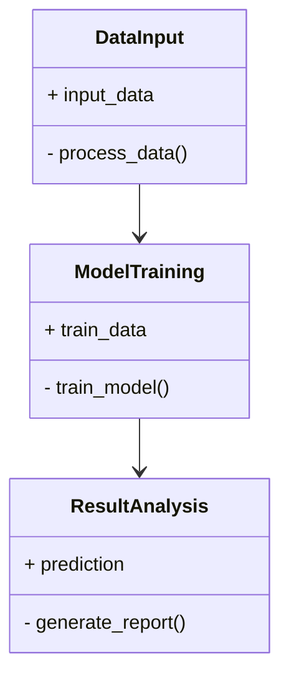
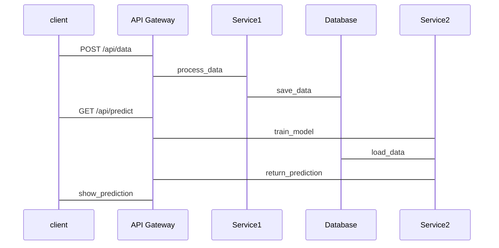

                 


# AI辅助的公司财务报表预测模型

## 关键词：人工智能、财务报表预测、机器学习、深度学习、时间序列分析

## 摘要：  
本文深入探讨了如何利用人工智能技术构建公司财务报表预测模型。通过结合传统财务分析方法与现代机器学习算法，文章详细分析了AI在财务预测中的优势、挑战及解决方案。从数据预处理到特征工程，再到模型训练与优化，文章逐步揭示了构建高效预测模型的关键步骤。通过具体案例分析，展示了如何利用AI技术提升财务预测的准确性和效率，为企业决策提供有力支持。

---

# 第1章: AI与公司财务报表预测的背景

## 1.1 人工智能与财务预测的结合  
### 1.1.1 人工智能技术的发展与应用  
人工智能（AI）作为当前科技领域的核心，其应用范围不断扩大。在财务领域，AI能够通过自然语言处理（NLP）、计算机视觉和机器学习等技术，帮助分析大量财务数据，识别趋势和潜在风险。  

### 1.1.2 财务预测的传统方法与局限性  
传统的财务预测方法主要依赖于财务人员的经验和手动计算。然而，这种方法存在效率低、误差大、难以处理大规模数据等局限性。随着企业规模的扩大和数据量的增加，传统方法已难以满足需求。  

### 1.1.3 AI在财务预测中的优势与潜力  
AI技术能够快速处理大量数据，发现隐藏的模式，并提供高精度的预测结果。通过机器学习算法，AI可以在短时间内完成复杂的财务分析，为企业提供实时、准确的预测支持，从而优化决策流程。  

## 1.2 公司财务报表预测的核心问题  
### 1.2.1 财务报表预测的基本概念  
财务报表预测是指通过分析历史财务数据，利用数学模型和算法，预测未来的财务状况，包括收入、利润、现金流等关键指标。  

### 1.2.2 预测的主要指标与目标  
主要预测指标包括营业收入、净利润、资产负债率等。目标是通过预测结果，帮助企业制定合理的财务策略，优化资源配置，降低风险。  

### 1.2.3 预测的边界与外延  
财务预测的边界在于数据质量和模型的准确性，而外延则涉及多变量分析、时间序列预测和行业间的横向比较。  

## 1.3 本章小结  
本章介绍了AI在财务预测中的应用背景，分析了传统方法的局限性，并提出了AI技术在提升预测效率和准确性方面的潜力。

---

# 第2章: 数据预处理与特征工程

## 2.1 数据预处理的重要性  
### 2.1.1 数据清洗与缺失值处理  
财务数据中常存在缺失值，需通过插值法或删除法进行处理。例如，使用均值填补法修复缺失的收入数据。  

### 2.1.2 数据标准化与归一化  
为确保模型训练的稳定性，需对数据进行标准化或归一化处理。例如，使用归一化方法将不同量纲的财务指标转换为统一尺度。  

### 2.1.3 数据分拆与训练集/测试集划分  
将数据集分为训练集和测试集，通常采用7:3的比例，确保模型具有良好的泛化能力。  

## 2.2 特征工程的核心原理  
### 2.2.1 特征选择与特征重要性分析  
通过相关系数或决策树模型，识别对预测结果影响较大的特征。例如，营业收入和净利润可能是最重要的预测指标。  

### 2.2.2 特征构建与数据增强  
根据历史数据构建新特征，如同比增长率、环比增长率等，以增强模型的预测能力。  

### 2.2.3 时间序列特征的处理  
时间序列数据需要考虑滞后特征（如上一期的收入）和趋势特征（如移动平均）。  

## 2.3 数据特征与预测结果的关系  
### 2.3.1 数据特征的分类与对比  
将特征分为数值型、分类型和时间序列型，分析不同类型特征对模型性能的影响。  

### 2.3.2 数据特征与预测模型的关系  
通过绘制相关系数矩阵热图，分析特征与目标变量之间的相关性，指导特征选择。  

### 2.3.3 数据特征对模型性能的影响  
例如，收入增长率较高的特征可能对模型预测有显著影响，而某些无关特征可能需要剔除。  

## 2.4 本章小结  
本章详细探讨了数据预处理和特征工程的重要性，分析了如何通过合理选择和构建特征，提升预测模型的性能。

---

# 第3章: 常见预测算法原理

## 3.1 线性回归模型  
### 3.1.1 线性回归的数学模型  
线性回归模型可表示为：  
$$ y = \beta_0 + \beta_1x_1 + \beta_2x_2 + \cdots + \beta_nx_n + \epsilon $$  
其中，$y$为目标变量，$x_i$为特征变量，$\epsilon$为误差项。  

### 3.1.2 最小二乘法的原理  
最小二乘法通过最小化预测值与实际值之间的平方差之和，求解回归系数。  

### 3.1.3 线性回归的优缺点  
优点：简单易懂，计算效率高；缺点：对非线性关系建模能力有限。  

## 3.2 随机森林与梯度提升树  
### 3.2.1 随机森林的原理  
随机森林通过构建多个决策树，并行投票法进行预测，具有较强的抗过拟合能力。  

### 3.2.2 XGBoost与LightGBM的原理  
XGBoost采用正则化损失函数，通过梯度提升优化模型；LightGBM则采用叶子权重的方法，训练速度快。  

### 3.2.3 集成学习的优势  
集成学习通过组合多个弱模型，显著提升预测准确性和稳定性。  

## 3.3 神经网络与深度学习  
### 3.3.1 神经网络的基本结构  
神经网络由输入层、隐藏层和输出层组成，通过反向传播算法优化权重。  

### 3.3.2 LSTM在时间序列预测中的应用  
LSTM（长短期记忆网络）通过 gates 机制，有效捕捉时间序列中的长期依赖关系。  

### 3.3.3 深度学习模型的训练与优化  
通过调整学习率、批量大小和正则化参数，优化模型性能。  

## 3.4 本章小结  
本章介绍了线性回归、随机森林、XGBoost和LSTM等常见预测算法的原理和应用场景。

---

# 第4章: 系统分析与架构设计

## 4.1 系统功能需求分析  
### 4.1.1 数据输入与处理模块  
用户输入财务数据，系统进行数据清洗和特征工程处理。  

### 4.1.2 模型训练与预测模块  
选择合适的算法，训练模型并生成预测结果。  

### 4.1.3 结果展示与分析模块  
以可视化方式展示预测结果，并提供分析报告。  

## 4.2 系统功能设计  
### 4.2.1 领域模型（类图）  


### 4.2.2 系统架构设计  
```mermaid
client --> API Gateway
API Gateway --> Service1
Service1 --> Database
client --> Service2
Service2 --> Database
```

### 4.2.3 系统接口设计  
定义RESTful API接口，如：  
- POST /api/data  
- GET /api/predict  
- GET /api/report  

### 4.2.4 系统交互设计  


## 4.3 本章小结  
本章详细分析了系统的功能需求、架构设计和接口设计，为后续实现提供了基础。

---

# 第5章: 项目实战

## 5.1 环境配置与数据准备  
### 5.1.1 环境配置  
安装必要的库，如Python的scikit-learn、XGBoost、Keras等。  

### 5.1.2 数据获取与预处理  
使用公开的财务数据集，如Yahoo Finance的股票数据，进行清洗和特征工程。  

## 5.2 模型实现与优化  
### 5.2.1 模型实现  
编写Python代码，实现数据预处理、模型训练和预测。  

### 5.2.2 模型优化  
通过网格搜索调整超参数，提升模型性能。  

## 5.3 案例分析与结果解读  
### 5.3.1 案例分析  
以某公司为例，预测其未来三年的净利润。  

### 5.3.2 结果解读  
分析预测结果的准确性，评估模型的表现。  

## 5.4 本章小结  
本章通过具体案例展示了如何利用AI技术构建财务预测模型，并对结果进行了详细解读。

---

# 第6章: 总结与展望

## 6.1 本章小结  
总结全文内容，重申AI在财务预测中的重要性和潜力。  

## 6.2 注意事项  
在实际应用中，需注意数据质量和模型的泛化能力，避免过拟合和欠拟合问题。  

## 6.3 未来展望  
随着大模型技术的发展，未来的财务预测模型将更加智能化和个性化，为企业决策提供更强大的支持。  

---

# 参考文献  
（此处列出相关文献和资料）

---

通过以上目录和内容，您可以逐步深入学习AI辅助的公司财务报表预测模型的构建与应用，从理论到实践，全面掌握相关知识。

