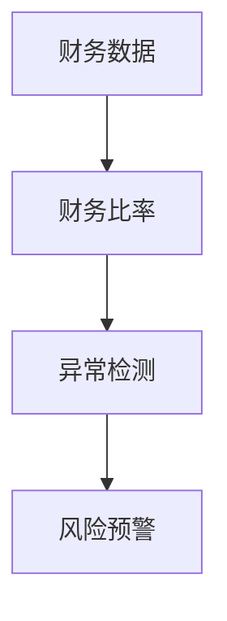
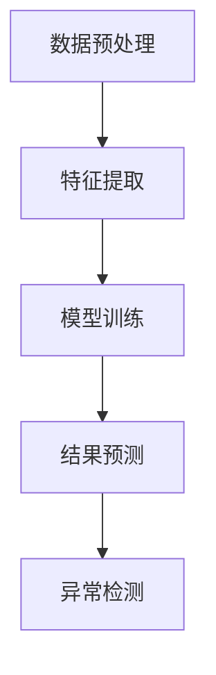
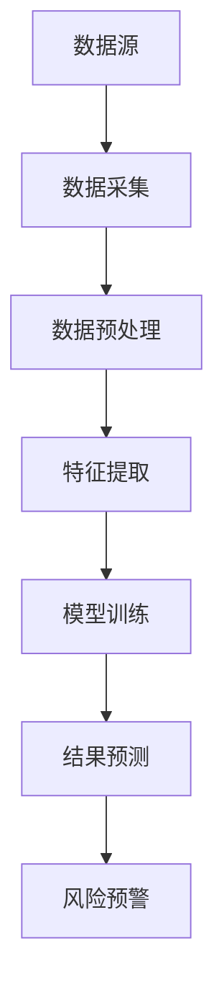
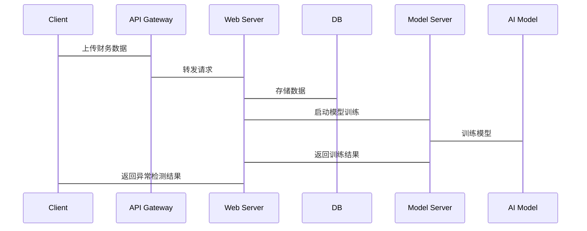

                 


# AI辅助的公司财务比率异常检测

> 关键词：AI, 财务比率, 异常检测, 机器学习, 数据分析

> 摘要：随着企业数据量的激增和对财务健康评估的日益重视，传统的财务比率分析方法在效率和准确性上逐渐显露出局限性。本文将详细探讨如何利用人工智能技术辅助公司财务比率异常检测，从理论基础、算法原理到系统设计，再到项目实战，系统性地分析和解决这一问题，为企业提供一种高效、智能的财务健康评估方案。

---

# 第一部分: AI辅助的公司财务比率异常检测背景介绍

# 第1章: 公司财务比率分析概述

## 1.1 财务比率分析的基本概念

### 1.1.1 财务比率的定义
财务比率是通过公司财务报表中的关键数据（如收入、支出、资产、负债等）计算得出的指标，用于衡量企业的财务健康状况。常见的财务比率包括流动比率、速动比率、资产负债率和利润率等。

### 1.1.2 财务比率的主要分类
财务比率通常分为以下几类：
- **流动性比率**：衡量企业偿还短期债务的能力，如流动比率（Current Ratio）和速动比率（Quick Ratio）。
- **杠杆比率**：衡量企业负债与股东权益之间的关系，如资产负债率（Debt-to-Equity Ratio）。
- **盈利能力比率**：衡量企业盈利能力，如净利润率（Net Profit Margin）和投资回报率（ROI）。
- **运营效率比率**：衡量企业资产使用效率，如存货周转率（Inventory Turnover）。

### 1.1.3 财务比率分析的用途
财务比率分析广泛应用于以下几个方面：
- **评估企业的财务健康状况**：通过分析财务比率，可以判断企业的偿债能力、盈利能力和发展潜力。
- **支持投资决策**：投资者可以通过财务比率评估企业的投资价值。
- **优化企业管理**：企业可以通过财务比率分析发现经营中的问题，优化资源配置。

## 1.2 财务比率异常检测的重要性

### 1.2.1 异常检测在企业风险管理中的作用
财务比率异常可能预示着企业面临财务困境或潜在风险。例如，过低的流动比率可能意味着企业无法偿还短期债务，而过高的资产负债率可能表明企业存在过度杠杆化的问题。

### 1.2.2 异常检测与企业财务健康评估
通过检测财务比率的异常变化，企业可以及时采取措施，避免财务危机。例如，如果发现利润率急剧下降，企业可以 investigate 成本控制或市场策略的问题。

### 1.2.3 异常检测对投资者决策的影响
投资者可以通过分析财务比率的异常变化，评估企业的经营状况和潜在风险。例如，发现某企业的速动比率突然下降，可能意味着企业的流动资金紧张，投资者可能会选择规避投资风险。

## 1.3 传统财务比率分析的局限性

### 1.3.1 人工分析的效率问题
传统的财务比率分析依赖于人工计算和判断，效率低下，且容易受到人为因素的影响。

### 1.3.2 数据量大带来的挑战
随着企业规模的扩大和业务的复杂化，财务数据量迅速增加，人工分析难以处理海量数据。

### 1.3.3 主观判断的局限性
财务比率分析需要依赖分析师的主观判断，不同分析师可能得出不同的结论，导致结果的不一致性。

## 1.4 AI技术在财务比率分析中的应用前景

### 1.4.1 AI技术如何提升财务分析效率
人工智能技术可以通过自动化数据处理和模型训练，快速计算和分析大量财务数据，显著提高财务分析的效率。

### 1.4.2 AI在异常检测中的潜在价值
AI可以通过机器学习算法，识别财务比率中的异常模式，帮助发现潜在的财务风险。

### 1.4.3 企业对AI辅助财务分析的需求
随着企业对财务健康评估的需求不断增加，AI辅助的财务分析工具越来越受到企业的重视。AI不仅可以提高分析效率，还可以提供更精准的预测和决策支持。

## 1.5 本章小结
本章介绍了财务比率分析的基本概念、异常检测的重要性以及传统分析方法的局限性，同时探讨了AI技术在财务比率分析中的应用前景。

---

# 第二部分: 财务比率异常检测的核心概念与联系

# 第2章: 财务比率分析的理论基础

## 2.1 财务比率的核心要素

### 2.1.1 流动比率
流动比率（Current Ratio）是衡量企业偿还短期债务能力的指标，计算公式为：
$$ \text{流动比率} = \frac{\text{流动资产}}{\text{流动负债}} $$

### 2.1.2 速动比率
速动比率（Quick Ratio）是流动比率的修正指标，剔除了存货的影响，计算公式为：
$$ \text{速动比率} = \frac{\text{流动资产} - \text{存货}}{\text{流动负债}} $$

### 2.1.3 资产负债率
资产负债率（Debt-to-Equity Ratio）是衡量企业负债与股东权益关系的指标，计算公式为：
$$ \text{资产负债率} = \frac{\text{总负债}}{\text{股东权益}} $$

### 2.1.4 净利润率
净利润率（Net Profit Margin）是衡量企业盈利能力的指标，计算公式为：
$$ \text{净利润率} = \frac{\text{净利润}}{\text{营业收入}} $$

## 2.2 异常检测的基本原理

### 2.2.1 异常检测的定义
异常检测（Outlier Detection）是通过统计方法或机器学习算法识别数据中的异常值。这些异常值可能代表潜在的问题或机会。

### 2.2.2 异常检测的关键指标
- **统计指标**：如标准差、均值、中位数等。
- **机器学习指标**：如支持向量机（SVM）、随机森林（Random Forest）等。

### 2.2.3 异常检测的分类
- **基于统计的方法**：如Z-score、箱线图等。
- **基于机器学习的方法**：如K-Means聚类、Isolation Forest等。

## 2.3 财务比率与异常检测的关系

### 2.3.1 财务比率与企业财务健康的关系
财务比率是企业财务健康状况的晴雨表。通过分析财务比率的异常变化，可以发现企业的潜在问题。

### 2.3.2 异常比率对企业风险的预警作用
异常的财务比率可能预示着企业面临财务困境或潜在风险，如流动性不足或盈利能力下降。

### 2.3.3 AI如何利用财务比率进行异常检测
AI可以通过机器学习算法，分析财务比率的变化趋势，识别异常模式，提前预警潜在风险。

## 2.4 核心概念对比表

| 财务比率         | 异常检测         |
|------------------|------------------|
| 流动比率         | 统计分析         |
| 速动比率         | 机器学习         |
| 资产负债率       | 数据挖掘         |
| 净利润率         | 神经网络         |

## 2.5 ER实体关系图



---

# 第三部分: 财务比率异常检测的算法原理

# 第3章: 算法原理与实现

## 3.1 监督学习方法

### 3.1.1 逻辑回归
逻辑回归（Logistic Regression）是一种常用的分类算法，适用于二分类问题。其数学模型为：
$$ P(y=1|x) = \frac{e^{\beta_0 + \beta_1x}}{1 + e^{\beta_0 + \beta_1x}} $$

### 3.1.2 算法流程图



### 3.1.3 Python代码示例

```python
from sklearn.linear_model import LogisticRegression
from sklearn.model_selection import train_test_split

# 数据预处理
X = df[['流动比率', '速动比率', '资产负债率', '净利润率']]
y = df['异常标志']

# 划分训练集和测试集
X_train, X_test, y_train, y_test = train_test_split(X, y, test_size=0.2, random_state=42)

# 模型训练
model = LogisticRegression()
model.fit(X_train, y_train)

# 模型预测
y_pred = model.predict(X_test)
```

## 3.2 无监督学习方法

### 3.2.1 聚类分析
聚类分析（Clustering）是一种常用的无监督学习方法，适用于无标签数据的异常检测。常用算法包括K-Means和DBSCAN。

### 3.2.2 Isolation Forest
Isolation Forest是一种基于树结构的异常检测算法，适用于高维数据的异常检测。

### 3.2.3 算法流程图


### 3.2.4 Python代码示例

```python
from sklearn.ensemble import IsolationForest

# 数据预处理
X = df[['流动比率', '速动比率', '资产负债率', '净利润率']]

# 模型训练
model = IsolationForest(n_estimators=100, random_state=42)
model.fit(X)

# 模型预测
y_pred = model.predict(X)
```

---

# 第四部分: 系统分析与架构设计

# 第4章: 系统分析与架构设计

## 4.1 问题场景介绍

### 4.1.1 问题背景
随着企业数据的快速增长，传统的财务比率分析方法已无法满足高效、精准的需求。引入AI技术，可以显著提升财务比率异常检测的效率和准确性。

### 4.1.2 项目介绍
本项目旨在开发一个基于AI的财务比率异常检测系统，利用机器学习算法，实现对企业财务数据的自动化分析和异常检测。

## 4.2 系统功能设计

### 4.2.1 功能模块
- **数据采集**：从企业财务系统中获取数据。
- **数据预处理**：清洗和转换数据，提取特征。
- **模型训练**：训练机器学习模型，实现异常检测。
- **结果展示**：可视化异常结果，提供风险预警。

### 4.2.2 领域模型



## 4.3 系统架构设计

### 4.3.1 系统架构图

```mermaid
graph LR
    Client --> API Gateway
    API Gateway --> Web Server
    Web Server --> DB
    Web Server --> Model Server
    Model Server --> AI Model
```

### 4.3.2 系统接口设计
- **数据接口**：提供RESTful API，用于数据的上传和查询。
- **模型接口**：提供API，用于模型的训练和预测。

## 4.4 系统交互设计

### 4.4.1 序列图



---

# 第五部分: 项目实战与案例分析

# 第5章: 项目实战

## 5.1 环境配置

### 5.1.1 安装依赖
```bash
pip install pandas scikit-learn mermaid4j
```

### 5.1.2 数据准备
从企业财务系统中获取财务数据，存储为CSV文件。

## 5.2 核心实现

### 5.2.1 数据预处理

```python
import pandas as pd

# 读取数据
df = pd.read_csv('financial_data.csv')

# 删除缺失值
df.dropna(inplace=True)

# 标准化数据
from sklearn.preprocessing import StandardScaler
scaler = StandardScaler()
df_scaled = scaler.fit_transform(df)
```

### 5.2.2 模型训练

```python
from sklearn.ensemble import IsolationForest

# 训练模型
model = IsolationForest(n_estimators=100, random_state=42)
model.fit(df_scaled)
```

### 5.2.3 结果展示

```python
import matplotlib.pyplot as plt

# 绘制异常结果
outliers = model.predict(df_scaled)
plt.scatter(df_scaled[outliers == -1, 0], df_scaled[outliers == -1, 1], c='red')
plt.scatter(df_scaled[outliers == 1, 0], df_scaled[outliers == 1, 1], c='blue')
plt.title('异常检测结果')
plt.show()
```

## 5.3 案例分析

### 5.3.1 案例背景
某制造企业发现其流动比率突然下降，可能存在流动性风险。

### 5.3.2 数据分析
通过AI模型分析，发现企业的速动比率也显著下降，进一步表明企业可能存在流动性问题。

### 5.3.3 结果解读
AI模型检测到异常的财务比率，提示企业需要 investigate 流动资产或流动负债的变化情况，采取相应的措施。

---

# 第六部分: 总结与展望

# 第6章: 总结与展望

## 6.1 本章总结
本文详细探讨了AI辅助的公司财务比率异常检测的背景、理论基础、算法原理、系统设计和项目实战。通过结合机器学习算法和财务比率分析，为企业提供了一种高效、智能的财务健康评估方案。

## 6.2 技术展望
随着AI技术的不断发展，未来财务比率异常检测将更加智能化和自动化。可能的方向包括：
- **深度学习的应用**：利用深度学习模型（如神经网络）进行更复杂的异常检测。
- **实时检测**：开发实时财务比率异常检测系统，及时预警潜在风险。
- **多模态数据融合**：结合文本、图像等多种数据源，提升异常检测的准确性和全面性。

## 6.3 最佳实践 tips
- **数据质量**：确保数据的准确性和完整性，避免数据噪声对模型的影响。
- **模型选择**：根据具体场景选择合适的算法，如监督学习或无监督学习。
- **持续优化**：定期更新模型，适应数据分布的变化，提升检测效果。

## 6.4 本章小结
通过本文的探讨，读者可以全面了解AI在公司财务比率异常检测中的应用，为企业的财务健康评估和风险管理提供有价值的参考。

---

# 结语
AI辅助的公司财务比率异常检测不仅提高了财务分析的效率和准确性，还为企业提供了更强大的工具和方法。随着技术的不断进步，未来AI在财务分析中的应用将更加广泛和深入，为企业创造更大的价值。

