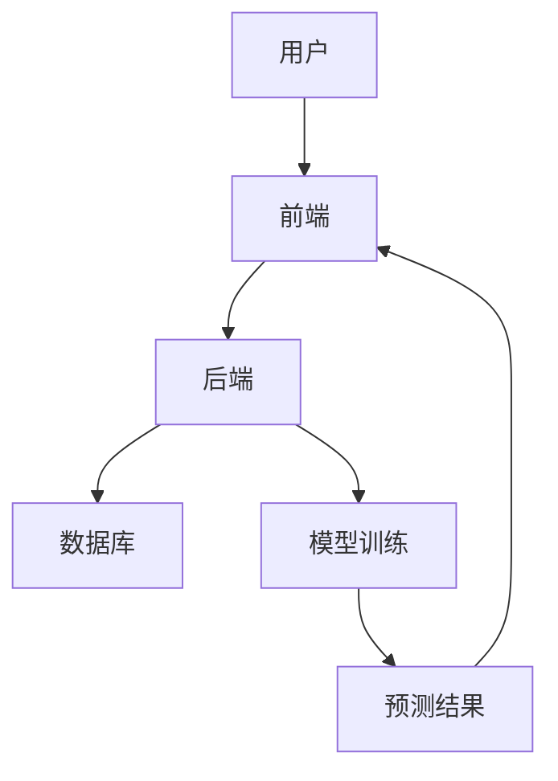

                 

<think>
好，我需要根据用户的要求，编写一篇关于《AI辅助的公司财务规划》的技术博客文章。首先，我会从文章标题、关键词、摘要开始，然后按照目录结构撰写正文内容。

**文章标题：AI辅助的公司财务规划**

**关键词：人工智能、财务规划、机器学习、自然语言处理、财务预测、预算管理**

**摘要：**
随着人工智能技术的快速发展，AI在财务规划中的应用越来越广泛。本文从AI技术在财务规划中的应用背景出发，详细探讨了NLP、机器学习等技术在财务文本分析、财务预测中的具体应用，并通过实际案例展示了AI如何提升财务规划的效率和准确性。文章还结合系统架构设计和项目实战，深入分析了AI辅助财务规划的核心算法和实现方法，最后总结了AI在财务规划中的优势和未来发展方向。

---

# AI辅助的公司财务规划

## 第1章 AI与公司财务规划的结合

### 1.1 AI技术在财务领域的应用背景

#### 1.1.1 传统财务规划的痛点与挑战
在传统的财务规划中，企业通常依赖于人工分析和经验判断，这种方式效率低下且容易受到主观因素的影响。财务数据的复杂性和多样性使得人工分析难以覆盖所有可能的情况，尤其是在面对大量历史数据和市场变化时，传统方法难以及时提供准确的预测和建议。

#### 1.1.2 AI技术如何解决财务规划问题
人工智能技术，特别是机器学习和自然语言处理（NLP），能够从海量数据中提取有价值的信息，快速建立预测模型，并提供准确的财务预测。AI还可以自动化处理重复性工作，减少人为错误，提高效率。

#### 1.1.3 AI辅助财务规划的核心价值
AI辅助财务规划的核心价值在于其高效性、准确性以及可扩展性。通过AI技术，企业可以实时分析市场动态，优化资源配置，降低风险。

### 1.2 AI辅助财务规划的定义与特点

#### 1.2.1 AI辅助财务规划的定义
AI辅助财务规划是指利用人工智能技术，结合财务数据和业务知识，为企业的财务决策提供支持和优化建议的过程。

#### 1.2.2 AI辅助财务规划的核心特点
- **数据驱动**：依赖于大量财务数据进行分析和预测。
- **自动化**：能够自动处理数据，减少人工干预。
- **实时性**：能够实时分析数据，提供及时的财务建议。
- **智能化**：能够学习和优化模型，提高预测准确性。

### 1.3 AI辅助财务规划的应用场景

#### 1.3.1 财务预测与预算
AI可以通过历史数据建立预测模型，帮助企业进行销售预测、成本预测和利润预测，从而优化预算分配。

#### 1.3.2 财务分析与决策支持
AI能够从财务报表和市场数据中提取关键信息，为企业提供数据驱动的决策支持。

#### 1.3.3 风险评估与管理
通过AI技术，企业可以实时监控财务风险，识别潜在的财务问题，并制定相应的风险管理策略。

### 1.4 本章小结
本章介绍了AI技术在财务规划中的应用背景，详细阐述了AI辅助财务规划的定义、特点及应用场景，为后续的技术分析奠定了基础。

---

## 第2章 自然语言处理（NLP）在财务文本分析中的应用

### 2.1 NLP技术简介

#### 2.1.1 NLP的基本概念
自然语言处理（NLP）是人工智能的一个分支，旨在使计算机能够理解、处理和生成人类语言。

#### 2.1.2 NLP的核心技术与算法
- **分词**：将文本分割成有意义的词语或短语。
- **实体识别**：识别文本中的实体（如人名、地名、组织名等）。
- **情感分析**：分析文本中的情感倾向。
- **文本摘要**：提取文本的主要信息并生成摘要。

### 2.2 NLP在财务文本分析中的应用

#### 2.2.1 财务文本的结构化处理
通过NLP技术，可以将非结构化的财务文本（如财务报告）转化为结构化的数据，便于后续分析。

#### 2.2.2 财务文本的情感分析
情感分析可以帮助识别财务报告中的情感倾向，预测市场情绪对财务结果的影响。

#### 2.2.3 财务文本的实体识别
实体识别可以帮助识别财务报告中的关键实体，如公司名称、金额等。

### 2.3 NLP在财务规划中的实际案例

#### 2.3.1 财务报告自动摘要
通过NLP技术，可以自动生成财务报告的摘要，帮助管理层快速了解财务状况。

#### 2.3.2 财务数据自动分类
NLP可以对财务数据进行分类，如将销售数据按地区分类，便于后续分析。

#### 2.3.3 财务风险预警
通过分析财务文本中的关键词和情感倾向，可以提前识别潜在的财务风险。

### 2.4 本章小结
本章详细介绍了NLP技术在财务文本分析中的应用，展示了如何利用NLP技术提高财务规划的效率和准确性。

---

## 第3章 机器学习在财务预测中的应用

### 3.1 机器学习技术简介

#### 3.1.1 机器学习的基本概念
机器学习是一种人工智能技术，通过数据训练模型，使其能够从数据中学习并做出预测或决策。

#### 3.1.2 常见的机器学习算法
- **线性回归**：用于预测连续型变量。
- **决策树**：用于分类和回归问题。
- **支持向量机（SVM）**：用于分类和回归问题。
- **随机森林**：一种基于决策树的集成学习方法。

### 3.2 机器学习在财务预测中的应用

#### 3.2.1 财务数据的特征提取
特征提取是机器学习的关键步骤，需要从原始数据中提取有用的特征，如销售额、成本、利润等。

#### 3.2.2 财务预测模型的构建
通过机器学习算法，可以建立财务预测模型，如销售预测模型、成本预测模型等。

#### 3.2.3 模型的训练与优化
通过训练数据对模型进行训练，并通过验证数据进行优化，以提高模型的准确性和泛化能力。

### 3.3 机器学习在财务规划中的实际案例

#### 3.3.1 销售预测模型
通过机器学习算法，建立销售预测模型，帮助企业优化销售策略。

#### 3.3.2 成本预测模型
通过机器学习算法，建立成本预测模型，帮助企业控制成本。

#### 3.3.3 利润预测模型
通过机器学习算法，建立利润预测模型，帮助企业制定财务计划。

### 3.4 本章小结
本章详细介绍了机器学习技术在财务预测中的应用，展示了如何利用机器学习算法提高财务预测的准确性。

---

## 第4章 时间序列分析在财务预测中的应用

### 4.1 时间序列分析技术简介

#### 4.1.1 时间序列的基本概念
时间序列是指按照时间顺序排列的数据，如每日股票价格、每月销售数据等。

#### 4.1.2 时间序列分析的常见方法
- **ARIMA模型**：自回归积分滑动平均模型，用于预测时间序列数据。
- **GARCH模型**：广义自回归条件异方差模型，用于预测金融时间序列的波动性。

### 4.2 时间序列分析在财务预测中的应用

#### 4.2.1 财务数据的时间序列建模
通过时间序列建模，可以预测未来的财务数据，如销售额、利润等。

#### 4.2.2 财务数据的外推预测
通过外推预测，可以预测未来一段时间内的财务趋势。

#### 4.2.3 时间序列分析的优缺点
- **优点**：能够捕捉时间序列中的趋势和周期性。
- **缺点**：对异常值敏感，需要大量的历史数据。

### 4.3 时间序列分析在财务规划中的实际案例

#### 4.3.1 财务数据的时间序列预测
通过时间序列分析，预测未来一段时间内的财务数据，帮助企业制定财务计划。

#### 4.3.2 时间序列分析在预算编制中的应用
通过时间序列分析，可以优化预算编制，提高预算的准确性。

#### 4.3.3 时间序列分析在风险评估中的应用
通过时间序列分析，可以预测市场波动，帮助企业制定风险管理策略。

### 4.4 本章小结
本章详细介绍了时间序列分析技术在财务预测中的应用，展示了如何利用时间序列分析技术提高财务预测的准确性。

---

## 第5章 AI辅助财务规划的系统架构设计

### 5.1 系统功能设计

#### 5.1.1 系统功能模块
- **数据采集模块**：从财务系统中采集财务数据。
- **数据处理模块**：对采集到的数据进行清洗和预处理。
- **模型训练模块**：利用机器学习算法训练财务预测模型。
- **预测结果展示模块**：将预测结果以可视化的方式展示给用户。

#### 5.1.2 系统功能流程
- 数据采集 → 数据处理 → 模型训练 → 预测结果展示

### 5.2 系统架构设计

#### 5.2.1 系统架构图


#### 5.2.2 系统交互流程
用户通过前端提交请求，前端将请求发送到后端，后端处理请求并调用模型训练模块进行预测，最后将预测结果返回给前端展示。

### 5.3 系统接口设计

#### 5.3.1 数据接口
- **输入接口**：接收财务数据。
- **输出接口**：返回预测结果。

#### 5.3.2 模型接口
- **训练接口**：训练财务预测模型。
- **预测接口**：进行财务预测。

### 5.4 本章小结
本章详细介绍了AI辅助财务规划系统的架构设计，包括系统功能模块、系统架构图以及系统交互流程。

---

## 第6章 项目实战：AI辅助财务规划系统实现

### 6.1 环境安装

#### 6.1.1 安装Python
```bash
python --version
pip install --upgrade pip
```

#### 6.1.2 安装机器学习库
```bash
pip install numpy pandas scikit-learn
```

### 6.2 核心实现源代码

#### 6.2.1 数据处理代码
```python
import pandas as pd
import numpy as np

# 读取数据
data = pd.read_csv('financial_data.csv')

# 数据清洗
data = data.dropna()
data = data[~data['sales'].isinf()]
```

#### 6.2.2 模型训练代码
```python
from sklearn.model_selection import train_test_split
from sklearn.linear_model import LinearRegression

# 数据分割
X = data[['sales', 'costs']]
y = data['profit']

X_train, X_test, y_train, y_test = train_test_split(X, y, test_size=0.2, random_state=42)

# 训练模型
model = LinearRegression()
model.fit(X_train, y_train)

# 预测
y_pred = model.predict(X_test)
```

#### 6.2.3 结果展示代码
```python
import matplotlib.pyplot as plt

plt.scatter(y_test, y_pred)
plt.xlabel('实际值')
plt.ylabel('预测值')
plt.title('销售预测结果')
plt.show()
```

### 6.3 项目小结
本章通过实际案例展示了AI辅助财务规划系统的实现过程，从环境安装到数据处理，再到模型训练和结果展示，详细讲解了每一步的操作和实现方法。

---

## 第7章 最佳实践与未来展望

### 7.1 最佳实践 tips
- **数据质量**：确保数据的准确性和完整性。
- **模型优化**：不断优化模型，提高预测准确性。
- **实时性**：确保系统能够实时处理数据，提供及时的财务建议。

### 7.2 本章小结
AI辅助财务规划的应用前景广阔，随着技术的不断发展，AI在财务规划中的作用将越来越重要。

---

# 结语

通过本文的详细讲解，我们可以看到，AI技术在财务规划中的应用前景非常广阔。未来，随着技术的不断进步，AI将为企业财务规划提供更高效、更准确的支持，帮助企业更好地应对市场变化和财务挑战。

