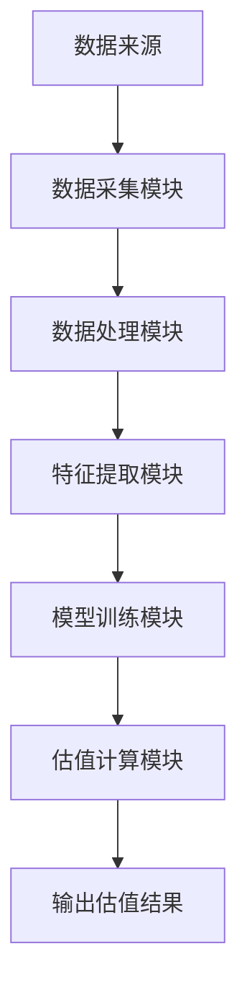
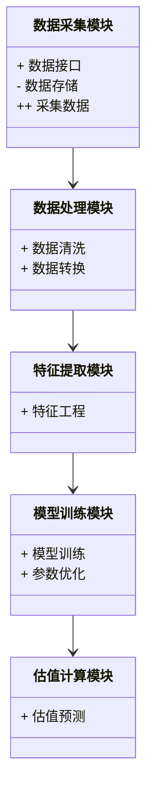
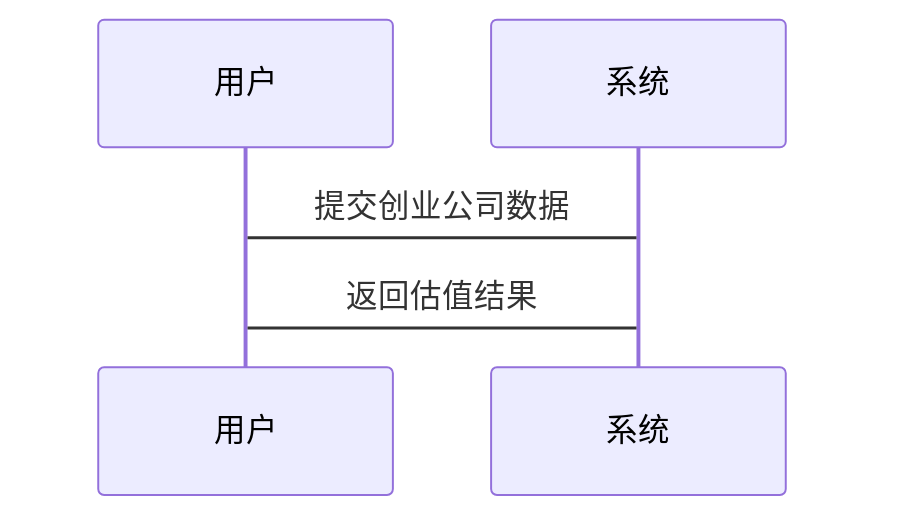

                 


# AI辅助的创业公司估值模型

## 关键词：创业公司估值模型，人工智能，机器学习，深度学习，自然语言处理，数据驱动

## 摘要：  
本文将详细探讨如何利用人工智能技术构建创业公司估值模型，通过结合机器学习、深度学习和自然语言处理等技术，分析创业公司的核心特征，建立数据驱动的估值模型，解决传统估值方法的局限性，实现更精准、更高效的创业公司估值。

---

# 1. 创业公司估值模型的背景与核心概念

## 1.1 创业公司的定义与特点

### 1.1.1 创业公司的基本定义  
创业公司是指由创业者创立的，旨在通过创新商业模式、产品或服务来实现商业价值的企业。这些公司通常处于早期阶段，具有高增长潜力，但也伴随着高风险。

### 1.1.2 创业公司的核心特征  
创业公司具有以下核心特征：  
1. **高风险性**：由于市场不确定性、竞争压力和资源有限性，创业公司的失败率较高。  
2. **高增长潜力**：成功的创业公司能够在短时间内实现业务的快速增长。  
3. **数据稀缺性**：早期创业公司可能缺乏足够的历史数据，传统估值方法难以适用。  
4. **依赖创新**：创业公司依赖于创新的产品或商业模式，这使得估值更加复杂。  

### 1.1.3 创业公司面临的挑战与机遇  
创业公司面临的主要挑战包括：  
- 资金不足  
- 市场不确定性  
- 人才竞争  
- 产品开发风险  

同时，创业公司也面临机遇，尤其是在技术驱动的领域，人工智能和大数据技术的应用为创业公司提供了新的增长点。

---

## 1.2 创业公司估值的重要性

### 1.2.1 创业估值的目的与意义  
创业公司估值是创业过程中至关重要的一步，它决定了公司的市场定位、融资能力以及投资者的回报预期。准确的估值能够帮助创业者更好地规划企业发展，吸引潜在投资者，优化资源配置。

### 1.2.2 传统估值方法的局限性  
传统的创业公司估值方法主要包括：  
1. **DCF模型**：基于未来现金流的折现，适用于数据充足且稳定的公司，但创业公司往往缺乏足够的历史数据。  
2. **可比公司分析**：通过与同类公司对比进行估值，但创业公司往往具有独特性，难以找到完全可比的公司。  
3. **创业投资公式**：基于团队能力、市场潜力等因素进行综合评估，但主观性较强，难以量化。  

### 1.2.3 引入AI技术的必要性  
AI技术的应用可以帮助解决传统估值方法的局限性：  
- **数据驱动**：利用大数据分析，提取更多维度的信息，提升估值的准确性。  
- **自动化与实时性**：通过机器学习模型，实现自动化估值，快速响应市场变化。  
- **个性化与精细分析**：基于创业公司的独特特征，提供定制化估值方案。  

---

## 1.3 AI辅助创业公司估值的背景

### 1.3.1 AI技术的发展与应用  
人工智能技术近年来取得了显著进展，特别是在自然语言处理、计算机视觉和机器学习领域。这些技术的应用已经渗透到金融、医疗、教育等多个领域。

### 1.3.2 AI在金融领域的应用现状  
AI在金融领域的应用主要体现在：  
- **量化投资**：利用算法交易优化投资策略。  
- **风险管理**：通过大数据分析识别潜在风险。  
- **客户画像**：基于用户行为数据进行精准营销。  

### 1.3.3 AI在创业公司估值中的潜力  
AI技术在创业公司估值中的潜力体现在：  
- **多维度数据分析**：利用文本、图像等非结构化数据，提取更多价值信息。  
- **动态估值**：实时跟踪市场变化，动态调整估值模型。  
- **模式识别**：通过机器学习发现隐藏的市场规律，提升估值的准确性。  

---

## 1.4 本章小结  
本章从创业公司的定义与特点出发，分析了创业公司估值的重要性以及传统估值方法的局限性。在此基础上，探讨了AI技术在创业公司估值中的应用潜力，为后续章节奠定了理论基础。

---

# 2. AI模型与创业公司估值的关系

## 2.1 AI模型的基本原理

### 2.1.1 机器学习的基本概念  
机器学习是一种通过数据训练模型，使其能够从经验中学习并做出预测的技术。常用的机器学习算法包括：  
- **监督学习**：基于标注数据进行模型训练，如线性回归、支持向量机（SVM）。  
- **无监督学习**：基于未标注数据发现数据的内在结构，如聚类分析、主成分分析（PCA）。  
- **深度学习**：通过多层神经网络提取数据的高层次特征，如卷积神经网络（CNN）、循环神经网络（RNN）。  

### 2.1.2 深度学习的基本概念  
深度学习是一种特殊的机器学习技术，通过多层神经网络模拟人脑的神经网络结构，能够自动提取数据的高层次特征。深度学习在图像识别、自然语言处理等领域取得了显著成果。

### 2.1.3 自然语言处理的基本概念  
自然语言处理（NLP）是研究人类语言理解与生成的计算机科学分支。NLP技术可以帮助模型从文本数据中提取语义信息，如关键词提取、情感分析等。

---

## 2.2 创业公司估值模型中的AI技术应用

### 2.2.1 数据驱动的特征提取  
创业公司估值的关键在于准确提取公司特征。AI技术可以通过以下方式提取特征：  
- **文本数据**：从公司官网、新闻报道、招股说明书等文本数据中提取关键词、情感倾向等信息。  
- **结构化数据**：从财务报表、市场数据中提取收入、利润、增长率等指标。  
- **非结构化数据**：从社交媒体、视频、图片等非结构化数据中提取潜在信息。  

### 2.2.2 AI模型的训练与预测  
AI模型的训练与预测过程如下：  
1. **数据预处理**：清洗数据，处理缺失值，标准化数据。  
2. **特征工程**：提取关键特征，构建特征向量。  
3. **模型训练**：基于训练数据，训练机器学习或深度学习模型。  
4. **模型预测**：利用训练好的模型对新数据进行估值预测。  

---

## 2.3 AI模型在创业公司估值中的优势

### 2.3.1 提高估值的准确性  
AI模型能够从多维度数据中提取特征，捕捉传统方法难以发现的市场规律，从而提高估值的准确性。

### 2.3.2 实现自动化与实时性  
AI模型可以实现自动化估值，快速响应市场变化，为投资者提供实时的估值参考。

### 2.3.3 支持个性化估值  
AI模型可以根据创业公司的独特特征，提供定制化估值方案，满足不同投资者的需求。

---

## 2.4 本章小结  
本章从AI模型的基本原理出发，探讨了AI技术在创业公司估值中的应用，分析了AI模型在提高估值准确性、实现自动化与实时性以及支持个性化估值方面的优势。

---

# 3. 创业公司估值模型的算法原理

## 3.1 数据预处理与特征提取

### 3.1.1 数据预处理  
数据预处理是构建AI模型的基础，主要包括：  
- **清洗数据**：去除噪声数据、处理缺失值。  
- **数据转换**：将数据标准化或归一化，使其适合模型输入。  
- **数据增强**：通过增加数据多样性，提升模型的泛化能力。  

### 3.1.2 特征提取  
特征提取是将原始数据转换为模型可识别的特征向量。常用特征提取方法包括：  
- **文本特征提取**：使用TF-IDF提取关键词，或使用Word2Vec生成词向量。  
- **数值特征提取**：从财务数据中提取收入、利润等指标，进行主成分分析（PCA）。  
- **图像特征提取**：使用CNN提取图像的高层次特征。  

---

## 3.2 模型训练与优化

### 3.2.1 选择合适的算法  
根据问题类型选择合适的算法：  
- **回归算法**：用于连续值预测，如线性回归、支持向量回归（SVR）。  
- **分类算法**：用于分类问题，如随机森林、神经网络。  

### 3.2.2 模型训练  
模型训练包括以下步骤：  
1. **划分数据集**：将数据划分为训练集、验证集和测试集。  
2. **训练模型**：基于训练数据，训练AI模型。  
3. **调整参数**：通过交叉验证优化模型参数，防止过拟合或欠拟合。  

### 3.2.3 模型评估  
模型评估包括以下指标：  
- **均方误差（MSE）**：衡量预测值与真实值的差距。  
- **决定系数（R²）**：衡量模型解释数据的能力。  
- **准确率与召回率**：适用于分类问题。  

---

## 3.3 数学模型与公式

### 3.3.1 线性回归模型  
线性回归是一种简单而常用的回归算法，其数学公式为：  
$$ y = \beta_0 + \beta_1 x + \epsilon $$  
其中，$y$ 是目标变量，$x$ 是自变量，$\beta_0$ 和 $\beta_1$ 是模型参数，$\epsilon$ 是误差项。

### 3.3.2 支持向量回归（SVR）  
支持向量回归是一种基于支持向量机（SVM）的回归算法，其数学公式为：  
$$ y = \text{sign}(w \cdot x + b) $$  
其中，$w$ 是权重向量，$x$ 是输入向量，$b$ 是偏置项。

---

## 3.4 本章小结  
本章详细介绍了创业公司估值模型的算法原理，包括数据预处理、特征提取、模型训练与优化等内容。通过选择合适的算法和优化模型参数，可以提升估值模型的准确性和可靠性。

---

# 4. 系统分析与架构设计方案

## 4.1 问题场景介绍  
本节将介绍创业公司估值系统的应用场景，包括数据来源、用户需求等。

## 4.2 系统功能设计  
### 4.2.1 功能模块划分  
创业公司估值系统主要包括以下功能模块：  
- **数据采集模块**：从多种数据源获取创业公司数据。  
- **数据处理模块**：清洗、转换和增强数据。  
- **特征提取模块**：提取关键特征，构建特征向量。  
- **模型训练模块**：训练AI模型，优化模型参数。  
- **估值计算模块**：基于训练好的模型，进行创业公司估值。  

### 4.2.2 功能流程图  
以下是系统功能流程图：



---

## 4.3 系统架构设计

### 4.3.1 系统架构图  
以下是系统架构图：



---

## 4.4 系统接口设计  
系统接口设计包括数据输入接口和结果输出接口，确保系统与其他模块的无缝对接。

---

## 4.5 系统交互设计

### 4.5.1 交互流程图  
以下是系统交互流程图：



---

## 4.6 本章小结  
本章从系统角度出发，设计了创业公司估值系统的功能模块、架构和接口，为后续的项目实现奠定了基础。

---

# 5. 项目实战：AI辅助创业公司估值模型的实现

## 5.1 环境安装与配置

### 5.1.1 安装Python环境  
安装Python 3.8及以上版本，并安装必要的库，如NumPy、Pandas、Scikit-learn、Keras等。

### 5.1.2 安装Jupyter Notebook  
安装Jupyter Notebook，用于代码实现与展示。

---

## 5.2 数据采集与预处理

### 5.2.1 数据采集  
从公开数据源（如 Crunchbase、CB Insights）获取创业公司数据，包括财务数据、市场数据、团队信息等。

### 5.2.2 数据清洗  
处理缺失值、异常值，确保数据的完整性和准确性。

---

## 5.3 特征提取与模型训练

### 5.3.1 特征提取  
从文本、数值和图像数据中提取特征，构建特征向量。

### 5.3.2 模型训练  
选择合适的算法，训练模型，并进行参数优化。

---

## 5.4 模型实现与预测

### 5.4.1 实现代码示例  
以下是Python代码示例：

```python
import numpy as np
import pandas as pd
from sklearn.model_selection import train_test_split
from sklearn.linear_model import LinearRegression
from sklearn.metrics import mean_squared_error

# 加载数据
data = pd.read_csv('startup_data.csv')

# 分割特征与目标变量
X = data.drop('valuation', axis=1)
y = data['valuation']

# 数据分割
X_train, X_test, y_train, y_test = train_test_split(X, y, test_size=0.2, random_state=42)

# 模型训练
model = LinearRegression()
model.fit(X_train, y_train)

# 模型预测
y_pred = model.predict(X_test)

# 模型评估
mse = mean_squared_error(y_test, y_pred)
print(f"均方误差：{mse}")
```

### 5.4.2 模型优化  
通过交叉验证优化模型参数，提升模型性能。

---

## 5.5 实际案例分析

### 5.5.1 案例背景  
以一家早期创业公司为例，分析其估值过程。

### 5.5.2 数据分析与结果解读  
基于模型预测结果，分析公司的估值变化及其影响因素。

---

## 5.6 本章小结  
本章通过实际案例展示了AI辅助创业公司估值模型的实现过程，从数据采集到模型训练，再到结果预测，帮助读者理解模型的实际应用。

---

# 6. 最佳实践、注意事项与小结

## 6.1 最佳实践

### 6.1.1 数据质量的重要性  
确保数据的准确性和完整性，选择合适的数据来源。  

### 6.1.2 模型的可解释性  
在实际应用中，模型的可解释性非常重要，尤其是在金融领域。  

### 6.1.3 模型的持续优化  
定期更新模型，适应市场变化，提升估值的准确性。  

---

## 6.2 注意事项

### 6.2.1 数据隐私与合规性  
在数据采集和处理过程中，需遵守相关法律法规，保护数据隐私。  

### 6.2.2 模型的局限性  
AI模型可能存在过拟合或欠拟合的问题，需结合实际情况进行调整。  

### 6.2.3 结合专家知识  
AI模型的结果应结合行业专家的知识，进行综合判断。  

---

## 6.3 小结  
本文详细探讨了AI辅助创业公司估值模型的构建过程，从背景介绍到算法实现，再到系统设计与项目实战，为读者提供了全面的指导。  

---

## 6.4 拓展阅读  
- 《机器学习实战》  
- 《深度学习》  
- 《自然语言处理入门》  

---

# 7. 总结与展望

## 7.1 总结  
本文通过理论与实践相结合的方式，详细介绍了AI辅助创业公司估值模型的构建过程，展示了AI技术在创业公司估值中的巨大潜力。

## 7.2 展望  
未来，随着AI技术的不断发展，创业公司估值模型将更加智能化和精准化，为创业公司和投资者提供更有力的支持。

---

# 关键词：创业公司估值模型，人工智能，机器学习，深度学习，自然语言处理，数据驱动  

---

# 作者介绍  
作者是[您的姓名]，[您的身份]，专注于[您的领域]，致力于通过技术博客分享知识与经验。

