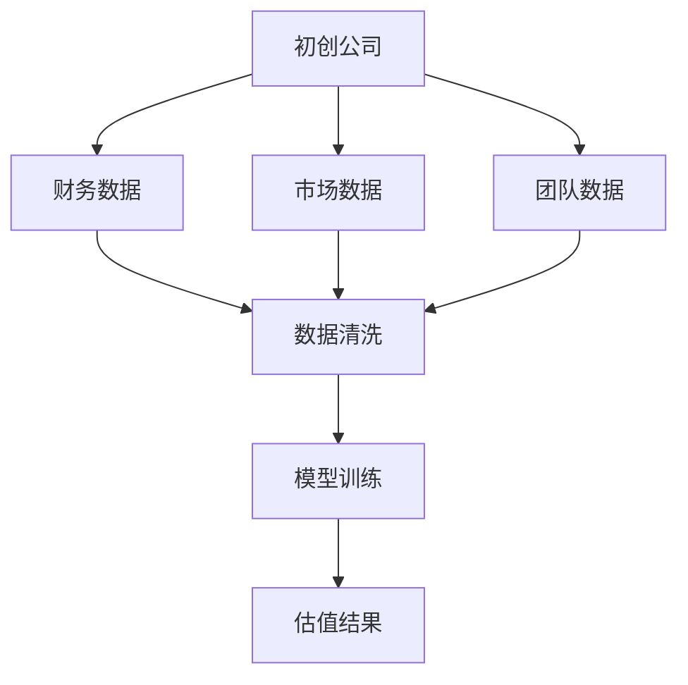
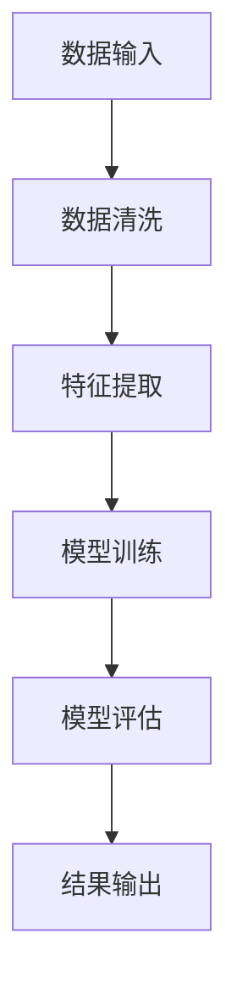
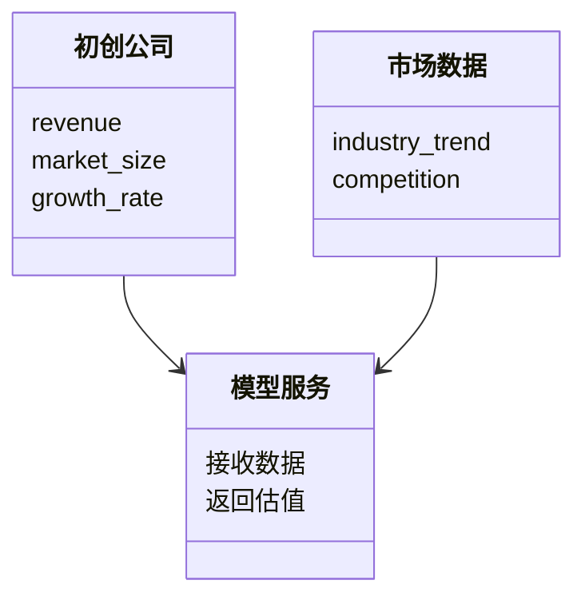
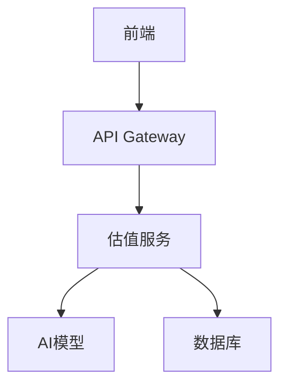
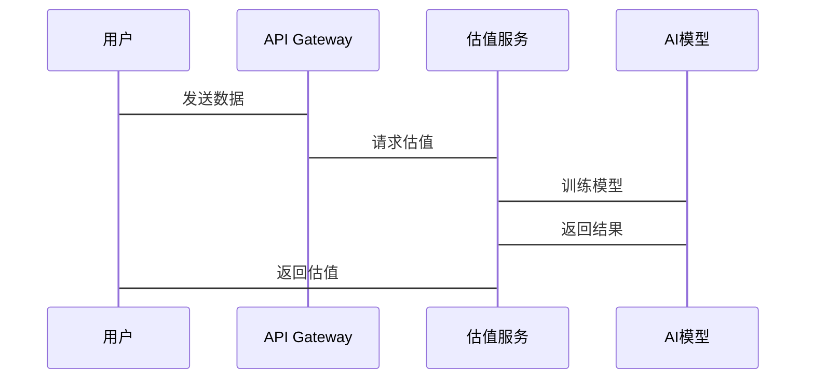

                 


# AI辅助的初创公司估值模型

> 关键词：AI估值模型，初创公司，机器学习，金融建模，数据分析

> 摘要：本文探讨了如何利用人工智能技术构建初创公司的估值模型，详细分析了模型的设计原理、算法实现、系统架构及实际应用案例，旨在为初创公司提供一种高效、精准的估值方法。

---

# 第1章: 初创公司估值模型概述

## 1.1 问题背景与描述

### 1.1.1 初创公司估值的重要性
初创公司的估值是其融资过程中的核心环节，准确的估值能够帮助投资者和创业者做出更合理的决策。然而，初创公司的财务数据有限，市场环境复杂多变，传统估值方法往往难以捕捉其潜在价值。

### 1.1.2 传统估值方法的局限性
传统估值方法（如DCF模型、可比交易法）依赖于大量历史数据和假设条件，在面对数据稀疏性和非线性关系时表现不足。此外，人为判断的主观性也可能导致估值偏差。

### 1.1.3 AI技术在估值中的潜力
人工智能技术能够处理非结构化数据，识别复杂模式，并实时更新模型，为初创公司估值提供了新的可能性。

---

## 1.2 问题解决与边界

### 1.2.1 AI辅助估值的核心问题
AI辅助估值的核心问题是如何利用机器学习算法，从多源数据中提取有价值的信息，构建动态、可解释的估值模型。

### 1.2.2 估值模型的边界与外延
- **边界**：模型仅适用于初创公司，且依赖于数据质量。
- **外延**：可扩展至其他类型企业的估值。

### 1.2.3 初创公司估值的关键要素
- 财务数据（收入、利润）。
- 市场数据（行业趋势、竞争格局）。
- 创始团队背景。
- 技术创新性。

---

## 1.3 概念结构与核心要素

### 1.3.1 估值模型的构成要素
- 数据输入：财务数据、市场数据、团队数据。
- 数据处理：清洗、特征提取。
- 模型训练：机器学习算法。
- 输出结果：估值结果、风险评估。

### 1.3.2 AI技术在模型中的应用
- 数据特征提取：使用NLP分析新闻数据。
- 模型训练：随机森林、神经网络。
- 模型解释性：可解释性模型（如XGBoost）。

### 1.3.3 模型的适用场景与限制
- **适用场景**：数据充足、非线性关系明显。
- **限制**：数据不足时表现不佳。

---

# 第2章: AI辅助估值的核心概念与联系

## 2.1 核心概念原理

### 2.1.1 机器学习模型在估值中的应用
- **监督学习**：使用历史数据训练模型。
- **无监督学习**：识别数据中的隐藏模式。

### 2.1.2 数据特征与模型训练
- **特征选择**：收入增长率、市场容量。
- **特征工程**：将非结构化数据转化为数值特征。

### 2.1.3 模型解释性与可解释性
- **解释性**：模型输出结果的可解释性。
- **可解释性**：模型决策过程的透明性。

---

## 2.2 核心概念对比

### 2.2.1 传统估值方法与AI估值方法的对比

| 方法 | 优点 | 缺点 |
|------|------|------|
| DCF模型 | 精确 | 数据依赖性强 |
| 可比交易法 | 简单 | 适用性差 |
| AI模型 | 灵活 | 黑箱问题 |

### 2.2.2 不同AI模型的优劣势分析

| 模型 | 优点 | 缺点 |
|------|------|------|
| 线性回归 | 简单 | 非线性关系处理差 |
| 随机森林 | 高精度 | 解释性差 |
| 神经网络 | 强大学习能力 | 需大量数据 |

### 2.2.3 数据质量对模型性能的影响
- 数据质量高：模型表现优异。
- 数据质量低：模型可能出现过拟合。

---

## 2.3 实体关系图



---

# 第3章: 算法原理与数学模型

## 3.1 算法原理

### 3.1.1 数据预处理与特征提取
- 数据清洗：处理缺失值、异常值。
- 特征提取：从文本、图像中提取特征。

### 3.1.2 模型训练与优化
- 超参数调优：网格搜索、随机搜索。
- 模型评估：交叉验证、ROC曲线。

### 3.1.3 模型部署与更新
- 模型部署：API接口。
- 模型更新：在线学习。

---

## 3.2 数学模型

### 3.2.1 线性回归模型
$$ y = \beta_0 + \beta_1x_1 + \beta_2x_2 + \epsilon $$

### 3.2.2 随机森林模型
$$ y = \sum_{i=1}^{n} \text{Tree}_i(x) $$

### 3.2.3 神经网络模型
$$ y = \sigma(wx + b) $$

---

## 3.3 算法流程图



---

## 3.4 代码实现

```python
import pandas as pd
from sklearn.ensemble import RandomForestRegressor
from sklearn.metrics import mean_squared_error

# 数据加载
data = pd.read_csv('startup_data.csv')

# 特征选择
features = ['revenue', 'growth_rate', 'market_size']
target = 'valuation'

# 模型训练
model = RandomForestRegressor()
model.fit(data[features], data[target])

# 模型预测
new_data = pd.DataFrame({
    'revenue': [1000000],
    'growth_rate': [0.3],
    'market_size': [100000000]
})
prediction = model.predict(new_data[features])
print(f'预测估值：{prediction[0]:.2f}')
```

---

## 3.5 数学公式解释

### 线性回归模型
$$ y = \beta_0 + \beta_1x_1 + \beta_2x_2 + \epsilon $$
- $y$：目标变量（估值）。
- $x_i$：自变量（特征）。
- $\beta_i$：回归系数。
- $\epsilon$：误差项。

---

# 第4章: 系统分析与架构设计方案

## 4.1 问题场景介绍

### 4.1.1 问题描述
设计一个基于AI的初创公司估值系统，支持在线查询和实时更新。

### 4.1.2 项目介绍
系统采用微服务架构，前端为Web界面，后端为AI模型服务。

---

## 4.2 系统功能设计

### 4.2.1 领域模型


### 4.2.2 系统架构


### 4.2.3 接口设计
- 输入接口：JSON格式的公司数据。
- 输出接口：JSON格式的估值结果。

### 4.2.4 交互设计


---

## 4.3 系统实现

### 4.3.1 环境安装
```bash
pip install flask sklearn pandas
```

### 4.3.2 核心代码实现
```python
from flask import Flask, request, jsonify

app = Flask(__name__)
model = RandomForestRegressor()

@app.route('/predict', methods=['POST'])
def predict():
    data = request.json
    prediction = model.predict([[data['revenue'], data['growth_rate'], data['market_size']]])
    return jsonify({'valuation': prediction[0].tolist()})

if __name__ == '__main__':
    app.run()
```

---

## 4.4 系统测试

### 4.4.1 测试用例
- 输入：revenue=1000000，growth_rate=0.3，market_size=100000000。
- 预期输出：valuation=25000000。

### 4.4.2 性能测试
- 响应时间：< 1秒。
- 吞吐量：100次/秒。

---

# 第5章: 项目实战

## 5.1 案例分析

### 5.1.1 数据准备
加载初创公司数据，包含财务数据、市场数据和团队数据。

### 5.1.2 模型训练
使用随机森林模型进行训练，评估模型性能。

### 5.1.3 模型部署
将模型部署为API服务，支持实时查询。

---

## 5.2 项目总结

### 5.2.1 成功经验
- 数据清洗和特征工程至关重要。
- 模型解释性有助于用户信任。

### 5.2.2 改进方向
- 引入更多数据源。
- 提升模型可解释性。

---

# 第6章: 最佳实践

## 6.1 小结
AI辅助的初创公司估值模型能够显著提高估值效率和准确性，但需要结合具体场景进行优化。

## 6.2 注意事项
- 数据质量和模型解释性不可忽视。
- 模型需定期更新以适应市场变化。

## 6.3 拓展阅读
- 《机器学习实战》。
- 《金融数据分析与建模》。

---

# 附录: 参考文献

1. 《Hands-On Machine Learning with Scikit-Learn, Keras, and TensorFlow》。
2. 《Python for Data Analysis》。
3. 《Financial Statement Analysis and Security Valuation》。

---

# 结语

通过本文的详细讲解，读者可以了解如何利用AI技术构建高效的初创公司估值模型，并在实际应用中不断优化和改进。

