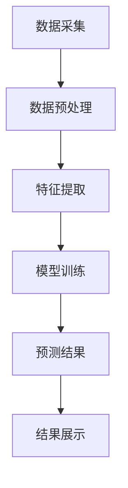
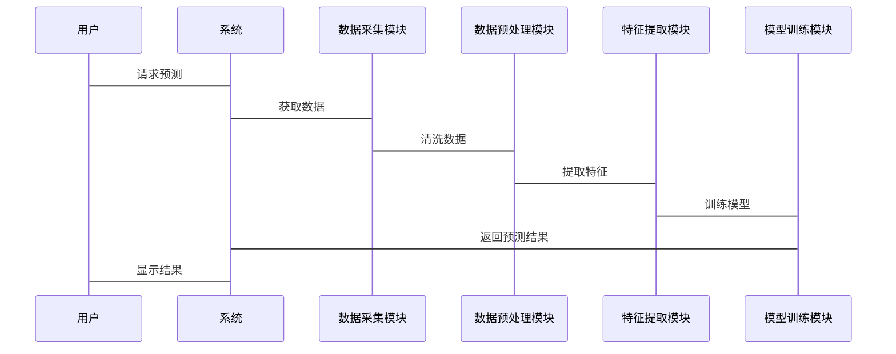

                 


# AI辅助的多资产类别收益率预测

## 关键词：AI，收益率预测，多资产类别，机器学习，深度学习，金融分析

## 摘要：  
本文探讨了人工智能在多资产类别收益率预测中的应用，分析了传统金融投资与AI技术结合的优势，详细讲解了机器学习算法在金融时间序列预测中的原理与实现。通过系统架构设计、算法对比与优化、项目实战案例分析，结合实际问题场景，为读者提供了从理论到实践的完整解决方案。文章最后总结了AI辅助多资产预测的最佳实践经验和未来研究方向。

---

# 第1章 AI在多资产类别收益率预测中的应用

## 1.1 多资产类别收益率预测的背景与意义

### 1.1.1 传统金融投资与收益率预测  
传统金融投资中，收益率预测是投资者制定投资策略的核心依据。然而，金融市场数据的复杂性、不确定性和非线性特征使得传统统计方法在预测精度和效率上受到限制。  

### 1.1.2 AI技术在金融领域的应用现状  
人工智能（AI）技术的快速发展为金融领域带来了革命性变化。通过机器学习算法，AI能够从海量数据中提取特征，发现传统方法难以捕捉的模式，从而显著提升预测精度。  

### 1.1.3 多资产类别预测的核心价值  
多资产类别预测能够帮助投资者在股票、债券、基金等多种资产之间进行优化配置，降低投资组合的风险，同时提高收益。AI技术的应用使得跨资产预测成为可能。  

---

## 1.2 AI辅助收益率预测的挑战与机遇

### 1.2.1 数据复杂性与多样性  
多资产类别数据具有异质性，不同资产的收益率波动特征差异显著。AI技术需要处理高频数据、缺失值、噪声干扰等复杂问题。  

### 1.2.2 模型的可解释性与稳定性  
金融市场的黑箱模型可能导致决策风险，模型的可解释性与稳定性是AI在金融领域应用的重要考量。  

### 1.2.3 技术进步带来的新可能  
深度学习、强化学习等技术的进步为多资产预测提供了新的工具和方法，特别是在处理时间序列数据和非线性关系方面表现突出。  

---

## 1.3 本书的核心目标与结构

### 1.3.1 本书的研究问题  
如何利用AI技术构建高效、稳定的多资产类别收益率预测模型？  

### 1.3.2 本书的主要目标  
通过理论分析与实践结合，为读者提供一套完整的AI辅助多资产预测解决方案。  

### 1.3.3 本书的章节安排  
- 第1章：背景与意义  
- 第2章：核心概念与联系  
- 第3章：算法原理与实现  
- 第4章：系统架构与设计  
- 第5章：项目实战与案例分析  
- 第6章：总结与展望  

---

# 第2章 多资产类别收益率预测的核心概念

## 2.1 资产类别与收益率预测的关系

### 2.1.1 股票、债券、基金等资产类别的特点  
- 股票：高风险、高收益，受市场情绪影响大。  
- 债券：低风险、低收益，受利率政策影响显著。  
- 基金：多样化投资，收益相对稳定。  

### 2.1.2 不同资产类别收益率预测的差异性  
不同资产的收益波动周期和驱动因素存在显著差异，例如股票受公司业绩影响，债券受利率影响，基金受市场整体波动影响。  

---

## 2.2 AI在多资产预测中的核心作用

### 2.2.1 数据处理与特征提取  
AI技术能够从海量数据中提取有意义的特征，例如通过自然语言处理技术分析新闻数据对资产价格的影响。  

### 2.2.2 模型选择与优化  
通过机器学习算法，AI能够自动优化模型参数，提高预测精度。  

### 2.2.3 结果解释与策略制定  
AI模型能够提供预测结果的解释性分析，帮助投资者制定最优的投资策略。  

---

## 2.3 多资产预测的核心要素分析

### 2.3.1 数据来源与质量  
数据来源的多样性和质量直接影响预测结果。例如，高频交易数据与宏观经济指标的结合能够提高预测精度。  

### 2.3.2 模型选择与调优  
不同资产类别适合不同的模型，例如股票适合使用LSTM模型，债券适合使用ARIMA模型。  

### 2.3.3 预测结果的验证与评估  
通过回测和风险指标（如VaR）评估模型的稳定性和可靠性。  

---

# 第3章 AI辅助多资产预测的算法原理

## 3.1 机器学习算法在多资产预测中的应用

### 3.1.1 线性回归模型  
#### 3.1.1.1 线性回归的基本原理  
线性回归通过最小化预测值与真实值之间的平方差，建立资产收益率与影响因素之间的线性关系。  

$$ y = \beta_0 + \beta_1x_1 + \beta_2x_2 + \dots + \beta_nx_n $$  

#### 3.1.1.2 线性回归在收益率预测中的应用  
适用于简单线性关系的场景，例如单资产短期预测。  

#### 3.1.1.3 线性回归的优缺点分析  
优点：简单易懂，计算速度快；缺点：无法捕捉非线性关系，适用性有限。  

---

### 3.1.2 随机森林与梯度提升树

#### 3.1.2.1 随机森林算法原理  
随机森林通过构建多棵决策树并对结果进行投票，提高模型的泛化能力。  

#### 3.1.2.2 XGBoost与LightGBM的对比  
XGBoost采用正则化损失函数，防止过拟合；LightGBM基于叶子评分，计算速度快。  

#### 3.1.2.3 集成学习在多资产预测中的优势  
集成学习能够有效降低模型的方差，提高预测稳定性。  

---

## 3.2 深度学习算法的应用

### 3.2.1 神经网络的基本结构  
神经网络通过多层非线性变换，能够捕捉数据中的复杂模式。  

### 3.2.2 RNN与LSTM在时间序列预测中的应用  
LSTM通过门控机制，有效解决RNN的梯度消失问题，适用于时间序列预测。  

$$ \text{LSTM} = \text{Forget Gate} + \text{Input Gate} + \text{Output Gate} $$  

### 3.2.3 Transformer架构的最新进展  
Transformer通过自注意力机制，能够捕捉数据中的长距离依赖关系。  

---

# 第4章 AI辅助多资产预测的系统架构

## 4.1 系统功能设计

### 4.1.1 数据采集与预处理模块  
- 数据来源：API接口、数据库、CSV文件。  
- 数据清洗：处理缺失值、异常值。  
- 数据标准化：统一数据格式，便于模型训练。  

### 4.1.2 特征提取与模型训练模块  
- 特征工程：提取技术指标、市场情绪指标。  
- 模型训练：选择适合的算法，训练预测模型。  

### 4.1.3 预测结果展示与策略制定模块  
- 结果可视化：绘制预测曲线与实际曲线对比。  
- 策略优化：根据预测结果调整投资组合。  

---

## 4.2 系统架构设计

### 4.2.1 系统架构图  


### 4.2.2 接口设计  
- 数据接口：API接口用于数据获取与推送。  
- 模型接口：标准化接口用于不同算法的调用。  

### 4.2.3 交互流程  


---

## 4.3 项目实战与案例分析

### 4.3.1 环境安装  
- Python 3.8+  
- 库：numpy、pandas、scikit-learn、xgboost、keras  

### 4.3.2 核心实现源代码  
```python
import numpy as np
import pandas as pd
from sklearn.ensemble import RandomForestRegressor
from sklearn.metrics import mean_absolute_error

# 数据加载
data = pd.read_csv('assets.csv')

# 特征与目标分离
X = data.drop(columns=['return'])
y = data['return']

# 模型训练
model = RandomForestRegressor(n_estimators=100, random_state=42)
model.fit(X, y)

# 预测与评估
y_pred = model.predict(X)
print(mean_absolute_error(y, y_pred))
```

### 4.3.3 案例分析  
以股票数据为例，通过随机森林模型预测股票收益率，并与实际收益率进行对比。  

### 4.3.4 项目小结  
通过实际案例分析，验证了AI技术在多资产预测中的有效性，并总结了模型优化的经验。  

---

## 第5章 总结与展望

### 5.1 项目总结  
AI技术为多资产类别收益率预测提供了新的工具和方法，显著提高了预测精度和效率。  

### 5.2 最佳实践 tips  
- 数据预处理是关键，确保数据质量和完整性。  
- 模型选择与调优需要结合实际场景。  
- 结果验证与解释性分析不可忽视。  

### 5.3 未来研究方向  
- 探索更先进的深度学习模型，如Transformer架构。  
- 结合强化学习优化投资策略。  

---

## 关键词回顾：AI，收益率预测，多资产类别，机器学习，深度学习，金融分析  

## 总结  
通过本文的系统分析与实践，读者可以全面了解AI技术在多资产类别收益率预测中的应用，并掌握从理论到实践的完整解决方案。

