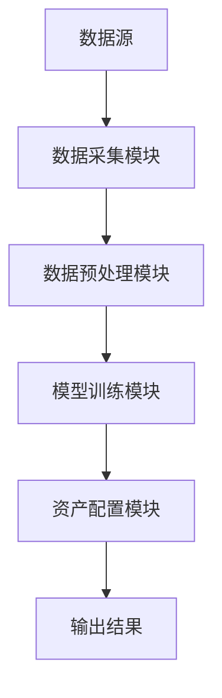

                 


# AI辅助的多资产类别收益率预测与资产配置

> 关键词：AI, 多资产类别, 收益率预测, 资产配置, 机器学习, 时间序列分析

> 摘要：本文将探讨如何利用人工智能技术辅助多资产类别收益率预测与资产配置。通过分析传统资产配置的局限性，结合AI技术的特点，提出基于机器学习和时间序列分析的多资产配置解决方案，旨在为投资者提供更高效、更精准的投资决策支持。

---

## 第一部分: 背景介绍

### 第1章: 问题背景与目标

#### 1.1 传统资产配置的局限性
传统的资产配置方法依赖于历史数据分析和人为经验判断，存在以下问题：
- 市场波动性高，传统方法难以捕捉复杂市场变化。
- 人工经验有限，难以覆盖多资产类别的复杂组合。
- 缺乏实时性，难以应对快速变化的市场环境。

#### 1.2 AI技术在金融领域的优势
人工智能技术在金融领域的应用具有以下优势：
- 数据处理能力强，能够处理海量金融数据。
- 模型复杂度高，能够捕捉非线性关系。
- 实时性好，能够快速响应市场变化。

#### 1.3 本文的目标
本文旨在通过AI技术实现多资产类别的收益率预测与资产配置，解决以下问题：
- 提供更精准的收益率预测。
- 实现动态资产配置。
- 提高投资组合的收益风险比。

---

## 第二部分: 核心概念与联系

### 第2章: 多资产类别与收益率预测

#### 2.1 多资产类别概述
- 股票：高风险、高收益。
- 债券：低风险、稳定收益。
- 基金：多样化投资，风险分散。
- 其他资产：如房地产、黄金等。

#### 2.2 收益率预测的核心指标
- 年化收益率（Annualized Return）。
- 风险指标（如波动率、最大回撤）。
- 收益率相关性。

#### 2.3 资产配置的优缺点对比
| 资产类别 | 优点 | 缺点 |
|----------|------|------|
| 股票     | 高收益 | 高风险 |
| 债券     | 稳定性 | 低收益 |
| 基金     | 分散风险 | 收益不稳定 |

### 第3章: AI技术的核心概念

#### 3.1 机器学习与深度学习
- 机器学习：通过训练数据模型，预测未来结果。
- 深度学习：通过多层神经网络，捕捉复杂特征。

#### 3.2 时间序列分析
- 时间序列：数据按时间顺序排列。
- 核心方法：ARIMA、LSTM。

#### 3.3 大数据与特征工程
- 数据来源：市场数据、宏观经济指标。
- 特征工程：提取有用特征，提升模型性能。

### 第4章: 核心概念的数学模型

#### 4.1 资产收益率的计算
$$ R = \frac{P_{t+1} - P_t}{P_t} $$

#### 4.2 线性回归模型
$$ y = \beta_0 + \beta_1x + \epsilon $$

#### 4.3 LSTM网络结构
- 输入门控：$$ i_t = \sigma(W_i x_t + U_i h_{t-1}) $$
- 遗忘门控：$$ f_t = \sigma(W_f x_t + U_f h_{t-1}) $$
- 输出门控：$$ o_t = \sigma(W_o x_t + U_o h_{t-1}) $$
- 状态更新：$$ c_t = i_t \cdot \tanh(W_c x_t + U_c h_{t-1}) $$
- 输出状态：$$ h_t = o_t \cdot \tanh(c_t) $$

---

## 第三部分: 算法原理

### 第5章: 时间序列预测算法

#### 5.1 ARIMA模型
- 优点：适合平稳时间序列。
- 缺点：难以捕捉非线性关系。

#### 5.2 LSTM网络
- 优点：适合时间序列数据，捕捉长期依赖关系。
- 缺点：训练时间长，参数多。

### 第6章: 资产配置算法

#### 6.1 均值-方差优化
- 目标：最小化风险，最大化收益。
- 公式：$$ \min \sigma^2 \quad \text{subject to} \quad \mu \cdot w = R $$

#### 6.2 风险平价法
- 优点：分散风险，避免单一资产风险过高。
- 缺点：依赖于假设，实际效果可能不佳。

---

## 第四部分: 系统分析与架构设计

### 第7章: 系统功能设计

#### 7.1 数据采集模块
- 从金融数据源获取多资产类别数据。
- 数据清洗与预处理。

#### 7.2 模型训练模块
- 选择合适的时间序列模型（如LSTM）。
- 训练模型并进行模型调优。

#### 7.3 资产配置模块
- 基于收益率预测结果，进行资产配置。
- 输出投资组合建议。

### 第8章: 系统架构设计

#### 8.1 系统架构图


#### 8.2 系统接口设计
- 输入接口：接收多资产数据。
- 输出接口：输出投资组合建议。

---

## 第五部分: 项目实战

### 第9章: 项目实战

#### 9.1 环境搭建
- 安装Python、TensorFlow、Keras等工具。

#### 9.2 核心代码实现
```python
import numpy as np
from tensorflow.keras.models import Sequential
from tensorflow.keras.layers import LSTM, Dense, Dropout

# 模型定义
model = Sequential()
model.add(LSTM(64, return_sequences=True, input_shape=(timesteps, features)))
model.add(Dropout(0.2))
model.add(LSTM(32, return_sequences=False))
model.add(Dense(1))
model.compile(loss='mean_squared_error', optimizer='adam')
```

#### 9.3 实际案例分析
- 使用LSTM模型预测股票和债券收益率。
- 基于预测结果进行资产配置。

---

## 第六部分: 最佳实践与总结

### 第10章: 最佳实践

#### 10.1 模型调优
- 参数调整：学习率、批次大小。
- 数据增强：增加数据多样性。

#### 10.2 数据处理
- 特征选择：提取有用的特征。
- 数据标准化：确保模型输入一致。

### 10.3 小结
本文通过AI技术实现多资产类别收益率预测与资产配置，为投资者提供了一种高效、精准的投资决策支持。未来，可以进一步研究更复杂的模型和优化策略。

---

通过以上内容，本文详细探讨了AI技术在多资产类别收益率预测与资产配置中的应用，从理论到实践，为读者提供了完整的解决方案。

