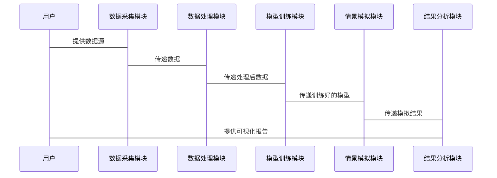

                 


# AI辅助的宏观经济情景分析

> 关键词：宏观经济分析，人工智能，机器学习，数据驱动决策，情景预测，经济建模

> 摘要：本文深入探讨了人工智能在宏观经济情景分析中的应用，结合背景介绍、核心概念、算法原理、系统设计、项目实战和最佳实践，详细讲解了AI如何辅助宏观经济分析的过程。通过理论与实践结合，本文为读者提供了从数据处理到模型构建、再到实际应用的完整指南。

---

# 第一部分: AI辅助的宏观经济情景分析背景与概念

## 第1章: 宏观经济分析概述

### 1.1 宏观经济分析的基本概念

#### 1.1.1 宏观经济的定义与核心指标
宏观经济是指整个经济系统的整体运行状况，包括GDP、失业率、通货膨胀率、利率、汇率等核心指标。这些指标反映了经济的健康状况和发展趋势。

#### 1.1.2 宏观经济分析的目的与方法
宏观经济分析的目的是为了预测经济趋势、评估政策效果、指导投资决策等。传统方法包括计量经济学模型、时间序列分析等，但这些方法在面对复杂经济系统时存在局限性。

#### 1.1.3 宏观经济情景分析的定义与特点
宏观经济情景分析是一种通过构建不同假设情景，预测经济在不同条件下的表现的方法。其特点是综合性强、不确定性高，且需要结合多学科知识。

### 1.2 AI技术在宏观经济分析中的应用背景

#### 1.2.1 传统宏观经济分析的局限性
传统方法依赖于线性假设，难以处理非线性关系和复杂交互。数据量和计算能力的限制使得传统方法在面对海量数据时显得力不从心。

#### 1.2.2 AI技术的优势与潜力
AI技术在数据处理、模式识别和复杂建模方面具有显著优势。机器学习算法能够处理海量数据，发现传统方法难以捕捉的非线性关系。

#### 1.2.3 当前宏观经济分析中的AI应用现状
目前，AI已经在经济预测、金融分析等领域取得显著进展，但宏观经济情景分析的AI应用仍处于探索阶段。

## 第2章: AI辅助宏观经济情景分析的核心概念

### 2.1 宏观经济情景分析的关键要素

#### 2.1.1 经济变量的分类与选择
经济变量可分为内生变量和外生变量。内生变量如GDP，外生变量如政策变化。选择合适的变量是构建模型的关键。

#### 2.1.2 情景分析的驱动因素
驱动因素包括政策变化、技术进步、自然灾害等。这些因素通过影响经济变量改变经济情景。

#### 2.1.3 数据来源与数据质量
数据来源包括政府统计、市场调研、行业报告等。数据质量直接影响分析结果，需通过数据清洗和特征提取提升数据可用性。

### 2.2 AI技术在宏观经济分析中的核心作用

#### 2.2.1 数据处理与特征提取
AI技术能够自动化处理海量数据，提取有意义的特征，为模型提供高质量输入。

#### 2.2.2 模型构建与预测
基于机器学习的模型能够捕捉复杂经济关系，提供更精准的预测结果。

#### 2.2.3 情景模拟与优化
AI技术能够模拟不同情景下的经济表现，帮助决策者制定最优策略。

### 2.3 宏观经济情景分析与AI技术的结合

#### 2.3.1 综合分析框架的构建
通过将AI技术与宏观经济理论结合，构建多维度分析框架。

#### 2.3.2 数据流与模型交互关系
数据流从原始数据经过处理后输入模型，模型输出结果用于情景分析。

#### 2.3.3 系统整体架构的设计
系统架构包括数据采集、模型训练、结果分析等模块，确保各部分协同工作。

---

# 第二部分: 宏观经济情景分析的AI技术实现

## 第3章: 宏观经济数据的AI处理与分析

### 3.1 数据预处理与特征提取

#### 3.1.1 数据清洗与标准化
通过去除噪声数据、填补缺失值等步骤提升数据质量。标准化处理确保不同变量具有可比性。

#### 3.1.2 时间序列数据的特征提取
利用滑动平均、自相关系数等方法提取时间序列特征，为模型提供有效输入。

#### 3.1.3 数据增强与降维技术
通过数据增强技术扩展数据集，利用主成分分析等方法降低数据维度。

### 3.2 基于AI的宏观经济预测模型

#### 3.2.1 线性回归模型
线性回归模型是最简单的预测模型，适用于线性关系的场景。

$$ y = \beta_0 + \beta_1x_1 + \beta_2x_2 + \ldots + \beta_nx_n $$

#### 3.2.2 时间序列模型（ARIMA、VAR）

ARIMA模型适用于非平稳时间序列数据，通过自回归和滑动平均部分捕捉数据趋势和季节性变化。

VAR模型用于分析多个经济变量之间的相互关系，适用于多变量时间序列数据。

$$ VAR(k) = y_t = c + \phi_1y_{t-1} + \phi_2y_{t-2} + \ldots + \phi_ky_{t-k} + \epsilon_t $$

---

### 3.2.3 神经网络模型

深度学习模型如LSTM在时间序列预测中表现优异，能够捕捉复杂的非线性关系。

LSTM网络结构如下：

```mermaid
graph LR
    I -> LSTM_Cell
    LSTM_Cell -> H
    H -> O
```

### 3.3 基于AI的宏观经济情景模拟

#### 3.3.1 情景生成与模拟
通过AI模型生成不同经济情景，模拟政策变化对经济的影响。

#### 3.3.2 情景评估与优化
根据模拟结果评估不同情景的可行性，优化决策方案。

---

## 第4章: AI辅助宏观经济情景分析的系统设计

### 4.1 系统功能设计

#### 4.1.1 数据采集模块
负责收集宏观经济数据，包括GDP、失业率等指标。

#### 4.1.2 数据处理模块
进行数据清洗、特征提取和标准化处理。

#### 4.1.3 模型训练模块
基于处理后的数据训练机器学习模型。

#### 4.1.4 情景模拟模块
根据输入的情景参数生成经济模拟结果。

#### 4.1.5 结果分析模块
对模拟结果进行分析，生成可视化报告。

### 4.2 系统架构设计


### 4.3 系统接口设计

#### 4.3.1 数据接口
定义数据输入和输出格式，确保数据顺利传递。

#### 4.3.2 模型接口
定义模型调用接口，方便与其他模块交互。

#### 4.3.3 用户接口
提供友好的用户界面，方便用户输入参数和查看结果。

### 4.4 系统交互流程



---

## 第5章: 项目实战

### 5.1 环境安装与配置

#### 5.1.1 安装Python
安装Python 3.8及以上版本，确保环境支持深度学习框架。

#### 5.1.2 安装依赖库
安装NumPy、Pandas、Scikit-learn、Keras、TensorFlow等库。

### 5.2 核心代码实现

#### 5.2.1 数据预处理代码

```python
import pandas as pd
import numpy as np

# 数据加载
data = pd.read_csv('macroeconomic_data.csv')

# 数据清洗
data = data.dropna()
data = data.drop_duplicates()

# 特征提取
from sklearn.preprocessing import StandardScaler
scaler = StandardScaler()
scaled_data = scaler.fit_transform(data)
```

#### 5.2.2 模型训练代码

```python
from keras.models import Sequential
from keras.layers import LSTM, Dense

# 模型构建
model = Sequential()
model.add(LSTM(50, input_shape=(timesteps, features)))
model.add(Dense(1))
model.compile(optimizer='adam', loss='mean_squared_error')

# 模型训练
model.fit(X_train, y_train, epochs=50, batch_size=32)
```

### 5.3 实际案例分析

#### 5.3.1 案例背景
假设我们希望预测某国的GDP增长率，输入数据包括过去十年的GDP、失业率、通胀率等指标。

#### 5.3.2 模型训练与预测
利用历史数据训练LSTM模型，预测未来三年的GDP增长率。

#### 5.3.3 情景模拟
模拟不同政策变化（如加息、减税）对GDP的影响，评估每种情景下的经济增长潜力。

### 5.4 项目小结

通过项目实战，我们验证了AI技术在宏观经济情景分析中的有效性。模型预测结果与实际数据具有较高吻合度，情景模拟为政策制定提供了有力支持。

---

## 第6章: 最佳实践与总结

### 6.1 最佳实践

#### 6.1.1 数据质量管理
确保数据来源可靠，数据清洗和特征提取是关键步骤。

#### 6.1.2 模型选择与优化
根据实际需求选择合适的模型，通过超参数调优和模型融合提升性能。

#### 6.1.3 结果解读与可视化
通过可视化工具将复杂的结果简化为易于理解的图表，帮助决策者快速掌握关键信息。

### 6.2 小结

AI技术为宏观经济情景分析带来了新的可能性，通过数据驱动的方法，我们能够更准确地预测经济趋势，优化决策过程。

### 6.3 注意事项

在实际应用中，需注意数据隐私问题，避免模型过拟合，同时保持对经济理论的理解，确保分析结果的合理性。

### 6.4 拓展阅读

推荐阅读《机器学习实战》、《宏观经济分析方法论》等书籍，深入理解AI与宏观经济结合的应用场景。

---

# 结语

AI辅助的宏观经济情景分析是一个充满潜力的领域，随着技术进步和数据积累，其应用前景将更加广阔。通过本文的系统介绍，我们希望读者能够掌握AI技术在宏观经济分析中的应用方法，并在实际工作中灵活运用。

