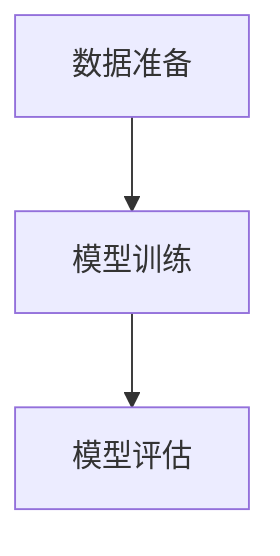
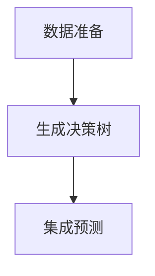
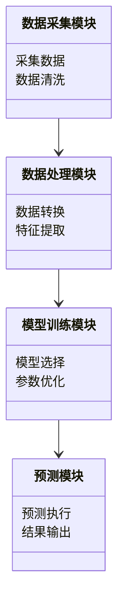
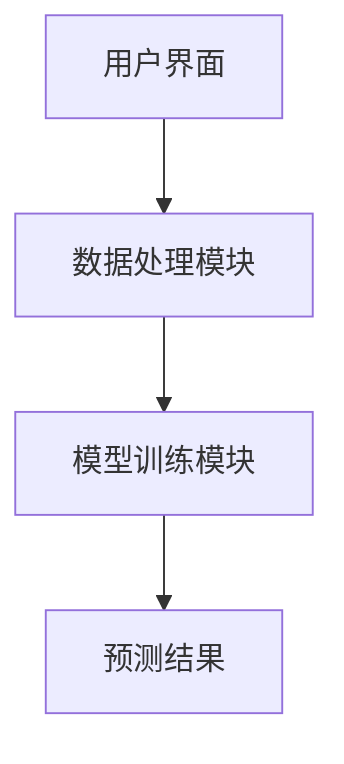
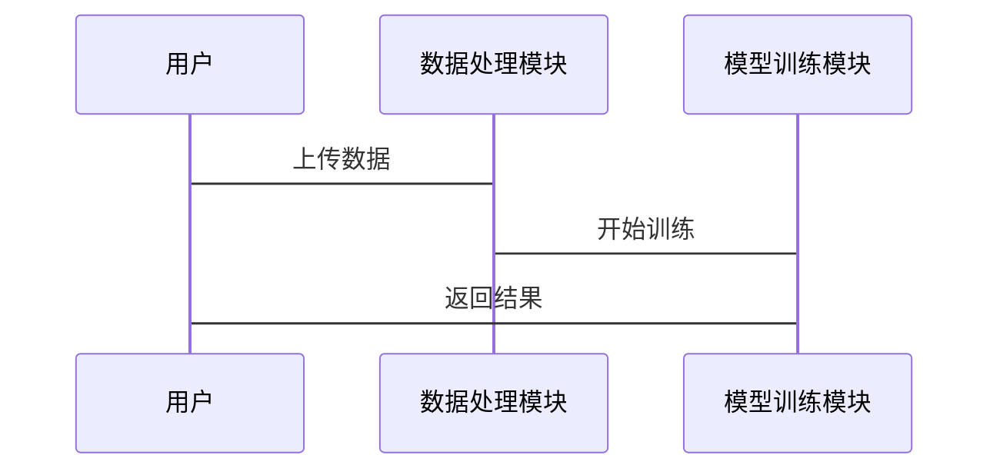

                 


# AI辅助的宏观经济指标预测

> 关键词：宏观经济指标、人工智能、机器学习、深度学习、预测模型、数据科学

> 摘要：本文探讨了人工智能技术在宏观经济指标预测中的应用，从理论基础到算法实现，再到系统架构设计，系统地分析了AI如何辅助宏观经济预测。文章首先介绍了宏观经济指标的基本概念及其预测的重要性，随后详细讲解了AI技术的核心概念、常用算法及其原理，接着分析了宏观经济预测系统的架构设计，最后通过一个实际项目案例展示了AI辅助预测的实现过程，并总结了最佳实践和未来研究方向。

---

## 第一章：宏观经济指标预测的背景与概述

### 1.1 宏观经济指标的定义与作用

#### 1.1.1 宏观经济指标的基本概念
宏观经济指标是反映经济整体运行状况的重要数据，主要包括国内生产总值（GDP）、通货膨胀率、失业率、工业生产指数（IP）、消费者价格指数（CPI）等。这些指标能够帮助政策制定者、经济学家和市场参与者更好地理解经济走势。

#### 1.1.2 宏观经济指标在经济分析中的作用
- **政策制定**：政府通过分析宏观经济指标来制定货币政策和财政政策。
- **市场预测**：企业利用宏观经济指标进行市场分析和投资决策。
- **学术研究**：宏观经济指标是经济学研究的重要数据来源。

### 1.2 AI技术在宏观经济预测中的应用背景

#### 1.2.1 宏观经济预测的传统方法与局限性
传统宏观经济预测方法主要依赖于经济理论和统计模型，如回归分析和时间序列分析。这些方法在一定程度上能够揭示经济变量之间的关系，但在面对复杂性和不确定性时显得力不从心。

#### 1.2.2 AI技术在经济预测中的优势
AI技术，特别是机器学习和深度学习，能够处理海量数据，发现传统方法难以捕捉的复杂模式，从而提高预测的准确性和及时性。

### 1.3 宏观经济预测的挑战与机遇

#### 1.3.1 数据的复杂性与不完整性
宏观经济数据往往受到多种因素的影响，且可能存在缺失或噪声。

#### 1.3.2 模型的可解释性与鲁棒性
AI模型的黑箱特性使得解释预测结果变得困难，同时模型的鲁棒性也是一个重要挑战。

---

## 第二章：宏观经济指标预测的核心概念

### 2.1 宏观经济指标的分类与特征

#### 2.1.1 主要宏观经济指标及其分类
- **总量指标**：如GDP、国民收入。
- **结构指标**：如产业结构比例。
- **价格指标**：如CPI、PPI。

#### 2.1.2 各类指标的特征分析
- **时间序列性**：宏观经济指标通常具有明显的时序特征。
- **相关性**：不同指标之间可能存在较强的相关性。

### 2.2 AI辅助预测的核心原理

#### 2.2.1 数据驱动的预测方法
AI预测的核心在于从历史数据中提取特征，建立预测模型。

#### 2.2.2 模型的选择与优化
选择合适的模型并进行参数优化是提高预测准确性的关键。

### 2.3 宏观经济预测的系统架构

#### 2.3.1 数据采集与处理流程
- 数据清洗：去除噪声数据。
- 数据转换：将数据转换为模型可处理的形式。

#### 2.3.2 模型训练与评估体系
- 训练数据集：用于模型训练。
- 测试数据集：用于模型评估。

---

## 第三章：算法原理与流程图

### 3.1 常用算法的原理

#### 3.1.1 线性回归算法

##### 3.1.1.1 线性回归的数学模型
$$ y = \beta_0 + \beta_1x + \epsilon $$

##### 3.1.1.2 线性回归的实现步骤
1. 数据准备。
2. 模型训练。
3. 模型评估。

##### 3.1.1.3 线性回归的应用场景
- 简单线性关系的预测。

#### 3.1.2 随机森林算法

##### 3.1.2.1 随机森林的数学模型
随机森林通过集成多个决策树来提高预测准确性。

##### 3.1.2.2 随机森林的实现步骤
1. 生成多个决策树。
2. 集成预测结果。

##### 3.1.2.3 随机森林的应用场景
- 处理高维数据。

### 3.2 算法流程图

#### 3.2.1 线性回归流程图



#### 3..2.2 随机森林流程图



---

## 第四章：系统分析与架构设计方案

### 4.1 问题场景介绍

#### 4.1.1 宏观经济预测系统的功能需求
- 数据采集与处理。
- 模型训练与预测。
- 结果展示与分析。

### 4.2 项目介绍

#### 4.2.1 项目目标
构建一个基于AI的宏观经济预测系统。

### 4.3 系统功能设计

#### 4.3.1 领域模型Mermaid类图



### 4.4 系统架构设计

#### 4.4.1 Mermaid架构图



### 4.5 系统接口设计

#### 4.5.1 API接口

- 数据接口：`/api/data/upload`
- 模型接口：`/api/model/train`

### 4.6 系统交互设计

#### 4.6.1 Mermaid序列图



---

## 第五章：项目实战

### 5.1 环境安装

#### 5.1.1 安装Python
```bash
python --version
pip install --upgrade pip
```

#### 5.1.2 安装依赖库
```bash
pip install numpy pandas scikit-learn
```

### 5.2 系统核心实现源代码

#### 5.2.1 数据采集与处理
```python
import pandas as pd
import numpy as np

# 数据采集
data = pd.read_csv('macroeconomic.csv')

# 数据清洗
data = data.dropna()
```

#### 5.2.2 模型训练与预测
```python
from sklearn.ensemble import RandomForestRegressor
from sklearn.model_selection import train_test_split

# 数据分割
X_train, X_test, y_train, y_test = train_test_split(data.drop('GDP', axis=1), data['GDP'], test_size=0.2)

# 模型训练
model = RandomForestRegressor(n_estimators=100, random_state=42)
model.fit(X_train, y_train)

# 预测
y_pred = model.predict(X_test)
```

### 5.3 代码应用解读与分析

#### 5.3.1 数据处理模块
- 读取CSV文件中的数据。
- 删除缺失值。

#### 5.3.2 模型训练模块
- 使用随机森林模型进行训练。
- 调参：设置树的数量为100，随机种子为42。

#### 5.3.3 预测模块
- 使用测试数据进行预测。
- 输出预测结果。

### 5.4 实际案例分析

#### 5.4.1 数据来源
使用某国的宏观经济数据，包括GDP、CPI、失业率等。

#### 5.4.2 模型评估
计算预测结果与实际值的误差，评估模型的准确性。

### 5.5 项目小结

#### 5.5.1 成功经验
- 数据清洗和特征工程的重要性。
- 模型选择和调参的影响。

#### 5.5.2 改进建议
- 引入更多数据源，如外部经济指标。
- 尝试其他模型，如LSTM网络。

---

## 第六章：最佳实践与小结

### 6.1 最佳实践

#### 6.1.1 数据处理
- 确保数据的完整性和准确性。
- 进行特征工程，提取有用的特征。

#### 6.1.2 模型选择
- 根据数据特点选择合适的模型。
- 进行模型融合，提高预测准确性。

### 6.2 小结

#### 6.2.1 全文总结
本文系统地介绍了AI技术在宏观经济指标预测中的应用，从算法原理到系统架构，再到实际项目案例，全面展示了AI在经济预测中的潜力和价值。

#### 6.2.2 注意事项
- 模型的可解释性需要重视。
- 数据隐私和安全问题不容忽视。

### 6.3 拓展阅读

#### 6.3.1 推荐书籍
- 《机器学习实战》
- 《深度学习入门：基于Python的理论与实践》

#### 6.3.2 推荐博客
- Towards Data Science：https://towardsdatascience.com
- Analytics Vidhya：https://www.analyticsvidhya.com

---

## 作者简介

作者是[您的姓名]，[您的职位]，在[公司/机构]工作，专注于[领域]。主要研究方向包括[具体研究方向]，发表过多篇技术博客和论文。

---

希望这篇文章能够帮助读者深入了解AI在宏观经济指标预测中的应用，并为实际项目提供有价值的参考和指导。

