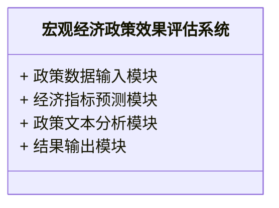
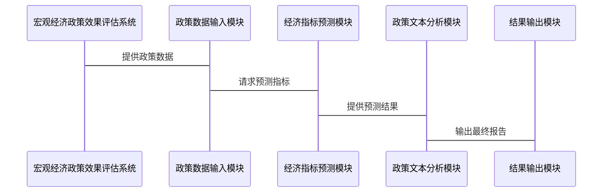

                 


# AI辅助的宏观经济政策效果评估

> 关键词：宏观经济政策，人工智能，政策效果评估，机器学习，时间序列分析

> 摘要：本文探讨了如何利用人工智能技术辅助宏观经济政策效果的评估。通过分析宏观经济政策的基本概念、AI技术的核心优势、AI算法在政策评估中的应用，以及构建一个基于机器学习的宏观经济政策效果评估系统。文章详细介绍了系统架构设计、算法实现、项目实战案例，并总结了AI辅助宏观经济政策效果评估的优势与未来发展方向。

---

## 第1章: 宏观经济政策效果评估的背景与问题

### 1.1 宏观经济政策的基本概念

#### 1.1.1 宏观经济政策的定义与目标
- 宏观经济政策是指政府或中央银行为了实现特定经济目标而采取的措施，包括货币政策、财政政策、产业政策等。
- 宏观经济政策的主要目标包括稳定经济增长、控制通货膨胀、促进充分就业、平衡国际收支等。

#### 1.1.2 宏观经济政策的主要工具与手段
- **货币政策工具**：包括调整基准利率、存款准备金率、公开市场操作等。
- **财政政策工具**：包括政府支出、税收调整、国债发行等。
- **产业政策工具**：包括行业补贴、税收优惠、贸易政策等。

#### 1.1.3 宏观经济政策的实施主体与作用机制
- 宏观经济政策的主要实施主体是政府和中央银行。
- 政策通过影响市场参与者的行为（如消费者、企业和投资者）来调节经济运行。

---

### 1.2 宏观经济政策效果评估的挑战

#### 1.2.1 宏观经济数据的复杂性与不完全性
- 宏观经济数据通常涉及多维度的变量（如GDP、CPI、失业率等），且数据之间可能存在复杂的相互作用。
- 数据的不完全性可能导致模型预测的不确定性。

#### 1.2.2 宏观经济政策的多目标冲突
- 宏观经济政策往往需要在多个目标之间进行权衡，例如经济增长与通货膨胀控制之间的冲突。

#### 1.2.3 宏观经济模型的局限性与不确定性
- 传统的宏观经济模型可能难以捕捉复杂的经济动态，且模型参数的选择可能影响预测结果。

---

### 1.3 AI技术在宏观经济政策评估中的潜力

#### 1.3.1 AI技术的基本概念与优势
- AI技术通过大数据分析和机器学习算法，能够发现传统模型难以捕捉的非线性关系。
- AI技术能够处理海量数据，提高政策评估的准确性和效率。

#### 1.3.2 宏观经济政策评估中的AI应用现状
- 当前，AI技术在宏观经济预测、政策文本分析等方面已有初步应用。
- 例如，利用自然语言处理技术分析政策文本，提取关键信息。

#### 1.3.3 AI辅助宏观经济政策评估的核心优势
- 提高政策评估的效率和准确性。
- 能够处理复杂的数据关系，发现潜在的经济规律。

---

## 第2章: AI辅助宏观经济政策效果评估的核心概念

### 2.1 宏观经济政策效果评估的理论框架

#### 2.1.1 宏观经济政策效果的定义与评价指标
- 宏观经济政策效果是指政策实施后对经济运行的实际影响。
- 常用的评价指标包括GDP增长率、失业率、通货膨胀率等。

#### 2.1.2 宏观经济政策效果的评价方法
- 定量分析法：通过统计模型评估政策对经济变量的影响。
- 定性分析法：通过专家意见或案例分析评价政策效果。

#### 2.1.3 宏观经济政策效果的评价流程
1. 确定评价目标和指标。
2. 收集相关数据。
3. 构建评价模型。
4. 进行模型验证和优化。
5. 输出评价结果。

---

### 2.2 AI辅助评估的核心技术

#### 2.2.1 机器学习在宏观经济分析中的应用
- **监督学习**：用于预测经济变量，如GDP增长率。
- **无监督学习**：用于发现数据中的潜在模式，如市场细分。

#### 2.2.2 自然语言处理在政策文本分析中的应用
- 利用NLP技术分析政策文本，提取关键词和主题。
- 通过主题模型（如LDA）分析政策文件的内容。

#### 2.2.3 时间序列分析与宏观经济预测
- 利用时间序列分析预测未来的经济指标，如使用ARIMA模型预测GDP增长率。

---

### 2.3 宏观经济政策效果评估的AI模型架构

#### 2.3.1 数据输入与特征提取
- 数据来源：宏观经济指标、政策文本、市场数据等。
- 特征提取：将文本数据转化为数值特征，如TF-IDF向量。

#### 2.3.2 模型训练与优化
- 选择合适的机器学习算法，如随机森林、梯度提升树。
- 进行模型调参和交叉验证。

#### 2.3.3 结果输出与解释
- 输出政策效果的量化指标。
- 解释模型结果，提供政策建议。

---

### 2.4 核心概念对比分析

#### 2.4.1 宏观经济政策与微观经济行为的对比
- 宏观经济政策关注整体经济运行，微观经济行为关注个体市场参与者的行为。

#### 2.4.2 AI模型与传统宏观经济模型的对比
- 传统模型：基于经济学理论构建模型，可能难以捕捉复杂关系。
- AI模型：基于数据驱动，能够发现非线性关系。

#### 2.4.3 不同AI算法在政策评估中的适用性对比
- 线性回归：适用于线性关系的预测。
- 支持向量机：适用于高维数据的分类和回归。
- LSTM：适用于时间序列数据的预测。

---

### 2.5 本章小结

---

## 第3章: 宏观经济政策效果评估的AI算法原理

### 3.1 机器学习算法在宏观经济分析中的应用

#### 3.1.1 线性回归模型
- **公式**：$y = \beta_0 + \beta_1x + \epsilon$
- **应用**：用于预测经济指标，如GDP增长率。

#### 3.1.2 支持向量机（SVM）
- **原理**：通过构建超平面将数据分为不同类别。
- **应用**：用于经济分类问题，如判断经济周期的阶段。

#### 3.1.3 随机森林与梯度提升树
- **随机森林**：通过集成多个决策树提高模型鲁棒性。
- **梯度提升树**：通过不断优化模型损失函数。

---

### 3.2 时间序列分析与宏观经济预测

#### 3.2.1 ARIMA模型
- **公式**：$ARIMA(p, d, q)$
- **应用**：用于预测经济指标的时间序列数据。

#### 3.2.2 GARCH模型
- **公式**：$r_t = \alpha_0 + \alpha_1r_{t-1} + \beta_1\sigma_{t-1}^2 + \epsilon_t$
- **应用**：用于预测金融市场的波动性。

#### 3.2.3 LSTM网络在时间序列预测中的应用
- **原理**：通过长短期记忆网络捕捉时间序列的长程依赖关系。
- **应用**：用于预测股票价格、外汇汇率等。

---

### 3.3 自然语言处理在政策文本分析中的应用

#### 3.3.1 文本预处理与特征提取
- **文本预处理**：分词、去除停用词、标点符号处理。
- **特征提取**：使用TF-IDF提取关键词。

#### 3.3.2 基于词嵌入的政策文本分析
- **词嵌入**：如Word2Vec、GloVe。
- **应用**：用于政策文本的主题分析。

#### 3.3.3 基于Transformer的政策文本理解
- **原理**：通过自注意力机制捕捉文本中的语义关系。
- **应用**：用于政策文本的语义分析。

---

### 3.4 综合AI模型的构建与优化

#### 3.4.1 混合模型的设计思路
- 结合机器学习和深度学习模型，如集成学习。

#### 3.4.2 模型调参与优化策略
- 使用交叉验证选择最优参数。
- 采用网格搜索优化模型性能。

#### 3.4.3 模型的可解释性与结果验证
- 使用特征重要性分析解释模型结果。
- 通过对比实验验证模型的有效性。

---

### 3.5 本章小结

---

## 第4章: 宏观经济政策效果评估的系统架构设计

### 4.1 系统功能需求分析

#### 4.1.1 数据采集与预处理
- 数据来源：政府发布的经济数据、政策文件、市场数据等。
- 数据清洗：处理缺失值、异常值。

#### 4.1.2 模型构建与训练
- 根据需求选择合适的AI算法，构建模型。

#### 4.1.3 结果分析与可视化
- 将模型预测结果与实际数据进行对比，生成可视化报告。

---

### 4.2 系统功能设计

#### 4.2.1 领域模型（Mermaid类图）


#### 4.2.2 系统架构设计（Mermaid架构图）


---

### 4.3 系统接口设计与交互流程

#### 4.3.1 系统接口设计
- API接口：用于数据输入和结果输出。

#### 4.3.2 系统交互流程（Mermaid序列图）


---

### 4.4 本章小结

---

## 第5章: 项目实战——基于机器学习的宏观经济政策效果评估

### 5.1 环境安装与数据准备

#### 5.1.1 环境安装
- 安装Python、机器学习库（如scikit-learn、xgboost）和数据处理库（如pandas、numpy）。

#### 5.1.2 数据准备
- 下载宏观经济数据（如GDP、CPI）和政策文本数据。

---

### 5.2 系统核心实现源代码

#### 5.2.1 数据预处理代码
```python
import pandas as pd
import numpy as np

# 读取数据
data = pd.read_csv('macroeconomic_data.csv')

# 数据清洗
data.dropna(inplace=True)
data = data[~data['policy_text'].isnull()]
```

#### 5.2.2 模型训练代码
```python
from sklearn.ensemble import RandomForestRegressor
from sklearn.model_selection import train_test_split
from sklearn.metrics import mean_squared_error

# 划分训练集和测试集
X_train, X_test, y_train, y_test = train_test_split(data.drop('target', axis=1), data['target'], test_size=0.2, random_state=42)

# 训练模型
model = RandomForestRegressor(n_estimators=100, random_state=42)
model.fit(X_train, y_train)

# 预测结果
y_pred = model.predict(X_test)

# 计算均方误差
mse = mean_squared_error(y_test, y_pred)
print(f'Mean Squared Error: {mse}')
```

---

### 5.3 实际案例分析与结果解读

#### 5.3.1 案例分析
- 假设目标是评估某项财政政策对GDP增长率的影响。
- 使用随机森林模型进行预测，计算均方误差（MSE）作为评价指标。

#### 5.3.2 结果解读
- 模型预测结果与实际数据对比，分析政策效果。
- 提供政策优化建议。

---

### 5.4 本章小结

---

## 第6章: 总结与展望

### 6.1 总结
- 本文探讨了AI技术在宏观经济政策效果评估中的应用。
- 详细介绍了AI算法的原理和系统架构设计。
- 通过项目实战展示了AI辅助政策评估的实际效果。

### 6.2 展望
- 随着AI技术的不断发展，宏观经济政策评估将更加精准和高效。
- 未来可以进一步研究如何结合多种AI技术，构建更加复杂的宏观经济模型。

---

### 6.3 最佳实践 Tips

1. 在实际应用中，需要根据具体需求选择合适的AI算法。
2. 数据预处理是关键，确保数据质量和完整性。
3. 模型调优和验证是提高模型性能的重要步骤。
4. 结果解读需要结合经济理论，避免片面结论。

---

### 6.4 小结

---

## 结语

通过本文的探讨，我们可以看到，AI技术为宏观经济政策效果评估提供了新的思路和方法。未来，随着技术的进步，AI在宏观经济领域的应用将更加广泛和深入。

