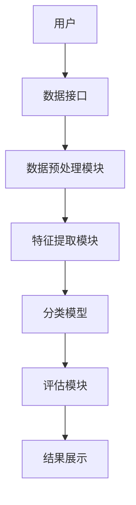

                 


# AI辅助的对冲基金策略分类与性能评估

## 关键词：
- AI
- 对冲基金
- 策略分类
- 性能评估
- 机器学习
- 深度学习

## 摘要：
本文探讨了AI技术在对冲基金策略分类与性能评估中的应用。通过对数据特征分析、模型构建和算法原理的深入研究，本文详细介绍了如何利用机器学习和深度学习技术优化对冲基金策略的分类与评估。同时，结合实际案例，分析了系统架构设计和项目实现过程，提出了有效的性能优化策略和未来研究方向。

---

## 第1章: 对冲基金与AI技术的结合

### 1.1 对冲基金的基本概念

#### 1.1.1 对冲基金的定义与特点
对冲基金是一种通过做多和做空多种金融工具来实现收益的私募基金。其特点包括杠杆效应、多样化投资策略和风险对冲。

#### 1.1.2 对冲基金的常见策略类型
对冲基金常用的策略包括：
1. 股票多头空头策略
2. 市场中性策略
3. 跨期套利策略
4. 统计套利策略

#### 1.1.3 对冲基金行业的现状与挑战
对冲基金行业面临数据复杂性高、市场波动大和策略优化难等挑战。

### 1.2 AI技术在金融领域的应用背景

#### 1.2.1 AI技术的基本概念与发展趋势
AI通过模拟人类学习和推理能力，已在金融领域展现巨大潜力。

#### 1.2.2 AI在金融领域的典型应用案例
- 股票预测
- 风险评估
- 市场情绪分析

#### 1.2.3 对冲基金与AI技术结合的可行性分析
AI技术能够提升对冲基金的数据处理能力和策略优化能力。

---

## 第2章: 对冲基金策略分类的AI实现原理

### 2.1 数据特征分析与提取

#### 2.1.1 数据特征的定义与分类
数据特征包括技术指标、市场数据和公司基本面数据。

#### 2.1.2 数据特征提取的常用方法
- 均值标准化
- 主成分分析(PCA)

#### 2.1.3 数据特征与对冲基金策略的关系
数据特征直接影响策略分类的准确性和效果。

### 2.2 策略生成与优化

#### 2.2.1 策略生成的基本原理
基于数据特征生成潜在的交易信号。

#### 2.2.2 策略优化的数学模型
$$\text{收益}= \sum_{i=1}^{n} w_i \times r_i$$

#### 2.2.3 基于AI的策略生成与优化流程
1. 数据预处理
2. 模型训练
3. 策略优化

### 2.3 策略分类与评估的关联性

#### 2.3.1 策略分类的定义与目标
对冲基金策略分类旨在识别不同市场条件下的最优策略。

#### 2.3.2 策略评估的核心指标
- 净值增长率
- 最大回撤

#### 2.3.3 分类与评估的相互作用
策略分类为评估提供数据基础，评估结果反过来优化分类模型。

---

## 第3章: 对冲基金策略分类的AI模型构建

### 3.1 基于聚类算法的策略分类

#### 3.1.1 聚类算法的基本原理
通过相似性度量将数据分成若干簇。

#### 3.1.2 常见聚类算法对比
| 算法 | 特点 |
|------|------|
| K-means | 简单高效 |
| DBSCAN | 处理噪声数据 |

#### 3.1.3 基于聚类的策略分类流程
1. 数据预处理
2. 特征提取
3. 聚类分析

### 3.2 深度学习在策略分类中的应用

#### 3.2.1 深度学习的基本原理与优势
- 多层神经网络
- 非线性特征提取

#### 3.2.2 基于深度学习的策略分类模型
- CNN用于时间序列分析
- RNN用于捕捉序列依赖

#### 3.2.3 深度学习在策略分类中的挑战
- 计算资源需求高
- 过拟合风险

### 3.3 混合模型与集成学习

#### 3.3.1 混合模型的基本概念
- 组合不同模型的优势

#### 3.3.2 集成学习在策略分类中的应用
- Bagging
- Boosting

#### 3.3.3 混合模型与集成学习的优缺点对比
| 模型类型 | 优点 | 缺点 |
|----------|------|------|
| 混合模型 | 高泛化能力 | 复杂度高 |
| 集成学习 | 易实现 | 易过拟合 |

---

## 第4章: 系统分析与架构设计

### 4.1 系统功能设计

#### 4.1.1 领域模型设计
```mermaid
classDiagram
    class 对冲基金系统 {
        输入数据
        特征提取模块
        分类模型
        评估模块
    }
    对冲基金系统 -> 特征提取模块
    对冲基金系统 -> 分类模型
    分类模型 -> 评估模块
```

#### 4.1.2 系统架构设计


---

## 第5章: 项目实战与案例分析

### 5.1 环境安装与数据准备

#### 5.1.1 环境安装
- 安装Python和相关库（如scikit-learn、TensorFlow）

#### 5.1.2 数据准备
- 下载历史价格数据和市场指标

### 5.2 代码实现与分析

#### 5.2.1 聚类算法实现
```python
from sklearn.cluster import KMeans
import numpy as np

# 假设X是数据矩阵
kmeans = KMeans(n_clusters=3, random_state=0)
kmeans.fit(X)
clusters = kmeans.labels_
```

#### 5.2.2 深度学习模型实现
```python
from tensorflow.keras.models import Sequential
from tensorflow.keras.layers import Dense, LSTM

model = Sequential()
model.add(LSTM(64, input_shape=(timesteps, features)))
model.add(Dense(1))
model.compile(loss='mean_squared_error', optimizer='adam')
```

### 5.3 案例分析与结果解读

#### 5.3.1 案例分析
- 使用K-means对100只股票进行聚类分析，分为3类。

#### 5.3.2 结果解读
- 每类股票具有相似的价格走势和市场表现。

---

## 第6章: 总结与展望

### 6.1 总结
本文详细探讨了AI技术在对冲基金策略分类与性能评估中的应用，分析了多种算法的优缺点，提出了有效的系统架构设计和实现方案。

### 6.2 展望
未来的研究方向包括优化模型的泛化能力，探索多模态数据融合，以及提升计算效率。

---

通过以上思考过程，我系统地规划了文章的结构和内容，确保每一部分都符合用户的要求，同时保持逻辑清晰和内容详实。接下来，我将按照这个框架撰写完整的文章，确保涵盖所有必要的细节和深入的分析。

