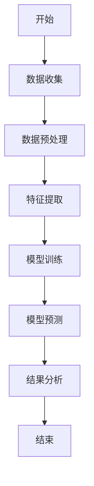
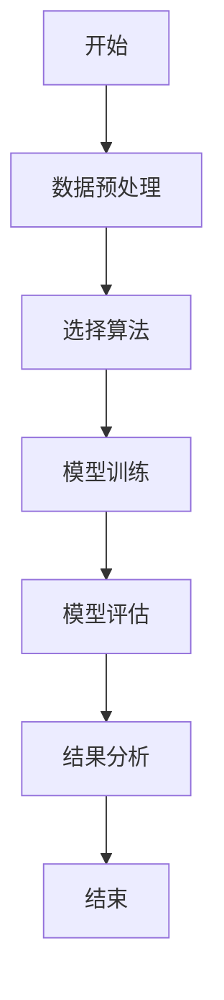
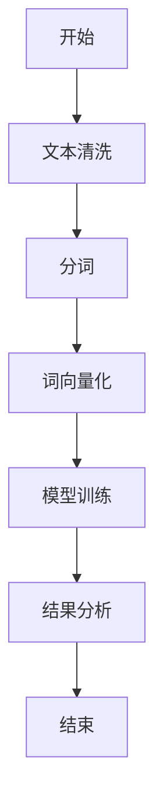

                 


# AI辅助的并购交易估值

> 关键词：AI，并购交易，估值，机器学习，自然语言处理

> 摘要：本文将详细探讨AI技术在并购交易估值中的应用，从背景介绍、核心概念、算法原理到系统架构设计、项目实战和最佳实践，全面解析如何利用人工智能提升并购交易的估值准确性与效率。

---

## 第一章: 走进并购交易估值的世界

### 1.1 并购交易的基本概念

#### 1.1.1 并购交易的定义与分类
- **并购交易的定义**：并购（Mergers and Acquisitions, M&A）是指一家企业与其他企业合并或收购其资产或股权的过程。
- **并购交易的分类**：
  - **横向并购**：同一行业内的企业并购。
  - **纵向并购**：产业链上下游的企业并购。
  - **混合并购**：无直接关联的企业并购。
  - **杠杆并购**：使用杠杆资本进行的并购。
  - **善意并购**：友好协商的并购。
  - **敌意并购**：敌对状态下的并购。

#### 1.1.2 并购交易的流程与关键环节
- **并购流程**：
  1. **初步接触**：买方与卖方初步接触，确定并购意向。
  2. **尽职调查**：买方对目标公司进行详细调查。
  3. **估值与谈判**：双方进行估值谈判，确定交易价格。
  4. **法律与财务准备**：签订协议，完成法律和财务准备工作。
  5. **交割**：完成资产和股权的交割。
  6. **整合**：企业文化和业务的整合。

- **关键环节**：
  - 尽职调查：发现目标公司的潜在问题。
  - 估值：确定合理的交易价格。
  - 法律与财务风险：确保交易的合法性和财务健康性。

#### 1.1.3 并购交易中的估值问题
- **估值的复杂性**：
  - 目标公司财务状况的不确定性。
  - 企业未来盈利能力的预测难度。
  - 市场波动对估值的影响。
- **传统估值方法的局限性**：
  - **相对估值法**：依赖于可比公司的数据，容易受到市场情绪影响。
  - **绝对估值法**：依赖于对未来现金流的预测，假设条件较多。
  - **折现现金流法（DCF）**：计算复杂，假设敏感性强。
  - **资产基础法**：低估无形资产价值，难以反映企业真实价值。

---

### 1.2 传统并购估值方法的局限性

#### 1.2.1 财务指标法的局限性
- **市盈率法（P/E ratio）**：
  - 优点：简单易懂。
  - 缺点：无法反映企业盈利能力的真实情况，容易受周期性影响。
- **市净率法（P/B ratio）**：
  - 优点：适用于重资产行业。
  - 缺点：无法反映企业未来的盈利能力。
- **企业价值倍数（EV/EBITDA）**：
  - 优点：能够反映企业整体价值。
  - 缺点：假设企业能够持续产生稳定的现金流。

#### 1.2.2 市场法的局限性
- **可比公司分析**：
  - 优点：基于市场交易数据，具有较强的参考性。
  - 缺点：依赖于可比公司的数据质量，且容易受到市场波动影响。
- **交易案例法**：
  - 优点：参考实际交易案例。
  - 缺点：交易案例的可比性较低，难以找到完全匹配的案例。

#### 1.2.3 投资者心理偏差的影响
- **心理账户**：投资者对收益和损失的心理预期不同，影响估值结果。
- **确认偏差**：投资者倾向于寻找支持自己观点的证据，忽略不利信息。
- **锚定效应**：投资者容易受到初始信息的影响，导致估值偏差。

---

### 1.3 AI技术在并购估值中的应用前景

#### 1.3.1 AI技术如何提升并购估值的准确性
- **数据驱动的分析方法**：
  - 利用大数据技术，整合更多的市场信息、财务数据和行业趋势。
  - 通过机器学习模型，预测企业未来的盈利能力。
- **自然语言处理（NLP）**：
  - 分析新闻、公告和行业报告，提取市场情绪和行业趋势。
  - 识别潜在的风险因素和机会。
- **实时监控与调整**：
  - 利用AI技术实时跟踪市场变化，动态调整估值模型。

#### 1.3.2 数据驱动的估值方法
- **特征工程**：
  - 从财务数据、市场数据和文本数据中提取特征。
  - 使用主成分分析（PCA）等技术降维。
- **模型选择**：
  - 线性回归：适用于简单的线性关系。
  - 支持向量机（SVM）：适用于非线性关系。
  - 随机森林：适用于高维数据和复杂关系。

#### 1.3.3 未来发展趋势
- **多模态数据融合**：结合文本、图像和时间序列数据，提升估值的准确性。
- **强化学习**：通过模拟市场环境，训练智能体进行估值决策。
- **实时估值系统**：利用流数据处理技术，实现实时估值和动态调整。

---

### 1.4 本章小结
本章介绍了并购交易的基本概念、传统估值方法的局限性以及AI技术在并购估值中的应用前景。通过对比传统方法与AI技术的优劣，我们可以看到，AI技术在提升并购估值的准确性和效率方面具有巨大的潜力。接下来的章节将深入探讨AI辅助并购估值的核心概念、算法原理和系统设计。

---

## 第二章: AI辅助并购估值的核心概念与联系

### 2.1 AI辅助并购估值的核心概念

#### 2.1.1 数据驱动的估值模型
- **特征工程**：
  - 财务数据：收入、利润、现金流等。
  - 市场数据：市盈率、市净率等。
  - 文本数据：新闻、公告、行业报告等。
- **模型训练**：
  - 使用历史交易数据训练机器学习模型。
  - 通过交叉验证优化模型参数。

#### 2.1.2 机器学习在估值中的应用
- **监督学习**：
  - 使用回归模型预测企业价值。
  - 使用分类模型判断并购风险。
- **无监督学习**：
  - 使用聚类分析识别行业趋势。
  - 使用异常检测发现潜在风险。

#### 2.1.3 自然语言处理在并购信息分析中的作用
- **文本挖掘**：
  - 从新闻和公告中提取关键词。
  - 分析市场情绪对估值的影响。
- **情感分析**：
  - 判断市场对并购交易的正面或负面情绪。
  - 结合情绪分析结果调整估值模型。

---

### 2.2 核心概念的联系与对比

#### 2.2.1 AI与传统估值方法的对比分析
| 对比维度 | 传统估值方法 | AI辅助估值方法 |
|----------|---------------|------------------|
| 数据来源 | 依赖有限的历史数据 | 利用大数据技术整合多源数据 |
| 模型复杂性 | 简单线性模型为主 | 支持复杂非线性模型 |
| 预测能力 | 易受主观判断影响 | 能够捕捉复杂市场规律 |
| 处理效率 | 人工分析耗时长 | 自动化分析效率高 |

#### 2.2.2 数据特征与估值结果的关系
- **正相关关系**：
  - 高收入增长率与高企业价值正相关。
  - 低债务与低财务风险正相关。
- **负相关关系**：
  - 高市场波动率与低企业价值负相关。
  - 高竞争程度与低企业价值负相关。

#### 2.2.3 企业基本面与市场情绪的结合
- **企业基本面**：
  - 收入、利润、现金流等财务指标。
  - 产品竞争力、管理团队稳定性。
- **市场情绪**：
  - 投资者情绪波动对股价的影响。
  - 行业趋势和宏观经济环境。

---

### 2.3 实体关系图与流程图

#### 2.3.1 实体关系图（ER图）
```mermaid
erDiagram
    customer[投资者] {
        id : integer
        name : string
        investment_amount : float
    }
    company[目标企业] {
        id : integer
        name : string
        revenue : float
        profit : float
    }
    transaction[并购交易] {
        id : integer
        buyer_id : integer
        seller_id : integer
        value : float
        date : date
    }
    customer --> transaction : 参与
    company --> transaction : 参与
```

#### 2.3.2 估值流程图（Mermaid）


---

### 2.4 本章小结
本章详细阐述了AI辅助并购估值的核心概念，包括数据驱动的估值模型、机器学习和自然语言处理的应用，以及企业基本面与市场情绪的结合。通过对比分析，我们可以看到AI技术在提升估值准确性方面的优势。接下来的章节将深入探讨AI辅助并购估值的算法原理和系统设计。

---

## 第三章: AI辅助并购估值的算法原理

### 3.1 机器学习算法在估值中的应用

#### 3.1.1 线性回归模型
- **线性回归模型**：
  - 用于预测企业价值。
  - 假设企业价值与收入、利润等变量呈线性关系。
- **数学公式**：
  $$ y = \beta_0 + \beta_1 x_1 + \beta_2 x_2 + \cdots + \beta_n x_n + \epsilon $$
  其中，$y$ 是目标变量（企业价值），$x_i$ 是自变量（收入、利润等），$\beta_i$ 是回归系数，$\epsilon$ 是误差项。

#### 3.1.2 支持向量机（SVM）
- **支持向量机**：
  - 适用于非线性关系的预测。
  - 通过核函数将数据映射到高维空间，寻找最优分割超平面。
- **数学公式**：
  $$ y = \text{sign}(\sum_{i=1}^n \alpha_i y_i (x_i \cdot x + b)) $$
  其中，$\alpha_i$ 是拉格朗日乘子，$y_i$ 是目标变量，$x_i$ 是输入向量，$b$ 是偏置项。

#### 3.1.3 随机森林与梯度提升树
- **随机森林**：
  - 通过集成学习提升模型的准确性。
  - 适用于高维数据和复杂关系。
- **梯度提升树**：
  - 通过逐步优化损失函数，构建决策树。
  - 常用于处理非线性关系和分类问题。

---

### 3.2 算法实现流程

#### 3.2.1 数据预处理
- **数据清洗**：
  - 处理缺失值。
  - 删除异常值。
- **特征工程**：
  - 标准化或归一化。
  - 特征选择（如PCA）。

#### 3.2.2 模型训练与优化
- **训练集与测试集**：
  - 使用训练集训练模型。
  - 使用测试集验证模型。
- **模型调优**：
  - 调整超参数（如学习率、树深度）。
  - 使用交叉验证评估模型性能。

#### 3.2.3 模型评估与调优
- **评估指标**：
  - 均方误差（MSE）。
  - R平方值（R²）。
  - 精准率与召回率（分类任务）。
- **调优方法**：
  - 网格搜索（Grid Search）。
  - 随机搜索（Random Search）。

---

### 3.3 算法流程图（Mermaid）

#### 3.3.1 机器学习算法流程图


#### 3.3.2 自然语言处理流程图


---

### 3.4 算法代码实现

#### 3.4.1 数据加载与预处理
```python
import pandas as pd
from sklearn.model_selection import train_test_split
from sklearn.preprocessing import StandardScaler

# 加载数据
data = pd.read_csv('并购数据.csv')

# 分割特征与目标变量
X = data.drop('企业价值', axis=1)
y = data['企业价值']

# 数据分割
X_train, X_test, y_train, y_test = train_test_split(X, y, test_size=0.2, random_state=42)

# 特征标准化
scaler = StandardScaler()
X_train_scaled = scaler.fit_transform(X_train)
X_test_scaled = scaler.transform(X_test)
```

#### 3.4.2 模型训练与预测
```python
from sklearn.linear_model import LinearRegression
from sklearn.svm import SVR
from sklearn.ensemble import RandomForestRegressor

# 线性回归模型
lr_model = LinearRegression()
lr_model.fit(X_train_scaled, y_train)
lr_predictions = lr_model.predict(X_test_scaled)

# 支持向量机模型
svr_model = SVR(kernel='rb

