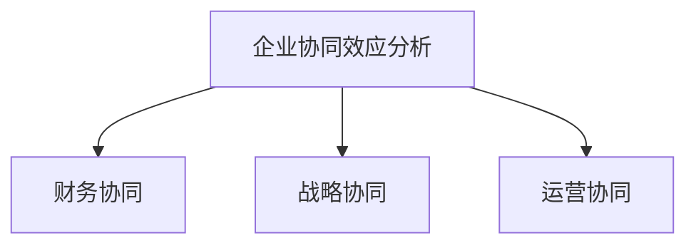
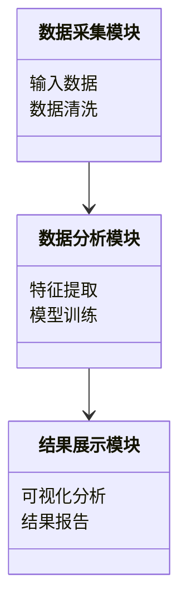

                 


# AI辅助的并购协同效应分析

> 关键词：AI辅助、并购协同效应、机器学习、企业整合、数据驱动

> 摘要：本文探讨了如何利用人工智能技术分析并购中的协同效应，通过构建数学模型和算法，结合实际案例，详细阐述了AI在企业并购中的应用及其带来的效率提升和价值创造。

---

# 第一部分: 并购协同效应的基础与背景

## 第1章: 并购协同效应的定义与背景

### 1.1 并购协同效应的定义
- 协同效应是指企业在并购后通过资源整合、资源共享等方式实现的成本节约和价值提升。
- 包括财务协同、战略协同和运营协同三类。

### 1.2 并购协同效应的背景
- 全球化背景下企业并购的频繁性。
- 协同效应是并购成功的关键因素。
- AI技术的快速发展为企业提供新的分析工具。

### 1.3 AI在并购协同效应分析中的作用
- 数据挖掘与分析。
- 智能预测与决策支持。
- 提高并购的精准性和成功率。

---

## 第2章: 并购协同效应的核心概念

### 2.1 协同效应的关键因素
| 因素 | 描述 |
|------|------|
| 财务因素 | 成本节约、收入增加 |
| 战略因素 | 战略一致性、资源互补性 |
| 运营因素 | 生产效率、供应链优化 |

### 2.2 并购协同效应的分析框架


---

## 第3章: 基于AI的协同效应分析框架

### 3.1 数据驱动的分析方法
- 数据收集：财务数据、市场数据、运营数据。
- 数据清洗与预处理。
- 数据分析：使用机器学习模型预测协同效应。

### 3.2 机器学习模型的选择
- 监督学习：回归模型预测协同效应。
- 非监督学习：聚类分析识别协同机会。

---

## 第4章: 并购协同效应的数学模型

### 4.1 协同效应的定量分析模型
- 财务协同效应公式：
$$ \text{协同效应} = \text{成本节约} + \text{收入增加} $$

### 4.2 基于回归分析的协同效应预测
- 线性回归模型：
$$ y = \beta_0 + \beta_1x_1 + \beta_2x_2 + \epsilon $$

### 4.3 神经网络模型的应用
- 使用多层感知机（MLP）预测协同效应。

---

## 第5章: AI辅助并购协同效应的系统架构

### 5.1 系统功能模块设计


---

## 第6章: 项目实战与案例分析

### 6.1 项目环境搭建
- 安装Python和相关库：pandas、scikit-learn、tensorflow。

### 6.2 核心代码实现
```python
# 数据预处理
import pandas as pd
data = pd.read_csv('并购数据.csv')
data = data.dropna()

# 模型训练
from sklearn.linear_model import LinearRegression
model = LinearRegression()
model.fit(X_train, y_train)

# 模型评估
from sklearn.metrics import r2_score
print(r2_score(y_test, model.predict(X_test)))
```

### 6.3 案例分析
- 某公司并购案例：通过AI分析预测协同效应，优化并购决策。

---

## 第7章: 总结与展望

### 7.1 实践中的注意事项
- 数据质量的重要性。
- 模型选择的合理性。
- 结果解释的准确性。

### 7.2 项目总结
- AI技术在并购协同效应分析中的优势。
- 提高并购效率和成功率。

### 7.3 未来展望
- 更多企业采用AI辅助并购。
- 技术的进一步优化与创新。

---

# 结语

通过本文的分析，读者可以全面了解AI在并购协同效应分析中的应用，掌握从数据采集到模型训练的全过程，并在实际项目中应用这些方法，提升企业的并购效率和成功率。

