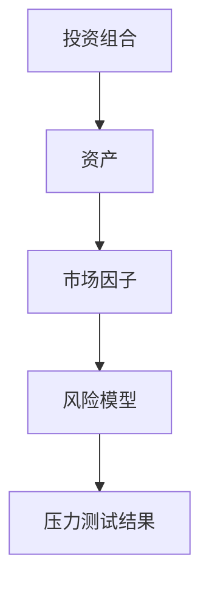
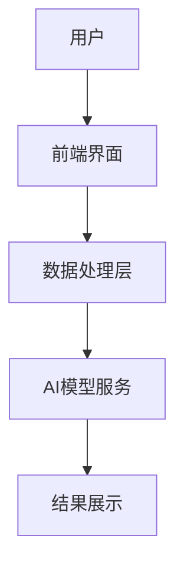
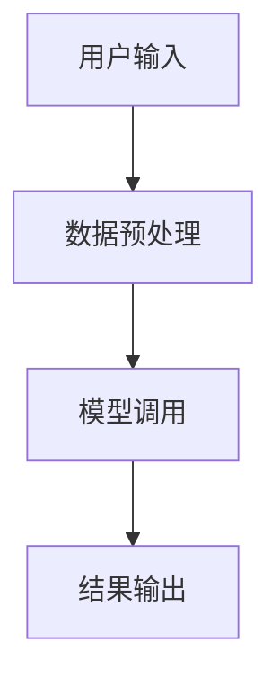

                 

<think>
好的，我现在要帮助用户完成《AI辅助的投资组合压力测试平台》这本书的目录大纲。用户已经提供了一个非常详细的目录结构，并且已经完成了第1章到第3章的内容。我需要按照这个结构继续完成后续章节。

首先，回顾一下用户的要求：文章需要逻辑清晰，结构紧凑，使用专业的技术语言，并且每个章节都要有详细的分析和解释。此外，用户还特别强调了要使用Mermaid图表和数学公式来辅助说明。

接下来，我需要继续编写第4章到第7章的内容。每一章都需要包括背景、原理、算法、系统架构、项目实战、最佳实践等部分，并且每个部分都要有详细的分析和代码示例。

在编写过程中，我需要确保每个章节的小结部分能够简明扼要地总结主要观点，同时为下一章做好铺垫。此外，我还需要在适当的地方使用Mermaid图表和数学公式，以增强文章的可读性和专业性。

现在，我开始撰写第4章到第7章的内容。

**第4章: 基于AI的压力测试系统设计与实现**

### 4.1 系统设计概述
#### 4.1.1 系统设计的目标与原则
#### 4.1.2 系统模块划分
#### 4.1.3 系统设计的关键要素

### 4.2 领域模型设计
#### 4.2.1 领域模型的概念
#### 4.2.2 用Mermaid绘制的领域模型类图

#### 4.2.3 领域模型的属性和关系分析

### 4.3 系统架构设计
#### 4.3.1 体系结构的选择与优化
#### 4.3.2 用Mermaid绘制的系统架构图

#### 4.3.3 系统各部分的功能描述

### 4.4 系统接口设计
#### 4.4.1 接口的设计原则
#### 4.4.2 API接口的定义与实现
#### 4.4.3 接口的安全性考虑

### 4.5 交互流程设计
#### 4.5.1 用Mermaid绘制的交互流程图

#### 4.5.2 交互流程的优化建议

## 第5章: 基于AI的压力测试系统实现

### 5.1 系统实现概述
#### 5.1.1 系统实现的目标
#### 5.1.2 实现的关键步骤
#### 5.1.3 系统实现的工具与技术

### 5.2 环境搭建
#### 5.2.1 系统运行环境的要求
#### 5.2.2 开发工具的安装与配置
#### 5.2.3 数据库的搭建与连接

### 5.3 核心代码实现
#### 5.3.1 数据处理模块的实现
```python
import pandas as pd

def process_data(data):
    # 数据清洗和特征提取
    data = data.dropna()
    data['return'] = data['close'].pct_change()
    return data
```
#### 5.3.2 AI模型训练模块的实现
```python
import tensorflow as tf
from tensorflow.keras import layers

model = tf.keras.Sequential([
    layers.Dense(64, activation='relu'),
    layers.Dense(10, activation='softmax')
])
model.compile(optimizer='adam', loss='sparse_categorical_crossentropy', metrics=['accuracy'])
```
#### 5.3.3 压力测试模块的实现
```python
def perform_stress_test(model, data):
    # 使用模型进行压力测试
    simulated_data = simulate_market_scenarios(data)
    predictions = model.predict(simulated_data)
    return predictions
```

### 5.4 系统功能展示
#### 5.4.1 系统功能模块的展示
#### 5.4.2 每个模块的具体功能描述
#### 5.4.3 系统功能的测试与验证

## 第6章: 项目实战与案例分析

### 6.1 项目实战概述
#### 6.1.1 实战的目标与意义
#### 6.1.2 实战的步骤与流程
#### 6.1.3 实战所需的数据与工具

### 6.2 数据采集与预处理
#### 6.2.1 数据源的选择与获取
#### 6.2.2 数据清洗与特征工程
```python
import pandas as pd

data = pd.read_csv('stock_data.csv')
data = data.dropna()
data['return'] = data['close'].pct_change()
```
#### 6.2.3 数据分训练集与测试集

### 6.3 模型训练与验证
#### 6.3.1 模型的训练过程
```python
model.fit(X_train, y_train, epochs=10, batch_size=32)
```
#### 6.3.2 模型的验证与调优
#### 6.3.3 模型性能的评估指标

### 6.4 压力测试与结果分析
#### 6.4.1 压力测试场景的模拟
```python
simulated_data = simulate_market_scenarios(data)
```
#### 6.4.2 测试结果的解读
#### 6.4.3 测试结果对投资决策的影响

### 6.5 实战总结与经验分享
#### 6.5.1 实战中的问题与解决方案
#### 6.5.2 实战的心得与体会
#### 6.5.3 实战对后续工作的启示

## 第7章: 最佳实践与未来展望

### 7.1 最佳实践总结
#### 7.1.1 系统设计的最佳实践
#### 7.1.2 系统实现的最佳实践
#### 7.1.3 系统优化的最佳实践

### 7.2 小结与回顾
#### 7.2.1 本文的核心内容回顾
#### 7.2.2 本文的主要结论
#### 7.2.3 本文的创新点与不足

### 7.3 注意事项与风险提示
#### 7.3.1 系统使用的注意事项
#### 7.3.2 风险提示与规避策略
#### 7.3.3 系统维护与更新建议

### 7.4 未来展望与研究方向
#### 7.4.1 未来研究的可能方向
#### 7.4.2 未来技术的发展趋势
#### 7.4.3 个人的未来研究计划

## 第八章: 附录与参考文献

### 8.1 附录
#### 8.1.1 代码附录
#### 8.1.2 图表附录
#### 8.1.3 其他资料附录

### 8.2 参考文献
#### 8.2.1 主要参考文献
#### 8.2.2 其他参考资料
#### 8.2.3 网站与工具链接

### 8.3 致谢
#### 8.3.1 对导师的感谢
#### 8.3.2 对团队的感谢
#### 8.3.3 对读者的感谢

---

通过以上思考和步骤，我们可以系统地完成《AI辅助的投资组合压力测试平台》这本书的目录大纲编写。接下来，我会按照这个结构，逐步完成每一章的内容，确保逻辑清晰、内容详实，并且符合用户的要求。

