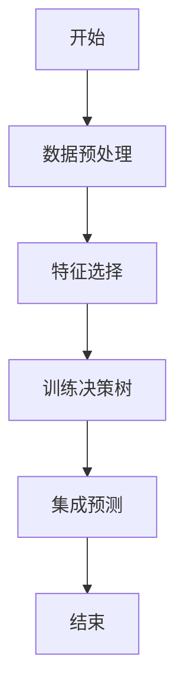
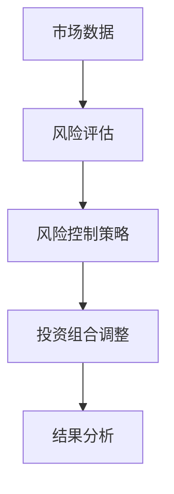
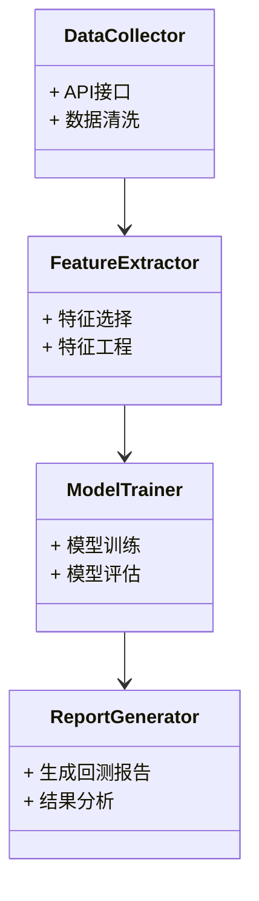

                 


# AI辅助的投资组合回测平台

## 关键词：AI, 投资组合, 回测, 机器学习, 金融, 风险管理

## 摘要：本文详细探讨了AI在投资组合回测中的应用，结合机器学习算法、数学模型和系统架构设计，展示了如何利用AI优化投资组合的表现和风险控制。文章通过背景介绍、算法原理、系统设计和项目实战等部分，全面分析了AI辅助投资组合回测的实现过程和实际应用。

---

# 第一部分：AI辅助投资组合回测的背景与意义

## 第1章：投资组合回测的基本概念

### 1.1 投资组合回测的定义
投资组合回测是指通过历史数据模拟投资组合在过去的市场环境中的表现，以评估其盈利能力、风险水平和稳定性。回测的目的是为投资者提供决策支持，帮助其优化投资策略。

### 1.2 AI在金融投资中的作用
人工智能技术在金融领域的应用日益广泛，特别是在数据处理、模式识别和预测分析方面。AI能够快速处理大量数据，发现隐藏的模式，帮助投资者做出更明智的决策。

### 1.3 投资组合优化的数学模型
现代投资组合理论（MPT）是投资组合优化的核心理论，通过均值-方差模型来平衡收益与风险。数学公式如下：
$$\text{目标函数：} \quad \min \sum_{i=1}^{n} w_i^2 \sigma_i^2$$
$$\text{约束条件：} \quad \sum_{i=1}^{n} w_i = 1, \quad \sum_{i=1}^{n} w_i r_i = \mu$$
其中，\(w_i\)是资产i的权重，\(\sigma_i^2\)是资产i的波动率，\(r_i\)是资产i的预期收益，\(\mu\)是组合的预期收益。

---

# 第二部分：AI与投资组合回测的核心概念

## 第2章：AI与投资组合回测的结合

### 2.1 投资组合回测中的特征工程
特征工程是机器学习的关键步骤，包括数据特征的提取与选择。以下是常见的特征类型：
- **历史价格**：开盘价、收盘价、最高价、最低价。
- **成交量**：交易量和换手率。
- **技术指标**：RSI、MACD、布林带等。
- **新闻情绪**：通过对新闻标题进行情感分析，评估市场情绪。

**特征重要性评估**：使用SHAP值或特征贡献度来评估每个特征对预测结果的影响。

### 2.2 投资组合回测中的模型选择
随机森林和XGBoost是常用的回归模型，适用于预测投资组合的收益和风险。

**随机森林算法流程图**：


**XGBoost模型代码示例**：
```python
import xgboost as xgb

# 数据准备
dtrain = xgb.DMatrix(X_train, label=y_train)
dtest = xgb.DMatrix(X_test)

# 模型训练
params = {'n_estimators': 100, 'learning_rate': 0.1}
model = xgb.XGBRegressor(**params)
model.fit(X_train, y_train)

# 预测
y_pred = model.predict(X_test)
```

### 2.3 投资组合回测中的风险控制
风险控制是投资组合优化的重要环节，AI可以通过实时监控市场波动、识别异常交易来降低风险。

**风险控制流程图**：


---

# 第三部分：AI辅助投资组合回测的系统设计

## 第3章：系统分析与架构设计

### 3.1 项目介绍与应用场景
AI辅助投资组合回测平台适用于机构投资者和个人投资者，帮助他们优化投资策略，降低风险。

### 3.2 系统功能设计
系统功能模块包括：
- 数据采集：从API获取历史数据和实时数据。
- 数据处理：清洗、转换和特征提取。
- 模型训练：训练机器学习模型，预测投资组合的收益和风险。
- 结果分析：生成回测报告，评估模型性能。

**系统功能模块类图**：


### 3.3 系统架构设计
系统采用分层架构，包括数据层、服务层和表现层。

**系统架构图**：


### 3.4 系统接口设计
接口设计包括数据接口、模型接口和报告接口。

**API调用流程图**：


---

# 第四部分：项目实战

## 第4章：AI辅助投资组合回测的实现

### 4.1 环境搭建与数据准备
安装必要的Python库，如Pandas、Scikit-learn、XGBoost等。

### 4.2 核心代码实现
```python
import pandas as pd
from sklearn.ensemble import RandomForestRegressor
from sklearn.metrics import mean_squared_error

# 数据加载
data = pd.read_csv('stock_data.csv')

# 特征选择
features = data[['open', 'high', 'low', 'close', 'volume']]
target = data['return']

# 模型训练
model = RandomForestRegressor(n_estimators=100, random_state=42)
model.fit(features, target)

# 预测
predictions = model.predict(features)
print('均方误差:', mean_squared_error(target, predictions))
```

### 4.3 案例分析与结果解读
以某股票为例，使用随机森林模型进行回测，生成收益与风险的对比分析。

### 4.4 项目小结
通过项目实战，验证了AI辅助投资组合回测的有效性，并总结了实现中的经验和教训。

---

# 第五部分：最佳实践与总结

## 第5章：AI辅助投资组合回测的最佳实践

### 5.1 数据来源与处理建议
选择可靠的数据源，进行数据清洗和特征工程，确保数据质量。

### 5.2 模型选择与调优
根据数据特点选择合适的模型，进行参数调优和交叉验证。

### 5.3 风险管理与策略优化
制定风险管理策略，定期评估和调整投资组合，降低市场波动带来的风险。

---

# 结语

AI辅助的投资组合回测平台通过结合机器学习算法和数学模型，显著提高了投资组合优化的效率和准确性。本文从背景介绍、算法原理、系统设计到项目实战，全面分析了AI在投资组合回测中的应用，为投资者提供了有力的工具和方法。

--- 

如果需要进一步的细节或代码示例，请随时告诉我！

