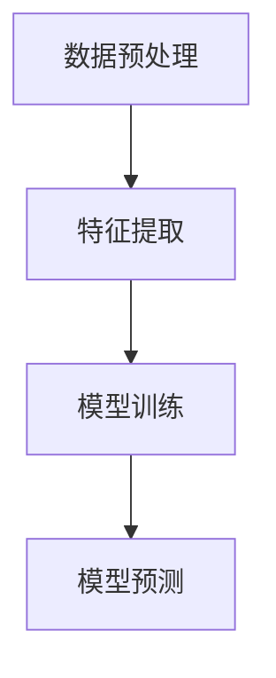
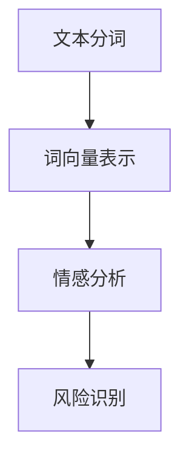
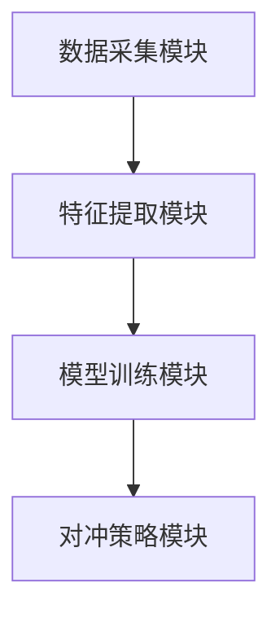
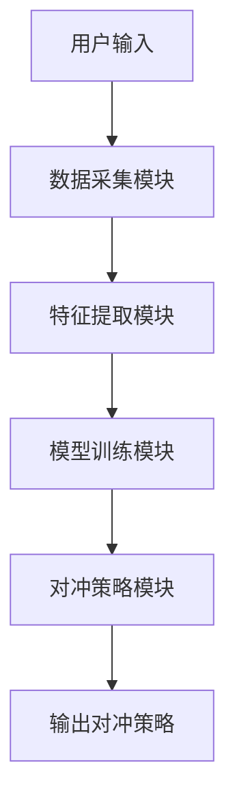

                 


# AI辅助的投资组合尾部风险对冲策略

> 关键词：AI辅助，投资组合，尾部风险，对冲策略，风险管理，机器学习

> 摘要：本文详细探讨了利用人工智能技术辅助投资组合尾部风险对冲的策略。首先介绍了尾部风险的定义和对投资组合的影响，然后分析了AI在金融风险管理中的应用，包括机器学习、自然语言处理和时间序列分析。接着，详细讲解了基于这些技术的算法原理和系统架构设计。最后，通过一个实际案例展示了如何使用Python实现AI辅助的投资组合尾部风险对冲系统，并总结了该领域的未来发展趋势。

---

# 第1章: 投资组合尾部风险对冲的背景与意义

## 1.1 尾部风险的定义与特征

### 1.1.1 尾部风险的定义
尾部风险（Tail Risk）是指在概率分布的尾部区域发生的小概率事件，这些事件可能导致投资组合出现极端损失。与普通波动不同，尾部风险事件的发生概率低，但影响巨大。

### 1.1.2 尾部风险的特征
- **低概率性**：尾部事件发生的概率较低，但在发生时影响巨大。
- **非对称性**：尾部风险通常会导致投资组合出现大幅亏损，而非对称的收益分布。
- **不可预测性**：尾部事件往往难以通过传统的统计模型预测。

### 1.1.3 尾部风险对投资组合的影响
尾部风险可能导致投资组合在极端市场条件下出现大幅亏损，甚至引发系统性风险。传统的风险管理方法难以有效识别和对冲尾部风险。

---

## 1.2 投资组合风险对冲的必要性

### 1.2.1 投资组合风险管理的重要性
投资组合管理的核心目标是最大化收益的同时最小化风险。有效的风险管理可以保护投资者免受重大损失。

### 1.2.2 尾部风险对冲的必要性
尾部风险事件可能导致投资组合的损失远超预期，因此必须采取有效的对冲策略。

### 1.2.3 AI技术在风险对冲中的作用
AI技术可以通过分析海量数据，识别潜在的尾部风险信号，并辅助制定对冲策略。

---

## 1.3 AI辅助投资组合对冲的背景与现状

### 1.3.1 人工智能在金融领域的应用背景
近年来，人工智能技术在金融领域的应用越来越广泛，尤其是在风险管理、交易策略和市场预测方面。

### 1.3.2 尾部风险对冲中的AI技术现状
目前，AI技术已经在尾部风险识别、对冲策略制定等方面取得了一定的成果，但仍面临诸多挑战。

### 1.3.3 未来发展趋势与挑战
未来，随着AI技术的不断发展，尾部风险对冲策略将更加智能化和精准化，但数据质量、模型解释性和计算能力等仍需进一步提升。

---

## 1.4 本章小结
本章介绍了尾部风险的定义和特征，分析了投资组合风险对冲的必要性，并探讨了AI技术在尾部风险对冲中的作用和发展现状。

---

# 第2章: AI辅助投资组合尾部风险对冲的核心概念

## 2.1 机器学习在金融风险管理中的应用

### 2.1.1 机器学习的基本概念
机器学习是一种人工智能技术，通过数据训练模型，使其能够进行预测或分类。

### 2.1.2 机器学习在金融风险管理中的应用领域
- **风险预测**：通过历史数据预测市场风险。
- **异常检测**：识别市场中的异常交易行为。
- **客户画像**：通过客户行为数据进行风险评估。

### 2.1.3 机器学习模型的优缺点
- **优点**：能够处理海量数据，发现复杂模式。
- **缺点**：模型的解释性较差，且容易过拟合。

---

## 2.2 NLP在金融文本分析中的应用

### 2.2.1 自然语言处理的基本概念
NLP（Natural Language Processing）是研究人机交互中语言处理的学科，广泛应用于文本分类、情感分析等领域。

### 2.2.2 NLP在金融新闻、财报分析中的应用
- **金融新闻分析**：通过分析新闻文本，识别市场情绪。
- **财报分析**：通过分析公司财报，评估公司财务状况。

### 2.2.3 NLP与尾部风险对冲的结合
NLP可以用于分析市场新闻和公司公告，识别潜在的尾部风险信号。

---

## 2.3 时间序列分析在金融中的应用

### 2.3.1 时间序列分析的基本概念
时间序列分析是一种统计方法，用于分析随时间变化的数据，识别数据中的趋势和周期性。

### 2.3.2 时间序列分析在股票价格预测中的应用
时间序列分析可以用于股票价格预测，识别价格的波动规律。

### 2.3.3 时间序列分析与尾部风险识别
通过时间序列分析，可以识别市场中的异常波动，提前预警尾部风险。

---

## 2.4 本章小结
本章介绍了机器学习、NLP和时间序列分析在金融风险管理中的应用，强调了这些技术在尾部风险对冲中的重要作用。

---

# 第3章: AI辅助投资组合尾部风险对冲的算法原理

## 3.1 马科维茨有效前沿理论

### 3.1.1 理论概述
马科维茨有效前沿理论是投资组合理论的基础，旨在通过优化投资组合的收益和风险，找到最优的投资组合。

### 3.1.2 理论的数学模型
投资组合的收益和风险可以通过以下公式进行优化：
$$
\text{收益} = \sum_{i=1}^{n} w_i r_i
$$
$$
\text{风险} = \sqrt{\sum_{i=1}^{n} \sum_{j=1}^{n} w_i w_j \sigma_{ij}}
$$
其中，$w_i$是投资比例，$r_i$是资产的收益，$\sigma_{ij}$是资产之间的协方差。

### 3.1.3 理论在投资组合优化中的应用
通过马科维茨有效前沿理论，可以找到在给定风险下收益最大的投资组合。

---

## 3.2 基于机器学习的尾部风险识别算法

### 3.2.1 算法概述
基于机器学习的尾部风险识别算法通过训练模型，识别市场中的异常波动。

### 3.2.2 算法的数学模型与公式
模型可以通过以下步骤进行训练：
1. 数据预处理：归一化数据。
2. 特征提取：提取影响尾部风险的关键特征。
3. 模型训练：使用支持向量机（SVM）或随机森林（Random Forest）进行训练。
4. 模型预测：预测市场中的尾部风险。

### 3.2.3 算法的实现步骤与流程图


---

## 3.3 基于NLP的金融文本风险识别

### 3.3.1 NLP模型在金融文本分析中的应用
NLP模型可以用于分析金融新闻、公司公告等文本，识别潜在的尾部风险信号。

### 3.3.2 基于NLP的风险识别算法
1. 文本分词：将文本分割成词语。
2. 词向量表示：将词语转换为向量表示。
3. 情感分析：分析文本的情感倾向。
4. 风险识别：根据情感分析结果，识别潜在的风险信号。

### 3.3.3 算法的实现步骤与流程图


---

## 3.4 本章小结
本章详细讲解了马科维茨有效前沿理论、基于机器学习的尾部风险识别算法和基于NLP的金融文本风险识别算法，并通过mermaid图展示了算法的实现流程。

---

# 第4章: AI辅助投资组合尾部风险对冲的系统架构设计

## 4.1 系统架构概述

### 4.1.1 系统架构设计目标
设计一个高效、可靠的AI辅助投资组合尾部风险对冲系统。

### 4.1.2 系统架构设计原则
- **模块化**：系统分为数据采集、特征提取、模型训练等模块。
- **可扩展性**：系统能够方便地扩展新的功能模块。
- **高可用性**：系统能够保证7×24小时的稳定运行。

### 4.1.3 系统架构的模块划分
系统主要模块包括：
- 数据采集模块：负责采集市场数据和新闻数据。
- 特征提取模块：提取影响尾部风险的关键特征。
- 模型训练模块：训练机器学习模型，识别尾部风险。
- 对冲策略模块：根据模型预测结果，制定对冲策略。

---

## 4.2 系统功能设计

### 4.2.1 数据采集模块
- **功能描述**：从金融市场数据源（如股票价格、指数等）采集数据。
- **实现方式**：使用API接口获取实时数据。

### 4.2.2 特征提取模块
- **功能描述**：提取影响尾部风险的关键特征，如波动率、相关系数等。
- **实现方式**：使用统计方法和机器学习特征提取技术。

### 4.2.3 模型训练模块
- **功能描述**：训练机器学习模型，识别尾部风险。
- **实现方式**：使用支持向量机（SVM）或随机森林（Random Forest）进行训练。

### 4.2.4 对冲策略模块
- **功能描述**：根据模型预测结果，制定对冲策略。
- **实现方式**：根据模型预测结果，动态调整投资组合。

---

## 4.3 系统架构设计

### 4.3.1 系统架构的mermaid图


### 4.3.2 系统交互的mermaid图


---

## 4.4 本章小结
本章设计了一个AI辅助投资组合尾部风险对冲系统的架构，包括数据采集、特征提取、模型训练和对冲策略模块，并通过mermaid图展示了系统的交互流程。

---

# 第5章: AI辅助投资组合尾部风险对冲的项目实战

## 5.1 项目背景与目标

### 5.1.1 项目背景
随着金融市场的波动加剧，尾部风险对冲的需求日益增加。

### 5.1.2 项目目标
开发一个基于Python的AI辅助投资组合尾部风险对冲系统。

---

## 5.2 项目环境与工具

### 5.2.1 环境配置
- **操作系统**：Windows 10或更高版本。
- **Python版本**：Python 3.8或更高版本。
- **依赖库**：numpy、pandas、scikit-learn、matplotlib。

### 5.2.2 工具安装
安装所需的Python库：
```bash
pip install numpy pandas scikit-learn matplotlib
```

---

## 5.3 项目核心实现

### 5.3.1 数据采集模块实现
从Yahoo Finance获取历史数据：
```python
import pandas_datareader as pdr
import datetime

start = datetime.datetime(2020, 1, 1)
end = datetime.datetime(2023, 1, 1)

data = pdr.data.DataReader('SPY', 'yahoo', start, end)
```

### 5.3.2 特征提取模块实现
计算波动率和相关系数：
```python
import pandas as pd
import numpy as np

def calculate_volatility(returns):
    return np.std(returns)

def calculate_correlation(asset1_returns, asset2_returns):
    return np.corrcoef(asset1_returns, asset2_returns)[0, 1]
```

### 5.3.3 模型训练模块实现
使用随机森林进行尾部风险预测：
```python
from sklearn.ensemble import RandomForestClassifier
from sklearn.model_selection import train_test_split

X = df[['volatility', 'correlation']]
y = df['is_tail-risk']

X_train, X_test, y_train, y_test = train_test_split(X, y, test_size=0.2)
model = RandomForestClassifier()
model.fit(X_train, y_train)
```

### 5.3.4 对冲策略模块实现
根据模型预测结果，动态调整投资组合：
```python
import numpy as np

predicted_risk = model.predict(X_test)
# 根据预测结果调整投资比例
new_weights = np.where(predicted_risk == 1, 0.5, 0.2)
```

---

## 5.4 项目实战总结

### 5.4.1 项目实现的关键点
- 数据采集模块的稳定性。
- 特征提取模块的准确性。
- 模型训练模块的预测能力。

### 5.4.2 项目优化建议
- 使用更复杂的模型（如XGBoost）进行预测。
- 增加更多的特征（如市场情绪指标）进行分析。

---

## 5.5 本章小结
本章通过一个实际案例展示了如何使用Python实现AI辅助的投资组合尾部风险对冲系统，详细讲解了项目的环境配置、核心实现和优化建议。

---

# 第6章: 总结与展望

## 6.1 总结
本文详细探讨了AI辅助投资组合尾部风险对冲的策略，介绍了尾部风险的定义和特征，分析了AI在金融风险管理中的应用，详细讲解了基于机器学习和NLP的尾部风险识别算法，并设计了一个完整的系统架构。最后，通过一个实际案例展示了如何实现AI辅助的投资组合尾部风险对冲系统。

---

## 6.2 展望
未来，随着AI技术的不断发展，尾部风险对冲策略将更加智能化和精准化。但同时，我们也需要关注数据隐私、模型解释性和计算能力等问题，以进一步提升尾部风险对冲的效果。

---

## 6.3 最佳实践Tips
- 在实际应用中，建议结合多种技术（如机器学习和NLP）进行尾部风险识别。
- 数据的高质量是模型预测准确性的关键，建议使用多种数据源进行分析。
- 定期更新模型，以适应市场的变化。

---

## 6.4 小结
本文通过理论分析和实际案例，全面探讨了AI辅助投资组合尾部风险对冲的策略，为读者提供了深入的技术指导和实践建议。

---

# 结语
投资组合尾部风险对冲是一个复杂而重要的问题，AI技术的应用为这一领域带来了新的可能性。通过本文的探讨，我们相信未来AI技术将在尾部风险对冲中发挥越来越重要的作用。

