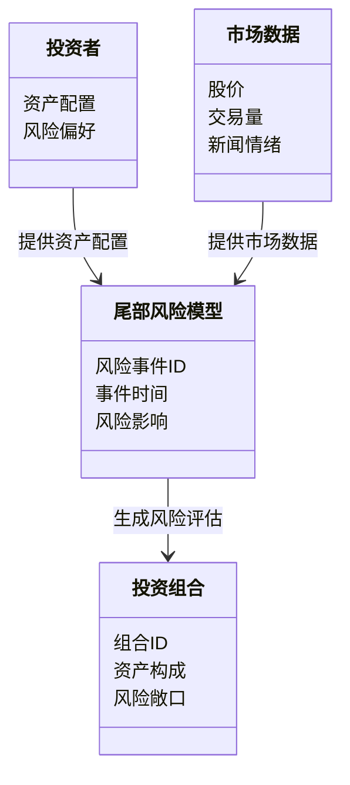
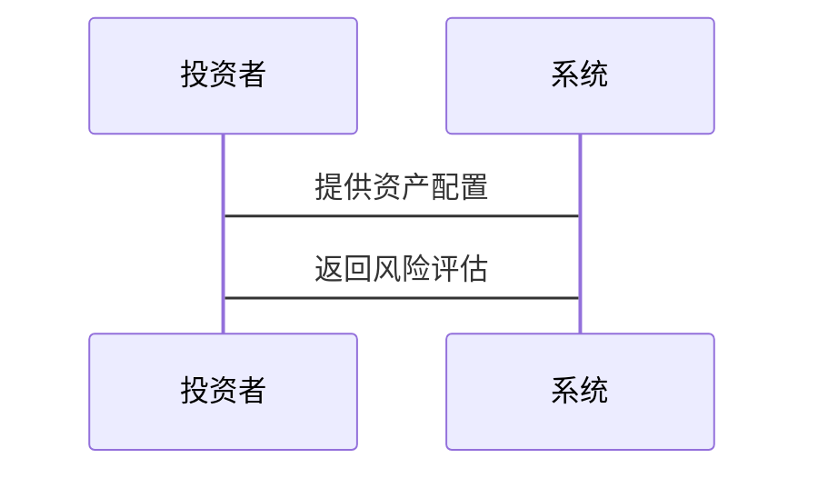

                 


# AI辅助的投资组合尾部风险度量

## 关键词：AI，投资组合，尾部风险，风险度量，金融数据分析

## 摘要：  
随着金融市场的复杂化和波动性的增加，尾部风险（Tail Risk）——即低概率但高影响的极端事件——对投资组合的影响日益显著。传统的风险度量方法在处理尾部风险时往往力不从心，而人工智能（AI）技术的引入为这一领域带来了新的可能性。本文将深入探讨AI在投资组合尾部风险度量中的应用，分析其核心概念、算法原理、系统架构以及实际案例，为读者提供一个全面的技术视角。

---

## 第一部分: AI辅助的投资组合尾部风险度量基础

## 第1章: 投资组合尾部风险度量概述

### 1.1 问题背景与定义

#### 1.1.1 尾部风险的定义  
尾部风险（Tail Risk）是指在概率分布的尾部区域发生极端事件的可能性。这些事件通常是低概率（小概率）事件，但一旦发生，会对资产价格或投资组合价值造成重大冲击。尾部风险的核心在于其“不可预测性”和“破坏性”。

#### 1.1.2 尾部风险与传统风险度量的区别  
传统的风险度量方法，如VaR（Value at Risk）和CVaR（Conditional Value at Risk），主要关注资产在正常情况下的波动性，而尾部风险则关注那些超出常规波动范围的极端事件。尾部风险更注重“黑天鹅”事件的潜在影响。

#### 1.1.3 尾部风险在投资组合管理中的重要性  
尾部风险的管理对于投资组合的稳健性至关重要。通过识别和量化尾部风险，投资者可以更好地应对极端市场条件，降低投资组合的整体风险敞口。

### 1.2 AI技术在金融领域的应用现状

#### 1.2.1 AI在金融数据分析中的应用  
AI技术在金融领域的应用涵盖了数据清洗、特征提取、模式识别等多个方面。例如，自然语言处理（NLP）技术可以用于分析新闻和社交媒体数据，预测市场情绪。

#### 1.2.2 AI在风险度量中的潜力  
AI技术，特别是深度学习，能够捕捉复杂的非线性关系，这使得其在尾部风险预测中具有较大的潜力。例如，可以通过神经网络模型识别市场中的异常信号。

#### 1.2.3 当前AI辅助投资组合管理的挑战  
尽管AI技术在金融领域展现出巨大潜力，但其在尾部风险度量中的应用仍面临数据稀疏性、模型解释性不足以及计算复杂性等挑战。

### 1.3 本章小结  
本章介绍了尾部风险的定义、特征及其在投资组合管理中的重要性，并探讨了AI技术在金融领域的应用现状和挑战。

---

## 第2章: 尾部风险度量的核心概念与联系

### 2.1 尾部风险的属性特征对比

#### 2.1.1 尾部风险的统计特征  
尾部风险具有以下统计特征：  
- **低概率性**：事件发生的概率较低。  
- **高影响性**：一旦发生，会对资产价格或投资组合价值造成重大影响。  
- **非线性性**：尾部风险通常与非线性关系相关。

#### 2.1.2 尾部风险与VaR、CVaR的对比  
下表展示了尾部风险与其他风险度量方法的对比：

| **指标** | **定义** | **特点** |  
|----------|----------|----------|  
| VaR     | 在一定置信水平下，资产的最大损失。 | 线性，关注置信区间内的损失。 |  
| CVaR     | 在VaR的基础上，考虑超过VaR的平均损失。 | 非线性，更关注尾部损失。 |  
| 尾部风险 | 关注极端事件的低概率、高影响特性。 | 非线性，关注概率分布的尾部区域。 |  

#### 2.1.3 尾部风险的时间依赖性  
尾部风险往往具有时间依赖性。例如，市场崩盘事件可能会引发连锁反应，导致后续市场的进一步波动。

### 2.2 尾部风险度量的ER实体关系图

```mermaid
erDiagram
    actor 投资者 {
        string 资产配置
        string 风险偏好
    }
    actor 市场数据 {
        string 股价
        string 交易量
        string 新闻情绪
    }
    entity 尾部风险 {
        int 风险事件ID
        date 事件时间
        float 风险影响
        string 事件类型
    }
    entity 投资组合 {
        int 组合ID
        string 资产构成
        float 风险敞口
    }
    investor -->> 尾部风险 : 监测
    marketData -->> 尾部风险 : 数据输入
    尾部风险 -->> 投资组合 : 风险评估
```

### 2.3 本章小结  
本章通过对比尾部风险与其他风险度量方法，分析了尾部风险的统计特征，并通过ER实体关系图展示了尾部风险度量的核心要素。

---

## 第3章: AI辅助尾部风险度量的算法原理

### 3.1 统计套利算法

#### 3.1.1 统计套利的定义与原理  
统计套利是一种基于统计套利策略的投资方法，通过寻找资产价格的短期偏离来获利。其核心在于利用资产价格的均值回归特性。

#### 3.1.2 统计套利在尾部风险中的应用  
统计套利算法可以通过识别资产价格的极端偏离，预测潜在的尾部风险事件。例如，可以通过均值回归模型预测资产价格的反弹。

#### 3.1.3 统计套利算法的数学模型  
以下是一个简单的统计套利模型：

$$
\text{收益} = \sum_{i=1}^{n} w_i \cdot r_i
$$

其中，$w_i$ 是权重，$r_i$ 是资产i的收益。

### 3.2 机器学习模型

#### 3.2.1 机器学习在尾部风险预测中的应用  
机器学习模型可以通过历史数据学习尾部风险的模式，预测未来的潜在风险事件。

#### 3.2.2 常用机器学习算法（如随机森林、神经网络）的原理  
随机森林通过构建多个决策树，进行投票或平均预测；神经网络通过多层感知机模拟非线性关系。

#### 3.2.3 机器学习模型的训练与优化  
机器学习模型的训练过程包括数据预处理、特征选择、模型训练和调优。

### 3.3 深度学习方法

#### 3.3.1 深度学习在金融时间序列分析中的应用  
深度学习模型，如LSTM（长短期记忆网络），可以捕捉时间序列中的长期依赖关系，适用于尾部风险预测。

#### 3.3.2 基于LSTM的尾部风险预测模型  
LSTM模型可以有效捕捉金融时间序列中的异常波动，预测潜在的尾部风险事件。

#### 3.3.3 深度学习模型的训练流程  
深度学习模型的训练流程包括数据准备、模型构建、训练与优化。

### 3.4 本章小结  
本章介绍了统计套利、机器学习和深度学习算法在尾部风险度量中的应用，并通过数学公式和流程图展示了算法的原理。

---

## 第4章: 尾部风险度量的数学模型与公式

### 4.1 尾部风险的概率分布模型

#### 4.1.1 常用概率分布模型（如正态分布、幂律分布）的对比  
正态分布适用于描述正常波动，而幂律分布更适合描述尾部风险的极端事件。

#### 4.1.2 尾部风险的概率密度函数  
幂律分布的概率密度函数可以表示为：

$$
f(x) = \frac{1}{\beta} x^{\beta - 1}
$$

其中，$\beta$ 是分布的指数参数。

### 4.2 尾部风险的VaR和CVaR计算公式

#### 4.2.1 VaR的计算公式  
VaR在95%置信水平下的计算公式为：

$$
\text{VaR}_{0.95} = \mu + z \cdot \sigma
$$

其中，$\mu$ 是平均回报率，$z$ 是标准正态分布的分位数，$\sigma$ 是标准差。

#### 4.2.2 CVaR的计算公式  
CVaR在95%置信水平下的计算公式为：

$$
\text{CVaR}_{0.95} = \frac{1}{1 - 0.95} \int_{-\infty}^{\text{VaR}_{0.95}} f(x) dx
$$

---

## 第5章: 系统分析与架构设计方案

### 5.1 问题场景介绍  
本系统旨在通过AI技术辅助投资组合尾部风险度量，帮助投资者识别和管理潜在的极端风险事件。

### 5.2 系统功能设计

#### 5.2.1 领域模型  


#### 5.2.2 系统架构设计  


### 5.3 系统接口设计  
系统接口包括数据输入接口、模型调用接口和结果输出接口。

### 5.4 系统交互设计  


---

## 第6章: 项目实战

### 6.1 环境安装  
需要安装Python、TensorFlow、Keras等工具。

### 6.2 系统核心实现源代码

#### 6.2.1 数据预处理  
```python
import pandas as pd

# 加载数据
data = pd.read_csv('market_data.csv')
# 数据清洗
data = data.dropna()
```

#### 6.2.2 模型实现  
```python
from tensorflow.keras import layers

# 构建LSTM模型
model = tf.keras.Sequential()
model.add(layers.LSTM(64, input_shape=(timesteps, features)))
model.add(layers.Dense(1))
model.compile(optimizer='adam', loss='mean_squared_error')
```

#### 6.2.3 模型训练  
```python
model.fit(x_train, y_train, epochs=100, batch_size=32)
```

### 6.3 案例分析  
通过实际案例分析，验证模型的预测能力和尾部风险识别能力。

### 6.4 项目小结  
总结项目实现过程中的关键点和经验教训。

---

## 第7章: 最佳实践与小结

### 7.1 最佳实践 tips  
- 数据预处理是关键，尤其是异常值的处理。
- 模型调优需要结合实际业务需求。

### 7.2 小结  
本文详细探讨了AI辅助的投资组合尾部风险度量的核心概念、算法原理和系统架构，并通过实际案例展示了AI技术的应用潜力。

### 7.3 注意事项  
- 尾部风险的预测具有不确定性，需结合多种方法进行综合判断。
- 模型的解释性和可扩展性需进一步优化。

### 7.4 拓展阅读  
推荐阅读相关领域的最新研究成果，如《金融中的深度学习》和《投资组合管理与风险管理》。

---

## 结语  
通过AI技术的应用，投资组合尾部风险的度量将更加精准和高效，为投资者提供更有力的决策支持。

