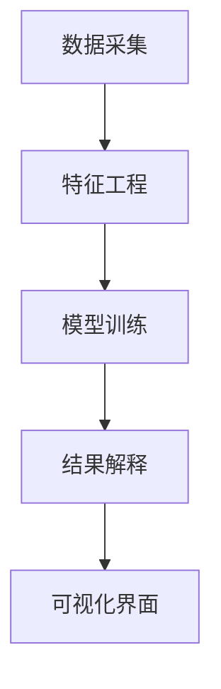

                 


# AI辅助的投资组合归因分析

> 关键词：投资组合归因分析, AI, 机器学习, 深度学习, 金融分析, 系统实现

> 摘要：本文探讨了AI技术在投资组合归因分析中的应用，从理论基础到系统实现，结合实际案例，分析了如何利用机器学习和深度学习提升归因分析的准确性和效率，为投资决策提供更有力的支持。

---

# 第1章：投资组合归因分析概述

## 1.1 投资组合归因分析的基本概念

### 1.1.1 什么是投资组合归因分析

投资组合归因分析是将投资组合的收益分解为各个组成部分的过程，帮助投资者理解收益的来源。通过分析资产配置、个股选择、行业选择等因素对整体收益的贡献，归因分析为投资决策提供了重要的参考依据。

### 1.1.2 归因分析的重要性

归因分析在投资组合管理中具有重要意义。它不仅帮助投资者评估投资决策的效果，还能识别表现优异或不佳的具体因素，从而优化投资策略。此外，归因分析还能帮助投资者在面对亏损时，及时发现并纠正问题。

### 1.1.3 归因分析的分类与应用场景

归因分析可以分为事后归因和实时归因。事后归因用于回顾过去的投资表现，实时归因则用于动态监控投资组合的表现。应用场景包括风险控制、绩效评估、投资策略优化等。

## 1.2 AI技术在金融领域的应用

### 1.2.1 AI在金融分析中的作用

人工智能在金融领域的应用日益广泛，尤其是在数据分析、预测模型和自动化交易方面。AI能够处理海量数据，识别复杂模式，提供精准的分析结果，帮助投资者做出更明智的决策。

### 1.2.2 AI在投资组合管理中的应用

AI技术在投资组合管理中应用广泛，包括资产配置、风险管理和绩效评估等方面。通过机器学习算法，AI能够优化投资组合的配置，降低风险，提升收益。

### 1.2.3 AI与归因分析的结合

将AI技术应用于归因分析，可以通过机器学习模型识别传统方法难以捕捉的复杂因素，提高归因分析的准确性和效率。同时，AI还可以实时监控投资组合的表现，提供动态的归因分析。

---

# 第2章：归因分析的理论基础

## 2.1 投资组合收益分解

### 2.1.1 绝对收益与相对收益

绝对收益是指投资组合的收益绝对值，相对收益则是相对于基准指数的收益。归因分析需要同时考虑绝对收益和相对收益，以全面评估投资组合的表现。

### 2.1.2 投资组合收益的来源

投资组合收益来源于多个因素，包括资产配置、个股选择、行业选择、市场风险等。归因分析需要将这些因素分解出来，明确每个因素的贡献。

## 2.2 因子模型与风险调整收益

### 2.2.1 因子模型的基本概念

因子模型将资产收益分解为多个因子的线性组合，如市值、价值、动量等。这些因子代表了影响资产收益的不同因素，通过因子模型可以更好地理解收益的来源。

### 2.2.2 风险调整收益的计算

风险调整收益是指扣除市场风险后的收益，通常使用夏普比率、特雷诺比率等指标来衡量。归因分析需要考虑风险调整收益，以评估投资组合的风险调整后表现。

## 2.3 归因分析的数学模型

### 2.3.1 时间序列分析模型

时间序列分析模型用于分析资产收益的时间变化，如ARIMA模型。归因分析可以利用时间序列模型，分析不同时间段内各因素对收益的贡献。

### 2.3.2 多因子模型

多因子模型将资产收益分解为多个因子的线性组合，如Fama-French三因子模型。归因分析可以通过多因子模型，明确各因子对收益的贡献。

---

# 第3章：机器学习在归因分析中的应用

## 3.1 机器学习的基本概念

### 3.1.1 机器学习的定义与分类

机器学习是一种人工智能技术，通过数据训练模型，使其能够进行预测或分类。机器学习可以分为监督学习、无监督学习和强化学习。

### 3.1.2 监督学习与无监督学习

监督学习基于标记数据训练模型，用于预测或分类；无监督学习则基于未标记数据，发现数据中的模式或结构。归因分析可以利用监督学习预测收益，或无监督学习发现隐藏的因子。

## 3.2 常见机器学习算法在归因分析中的应用

### 3.2.1 线性回归模型

线性回归模型用于预测资产收益，通过回归系数确定各因素对收益的贡献。例如，使用线性回归模型分析市场因子对收益的影响。

### 3.2.2 支持向量机（SVM）

SVM用于分类和回归，可以用于将资产收益分为不同类别，或预测收益的变化。SVM在处理高维数据时表现优异，适合用于复杂的归因分析。

### 3.2.3 随机森林与梯度提升树

随机森林和梯度提升树是集成学习算法，通过组合多个弱模型提高预测准确性。归因分析可以使用这些算法，综合考虑多个因素对收益的影响。

## 3.3 机器学习模型的选择与优化

### 3.3.1 模型选择的策略

选择适合的机器学习模型需要考虑数据特征、问题类型和模型性能。例如，线性回归适合线性关系，随机森林适合复杂非线性关系。

### 3.3.2 超参数优化

通过网格搜索或随机搜索优化模型超参数，如学习率、树深度等，提高模型的预测准确性和归因分析的精度。

---

# 第4章：深度学习在归因分析中的应用

## 4.1 深度学习的基本概念

### 4.1.1 神经网络的基本结构

深度学习基于神经网络，通过多层非线性变换提取数据特征。神经网络结构包括输入层、隐藏层和输出层。

### 4.1.2 深度学习的优势与挑战

深度学习能够处理高维复杂数据，提取深层特征，但需要大量数据和计算资源，且模型解释性较差。

## 4.2 深度学习模型在归因分析中的应用

### 4.2.1 卷积神经网络（CNN）

CNN用于处理图像数据，但在金融时间序列数据中也有应用，如分析K线图识别价格走势。

### 4.2.2 循环神经网络（RNN）

RNN用于处理序列数据，如分析时间序列数据，预测未来收益。

### 4.2.3 Transformer模型

Transformer模型用于自然语言处理，但在金融数据处理中也有应用，如分析新闻文本对股价的影响。

## 4.3 深度学习模型的训练与评估

### 4.3.1 模型训练策略

深度学习模型需要大量数据和计算资源，通常使用GPU加速训练。训练策略包括数据增强、批量归一化等。

### 4.3.2 模型评估与验证

通过交叉验证、ROC曲线等方法评估模型性能，确保模型具有良好的泛化能力。

---

# 第5章：AI辅助归因分析系统的实现

## 5.1 系统架构设计

### 5.1.1 系统功能模块划分

AI辅助归因分析系统包括数据采集、特征工程、模型训练、结果解释等模块。数据采集模块负责收集投资组合和市场数据，特征工程模块进行数据预处理和特征提取，模型训练模块训练归因分析模型，结果解释模块将分析结果可视化。

### 5.1.2 系统架构图



## 5.2 数据收集与预处理

### 5.2.1 数据来源与特征提取

数据来源包括历史价格、财务报表、市场指标等。特征提取包括计算技术指标、因子值等。

### 5.2.2 数据清洗与标准化

数据清洗包括处理缺失值、异常值。数据标准化通过归一化或标准化方法，确保不同特征具有可比性。

## 5.3 模型训练与部署

### 5.3.1 模型训练流程

模型训练流程包括数据加载、特征选择、模型训练、评估和优化。通过交叉验证选择最优模型，调整超参数提高性能。

### 5.3.2 模型部署与接口设计

将训练好的模型部署到生产环境，提供API接口供其他系统调用，实时获取归因分析结果。

## 5.4 系统实现的代码示例

### 5.4.1 数据预处理代码

```python
import pandas as pd
from sklearn.preprocessing import StandardScaler

# 加载数据
data = pd.read_csv('portfolio_data.csv')

# 特征提取
features = data[['return', 'market_value', 'sector']]
targets = data['label']

# 数据清洗
data_clean = data.dropna()

# 特征标准化
scaler = StandardScaler()
features_scaled = scaler.fit_transform(features)
```

### 5.4.2 模型训练代码

```python
from sklearn.ensemble import RandomForestRegressor
from sklearn.metrics import mean_squared_error

# 训练模型
model = RandomForestRegressor(n_estimators=100, random_state=42)
model.fit(features_scaled, targets)

# 模型评估
predicted = model.predict(features_scaled)
mse = mean_squared_error(targets, predicted)
print(f'Mean Squared Error: {mse}')
```

## 5.5 本章小结

通过系统实现，展示了如何利用AI技术构建投资组合归因分析系统，从数据处理到模型训练，再到结果解释，为投资者提供实时、准确的分析结果。

---

# 第6章：实际案例分析

## 6.1 案例背景与数据介绍

### 6.1.1 案例选择的依据

选择一个具有代表性的投资组合，涵盖多种资产和行业，数据涵盖一定的时间范围。

### 6.1.2 数据集的描述

数据集包括投资组合的资产配置、历史收益、市场指标等，用于训练和验证归因分析模型。

## 6.2 案例分析

### 6.2.1 数据预处理与特征提取

对数据进行清洗和标准化，提取关键特征，如资产配置比例、市场因子值等。

### 6.2.2 模型训练与评估

使用机器学习或深度学习模型训练归因分析模型，评估模型的准确性和解释力。

### 6.2.3 结果解释与优化

通过可视化工具展示归因结果，分析各因素对收益的贡献，优化投资策略。

---

# 7. 结论与展望

## 7.1 本章总结

通过本文的探讨，展示了AI技术在投资组合归因分析中的巨大潜力，从理论到实践，系统介绍了如何利用机器学习和深度学习提升归因分析的效率和准确性。

## 7.2 未来展望

未来，随着AI技术的不断发展，归因分析将更加智能化和自动化。结合自然语言处理和增强学习，归因分析将能够处理更复杂的数据和场景，为投资者提供更精准的决策支持。

---

通过以上章节的详细分析，本文为读者提供了全面的AI辅助投资组合归因分析的知识体系，从基础理论到系统实现，再到实际案例，帮助读者深入了解AI在金融领域的应用。

