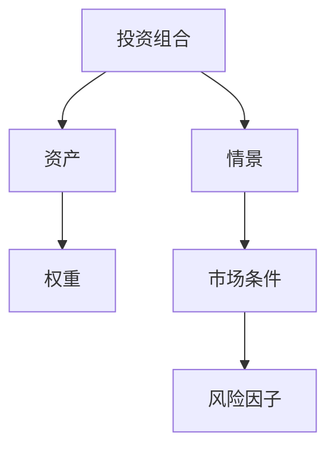
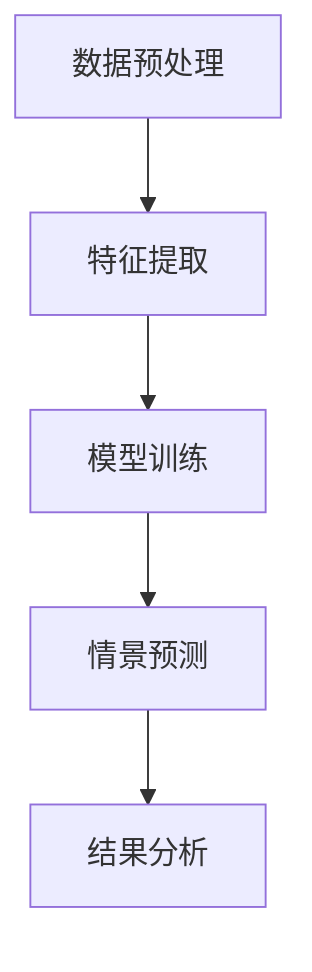
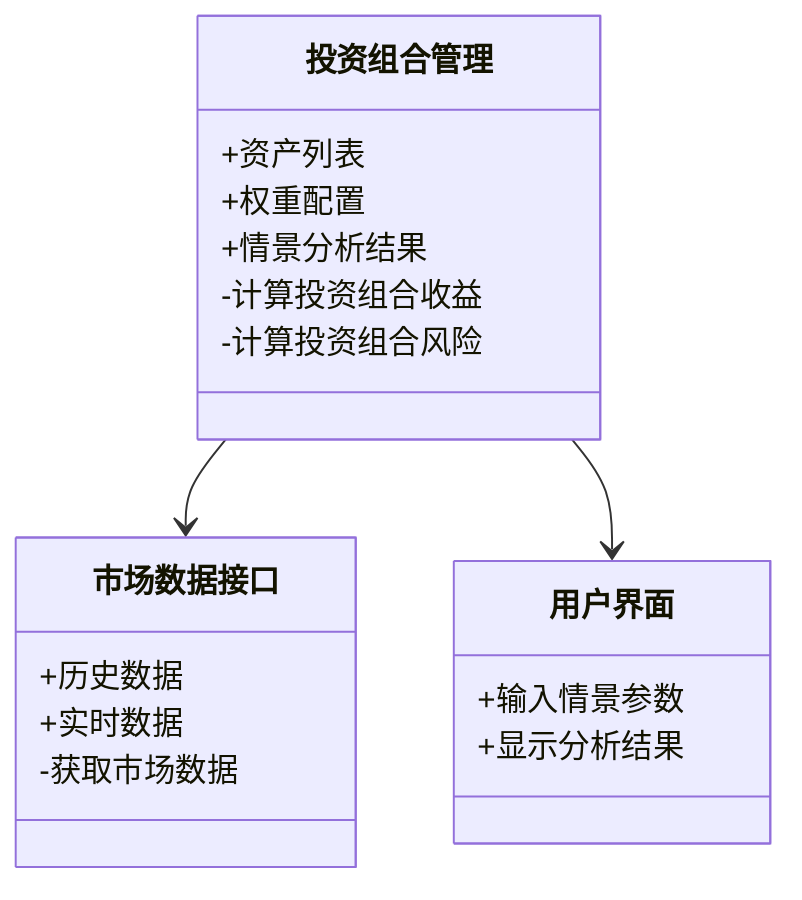
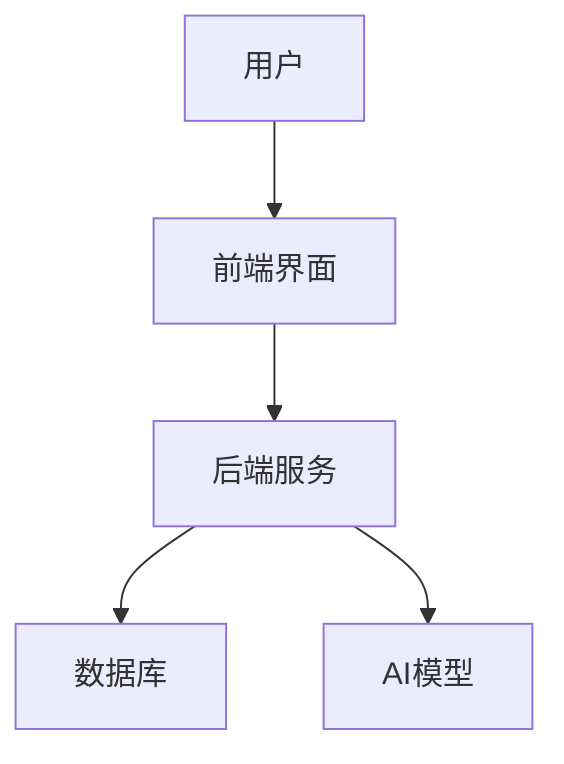

                 


# AI辅助的投资组合情景分析工具

> 关键词：AI, 投资组合, 情景分析, 机器学习, 金融建模

> 摘要：本文详细探讨了AI技术在投资组合情景分析中的应用，结合理论分析和实际案例，系统地介绍了AI辅助工具的核心概念、算法原理、系统架构以及项目实战，为读者提供了全面的视角来理解如何利用AI提升投资决策的效率和准确性。

---

# 第1章: AI辅助投资组合情景分析的背景与挑战

## 1.1 投资组合分析的基本概念

### 1.1.1 投资组合的定义
- 投资组合是指将多种金融资产按照一定比例组合在一起，以达到分散风险、优化收益的目的。
- 例如，一个投资组合可能包含股票、债券、基金等多种资产。

### 1.1.2 情景分析的核心意义
- 情景分析是一种预测不同市场条件下投资组合表现的方法，帮助投资者制定应对策略。
- 例如，分析在经济衰退、市场繁荣等不同情况下，投资组合的表现如何。

### 1.1.3 传统投资组合分析的局限性
- 传统分析方法依赖于历史数据和假设，难以应对复杂多变的市场环境。
- 例如，传统方法可能无法准确预测突发事件（如疫情）对市场的影响。

## 1.2 人工智能在金融领域的应用前景

### 1.2.1 人工智能技术的基本特征
- 人工智能（AI）通过机器学习、自然语言处理和计算机视觉等技术，能够处理和分析大量数据。
- 例如，AI可以分析大量的市场数据，识别潜在的投资机会。

### 1.2.2 人工智能在金融投资中的应用领域
- 股票预测、风险评估、市场情绪分析等。
- 例如，AI可以通过分析社交媒体上的评论来预测市场情绪。

### 1.2.3 情景分析工具的智能化趋势
- 随着AI技术的进步，情景分析工具越来越智能化，能够提供更精准的预测和建议。
- 例如，AI驱动的情景分析工具可以模拟多种市场情况，帮助投资者制定最优的投资策略。

## 1.3 AI辅助投资组合情景分析的核心价值

### 1.3.1 提高投资决策的效率
- AI能够快速处理大量数据，缩短分析时间，提高决策效率。
- 例如，AI可以在几分钟内分析数千条市场数据，而传统方法可能需要数天时间。

### 1.3.2 增强风险预测的准确性
- AI通过分析历史数据和市场趋势，能够更准确地预测风险。
- 例如，AI可以通过预测模型识别潜在的市场风险，帮助投资者提前规避。

### 1.3.3 优化投资组合的配置策略
- AI能够根据市场变化动态调整投资组合的配置，优化收益与风险的平衡。
- 例如，AI可以根据市场波动自动调整股票和债券的比例。

## 1.4 本章小结
- 本章介绍了AI辅助投资组合情景分析的背景、核心概念以及其在金融领域的应用前景，强调了AI技术在提高投资效率、增强风险预测和优化配置策略方面的重要作用。

---

# 第2章: 核心概念与理论基础

## 2.1 投资组合分析的核心理论

### 2.1.1 投资组合理论的数学模型
- 投资组合理论的核心是通过优化资产配置来最大化收益并最小化风险。
- 例如，现代投资组合理论（MPT）通过优化数学模型来确定最优资产配置。

### 2.1.2 风险与收益的权衡
- 在投资组合分析中，风险和收益是两个核心指标，需要通过数学模型进行量化和优化。
- 例如，通过计算夏普比率（Sharpe Ratio）来衡量投资组合的风险调整后收益。

## 2.2 情景分析的理论基础

### 2.2.1 情景分析的基本方法
- 情景分析通常包括基本、中性和乐观三种情景，帮助投资者全面评估市场变化的影响。
- 例如，基本情景可能假设经济增长率为3%，中性情景假设5%，乐观情景假设7%。

### 2.2.2 多因素模型在情景分析中的应用
- 多因素模型考虑多个影响市场的因素，如经济增长率、利率变动、通货膨胀等。
- 例如，Fama-French三因子模型考虑市值、价值和动量三个因素。

## 2.3 AI技术在情景分析中的应用

### 2.3.1 机器学习在金融数据处理中的应用
- 机器学习可以通过训练模型来预测市场走势和资产价格。
- 例如，使用支持向量机（SVM）模型预测股票价格的变化趋势。

### 2.3.2 自然语言处理在市场情绪分析中的作用
- 自然语言处理（NLP）可以分析新闻、社交媒体等文本数据，评估市场情绪。
- 例如，通过分析新闻标题的情绪倾向，预测市场波动。

### 2.3.3 深度学习在复杂场景预测中的优势
- 深度学习模型，如LSTM，可以捕捉时间序列数据中的复杂模式，提高预测准确性。
- 例如，使用LSTM模型预测外汇市场的汇率波动。

---

# 第3章: 核心概念的关联与对比

## 3.1 核心概念的属性特征对比

### 3.1.1 投资组合与情景分析的对比
| 特性       | 投资组合      | 情景分析      |
|------------|---------------|---------------|
| 目标       | 优化收益与风险 | 评估市场变化影响 |
| 方法       | 资产配置       | 假设情景分析    |
| 数据输入   | 资产价格、权重  | 市场因素、经济指标 |

### 3.1.2 传统分析方法与AI辅助方法的对比
| 特性       | 传统方法      | AI辅助方法     |
|------------|---------------|----------------|
| 数据处理能力 | 依赖历史数据   | 可处理实时数据   |
| 预测精度   | 较低           | 较高           |
| 处理速度   | 较慢           | 较快           |

## 3.2 实体关系图



---

# 第4章: 基于机器学习的情景分析算法

## 4.1 算法原理

### 4.1.1 机器学习在情景分析中的应用
- 机器学习算法可以训练模型，识别市场趋势和潜在风险。
- 例如，使用随机森林模型预测不同情景下的资产表现。

### 4.1.2 常见的机器学习算法及其特点
| 算法       | 特点           |
|------------|----------------|
| 线性回归    | 简单，适合线性关系 |
| 支持向量机  | 适合高维数据   |
| 神经网络    | 能捕捉复杂模式   |

### 4.1.3 算法流程图


## 4.2 数学模型与公式

### 4.2.1 线性回归模型
$$ y = \beta_0 + \beta_1x + \epsilon $$
- 其中，$y$ 是目标变量，$x$ 是自变量，$\beta$ 是回归系数，$\epsilon$ 是误差项。

### 4.2.2 支持向量机模型
$$ \text{最大化} \quad \frac{1}{2} \lVert \beta \rVert^2 $$
$$ \text{满足} \quad y_i(\beta^T x_i + \beta_0) \geq 1 \quad \forall i $$

---

# 第5章: 系统分析与架构设计

## 5.1 系统应用场景

### 5.1.1 投资组合管理
- 系统用于帮助投资者优化资产配置，实现投资目标。
- 例如，机构投资者可以利用系统进行风险管理和资产分配。

### 5.1.2 风险评估与预警
- 系统能够实时监控市场风险，提供预警信息。
- 例如，在市场波动剧烈时，系统可以提醒投资者调整投资策略。

## 5.2 系统功能设计

### 5.2.1 领域模型


### 5.2.2 系统架构设计


---

# 第6章: 项目实战

## 6.1 环境安装

### 6.1.1 安装Python
- 安装Python 3.8及以上版本。
- 使用命令：`python --version`

### 6.1.2 安装依赖库
- 使用pip安装以下库：
  ```bash
  pip install numpy pandas scikit-learn
  ```

## 6.2 系统核心实现源代码

### 6.2.1 数据处理
```python
import pandas as pd

data = pd.read_csv('market_data.csv')
print(data.head())
```

### 6.2.2 模型训练
```python
from sklearn.linear_model import LinearRegression
model = LinearRegression()
model.fit(X, y)
```

## 6.3 案例分析

### 6.3.1 数据分析
- 使用历史数据进行分析，识别投资机会和风险。

### 6.3.2 情景模拟
- 模拟不同市场情景下的投资组合表现。
- 例如，模拟经济衰退和市场繁荣两种情景。

---

# 第7章: 总结与展望

## 7.1 本章总结
- 本文详细介绍了AI辅助投资组合情景分析的核心概念、算法原理和系统架构，展示了其在实际应用中的潜力。

## 7.2 未来展望
- 随着AI技术的进步，投资组合情景分析工具将更加智能化和个性化。
- 例如，未来的工具可能能够根据投资者的风险承受能力和投资目标，自动生成最优的投资策略。

---

# 结语
通过本文的介绍，读者可以全面了解AI辅助投资组合情景分析的技术细节和实际应用，为未来的投资决策提供有力的支持。

