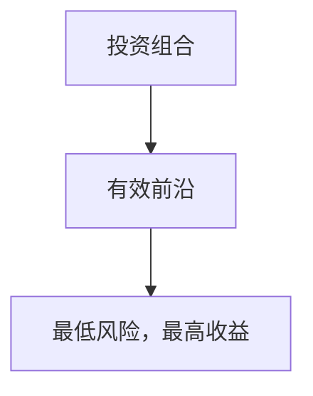
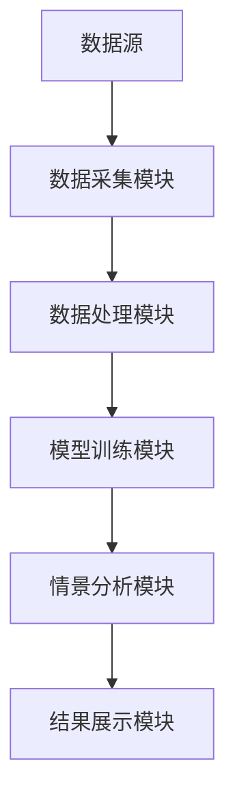
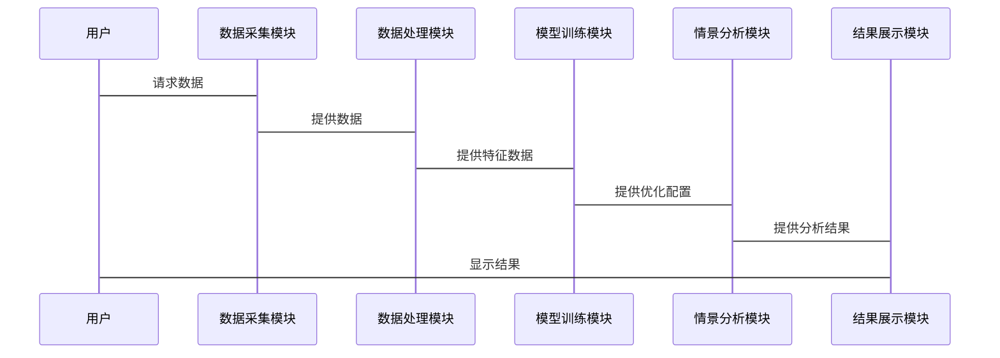

                 


# AI辅助的投资组合情景分析平台

## 关键词：AI，投资组合，情景分析，机器学习，金融建模，大数据

## 摘要：本文探讨了如何利用人工智能技术辅助投资组合的情景分析，通过结合机器学习和大数据分析，构建高效的投资组合优化模型，提升投资决策的准确性和效率。

---

# 第一部分: AI在金融投资中的应用

## 第1章: AI在金融投资中的应用现状

### 1.1 AI在金融投资中的优势

人工智能（AI）在金融领域的应用日益广泛，尤其是在投资组合分析方面。AI能够处理海量数据，识别复杂模式，并提供实时分析，帮助投资者做出更明智的决策。传统的投资分析依赖于经验丰富的分析师，但随着市场的复杂化和数据量的爆炸式增长，单纯依靠人工分析已经难以应对。

AI的优势体现在以下几个方面：

1. **数据处理能力**：AI能够快速处理和分析大量数据，包括历史价格、市场新闻、公司财报等，提取关键信息。
2. **实时监控**：AI可以实时监控市场动态，及时识别潜在风险和机会。
3. **预测能力**：通过机器学习模型，AI能够预测市场趋势，评估不同情景下的投资组合表现。
4. **自动化交易**：AI可以实现自动化交易策略，减少人为错误，提高交易效率。

### 1.2 投资组合分析的基本概念

投资组合是指将资金分配到不同资产（如股票、债券、基金等）上的配置方式。投资组合的目标是在风险和收益之间找到最佳平衡点。情景分析则是评估投资组合在不同市场情景下（如牛市、熊市、经济衰退）的表现，帮助投资者制定应对策略。

### 1.3 AI在投资组合情景分析中的作用

AI在投资组合情景分析中的作用主要体现在以下几个方面：

1. **数据清洗与特征提取**：AI能够自动清洗数据，去除噪声，并提取有用的特征，为分析提供高质量的数据支持。
2. **情景生成**：通过机器学习模型，AI可以生成多种市场情景，并模拟投资组合在这些情景下的表现。
3. **优化模型**：AI能够优化投资组合的配置，找到在给定风险下的最大收益，或者在给定收益下的最小风险。
4. **实时调整**：根据市场变化，AI可以实时调整投资组合，动态优化配置。

---

## 第2章: 投资组合理论基础

### 2.1 现代投资组合理论（MPT）

现代投资组合理论（MPT）由哈里·马科维茨在1952年提出，是投资学的重要理论之一。MPT的核心思想是通过优化投资组合的配置，降低投资风险。

#### 2.1.1 均值-方差模型

均值-方差模型是MPT的核心，其目标是在给定风险下最大化收益，或者在给定收益下最小化风险。数学表达如下：

$$
\text{Minimize } \sigma^2 \text{ s.t. } \mu \geq \text{目标收益}
$$

其中，$\sigma^2$是投资组合的方差（风险），$\mu$是投资组合的期望收益。

#### 2.1.2 有效前沿

有效前沿是指在给定风险下，能够提供最高收益的所有投资组合的集合。图2-1展示了有效前沿的概念。



#### 2.1.3 马科维茨优化模型

马科维茨优化模型是一个二次规划问题，目标是找到最优的投资组合配置。其数学表达如下：

$$
\text{Minimize } \frac{1}{2} \mathbf{x}^T \mathbf{Q} \mathbf{x} \text{ s.t. } \mathbf{r}^T \mathbf{x} = \mu, \mathbf{x}^T \mathbf{1} = 1
$$

其中，$\mathbf{x}$是投资组合权重向量，$\mathbf{Q}$是协方差矩阵，$\mathbf{r}$是资产期望收益向量。

### 2.2 多因子模型

多因子模型是一种广泛应用于投资组合分析的方法，它通过多个因子（如市值、价值、动量等）来解释资产的收益。

#### 2.2.1 Fama-French三因子模型

Fama-French三因子模型包括三个因子：市值因子、价值因子和动量因子。其数学表达如下：

$$
R_i = \alpha + \beta_1 \text{Size}_i + \beta_2 \text{Value}_i + \beta_3 \text{Momentum}_i + \epsilon_i
$$

其中，$R_i$是资产$i$的收益，$\alpha$是截距项，$\beta$是因子的回归系数，$\epsilon_i$是误差项。

### 2.3 风险中性定价与情景生成

风险中性定价是指在无套利的情况下，资产的期望收益等于其无风险利率加一个风险溢价。基于此，可以生成不同的市场情景，并评估投资组合在这些情景下的表现。

---

## 第3章: 基于机器学习的投资组合分析

### 3.1 机器学习在投资组合分析中的应用

机器学习在投资组合分析中的应用主要体现在以下几个方面：

1. **风险预测**：通过机器学习模型预测市场的波动性，评估投资组合的风险。
2. **收益预测**：利用历史数据训练模型，预测未来资产的收益。
3. **情景生成**：通过生成对抗网络（GAN）等技术生成多种市场情景。

#### 3.1.1 线性回归模型

线性回归是一种简单但有效的机器学习模型，适用于预测资产的收益。其数学表达如下：

$$
y = \beta_0 + \beta_1 x_1 + \beta_2 x_2 + \dots + \beta_n x_n + \epsilon
$$

其中，$y$是目标变量（收益），$x_i$是特征变量，$\beta_i$是回归系数，$\epsilon$是误差项。

#### 3.1.2 支持向量机（SVM）

SVM是一种监督学习模型，适用于分类和回归问题。在投资组合分析中，可以用于分类市场状态（牛市、熊市等）。

#### 3.1.3 随机森林与梯度提升树

随机森林是一种基于树的集成学习方法，适用于处理高维数据和非线性关系。梯度提升树是一种优化的树集成方法，适用于回归和分类问题。

#### 3.1.4 神经网络与深度学习模型

神经网络是一种模拟人脑神经网络的模型，适用于处理复杂的非线性关系。深度学习模型（如LSTM）适用于时间序列数据的预测。

### 3.2 基于机器学习的情景分析

#### 3.2.1 数据预处理与特征选择

数据预处理包括数据清洗、标准化、缺失值处理等。特征选择可以通过相关性分析、主成分分析（PCA）等方法实现。

#### 3.2.2 模型训练与验证

模型训练需要选择合适的算法和参数，进行交叉验证，评估模型的性能。

#### 3.2.3 结果解释与应用

通过模型预测的结果，生成不同的市场情景，并评估投资组合在这些情景下的表现。

---

## 第4章: 系统架构与实现

### 4.1 系统模块划分

#### 4.1.1 数据采集模块

数据采集模块负责从多种数据源（如金融数据API、新闻网站等）获取数据。

#### 4.1.2 数据处理模块

数据处理模块负责清洗数据、提取特征、生成市场情景。

#### 4.1.3 模型训练模块

模型训练模块负责训练机器学习模型，生成投资组合的优化配置。

#### 4.1.4 情景分析模块

情景分析模块负责评估投资组合在不同情景下的表现。

#### 4.1.5 结果展示模块

结果展示模块负责将分析结果以可视化的方式呈现给用户。

### 4.2 系统架构图



### 4.3 系统接口设计

系统接口设计包括数据接口、模型接口和用户接口。数据接口负责与数据源交互，模型接口负责与机器学习模型交互，用户接口负责与用户交互。

### 4.4 系统交互序列图



---

## 第5章: 项目实战

### 5.1 环境安装

需要安装Python、Pandas、NumPy、Scikit-learn、TensorFlow等库。

### 5.2 核心实现代码

以下是一个简单的投资组合优化代码示例：

```python
import numpy as np
import pandas as pd
from sklearn.linear_model import LinearRegression
from sklearn.metrics import mean_squared_error

# 数据加载
data = pd.read_csv('stock_data.csv')
X = data[['open', 'high', 'low', 'volume']]
y = data['close']

# 模型训练
model = LinearRegression()
model.fit(X, y)

# 模型预测
y_pred = model.predict(X)

# 模型评估
 mse = mean_squared_error(y, y_pred)
 print(f'MSE: {mse}')
```

### 5.3 案例分析

以某只股票为例，展示如何利用机器学习模型进行投资组合的情景分析。

### 5.4 结果分析与解读

分析模型预测结果，评估投资组合在不同情景下的表现。

---

## 第6章: 优化与展望

### 6.1 模型优化

通过调整模型参数、引入新的特征、优化算法等方法，提升模型的性能。

### 6.2 未来展望

随着AI技术的不断发展，投资组合情景分析将更加智能化和个性化。未来的研究方向可能包括强化学习、多模态数据融合等。

### 6.3 注意事项

在实际应用中，需要注意数据的及时性、模型的可解释性以及风险管理。

---

## 第7章: 结语

AI辅助的投资组合情景分析平台为投资者提供了强大的工具，帮助他们在复杂多变的市场中制定科学的投资策略。通过不断的优化和创新，AI将在投资组合分析中发挥越来越重要的作用。

---

# 参考文献

（此处列出参考文献）

---

# 致谢

感谢读者的耐心阅读，感谢相关人员的支持与帮助。

---

# 附录

（此处列出附录内容）

