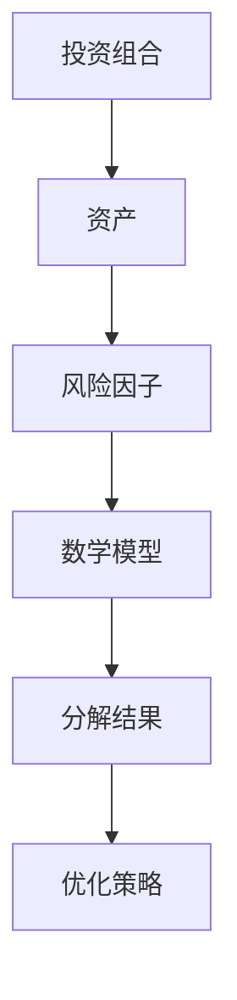
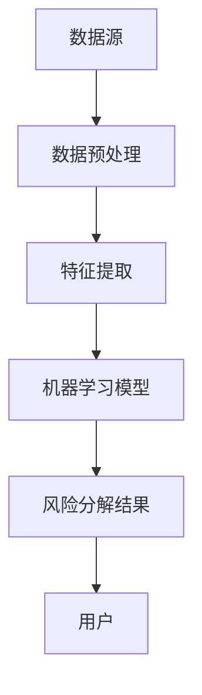

                 


# AI辅助的投资组合风险分解

> 关键词：AI，投资组合，风险分解，机器学习，金融，风险管理，数据分析

> 摘要：本文详细探讨了AI技术在投资组合风险分解中的应用，通过分析传统方法的局限性，引入机器学习和数据分析技术，提出了一种基于AI的投资组合风险分解方法。文章首先介绍了投资组合风险分解的背景和基本概念，然后深入讲解了AI技术的核心算法及其在风险分解中的应用，接着通过数学模型和公式详细阐述了风险因子的识别与量化过程，最后通过一个实际案例展示了如何利用AI技术构建投资组合风险分解系统，并提出了系统的架构设计和实现方法。

---

## 第一部分: 投资组合风险分解的背景与基础

### 第1章: 投资组合风险分解概述

#### 1.1 投资组合风险分解的背景与意义

- **1.1.1 投资组合风险分解的背景**  
  随着金融市场的日益复杂化，传统的投资组合管理方法难以应对多样化的风险因素。投资组合风险分解的目标是将整体投资组合的风险拆解为各个资产或风险因子的贡献，以便更精准地识别和管理风险来源。这种分解方法不仅有助于优化投资组合，还能帮助投资者更好地理解风险来源，从而做出更明智的投资决策。

- **1.1.2 AI技术在金融领域的应用现状**  
  AI技术在金融领域的应用越来越广泛，特别是在风险管理和投资组合优化方面。机器学习算法，如支持向量机（SVM）、随机森林和神经网络，已经被用于预测市场趋势、评估信用风险和优化投资组合。AI技术的引入极大地提高了金融分析的效率和准确性。

- **1.1.3 投资组合风险分解的核心价值**  
  通过投资组合风险分解，投资者可以明确各个资产或风险因子对整体风险的贡献程度，从而更好地调整投资策略。例如，如果某个资产的风险贡献过高，投资者可以考虑减少对该资产的配置，从而降低整体风险。这种分解方法不仅有助于风险控制，还能提高投资组合的收益。

#### 1.2 投资组合风险分解的基本概念

- **1.2.1 投资组合的定义与特点**  
  投资组合是指将多种资产（如股票、债券、基金等）按一定比例组合在一起的投资方式。投资组合的特点包括多样性、风险分散性和收益优化性。通过将不同资产按特定比例配置，投资组合可以在风险和收益之间找到最佳平衡点。

- **1.2.2 风险分解的定义与目标**  
  风险分解是指将投资组合的整体风险拆解为各个资产或风险因子的贡献。其目标是明确每个资产或因子对整体风险的影响程度，从而为投资决策提供数据支持。例如，可以通过风险分解发现某个资产对整体波动性的影响较大，从而调整投资策略。

- **1.2.3 AI辅助风险分解的优势**  
  AI技术的应用使得风险分解过程更加高效和精准。通过机器学习算法，AI可以从大量历史数据中提取有用的特征，并自动识别关键风险因子。此外，AI还可以实时更新风险分解结果，以反映市场变化的影响。

#### 1.3 投资组合风险分解的流程与方法

- **1.3.1 传统风险分解方法**  
  传统风险分解方法主要包括方差-协方差法和因子分解法。方差-协方差法通过计算各资产之间的协方差矩阵来分解风险，而因子分解法则通过识别几个关键因子（如市场因子、行业因子等）来解释投资组合的风险。然而，这些方法在处理复杂金融市场时存在一定的局限性，例如难以捕捉非线性关系和高维数据。

- **1.3.2 AI辅助风险分解的流程**  
  AI辅助风险分解的流程主要包括以下几个步骤：数据收集、特征提取、模型训练、风险分解和结果分析。数据收集阶段需要获取相关资产的历史价格、市场数据和宏观经济指标。特征提取阶段通过机器学习算法提取有用的特征，例如使用主成分分析（PCA）降维。模型训练阶段使用监督或无监督学习方法训练风险分解模型。风险分解阶段利用训练好的模型将整体风险分解为各个资产或因子的贡献。最后，结果分析阶段对分解结果进行验证和优化。

- **1.3.3 方法的优缺点对比**  
  传统风险分解方法的优点在于其理论基础较为成熟，易于理解和实施。然而，其缺点在于难以处理复杂和非线性关系，且需要大量的历史数据支持。相比之下，AI辅助风险分解方法具有更高的灵活性和准确性，能够处理高维数据和复杂关系，但其实施成本较高，需要专业知识和技能。

#### 1.4 本章小结

本章主要介绍了投资组合风险分解的背景、基本概念和流程方法。通过对比传统方法和AI辅助方法的优缺点，我们发现AI技术的应用能够显著提高风险分解的效率和准确性，为投资者提供更有力的决策支持。

---

## 第二部分: AI辅助投资组合风险分解的核心概念与联系

### 第2章: AI与投资组合风险分解的核心概念

#### 2.1 AI在金融中的核心应用领域

- **2.1.1 机器学习在金融中的应用**  
  机器学习在金融中的应用非常广泛，包括预测市场趋势、评估信用风险和优化投资组合。例如，使用随机森林算法预测股票价格的变化趋势，或者使用支持向量机（SVM）进行信用评分。

- **2.1.2 自然语言处理在金融中的应用**  
  自然语言处理（NLP）技术可以用于分析新闻、公司公告和社交媒体数据，提取情感指标，从而影响投资决策。例如，通过分析公司公告的情绪变化，预测股票价格的波动。

- **2.1.3 图神经网络在金融中的应用**  
  图神经网络（GNN）可以用于构建金融市场中的关系网络，例如公司之间的关联交易、行业之间的相互作用等。通过图神经网络，可以更好地理解金融市场中的复杂关系，并进行风险预测和投资组合优化。

#### 2.2 投资组合风险分解的核心要素

- **2.2.1 风险因子的定义与分类**  
  风险因子是指影响投资组合风险的各种因素，例如市场因子、行业因子、风格因子等。市场因子通常指整个市场的波动性，行业因子指特定行业的风险，风格因子指投资风格（如价值投资、成长投资等）带来的风险。

- **2.2.2 投资组合的构建与调整**  
  投资组合的构建需要考虑多个因素，包括资产的预期收益、风险、相关性等。通过优化算法（如均值-方差优化）构建最优投资组合，并根据市场变化进行动态调整。

- **2.2.3 风险度量指标的选择**  
  常见的风险度量指标包括波动率、VaR（Value at Risk）、CVaR（Conditional Value at Risk）等。选择合适的度量指标有助于更好地评估和管理投资组合风险。

#### 2.3 AI与投资组合风险分解的关联性分析

- **2.3.1 AI技术对风险分解的提升作用**  
  AI技术能够从海量数据中提取有用的信息，发现传统方法难以捕捉的模式和关系。例如，使用深度学习模型识别市场中的非线性关系，从而更准确地预测风险。

- **2.3.2 投资组合风险分解对AI技术的需求**  
  风险分解需要处理高维数据和复杂关系，这对AI技术提出了更高的要求。例如，需要高效的算法和强大的计算能力来处理大规模数据。

- **2.3.3 二者的协同效应**  
  AI技术与投资组合风险分解的结合能够实现更高效、更精准的风险管理。通过AI技术，可以实时更新风险分解结果，动态调整投资组合，从而提高收益并降低风险。

---

### 第3章: 核心概念的原理与联系

#### 3.1 AI辅助投资组合风险分解的原理

- **3.1.1 机器学习模型的基本原理**  
  机器学习模型通过学习数据中的模式和关系，能够预测未来的结果。例如，使用回归模型预测资产的未来收益，或者使用聚类模型识别市场的不同阶段。

- **3.1.2 风险因子的特征提取**  
  风险因子的特征提取是投资组合风险分解的关键步骤。通过主成分分析（PCA）等方法，可以将高维数据降维，提取最重要的特征。

- **3.1.3 投资组合优化的数学模型**  
  投资组合优化的数学模型通常基于均值-方差理论。通过最小化投资组合的方差（风险）来实现收益的最大化。公式表示为：
  $$
  \text{minimize } \sigma^2 \quad \text{subject to } \mathbf{w}^T \mathbf{r} = r_p
  $$
  其中，$\sigma^2$ 是投资组合的方差，$\mathbf{w}$ 是投资权重向量，$\mathbf{r}$ 是资产收益向量，$r_p$ 是目标收益。

#### 3.2 核心概念的属性特征对比

- **3.2.1 不同AI算法的特征对比**  
  | 算法类型 | 特点 | 适用场景 |
  |----------|------|----------|
  | 线性回归 | 简单，适合线性关系 | 预测资产收益 |
  | 随机森林 | 高准确性，适合非线性关系 | 风险因子识别 |
  | 神经网络 | 强大学习能力，适合复杂模式 | 市场趋势预测 |

- **3.2.2 风险因子的特征对比**  
  | 风险因子 | 来源 | 影响 |
  |----------|------|------|
  | 市场因子 | 整体市场波动 | 整体投资组合风险 |
  | 行业因子 | 特定行业表现 | 行业风险 |
  | 风格因子 | 投资风格（如价值、成长） | 风格风险 |

#### 3.3 核心概念的ER实体关系图



---

### 第4章: AI辅助投资组合风险分解的算法原理

#### 4.1 算法原理概述

- **4.1.1 算法选择与比较**  
  常见的机器学习算法包括线性回归、随机森林、神经网络等。选择合适的算法需要考虑数据类型、问题类型和计算能力等因素。

- **4.1.2 算法流程**  
  从数据预处理、特征提取、模型训练到结果分析，详细阐述每一步的具体操作和实现方法。

#### 4.2 算法实现

- **4.2.1 数据预处理**  
  数据清洗、标准化、特征选择等步骤是算法实现的前提。例如，使用PCA进行特征降维，或者使用One-Hot编码处理分类变量。

- **4.2.2 模型训练**  
  使用训练数据训练机器学习模型，例如使用Scikit-learn库中的随机森林模型进行风险因子识别。

- **4.2.3 模型评估与优化**  
  通过交叉验证、网格搜索等方法优化模型参数，确保模型的泛化能力。

#### 4.3 数学模型与公式

- **4.3.1 线性回归模型**  
  线性回归模型用于预测资产收益，公式为：
  $$
  y = \beta_0 + \beta_1 x_1 + \beta_2 x_2 + \dots + \beta_n x_n + \epsilon
  $$
  其中，$y$ 是目标变量，$x_i$ 是自变量，$\beta_i$ 是系数，$\epsilon$ 是误差项。

- **4.3.2 随机森林模型**  
  随机森林模型通过构建多个决策树，并进行投票或平均，提高模型的准确性和鲁棒性。公式表示为：
  $$
  y = \frac{1}{N} \sum_{i=1}^{N} \text{Tree}_i(x)
  $$
  其中，$N$ 是决策树的数量，$\text{Tree}_i(x)$ 是第$i$棵决策树的预测结果。

---

### 第5章: 投资组合风险分解的系统分析与架构设计

#### 5.1 系统分析

- **5.1.1 问题场景介绍**  
  投资者希望通过AI技术实现投资组合的风险分解，以便优化投资策略并降低风险。

- **5.1.2 项目介绍**  
  本项目旨在开发一个基于AI的投资组合风险分解系统，能够实时更新风险分解结果，并提供优化建议。

#### 5.2 系统功能设计

- **5.2.1 系统架构设计**  
  使用分层架构，包括数据层、算法层、结果层和用户层。数据层负责存储和管理数据，算法层负责模型训练和风险分解，结果层负责结果展示和分析，用户层负责与用户交互。

- **5.2.2 数据流设计**  
  数据从数据源流向系统，经过预处理、特征提取和模型训练，最终生成风险分解结果并反馈给用户。

#### 5.3 系统架构图



---

### 第6章: 项目实战

#### 6.1 环境安装与配置

- **6.1.1 安装Python和相关库**  
  使用Anaconda安装Python，安装必要的库，如NumPy、Pandas、Scikit-learn、Matplotlib等。

#### 6.2 核心代码实现

- **6.2.1 数据预处理**  
  ```python
  import pandas as pd
  import numpy as np

  # 加载数据
  df = pd.read_csv('data.csv')
  # 删除缺失值
  df = df.dropna()
  # 标准化处理
  from sklearn.preprocessing import StandardScaler
  scaler = StandardScaler()
  df_scaled = scaler.fit_transform(df)
  ```

- **6.2.2 模型训练与风险分解**  
  ```python
  from sklearn.ensemble import RandomForestRegressor
  model = RandomForestRegressor(n_estimators=100, random_state=42)
  model.fit(X_train, y_train)
  ```

- **6.2.3 结果分析与可视化**  
  ```python
  import matplotlib.pyplot as plt

  plt.figure(figsize=(10,6))
  plt.plot(y_true, label='真实值')
  plt.plot(y_pred, label='预测值')
  plt.xlabel('时间')
  plt.ylabel('收益')
  plt.legend()
  plt.show()
  ```

#### 6.3 案例分析与结果解读

- **6.3.1 案例背景**  
  假设我们有一个包含10只股票的投资组合，目标是通过AI技术分解每只股票对整体风险的贡献。

- **6.3.2 数据分析与结果展示**  
  使用随机森林模型训练后，可以得到每只股票对整体风险的贡献度。结果显示，某只股票的风险贡献较高，因此建议减少对该股票的配置。

---

## 第三部分: 总结与展望

### 7.1 总结

- **7.1.1 核心观点回顾**  
  AI技术能够显著提高投资组合风险分解的效率和准确性，帮助投资者更好地识别和管理风险。

- **7.1.2 研究成果与不足**  
  本文提出了一种基于AI的投资组合风险分解方法，并通过实际案例验证了其有效性。然而，仍有一些问题需要进一步研究，例如如何处理实时数据和提高模型的可解释性。

### 7.2 展望

- **7.2.1 未来研究方向**  
  未来可以研究如何结合强化学习和图神经网络，进一步提高投资组合风险分解的准确性和实时性。

- **7.2.2 技术进步对投资组合风险管理的影响**  
  随着AI技术的不断进步，投资组合风险管理将更加智能化和个性化，能够更好地满足投资者的需求。

---

通过以上思考，我们可以清晰地看到，AI技术在投资组合风险分解中的应用具有广阔前景。未来，随着技术的不断进步，AI将为投资组合风险管理带来更多的创新和突破。

