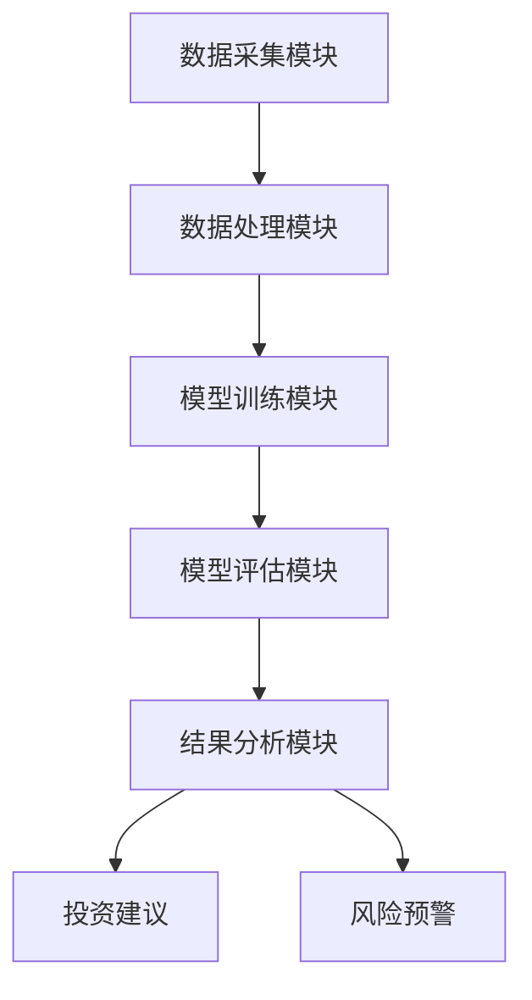
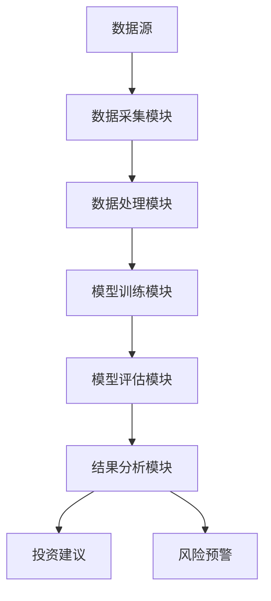
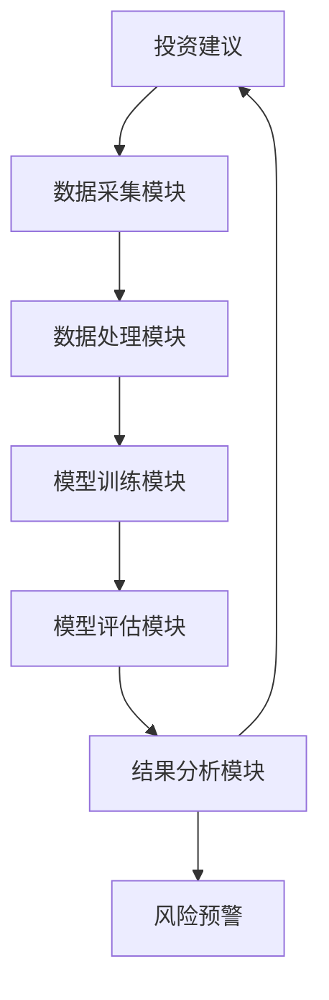

                 


# AI辅助的私募股权投资分析

> 关键词：AI, 私募股权, 投资分析, 机器学习, 自然语言处理

> 摘要：本文详细探讨了人工智能（AI）如何辅助私募股权投资分析的过程，从数据处理、模型构建到实际应用，结合具体案例，分析了AI技术在私募股权投资中的核心作用及实际应用价值。文章涵盖了AI技术在私募股权投资中的关键算法、系统架构设计以及项目实战，为读者提供了全面的视角和深入的技术解读。

---

# 第1章: 私募股权投资与AI概述

## 1.1 私募股权投资的定义与特点

### 1.1.1 私募股权投资的基本概念

私募股权投资（Private Equity Investment，简称PE投资）是指通过私募基金等方式对非公开交易的企业进行投资，并通过企业价值的提升和资本运作实现退出的投资方式。私募股权投资者通常会通过收购、重组等方式，对目标企业进行长期股权投资，并在一定期限内通过IPO、并购等方式退出，获取资本增值收益。

私募股权投资的核心目标是实现资本增值，其本质是通过专业的投资策略和管理能力，对目标企业的经营、财务、市场等方面进行深度分析和优化，最终实现投资回报的最大化。

### 1.1.2 私募股权投资的核心特点

1. **私募性**：私募股权的投资对象通常是未上市企业，且投资过程不公开。
2. **专业性**：私募股权投资需要专业的团队和丰富的行业经验，对目标企业的财务、市场、管理等方面进行深入分析。
3. **高风险与高回报**：私募股权投资的风险较高，但潜在回报也较高，尤其是在企业价值被低估的情况下。
4. **长期性**：私募股权投资通常需要较长时间（3-10年）才能实现退出和收益。

### 1.1.3 私募股权投资的行业现状

随着全球经济的发展和资本市场的不断完善，私募股权投资在全球范围内得到了快速发展。根据相关统计，全球私募股权基金的管理规模已超过5万亿美元，且这一数字仍在快速增长。私募股权投资在推动企业成长、优化资源配置、促进创新等方面发挥着重要作用。

---

## 1.2 AI在私募股权投资中的应用背景

### 1.2.1 私募股权投资的传统分析方法

传统的私募股权投资分析主要依赖于人工分析，包括对企业财务报表、行业趋势、市场环境等的深度研究。投资决策通常由经验丰富的投资经理或团队基于主观判断做出。这种方法虽然在一定程度上能够揭示企业的潜在价值，但也存在以下问题：

1. **效率低下**：人工分析耗时长，难以应对海量数据。
2. **主观性较强**：分析结果依赖于分析师的经验和判断，存在较大的主观性。
3. **覆盖面有限**：人工分析难以覆盖所有潜在的财务和非财务风险因素。

### 1.2.2 AI技术如何改变私募股权投资

人工智能（AI）技术的快速发展为私募股权投资分析带来了革命性的变化。通过AI技术，可以实现对海量数据的自动化处理、深度分析和智能决策，从而显著提高投资效率和准确性。具体来说，AI技术在私募股权投资中的应用体现在以下几个方面：

1. **数据处理与分析**：AI能够快速处理和分析海量的结构化和非结构化数据，包括财务报表、新闻报道、社交媒体信息等。
2. **风险评估与预测**：通过机器学习算法，AI可以对企业的财务状况、市场风险、管理风险等进行量化分析和预测。
3. **投资决策优化**：AI可以通过大数据分析和模型优化，帮助投资者发现潜在的投资机会，并制定最优的投资策略。

### 1.2.3 当前AI在私募股权投资中的应用现状

当前，AI技术在私募股权投资中的应用已经取得了显著进展。许多私募基金已经开始采用AI技术辅助投资决策，特别是在以下几个方面：

1. **量化分析**：通过量化模型对市场趋势、企业财务数据等进行分析，帮助投资者发现潜在的投资机会。
2. **风险预警**：利用自然语言处理（NLP）技术对新闻、公告等非结构化数据进行分析，识别潜在的风险因素。
3. **智能投顾**：通过AI技术为投资者提供个性化的投资建议，优化投资组合。

---

## 1.3 本章小结

本章从私募股权投资的基本概念、特点以及行业现状入手，详细介绍了AI技术在私募股权投资中的应用背景。通过对比传统分析方法和AI技术的优势，阐述了AI技术如何改变私募股权投资的分析方式和决策过程。接下来的章节将深入探讨AI技术在私募股权投资分析中的具体应用和实现方法。

---

# 第2章: AI辅助私募股权投资的核心概念

## 2.1 数据驱动的私募股权投资分析

### 2.1.1 数据在私募股权投资中的重要性

在私募股权投资中，数据是整个分析过程的基础。通过数据的收集、处理和分析，投资者可以更好地理解企业的财务状况、市场表现、管理能力等关键因素。具体来说，数据的重要性体现在以下几个方面：

1. **支持决策**：数据是投资决策的重要依据，通过数据分析可以发现企业的潜在价值和风险。
2. **提高效率**：通过自动化数据处理，可以显著提高分析效率，降低成本。
3. **量化分析**：数据为量化分析提供了基础，可以通过数学模型对企业的未来表现进行预测。

### 2.1.2 数据的收集与处理

私募股权投资中的数据来源多样，包括财务数据、市场数据、行业数据、新闻数据等。数据的收集和处理是整个分析过程的关键环节。

#### 数据收集渠道

1. **财务数据**：包括企业的财务报表、审计报告、现金流等。
2. **市场数据**：包括行业趋势、竞争对手分析、市场容量等。
3. **新闻数据**：包括企业新闻、行业动态、政策法规等。
4. **社交媒体数据**：包括社交媒体上的企业信息、用户评价等。

#### 数据清洗与预处理

在数据处理过程中，需要对收集到的数据进行清洗和预处理，以确保数据的准确性和完整性。具体步骤包括：

1. **去重**：去除重复数据。
2. **填补缺失值**：对缺失的数据进行插值或删除。
3. **标准化**：对数据进行标准化处理，确保不同数据来源的统一性。
4. **特征提取**：从数据中提取有用的特征，为后续分析提供基础。

### 2.1.3 数据的质量与清洗

数据质量是影响分析结果的重要因素。在数据清洗过程中，需要特别注意以下几点：

1. **数据一致性**：确保数据在不同来源中的表示一致。
2. **数据准确性**：确保数据的来源可靠，避免错误数据的引入。
3. **数据完整性**：确保数据的完整性，避免关键信息的缺失。

---

## 2.2 AI在私募股权投资中的关键算法

### 2.2.1 机器学习在私募股权投资中的应用

机器学习是一种人工智能技术，通过训练模型从数据中学习规律，并利用这些规律对新数据进行预测或分类。在私募股权投资中，机器学习可以应用于以下几个方面：

1. **企业价值评估**：通过机器学习模型对企业财务数据进行分析，预测企业的未来价值。
2. **风险评估**：通过机器学习模型对企业财务状况、市场风险等进行评估，识别潜在的风险因素。
3. **投资组合优化**：通过机器学习模型优化投资组合，降低风险，提高回报。

#### 机器学习算法的选择

在选择机器学习算法时，需要根据具体问题和数据特点进行选择。常用的机器学习算法包括：

1. **监督学习**：如线性回归、支持向量机（SVM）、随机森林等。
2. **非监督学习**：如聚类分析、主成分分析（PCA）等。
3. **强化学习**：如Q-learning、Deep Q-Network等。

### 2.2.2 自然语言处理（NLP）在私募股权投资中的应用

自然语言处理（NLP）是一种人工智能技术，用于处理和理解人类语言。在私募股权投资中，NLP可以应用于以下几个方面：

1. **情感分析**：通过分析新闻、评论等文本数据，判断市场情绪，辅助投资决策。
2. **主题挖掘**：通过主题建模技术，识别行业趋势和热点话题。
3. **风险预警**：通过分析新闻、公告等文本数据，识别潜在的财务风险或管理风险。

#### NLP的核心技术

NLP的核心技术包括：

1. **词袋模型（Bag of Words）**：将文本表示为词袋，忽略词序和语法结构。
2. **TF-IDF**：计算词的权重，提取文本中的重要特征。
3. **主题建模（Topic Modeling）**：如LDA（Latent Dirichlet Allocation）模型，用于发现文本的主题结构。
4. **情感分析**：通过训练好的模型，判断文本的情感倾向。

### 2.2.3 时间序列分析在私募股权投资中的应用

时间序列分析是一种统计技术，用于分析随时间变化的数据。在私募股权投资中，时间序列分析可以应用于以下几个方面：

1. **市场趋势预测**：通过分析历史市场数据，预测未来的市场趋势。
2. **企业财务预测**：通过分析企业的历史财务数据，预测未来的财务状况。
3. **风险预警**：通过分析企业的历史数据，识别潜在的财务风险。

#### 时间序列分析的方法

常用的时间序列分析方法包括：

1. **ARIMA模型**：自回归积分滑动平均模型，适用于线性时间序列数据。
2. **GARCH模型**：广义自回归条件异方差模型，适用于波动性建模。
3. **LSTM网络**：长短期记忆网络，适用于复杂的时间序列数据。

---

## 2.3 AI辅助私募股权投资的核心流程

### 2.3.1 数据采集与预处理

数据采集与预处理是整个分析过程的第一步，其目的是确保数据的准确性和完整性。具体步骤包括：

1. **数据收集**：从多种渠道收集相关数据，包括财务数据、市场数据、新闻数据等。
2. **数据清洗**：对收集到的数据进行去重、填补缺失值、标准化等处理。
3. **特征提取**：从数据中提取有用的特征，为后续分析提供基础。

### 2.3.2 模型训练与优化

在数据预处理完成后，需要对数据进行建模和训练。具体步骤包括：

1. **选择算法**：根据具体问题和数据特点选择合适的机器学习算法。
2. **模型训练**：利用训练数据对模型进行训练，调整模型参数。
3. **模型评估**：通过测试数据对模型进行评估，计算模型的准确率、召回率等指标。
4. **模型优化**：通过超参数优化、特征选择等方法进一步提升模型性能。

### 2.3.3 结果分析与决策支持

在模型训练完成后，需要对模型的输出结果进行分析，并将其应用于投资决策。具体步骤包括：

1. **结果分析**：通过模型输出结果，识别潜在的投资机会和风险。
2. **决策支持**：基于模型分析结果，制定投资策略和决策。

---

## 2.4 本章小结

本章详细介绍了AI辅助私募股权投资的核心概念，包括数据驱动的分析方法、关键算法以及核心流程。通过机器学习、自然语言处理和时间序列分析等技术，可以显著提高私募股权投资的效率和准确性。接下来的章节将结合具体案例，深入探讨这些技术在实际应用中的实现和效果。

---

# 第3章: 私募股权投资分析中的数据处理与建模

## 3.1 数据来源与预处理

### 3.1.1 数据来源渠道

私募股权投资分析中的数据来源多样，主要包括以下几种：

1. **财务数据**：包括企业的财务报表、审计报告、现金流等。
2. **市场数据**：包括行业趋势、竞争对手分析、市场容量等。
3. **新闻数据**：包括企业新闻、行业动态、政策法规等。
4. **社交媒体数据**：包括社交媒体上的企业信息、用户评价等。

### 3.1.2 数据清洗与标准化

在数据预处理过程中，需要对收集到的数据进行清洗和标准化，以确保数据的准确性和一致性。具体步骤包括：

1. **去重**：去除重复数据。
2. **填补缺失值**：对缺失的数据进行插值或删除。
3. **标准化**：对数据进行标准化处理，确保不同数据来源的统一性。
4. **特征提取**：从数据中提取有用的特征，为后续分析提供基础。

### 3.1.3 数据特征提取

特征提取是数据预处理中的重要一步，其目的是从数据中提取能够反映企业核心价值和风险的特征。常用的特征提取方法包括：

1. **财务特征**：如收入增长率、净利润率、资产负债率等。
2. **市场特征**：如行业指数、竞争对手市场份额等。
3. **文本特征**：如关键词频率、情感倾向等。

---

## 3.2 基于机器学习的私募股权投资模型

### 3.2.1 监督学习模型

监督学习是一种机器学习技术，通过训练有标签的数据来预测新的数据标签。在私募股权投资中，监督学习可以应用于以下几个方面：

1. **企业价值评估**：通过监督学习模型对企业财务数据进行分析，预测企业的未来价值。
2. **风险评估**：通过监督学习模型对企业财务状况、市场风险等进行评估，识别潜在的风险因素。
3. **投资组合优化**：通过监督学习模型优化投资组合，降低风险，提高回报。

#### 监督学习算法的选择

在监督学习中，常用的算法包括：

1. **线性回归**：适用于线性关系的预测。
2. **支持向量机（SVM）**：适用于分类和回归问题。
3. **随机森林**：适用于分类和回归问题，具有较强的抗过拟合能力。

### 3.2.2 非监督学习模型

非监督学习是一种机器学习技术，通过无标签的数据进行聚类或降维。在私募股权投资中，非监督学习可以应用于以下几个方面：

1. **客户细分**：通过聚类分析对客户进行细分，制定个性化的投资策略。
2. **风险分类**：通过聚类分析识别不同类型的金融风险。
3. **市场趋势分析**：通过聚类分析识别市场趋势和热点话题。

#### 非监督学习算法的选择

在非监督学习中，常用的算法包括：

1. **K-means聚类**：适用于简单的聚类问题。
2. **主成分分析（PCA）**：适用于降维和特征提取。
3. **主题建模（LDA）**：适用于文本主题的挖掘。

### 3.2.3 加强学习模型

加强学习是一种机器学习技术，通过智能体与环境的交互来学习最优策略。在私募股权投资中，加强学习可以应用于以下几个方面：

1. **动态策略优化**：通过加强学习优化投资策略，适应市场变化。
2. **风险管理**：通过加强学习模型动态调整风险敞口，降低潜在损失。
3. **智能投顾**：通过加强学习模型为投资者提供个性化的投资建议。

#### 加强学习算法的选择

在加强学习中，常用的算法包括：

1. **Q-learning**：适用于简单的决策问题。
2. **Deep Q-Network**：适用于复杂的决策问题，具有较强的表达能力。

---

## 3.3 模型评估与优化

### 3.3.1 模型评估指标

在模型评估过程中，常用的指标包括：

1. **准确率（Accuracy）**：反映模型的分类能力。
2. **召回率（Recall）**：反映模型的查全能力。
3. **F1分数**：综合准确率和召回率的调和平均数。
4. **ROC曲线**：反映模型的区分能力。

### 3.3.2 超参数优化

超参数优化是提高模型性能的重要步骤，常用的优化方法包括：

1. **网格搜索（Grid Search）**：通过遍历所有可能的超参数组合，选择最优参数。
2. **随机搜索（Random Search）**：通过随机选择超参数组合，减少计算量。
3. **贝叶斯优化（Bayesian Optimization）**：通过贝叶斯方法优化超参数，提高效率。

### 3.3.3 模型部署与监控

在模型训练完成后，需要将其部署到实际应用中，并进行实时监控和维护。具体步骤包括：

1. **模型部署**：将模型部署到生产环境，提供API接口供其他系统调用。
2. **实时监控**：通过监控工具实时跟踪模型的性能和数据质量。
3. **模型更新**：根据监控结果，定期更新模型，确保其性能和适应性。

---

## 3.4 本章小结

本章详细介绍了私募股权投资分析中的数据处理与建模过程，包括数据预处理、模型选择与优化、模型部署与监控等。通过机器学习技术，可以显著提高私募股权投资的分析效率和准确性。接下来的章节将结合具体案例，深入探讨这些技术在实际应用中的实现和效果。

---

# 第4章: 基于NLP的私募股权投资分析

## 4.1 自然语言处理在私募股权投资中的应用

### 4.1.1 文本数据的特征提取

在私募股权投资中，文本数据的特征提取是NLP技术的重要应用之一。通过分析文本数据，可以提取出企业的市场地位、管理能力、行业趋势等关键信息。常用的文本特征提取方法包括：

1. **词袋模型（Bag of Words）**：将文本表示为词袋，忽略词序和语法结构。
2. **TF-IDF**：计算词的权重，提取文本中的重要特征。
3. **主题建模（LDA）**：通过主题建模技术，识别文本的主题结构。

### 4.1.2 基于NLP的情感分析

情感分析是NLP技术的重要应用之一，通过分析文本的情感倾向，可以辅助投资决策。在私募股权投资中，情感分析可以应用于以下几个方面：

1. **市场情绪分析**：通过分析新闻、社交媒体等文本数据，判断市场情绪，辅助投资决策。
2. **企业声誉分析**：通过分析企业的新闻、评论等文本数据，评估企业的声誉和市场形象。
3. **风险预警**：通过分析企业的新闻、公告等文本数据，识别潜在的财务风险或管理风险。

#### 情感分析算法的选择

在情感分析中，常用的算法包括：

1. **词袋模型（Bag of Words）**：适用于简单的文本分类任务。
2. **词嵌入（Word Embedding）**：如Word2Vec、GloVe等，适用于复杂的文本分类任务。
3. **深度学习模型**：如LSTM、Transformer等，适用于复杂的文本分析任务。

### 4.1.3 基于NLP的主题挖掘

主题挖掘是NLP技术的另一个重要应用，通过分析文本的主题结构，可以识别行业趋势和热点话题。在私募股权投资中，主题挖掘可以应用于以下几个方面：

1. **行业趋势分析**：通过分析行业新闻、报告等文本数据，识别行业趋势和热点话题。
2. **竞争对手分析**：通过分析竞争对手的新闻、公告等文本数据，了解竞争对手的动态和战略。
3. **市场机会挖掘**：通过分析市场文本数据，发现潜在的市场机会和投资机会。

#### 主题挖掘算法的选择

在主题挖掘中，常用的算法包括：

1. **LDA（Latent Dirichlet Allocation）**：适用于主题建模。
2. **LSA（Latent Semantic Analysis）**：适用于语义分析。
3. **NMF（Non-negative Matrix Factorization）**：适用于主题提取。

---

## 4.2 基于NLP的新闻与公告分析

### 4.2.1 财务报告分析

财务报告是私募股权投资中重要的文本数据来源之一。通过NLP技术，可以对财务报告进行自动化的分析和理解，提取关键信息。例如：

1. **财务数据提取**：通过NLP技术从财务报告中提取收入、利润、资产负债等关键财务指标。
2. **财务趋势分析**：通过NLP技术分析财务报告的趋势，识别企业的财务健康状况。
3. **财务风险预警**：通过NLP技术识别财务报告中的潜在风险，如收入下降、利润减少等。

### 4.2.2 行业新闻分析

行业新闻是私募股权投资中重要的外部数据来源之一。通过NLP技术，可以对行业新闻进行自动化的分析和理解，识别行业趋势和热点话题。例如：

1. **行业趋势分析**：通过NLP技术分析行业新闻的趋势，识别行业的增长点和风险点。
2. **竞争对手分析**：通过NLP技术分析竞争对手的新闻，了解竞争对手的动态和战略。
3. **市场机会挖掘**：通过NLP技术识别市场机会，如新兴行业、技术创新等。

### 4.2.3 公司公告分析

公司公告是私募股权投资中重要的外部数据来源之一。通过NLP技术，可以对公司公告进行自动化的分析和理解，识别公司的战略和潜在风险。例如：

1. **公司战略分析**：通过NLP技术分析公司公告的战略，识别公司的发展方向和目标。
2. **公司风险预警**：通过NLP技术识别公司公告中的潜在风险，如重大诉讼、财务危机等。

---

## 4.3 NLP在风险评估中的应用

### 4.3.1 风险信号识别

在私募股权投资中，风险信号识别是NLP技术的重要应用之一。通过分析文本数据，可以识别潜在的风险信号，如财务风险、管理风险、市场风险等。例如：

1. **财务风险信号**：通过NLP技术分析财务报告，识别财务数据中的异常波动，如收入下降、利润减少等。
2. **管理风险信号**：通过NLP技术分析公司公告、新闻等文本数据，识别管理团队的变化、内部冲突等潜在风险。
3. **市场风险信号**：通过NLP技术分析行业新闻、市场报告等文本数据，识别市场环境的变化，如经济衰退、政策变化等。

### 4.3.2 风险分类与预测

通过NLP技术，可以对风险进行分类和预测，帮助投资者制定有效的风险管理策略。例如：

1. **风险分类**：通过NLP技术将风险分为不同的类别，如财务风险、管理风险、市场风险等。
2. **风险预测**：通过NLP技术对风险进行预测，识别潜在的风险因素，如市场下跌、企业亏损等。

### 4.3.3 风险评估报告生成

通过NLP技术，可以自动生成风险评估报告，帮助投资者快速了解企业的风险状况。例如：

1. **风险评估报告**：通过NLP技术分析企业的财务报告、行业新闻等文本数据，自动生成风险评估报告，包括风险类型、风险程度、风险建议等。

---

## 4.4 本章小结

本章详细介绍了自然语言处理（NLP）技术在私募股权投资中的应用，包括文本数据的特征提取、情感分析、主题挖掘以及新闻与公告分析等。通过NLP技术，可以显著提高私募股权投资的分析效率和准确性，特别是在风险评估和市场趋势分析方面。接下来的章节将结合具体案例，深入探讨这些技术在实际应用中的实现和效果。

---

# 第5章: 私募股权投资的系统架构与实现

## 5.1 系统架构设计

### 5.1.1 系统模块划分

在设计基于AI的私募股权投资分析系统时，需要将系统划分为多个功能模块，每个模块负责特定的功能。常用的模块划分包括：

1. **数据采集模块**：负责从多种渠道收集数据，包括财务数据、市场数据、新闻数据等。
2. **数据处理模块**：负责对收集到的数据进行清洗、预处理和特征提取。
3. **模型训练模块**：负责对数据进行建模和训练，选择合适的算法进行模型训练。
4. **模型评估模块**：负责对模型进行评估和优化，确保模型的准确性和稳定性。
5. **结果分析模块**：负责对模型的输出结果进行分析，生成投资建议和风险预警。

### 5.1.2 系统功能设计

基于上述模块划分，系统的功能设计如下：

1. **数据采集**：支持从多种渠道采集数据，包括数据库、API接口、文件导入等。
2. **数据处理**：支持数据清洗、预处理、特征提取等功能。
3. **模型训练**：支持多种机器学习算法的训练和优化，包括监督学习、非监督学习、强化学习等。
4. **模型评估**：支持模型的准确率、召回率、F1分数等指标的评估。
5. **结果分析**：支持模型输出结果的可视化展示，生成投资建议和风险预警报告。

### 5.1.3 系统架构图

以下是一个基于AI的私募股权投资分析系统的架构图：



---

## 5.2 数据流与交互设计

### 5.2.1 数据流图

数据流图描述了数据在系统中的流动过程。以下是一个基于AI的私募股权投资分析系统的数据流图：



### 5.2.2 系统交互流程

系统交互流程描述了用户与系统之间的交互过程。以下是一个基于AI的私募股权投资分析系统的交互流程：



### 5.2.3 接口设计

接口设计是系统实现的重要部分，以下是系统的主要接口：

1. **数据采集接口**：提供API接口，支持从多种数据源采集数据。
2. **数据处理接口**：提供API接口，支持数据的清洗、预处理和特征提取。
3. **模型训练接口**：提供API接口，支持多种机器学习算法的训练和优化。
4. **模型评估接口**：提供API接口，支持模型的准确率、召回率等指标的评估。
5. **结果分析接口**：提供API接口，支持模型输出结果的可视化展示，生成投资建议和风险预警报告。

---

## 5.3 系统实现与优化

### 5.3.1 技术选型与实现

在系统实现过程中，需要选择合适的技术和工具。以下是常用的技术选型：

1. **编程语言**：Python（适合机器学习和数据分析）。
2. **框架与库**：Scikit-learn（机器学习）、Natural Language Toolkit（NLP）、TensorFlow（深度学习）等。
3. **数据库**：MySQL、MongoDB等。
4. **工具与平台**：Jupyter Notebook（数据处理与分析）、Docker（容器化部署）等。

### 5.3.2 系统性能优化

在系统实现过程中，需要注意系统的性能优化。具体步骤包括：

1. **数据预处理**：通过数据清洗、特征提取等步骤，减少数据冗余，提高数据处理效率。
2. **算法优化**：通过超参数优化、模型集成等方法，提高模型的准确率和稳定性。
3. **系统优化**：通过缓存、并行计算等技术，提高系统的运行效率。

### 5.3.3 系统扩展性设计

在系统设计过程中，需要考虑系统的扩展性。具体步骤包括：

1. **模块化设计**：通过模块化设计，确保系统的可扩展性和可维护性。
2. **接口设计**：通过标准化接口设计，确保系统的兼容性和扩展性。
3. **分布式部署**：通过分布式部署，提高系统的扩展性和容错性。

---

## 5.4 本章小结

本章详细介绍了基于AI的私募股权投资分析系统的架构设计、数据流与交互设计、系统实现与优化等内容。通过模块化设计和标准化接口，可以显著提高系统的可扩展性和可维护性。接下来的章节将结合具体案例，深入探讨这些技术在实际应用中的实现和效果。

---

# 第6章: 项目实战——基于AI的私募股权投资分析系统

## 6.1 项目背景与目标

### 6.1.1 项目背景

随着AI技术的快速发展，私募股权投资的分析方式也在不断变革。传统的私募股权投资分析主要依赖于人工分析，效率低下且容易受到主观因素的影响。通过引入AI技术，可以实现对海量数据的自动化处理和智能分析，显著提高投资效率和准确性。

### 6.1.2 项目目标

本项目的目标是开发一个基于AI的私募股权投资分析系统，通过机器学习和自然语言处理技术，实现对企业财务数据、市场数据、新闻数据等的自动化分析，提供投资建议和风险预警。具体目标包括：

1. **数据采集与处理**：支持从多种数据源采集数据，并进行清洗、预处理和特征提取。
2. **模型训练与优化**：通过机器学习算法对数据进行建模和训练，选择最优模型进行投资分析。
3. **结果分析与展示**：通过模型输出结果，生成投资建议和风险预警报告，并提供可视化展示。

---

## 6.2 系统核心实现

### 6.2.1 环境安装与配置

在开发基于AI的私募股权投资分析系统之前，需要先安装和配置开发环境。以下是常用的开发环境配置：

1. **安装Python**：安装Python 3.x版本，推荐使用Anaconda或Miniconda。
2. **安装机器学习库**：安装Scikit-learn、TensorFlow、Natural Language Toolkit等机器学习库。
3. **安装数据处理工具**：安装Pandas、NumPy等数据处理工具。
4. **安装可视化工具**：安装Matplotlib、Seaborn等可视化工具。

### 6.2.2 核心代码实现

以下是基于AI的私募股权投资分析系统的核心代码实现：

#### 1. 数据采集模块

```python
import pandas as pd
import requests

def fetch_data(api_key):
    url = f"http://example.com/api?api_key={api_key}"
    response = requests.get(url)
    data = response.json()
    df = pd.DataFrame(data)
    return df

# 示例代码
df = fetch_data("your_api_key")
print(df.head())
```

#### 2. 数据处理模块

```python
def preprocess_data(df):
    # 删除缺失值
    df = df.dropna()
    # 标准化处理
    df = (df - df.mean()) / df.std()
    return df

# 示例代码
processed_df = preprocess_data(df)
print(processed_df.head())
```

#### 3. 模型训练模块

```python
from sklearn.model

