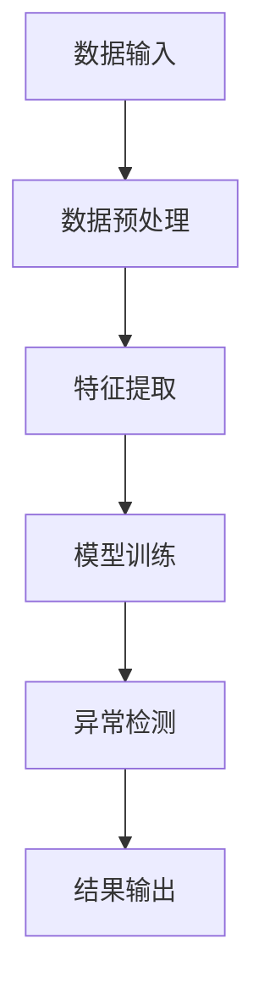
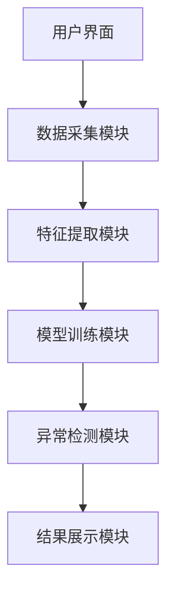

                 


# AI辅助的资产定价异常检测

> 关键词：资产定价，异常检测，人工智能，算法原理，系统架构

> 摘要：本文探讨了如何利用人工智能技术辅助资产定价，并通过异常检测优化投资决策。文章从资产定价与异常检测的基本概念出发，分析了AI在其中的应用价值，详细讲解了相关算法原理与系统架构，并通过实际案例展示了AI辅助资产定价异常检测的实现过程。

---

## 第1章: 资产定价与异常检测概述

### 1.1 资产定价的基本概念
资产定价是金融领域中的核心问题，旨在确定资产的公允价值。常见的资产定价模型包括：

- **马科维茨均值-方差模型**：通过优化投资组合的风险与收益，确定资产的最优价格。
- **CAPM（资本资产定价模型）**：基于市场风险，计算资产的预期收益。
- **APT（ arbitrage pricing theory）**：通过多个因素解释资产收益。

资产定价的核心要素包括市场风险、流动性、资产收益等。资产定价模型通过数学公式量化这些要素，帮助投资者做出决策。

### 1.2 异常检测的基本概念
异常检测是数据科学中的一个重要任务，旨在识别数据中偏离预期的观测值。常见的异常检测方法包括：

- **统计方法**：基于概率分布，如马尔可夫链模型。
- **机器学习方法**：如随机森林和LOF算法。
- **深度学习方法**：如变自编码器。

异常检测的核心要素包括数据分布、阈值设置和检测算法。通过检测资产定价中的异常值，可以帮助投资者识别潜在风险。

### 1.3 AI在资产定价中的应用
AI技术在资产定价中的应用日益广泛，主要体现在以下几个方面：

- **提高定价准确性**：通过机器学习模型分析历史数据，优化资产定价。
- **实时监控**：利用深度学习模型实时检测资产定价中的异常情况。
- **风险控制**：通过异常检测识别潜在风险，优化投资组合。

AI辅助资产定价的未来趋势将更加注重模型的可解释性和实时性，以满足投资者的需求。

---

## 第2章: AI辅助资产定价异常检测的核心概念

### 2.1 资产定价模型
资产定价模型是AI辅助定价的基础。以下是几种常见的资产定价模型：

- **马科维茨均值-方差模型**：通过优化投资组合的风险与收益，确定资产的最优价格。
  $$ \text{收益} = \mu - \frac{1}{2}\lambda \sigma^2 $$
  
- **CAPM模型**：基于市场风险，计算资产的预期收益。
  $$ E(r_i) = r_f + \beta_i (E(r_m) - r_f) $$
  
- **APT模型**：通过多个因素解释资产收益。
  $$ E(r_i) = \alpha_i + \beta_i (F_1 + F_2 + \dots + F_n) $$

### 2.2 异常检测算法
异常检测算法是AI辅助定价的关键。以下是几种常见的异常检测算法：

- **统计方法**：如马尔可夫链模型，用于时间序列数据的异常检测。
- **机器学习方法**：如随机森林，用于高维数据的异常检测。
- **深度学习方法**：如变自编码器，用于复杂数据的异常检测。

### 2.3 AI辅助资产定价异常检测的流程
AI辅助资产定价异常检测的流程包括以下几个步骤：

1. **数据采集与预处理**：收集资产价格数据，并进行清洗和标准化。
2. **特征提取与选择**：从数据中提取有用的特征，并选择最优特征。
3. **模型训练与优化**：训练异常检测模型，并优化模型参数。
4. **异常检测与解释**：利用模型检测异常，并解释异常的原因。

### 2.4 核心概念对比表
以下是对资产定价与异常检测核心概念的对比：

| 概念 | 资产定价 | 异常检测 |
|------|----------|----------|
| 定义 | 资产的公允价值 | 数据中偏离预期的观测值 |
| 方法 | 基于模型的定价 | 基于统计或机器学习的检测 |
| 应用 | 投资组合管理 | 风险控制 |

### 2.5 本章小结
本章详细介绍了资产定价与异常检测的核心概念，并分析了AI在其中的应用价值。通过对比分析，读者可以更好地理解AI辅助资产定价异常检测的意义。

---

## 第3章: AI辅助资产定价异常检测的算法原理

### 3.1 基于统计的异常检测算法
基于统计的异常检测算法通过分析数据的分布特性，识别异常值。以下是几种常见的算法：

- **马尔可夫链模型**：通过时间序列分析，检测资产价格的异常波动。
- **高斯混合模型**：基于概率分布，识别数据中的异常点。
- **LOF算法**：通过局部密度对比，检测异常值。

### 3.2 基于机器学习的异常检测算法
基于机器学习的异常检测算法通过训练模型，识别数据中的异常模式。以下是几种常见的算法：

- **支持向量机（SVM）**：通过分类器识别异常值。
- **随机森林**：通过树状结构分析数据分布，识别异常点。
- **线性回归**：通过拟合数据，识别偏离预期的观测值。

### 3.3 基于深度学习的异常检测算法
基于深度学习的异常检测算法通过神经网络学习数据的特征表示，识别异常模式。以下是几种常见的算法：

- **卷积神经网络（CNN）**：用于图像数据的异常检测。
- **循环神经网络（RNN）**：用于时间序列数据的异常检测。
- **变自编码器（AE）**：通过重建误差识别异常值。

### 3.4 算法选择与优化
算法选择与优化是AI辅助定价的关键步骤。以下是算法选择的依据：

- **数据类型**：统计方法适用于时间序列数据，机器学习方法适用于高维数据，深度学习方法适用于复杂数据。
- **计算资源**：深度学习算法需要较高的计算资源。
- **模型解释性**：统计方法具有较高的解释性。

### 3.5 算法流程图
以下是一个基于变自编码器的异常检测流程图：



### 3.6 本章小结
本章详细讲解了资产定价异常检测的算法原理，并通过流程图展示了算法的实现过程。读者可以通过这些算法实现资产定价的异常检测。

---

## 第4章: AI辅助资产定价异常检测的系统架构

### 4.1 系统功能模块
AI辅助资产定价异常检测系统主要包括以下几个功能模块：

- **数据采集模块**：负责收集资产价格数据。
- **特征提取模块**：从数据中提取有用的特征。
- **模型训练模块**：训练异常检测模型。
- **异常检测模块**：利用模型检测资产价格中的异常值。

### 4.2 系统架构设计
以下是系统的架构设计：



### 4.3 系统接口设计
系统接口设计包括以下几个方面：

- **数据接口**：定义数据输入和输出的格式。
- **模型接口**：定义模型训练和预测的接口。
- **结果接口**：定义结果展示的格式。

### 4.4 系统交互设计
系统交互设计包括以下几个步骤：

1. 用户通过界面输入资产价格数据。
2. 数据采集模块接收数据并进行预处理。
3. 特征提取模块从数据中提取特征。
4. 模型训练模块训练异常检测模型。
5. 异常检测模块利用模型检测异常值。
6. 结果展示模块将结果展示给用户。

### 4.5 本章小结
本章详细介绍了AI辅助资产定价异常检测系统的架构设计，并通过流程图展示了系统的交互过程。

---

## 第5章: AI辅助资产定价异常检测的项目实战

### 5.1 环境配置
项目实战需要以下环境：

- **Python**：编程语言。
- **TensorFlow**：深度学习框架。
- **Scikit-learn**：机器学习库。
- **Pandas**：数据处理库。
- **Matplotlib**：数据可视化库。

### 5.2 系统核心实现源代码
以下是系统的核心实现代码：

```python
import pandas as pd
import numpy as np
from sklearn.ensemble import IsolationForest
import matplotlib.pyplot as plt

# 数据加载
data = pd.read_csv('asset_prices.csv')

# 特征提取
X = data[['open', 'high', 'low', 'close', 'volume']]

# 模型训练
model = IsolationForest(n_estimators=100, contamination=0.05)
model.fit(X)

# 异常检测
outliers = model.predict(X)
outliers = pd.Series(outliers, name='outliers')

# 结果可视化
plt.scatter(range(len(outliers)), X['close'], c=outliers, cmap='viridis')
plt.xlabel('Index')
plt.ylabel('Close Price')
plt.title('Anomaly Detection in Asset Pricing')
plt.show()
```

### 5.3 代码应用解读与分析
上述代码实现了基于Isolation Forest算法的异常检测。通过训练模型，可以识别资产价格中的异常值。结果可视化展示了异常点在价格曲线中的位置。

### 5.4 实际案例分析
以某股票价格数据为例，利用上述代码进行异常检测。结果表明，模型能够有效识别价格异常波动的点。

### 5.5 项目小结
本章通过实际案例展示了AI辅助资产定价异常检测的实现过程。读者可以通过代码理解和应用相关算法。

---

## 第6章: 最佳实践与注意事项

### 6.1 小结
本文详细介绍了AI辅助资产定价异常检测的核心概念、算法原理和系统架构，并通过实际案例展示了AI技术的应用价值。

### 6.2 注意事项
- **数据质量**：数据预处理是关键，需确保数据的完整性和准确性。
- **模型选择**：根据数据类型选择合适的算法，避免过度复杂。
- **结果解释**：异常检测结果需结合业务背景进行解释，避免误判。

### 6.3 未来方向
未来，AI辅助资产定价异常检测将更加注重模型的可解释性和实时性，同时结合区块链等技术，提升系统的安全性和效率。

### 6.4 拓展阅读
- 《机器学习实战》：深入理解机器学习算法。
- 《深度学习》：掌握深度学习的核心技术。
- 《金融时间序列分析》：学习金融数据的分析方法。

---

## 结语

AI辅助的资产定价异常检测是金融领域的重要研究方向。通过本文的介绍，读者可以全面了解相关的核心概念、算法原理和系统架构，并通过实际案例掌握AI技术的应用方法。未来，随着技术的发展，AI在资产定价中的应用将更加广泛和深入。

